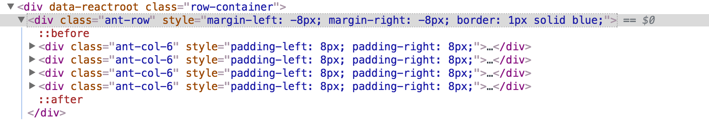

#### 1.Antd的布局
##### 1.1 gutter属性
下图就是将Row组件的gutter={16}后的结果:



首先你可以[阅读一下基础内容](http://blog.csdn.net/liangklfang/article/details/70231409)。首先我们的Row组件会在左侧和右侧分别超出父组件8px,同时从图中可以看到每一个Col元素都有下面的css属性:
```html
padding-left: 8px; 
padding-right: 8px;
```
这样的话，我们的第一个Col元素会直接紧紧挨着Row元素的父组件，从而`Row+Row的父元素+Col`之间形成了一个闭环。最后的结果就是:Col在左侧紧紧挨着Row的父元素，而且Col之间的距离就是gutter的大小。

##### 1.2 gutter属性对元素大小影响
请看下面的图:


不管有没有设置gutter，我们的Row的父元素的宽度应该是不变的(`Row的gutter只会影响Row自己的宽度`)，比如560px,那么每一个Col元素的宽度应该是:560/4=140px。假如我们设置了gutter={16},虽然Row的宽度变大了，即560+16=576px，但是我们的Col依然是参考Row的父元素来排版的，即:(560-(n-1)\*gutter)/n = (560-3\*16)/4=128，即从原来的140px宽度变成了128px！

我们为页面中栅格的Gutter设定了定值，即浏览器在一定范围扩大或缩小，栅格的 Column 宽度会随之扩大或缩小，但 Gutter 的宽度值固定不变。

##### 1.3 offset设置的值
使用 offset 可以将列向右侧偏。例如，offset={4} 将元素向右侧偏移了4个列（column）的宽度。

##### 1.5 push和pull设置
通过使用 push 和 pull 类就可以很容易的改变列（column）的顺序。push表示左偏多少列，而pull表示从右往左拉。

其中牵涉到类似布局的还有Form.Item的labelCol和wrapperCol:
```js
const formLayout = {
  labelCol: {
    span: 6
  },
  //label 标签布局，同 <Col> 组件，设置 span offset 值
  wrapperCol: {
    span: 18
  }
  //需要为输入控件设置布局样式时，使用该属性，用法同labelCol
};
```
这样，对于下面这种处理:
```js
<Col span={6}>
    <FormItem {...formLayout} label="层级名称">
      <Input />
    </FormItem>
</Col>
```
我们始终能保证label部分宽度为6(超出会自动省略号)，而标签部分为18。所以，当你一行有多个列的时候，每一列都是同样的布局(label和标签分别占据6,18)。即使你有`多行`，那么多行的标签部分都是对齐的。


参考资料：

[布局](https://ant.design/docs/spec/layout-cn)
