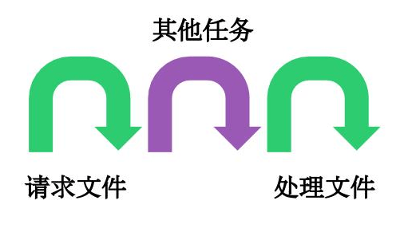

### 1.Generator与其他异步处理方案

以前，异步编程的方法，大概有下面四种。

#### 1.1 回调函数

JavaScript 语言对异步编程的实现，就是回调函数。所谓回调函数，就是把任务的第二段单独写在一个函数里面，等到重新执行这个任务的时候，就直接调用这个函数。它的英语名字 callback，直译过来就是"重新调用"。
读取文件进行处理，是这样写的。

```js
fs.readFile('/etc/passwd', function (err, data) {
  if (err) throw err;
  console.log(data);
});
```
上面代码中，readFile函数的第二个参数，就是回调函数，也就是任务的第二段。等到操作系统返回了 /etc/passwd 这个文件以后，回调函数才会执行。

一个有趣的问题是，为什么Node.js约定，回调函数的第一个参数，必须是错误对象err（如果没有错误，该参数就是 null）？原因是执行分成两段，在这两段之间抛出的错误，程序无法捕捉，只能当作参数，传入第二段。

#### 1.2 事件监听

在DOM监听中比较常见。

#### 1.3 发布/订阅

也就是常说的[观察者模式](http://www.tuicool.com/articles/mqANjiR)

#### 1.4 Promise 对象

回调函数本身并没有问题，它的问题出现在多个回调函数嵌套。假定读取A文件之后，再读取B文件，代码如下。

```j
fs.readFile(fileA, function (err, data) {
  fs.readFile(fileB, function (err, data) {
    // ...
  });
});
```

不难想象，如果依次读取多个文件，就会出现多重嵌套。代码不是纵向发展，而是横向发展，很快就会乱成一团，无法管理。这种情况就称为"回调函数噩梦"（callback hell）。
Promise就是为了解决这个问题而提出的。它不是新的语法功能，而是一种新的写法，允许将回调函数的横向加载，改成纵向加载。采用Promise，连续读取多个文件，写法如下。

```js
var readFile = require('fs-readfile-promise');
readFile(fileA)
.then(function(data){
  console.log(data.toString());
})
.then(function(){
  return readFile(fileB);
})
.then(function(data){
  console.log(data.toString());
})
.catch(function(err) {
  console.log(err);
});
```

Promise 的最大问题是代码冗余，原来的任务被Promise 包装了一下，不管什么操作，一眼看去都是一堆 then，原来的语义变得很不清楚。

#### 1.5 Generator的方式

ECMAScript 6 （简称 ES6 ）作为下一代 JavaScript 语言，将 JavaScript 异步编程带入了一个全新的阶段。关于异步编程可以查看下图：



而下面这种连续的执行过程叫做同步的。


Generator 函数是协程在 ES6 的实现，`最大特点就是可以交出函数的执行权（即暂停执行）。Generator 函数可以暂停执行和恢复执行，这是它能封装异步任务的根本原因。除此之外，它还有两个特性，使它可以作为异步编程的完整解决方案：函数体内外的数据交换和错误处理机制。`
next 方法返回值的 value 属性，是 Generator 函数向外输出数据；next 方法还可以接受参数，这是向 Generator 函数体内输入数据。如下例：

特性1：暂停执行与恢复执行

```js
function* gen(x){
  var y = yield x + 2;
  //(1)每次调用next只会执行yield后面的代码
  //(2)第二次调用next的时候可以将上一次调用yield后的结果返回给下一次的调用
  return y;
}
```

也就是通过yield来暂停执行，通过next来恢复执行

特性2：函数体内外的数据交换

```js
function* gen(x){
  var y = yield x + 2;
  return y;
}
var g = gen(1);
g.next() 
// { value: 3, done: false }
g.next(2) 
// { value: 2, done: true }
// 这里的g.next(2)相当于向我们的generator函数传入值(即表示我们上一次调用g.next得到的值为2)，作为上一个yield的返回值，所以得到的结果为2
```

通过调用next方法获取到的value代表函数体向外输出的数据，而调用next方法传入的参数本身代表向Generator传入数据。

特性3：错误处理机制

```js
function* gen(x){
  try {
    var y = yield x + 2;
  } catch (e){ 
    console.log(e);
  }
  return y;
}

var g = gen(1);
g.next();
g.throw（'出错了'）;
// 出错了
```

上面代码的最后一行，Generator 函数体外，使用指针对象的 throw 方法抛出的错误，可以被函数体内的 try ... catch 代码块捕获。这意味着，出错的代码与处理错误的代码，实现了时间和空间上的分离，这对于异步编程无疑是很重要的。

下面是Generator处理实际任务的一个例子：

```js
var fetch = require('node-fetch');
function* gen(){
  var url = 'https://api.github.com/users/github';
  var result = yield fetch(url);
  console.log(result.bio);
}
```

具体的执行过程如下：

```js
var g = gen();
var result = g.next();
//(1)第一步调用g.next表示从服务端获取数据，即得到yield fetch(url)的结果
//(2)第一个then方法表示将yield的结果转化为json
//(3)第二个then方法表示将json传回到我们的generator方法，此时可以打印result.bio的值
result.value.then(function(data){
  return data.json();
}).then(function(data){
  g.next(data);
});
```


### 2.thunk函数

#### 2.1 thunk函数基本概念

编译器的"传名调用"实现，往往是将参数放到一个临时函数之中，再将这个临时函数传入函数体。这个临时函数就叫做 Thunk 函数。

```js
function f(m){
  return m * 2;     
}
f(x + 5);
// 等同于
var thunk = function () {
  return x + 5;
};
function f(thunk){
  return thunk() * 2;
}
```

上面代码中，函数 f 的参数 x + 5 被一个函数替换了。凡是用到原参数的地方，对 Thunk 函数求值即可。这就是 Thunk 函数的定义，它是"传名调用"的一种实现策略，用来替换某个表达式。

#### 2.2 javascript中的thunk函数

JavaScript 语言是传值调用，它的 Thunk 函数含义有所不同。在 JavaScript 语言中，`Thunk 函数替换的不是表达式，而是多参数函数，将其替换成单参数的版本，且只接受回调函数作为参数。`

thunk函数的实现机制还是通过闭包来完成的。其调用分为三步，首先是传入一个函数,接着是传入该函数的所有除了callback以外的参数,最后是传入回调函数callback

```js
function thunkify(fn){
    //第一步：传入函数
  return function(){
    //第二步：传入除了callback以外的参数
    var args = new Array(arguments.length);
    var ctx = this;
    for(var i = 0; i < args.length; ++i) {
      args[i] = arguments[i];
    }
    return function(done){
        //第三步：传入回调函数
      var called;
      args.push(function(){
        if (called) return;
        //回调函数只会运行一次
        called = true;
        done.apply(null, arguments);
      });
      try {
        fn.apply(ctx, args);
      } catch (err) {
        done(err);
      }
    }
  }
};
```

### 3.thunk与Generator强强联手将程序执行权交还给Generator函数

#### 3.1 Generator的yield返回的必须是thunkify的函数才能递归

你可能会问， Thunk 函数有什么用？回答是以前确实没什么用，但是 ES6 有了 Generator 函数，Thunk 函数现在可以用于 Generator 函数的自动流程管理。

以读取文件为例。下面的 Generator 函数封装了两个异步操作。

```js
var fs = require('fs');
var thunkify = require('thunkify');
var readFile = thunkify(fs.readFile);
var gen = function* (){
  var r1 = yield readFile('/etc/fstab');
  //1.交出执行权
  console.log(r1.toString());
  var r2 = yield readFile('/etc/shells');
   //1.交出执行权
  console.log(r2.toString());
};
```

上面代码中，yield 命令用于将程序的执行权移出 Generator 函数，那么就需要一种方法，将执行权再交还给 Generator 函数。这种方法就是 Thunk 函数，因为它可以在回调函数里，将执行权交还给 Generator 函数。为了便于理解，我们先看如何手动执行上面这个 Generator 函数。

```js
var g = gen();
var r1 = g.next();
//2.查看这里的程序你可以清楚的看到，这里是将同一个回调函数反复的传入到g.next返回的value中。但是这个返回的value必须是thunkify过后的函数，这样它只会接受一个参数，那么就满足这里的定义了
r1.value(function(err, data){
  if (err) throw err;
  var r2 = g.next(data);
  r2.value(function(err, data){
    //2.value必须是thunkify的函数才会只接受一个callback参数
    if (err) throw err;
    g.next(data);
  });
});
```

上面代码中，变量 g 是 Generator 函数的内部指针，表示目前执行到哪一步。next 方法负责将指针移动到下一步，并返回该步的信息（value 属性和 done 属性）。
仔细查看上面的代码，可以发现 Generator 函数的执行过程，其实是将同一个回调函数，反复传入 next 方法的 value 属性。这使得我们可以用`递归`来自动完成这个过程。

#### 3.2 使用thunkify来自动执行Generator函数从而将执行权交还给Generator

```js
function run(fn) {
  var gen = fn();
  //获取到generator内部指针，这里的next就是thunk函数的回调函数
  function next(err, data) {
    var result = gen.next(data);
    //获取generator内部状态
    if (result.done) return;
    result.value(next);
    //Gnerator的value必须是thunkify函数，此时才会只接受一个回调函数
  }
  next();
}
run(gen);
```

下面是一个读取多个文件的例子：

```js
var gen = function* (){
  var f1 = yield readFile('fileA');
  var f2 = yield readFile('fileB');
  // ...
  var fn = yield readFile('fileN');
};
run(gen);
```

上面代码中，函数 gen 封装了 n 个异步的读取文件操作，只要执行 run 函数，这些操作就会自动完成。这样一来，异步操作不仅可以写得像同步操作，而且一行代码就可以执行。

Thunk 函数并不是 Generator 函数自动执行的唯一方案。因为自动执行的关键是，必须有一种机制，自动控制 Generator 函数的流程，接收和交还程序的执行权。回调函数可以做到这一点，Promise 对象也可以做到这一点。

### 4.co函数库实现Generator函数自动执行

co 函数库是著名程序员 TJ Holowaychuk 于2013年6月发布的一个小工具，用于 Generator 函数的自动执行。

#### 4.1 co函数库自动执行Generator，但是yield后必须是promise或者thunk函数

比如，有一个 Generator 函数，用于依次读取两个文件。

```js
var gen = function* (){
  var f1 = yield readFile('/etc/fstab');
  var f2 = yield readFile('/etc/shells');
  console.log(f1.toString());
  console.log(f2.toString());
};
```

co 函数库可以让你不用编写 Generator 函数的执行器。

```js
var co = require('co');
co(gen);
```

上面代码中，Generator 函数只要传入 co 函数，就会自动执行。co 函数返回一个 `Promise 对象`，因此可以用 then 方法添加回调函数。

```js
co(gen).then(function (){
  console.log('Generator 函数执行完成');
})
```

上面代码中，等到 Generator 函数执行结束，就会输出一行提示。相对于thunkify，我们的co的yeild后可以是promise或者thunk函数，其中后者是通过递归来实现的


#### 4.2 co函数库自动执行Generator的原理

为什么 co 可以自动执行 Generator 函数？

前面文章说过，Generator 函数就是一个异步操作的容器。它的自动执行需要一种机制，当异步操作有了结果，能够自动交回执行权。

两种方法可以做到这一点。

（1）回调函数。将异步操作包装成 Thunk 函数，在回调函数里面交回执行权（见第3部分）。

（2）Promise 对象。将异步操作包装成 Promise 对象，用 then 方法交回执行权。
co 函数库其实就是将`两种自动执行器（Thunk 函数和 Promise 对象），包装成一个库`。使用 co 的前提条件是，Generator 函数的 yield 命令后面，只能是 Thunk 函数或 Promise 对象。

下面展示如何使用Promise来交还执行权：

```js
var fs = require('fs');
var readFile = function (fileName){
    //这里new Promise导致我们的readFile本身返回的是一个Promise
  return new Promise(function (resolve, reject){
    fs.readFile(fileName, function(error, data){
      if (error) reject(error);
      resolve(data);
      //then方法的回调函数中会得到这里的data数据
    });
  });
};

var gen = function* (){
  var f1 = yield readFile('/etc/fstab');
  //这里返回的是一个Promise对象，所以通过g.next().value获取到的对象可以继续调用then方法
  var f2 = yield readFile('/etc/shells');
  console.log(f1.toString());
  console.log(f2.toString());
};
```

下面我们手动执行上面这个Generator函数

```js
var g = gen();
//g.next()开始执行第一个readFile方法，g.next().value表示执行第一个readFile返回的promise对象
g.next().value.then(function(data){
  //g.next(data)表示将上一个yield的执行结果交还给Generator，相当于将结果赋值给变量f1
  g.next(data).value.then(function(data){
    g.next(data);
  });
})
```

注意：如果是下面这样，那么f1最后将会是undefined(toString报错)，因为第一个yield执行结果并没有交还给Generator，所以无法获取到内容：

```js
var g = gen();
g.next().value.then(function(data){
    //下面不是g.next(data)，所以第一个读取文件的结果没有交还给Generator的f1
  g.next().value.then(function(data){
    g.next(data);
  });
})
```

而下面展示的就是一个通过Promise来自动执行Generator的实例：

```js
function run(gen){
  var g = gen();
  //获取指针
  function next(data){
    var result = g.next(data);
    if (result.done) return result.value;
    //result.value此处返回的是Promise对象
    result.value.then(function(data){
      next(data);
      //将data交给上一个yield执行结果
    });
  }
  next();
}
run(gen);
```

### 5.async对于异步的终极解决方案

#### 5.1 Generator函数的async表达

一句话，async 函数就是 Generator 函数的语法糖。

前文有一个 Generator 函数，依次读取两个文件。

```js
var fs = require('fs');
var readFile = function (fileName){
  return new Promise(function (resolve, reject){
    fs.readFile(fileName, function(error, data){
      if (error) reject(error);
      resolve(data);
    });
  });
};

var gen = function* (){
  var f1 = yield readFile('/etc/fstab');
  var f2 = yield readFile('/etc/shells');
  console.log(f1.toString());
  console.log(f2.toString());
};
```

写成 async 函数，就是下面这样。

```js
var asyncReadFile = async function (){
  var f1 = await readFile('/etc/fstab');
  var f2 = await readFile('/etc/shells');
  console.log(f1.toString());
  console.log(f2.toString());
};
```

一比较就会发现，async 函数就是将 Generator 函数的星号（*）替换成 async，将 yield 替换成 await，仅此而已。

#### 5.2 async函数的优点

async 函数对 Generator 函数的改进，体现在以下三点。

（1）内置执行器。 Generator 函数的执行必须靠执行器，所以才有了 co 函数库，而 async 函数自带执行器。也就是说，async 函数的执行，与普通函数一模一样，只要一行。

```js
var result = asyncReadFile();
```

（2）更好的语义。 async 和 await，比起星号和 yield，语义更清楚了。async 表示函数里有异步操作，await 表示紧跟在后面的表达式需要等待结果。

（3）更广的适用性。 co 函数库约定，yield 命令后面只能是 Thunk 函数或 Promise 对象，而 async 函数的 await 命令后面，可以跟 Promise 对象和原始类型的值（数值、字符串和布尔值，但这时等同于同步操作）。

#### 5.3 async的用法

同 Generator 函数一样，`async 函数返回一个 Promise 对象，可以使用 then 方法添加回调函数`。当函数执行的时候，一旦遇到 await 就会先返回，等到触发的异步操作完成，再接着执行函数体内后面的语句。

下面的例子，指定多少毫秒后输出一个值。

```js
function timeout(ms) {
  return new Promise((resolve) => {
    setTimeout(resolve, ms);
  });
}
async function asyncPrint(value, ms) {
  await timeout(ms);
  //遇到await了，所有先返回，得到异步操作完成，执行后面的代码
  console.log(value)
}
asyncPrint('hello world', 50);
```

上面代码指定50毫秒以后，输出"hello world"。

#### 5.4 async自动执行器的实现

```js
//genF是Generator函数
function spawn(genF) {
    //返回promise和co一样，但是co只能是promise和thunk函数
  return new Promise(function(resolve, reject) {
    var gen = genF();
    //得到Generator内部指针
    function step(nextF) {
      try {
        var next = nextF();
       //next获取到第一个await返回的结果
      } catch(e) {
        return reject(e); 
      }
      if(next.done) {
        return resolve(next.value);
      } 
      //如果done为true那么我们直接resolve
      Promise.resolve(next.value).then(function(v) {
        //第一个await返回的对象的value表示结果{value:'',done:false}
        step(function() { return gen.next(v); });  
        //调用gen.next()获取到下一个await的结果并传入上一次的await调用后得到的value    
      }, function(e) {
        step(function() { return gen.throw(e); });
      });
    }
    step(function() { return gen.next(undefined); });
    //首次执行的时候传入第一个await的data为undefined
  });
}
```

### 6.promise函数深入理解

每一个promise对象都会提供一个then方法或者是catch方法：

```js
somePromise().then(function () {
    // I'm inside a then() function!
});
```
在then方法内部，我们可以做三件事：

1. return 一个promise对象 

2. return 一个同步的值或者是 undefined 

3.同步的 throw 一个错误

理解这三种情况之后，你就会理解promise了。

#### 6.1 返回另一个promise对象

在有关promise的相关文章中，这种写法很常见，就像上文提到的构成promise链的一段代码：

```js
getUserByName('nolan').then(function (user) {
    return getUserAccountById(user.id);
}).then(funcxtion (userAccount) {
});
```
这段代码里面的return非常关键，没有这个return的话，getUserAccountById只是一个普通的被别的函数调用的函数。下一个回调函数会接收到undefined而不是userAccount

#### 6.2 返回一个同步的值或者是 undefined
返回一个 undefined 大多数情况下是错误的，但是返回一个同步的值确实是一个将同步代码转化成promise风格代码的好方法。举个例子，现在在内存中有users。我们可以：

```js
getUserByName('nolan').then(fcuntion (user) {
    if (inMemoryCache[user.id]) {
        return inMemoryCache[user.id]; 
         // returning a synchronous value!
    }
    return inMemoryCache[user.id]; 
    // returning a promise
}).then(function (userAccount) {
    // I got a user account
})
```
第二个回调函数并不关心userAccount是通过同步的方式得到的还是异步的方式得到的，而第一个回调函数既可以返回同步的值又可以返回异步的值。不幸的是，如果不显式调用return语句的话，javaScript里的函数会返回 undefined 。这也就意味着在你想返回一些值的时候，不显式调用return会产生一些副作用。

因此，我们要养成了一个个人习惯就是在`then方法内部永远显式的调用return或者throw`

#### 6.3 抛出一个同步的错误
说到throw，这又体现了promise的功能强大。在用户退出的情况下，我们的代码中会采用抛出异常的方式进行处理：

```js
getUserByName('nolan').then(function (user) {
  if (user.isLoggedOut()) {
    throw new Error('user logged out!'); // throwing a synchronous error!
  }
  if (inMemoryCache[user.id]) {
    return inMemoryCache[user.id];       // returning a synchronous value!
  }
  return getUserAccountById(user.id);    // returning a promise!
}).then(function (userAccount) {
  // I got a user account!
}).catch(function (err) {
  // Boo, I got an error!
});
```
如果用户已经登出的话， catch() 会收到一个同步的错误，如果有promise对象的状态变为rejected的话，它也会收到一个异步的错误。 catch() 的回调函数不用关心错误是异步的还是同步的。

在使用promise的时候抛出异常在开发阶段很有用，它能帮助我们定位代码中的错误。比方说，在then函数内部调用 JSON.parse（） ，如果JSON对象不合法的话，可能会抛出异常，在回调函数中，这个异常会被吞噬，但是在使用promise之后，我们就可以捕获到这个异常了。更多关于promise的内容请查看[谈谈使用promise时候的一些反模式](http://www.tuicool.com/articles/FvyQ3a)

下面是摘抄自这个文章的几个例子，弄懂了这几个例子有助于深入的理解Promise。

例子1

```js
doSomething().then(function () {
  return doSomethingElse();
  //undefined
}).then(finalHandler);
//finalHandler会接受到前面then指定的函数的返回值，因为它明确的return了，注意return不可少
```
答案如下：我们的then方法中没有形参接受到doSomething返回的值，所以为undefined

<pre>
doSomething
|-----------------|
                  doSomethingElse(undefined) 
                  |------------------|
                                     finalHandler(resultOfDoSomethingElse)
                                     |------------------|
</pre>

例子2

```js
doSomething().then(function () {
  doSomethingElse();
}).then(finalHandler);
```
答案如下:finalHandler也会接受到undefined，因为前面的then中的函数没有明确的return值

<pre>
doSomething
|-----------------|
                  doSomethingElse(undefined)
                  |------------------|
                  finalHandler(undefined)
                  |------------------|
</pre>

例子3

```js
doSomething().then(doSomethingElse())
//doSomethingElse()返回了Promise的情况比较特殊，finalHandler接受到doSomething的值
  .then(finalHandler);
```
答案如下：因为我们的then方法中的doSomethingElse()返回的是一个Promise对象，即typeof doSomethingElse()为"object"，所以finalHandler会接收到doSomething返回的值。

<pre>
doSomething
|-----------------|
doSomethingElse(undefined)
|---------------------------------|
                  finalHandler(resultOfDoSomething)
                  |------------------|
</pre>

比如下面的例子依然输出的为"qinliang"：

```js
var f=function(result){console.log(result);}
Promise.resolve("qinliang").then(f);
```
和下面的代码输出结果完全相同:

```js
Promise.resolve('qinliang').then(function(result){console.log(result);})
```
其实他们的then方法传入函数签名完全一致。

例子4

```js
doSomething().then(doSomethingElse)
//doSomethingElse会接受到doSomething()的结果
  .then(finalHandler);
//finalHandler会接受到doSomethingElse的结果
```
答案如下：我们的doSomethingElse只是一个`函数句柄(如const doSomething=function(){})`，通过调用这个函数句柄doSomethingElse()会得到我们的Promise对象。

<pre>
doSomething
|-----------------|
                  doSomethingElse(resultOfDoSomething)
                  |------------------|
                                     finalHandler(resultOfDoSomethingElse)
                                     |------------------|
</pre>
需要说明的是，在上述的例子中，我都假设 doSomething() 和 doSomethingElse() `返回(注意是返回了，即return的情况下，而不是第一个例子的方式)`一个promise对象，这些promise对象都代表了一个异步操作，这样的操作会在当前event loop之外结束，比如说有关IndexedDB，network的操作，或者是使用 setTimeout 。这里给出 JSBin 上的示例。


参考资料：

[Generator 函数的含义与用法](http://www.ruanyifeng.com/blog/2015/04/generator.html)

[Thunk 函数的含义和用法](http://www.ruanyifeng.com/blog/2015/05/thunk.html)

[co 函数库的含义和用法](http://www.ruanyifeng.com/blog/2015/05/co.html)

[async 函数的含义和用法](http://www.ruanyifeng.com/blog/2015/05/async.html)

[async库](http://caolan.github.io/async/docs.html)

[co库](https://github.com/tj/co)

[node-thunkify库](https://github.com/tj/node-thunkify)

[谈谈使用promise时候的一些反模式](http://www.tuicool.com/articles/FvyQ3a)

[关于Promise：你可能不知道的6件事](http://www.tuicool.com/articles/6fqQ3aB)
