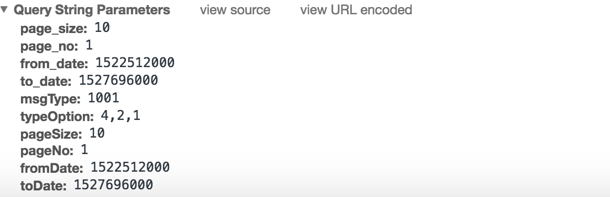
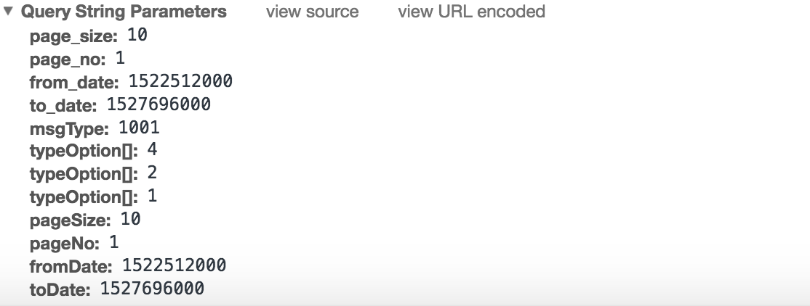

#### 前言
本章节主要是关于开发中的基础问题，欢迎star

#### 前端post请求发送数组的表现
此时在chrome控制台看到的将会是如下的格式:

如果你把URL解码一下(Form Data里面点击view source)，你可以看到如下的格式:
<pre>
typeOption=4,2&msgType=1000&mockSend=0
</pre>

#### 前端Get请求发送数组的表现

可以看到不管是post/get都不会出现如下的参数形式:

而且下面这种传递参数的方式可能会抛出错误:"For input string quote quote"。一般出现这种情况是ajax将数组当做json处理了。
