#### 主要内容
在本章节，主要是一些渲染引擎相关内容。通过这部分内容我希望自己能够更多的了解浏览器，不仅仅是JS引擎，也包括渲染引擎和图像图形学基础知识。如果你有任何问题欢迎issue,同时也欢迎star！

#### 第一部分.计算机图形学基础知识
##### 1.bitmap+像素比特BPP
###### 1.1 什么是[bitmap](https://baike.baidu.com/item/Bitmap/6493270?fr=aladdin)
**位图文件（Bitmap）**，扩展名可以是.bmp或者.dib。位图是**Windows标准格式图形文件**，它将图像定义为由**点(像素)**组成，每个点可以由多种色彩表示，包括2、4、8、16、24和32位色彩。例如，一幅1024×768分辨率的32位真彩图片(总共为32个比特,含有的`颜色数量`为2^32种)，其所占存储字节数为：1024×768×32/(8\*1024)=3072KB(其中1个字节=8个比特位)。

位图文件图像效果好，但是`非压缩格式`的，需要**占用较大存储空间**，不利于在网络上传送。jpg格式则恰好弥补了[位图文件这个缺点](https://baike.baidu.com/item/%E4%BD%8D%E5%9B%BE%E5%9B%BE%E5%83%8F/1451321)。

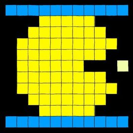

###### 1.2 像素每比特(BPP)
像素所能表达的**不同颜色数**取决于比特每像素([BPP](https://baike.baidu.com/item/%E5%83%8F%E7%B4%A0/95084?fr=aladdin))。这个最大数可以通过取二的色彩深度次幂来得到。例如，常见的取值有:
```js
8 bpp ;
// [2^8=256；(256色)]
16 bpp [2^16=65536]
// (65,536色，称为高彩色)]
24 bpp 
// [2^24=16777216； (16,777,216色，称为真彩色)]；
// 注意24位也是真彩色，见上面1.1部分,即一个像素有2^24种颜色
48 bpp 
// [2^48=281474976710656；(281,474,976,710,656色，用于很多专业的扫描仪) 。
```
256色或者更少的色彩的图形经常以**块或平面格式**存储于显存中，其中显存中的每个像素是到一个称为调色板的颜色数组的索引值。这些模式因而有时被称为索引模式。

虽然每次只有256色，但是这256种颜色选自一个选择大的多的调色板，通常是16兆色。改变调色板中的色彩值可以得到一种动画效果。windows95和windows98的标志可能是这类动画最著名的例子了。

**对于超过8位的深度**，这些数位就是三个分量（红绿蓝）的各自的数位的总和。一个16位的深度通常分为5位红色和5位蓝色，6位绿色（眼睛对于绿色更为敏感）。24位的深度一般是每个分量8位。在有些系统中，32位深度也是可选的：这意味着24位的像素有**8位额外的数位来描述透明度**。在老一些的系统中，4bpp（16色）也是很常见的。 当一个图像文件显示在屏幕上，每个像素的数位对于光栅文本和对于显示器可以是不同的。有些光栅图像文件格式相对其他格式有更大的色彩深度。

例如GIF格式，其最大深度为8位，而TIFF文件可以处理48位像素。没有任何显示器可以显示48位色彩，所以这个深度通常用于特殊专业应用，例如胶片扫描仪和打印机。


##### 1.2 什么是[渲染到纹理](http://blog.csdn.net/a812073479/article/details/49208119)
常规的渲染操作是将场景送至backbuffer，而backbuffer实际上是一个Surface，而纹理恰恰又包含了Surface，所以我们只需要取得纹理的Surface，其次将场景送至这个Surface，最后再把这个纹理渲染到backbuffer中即可。举个例子，假设你要在一面墙壁上画一幅画，你有两种方法:

- 方法1
  直接在墙上画，这个很好理解，就对应常规的backbuffer渲染
- 方法2
  先将画绘制在纸上，然后将纸贴到墙上，这就对应渲染到纹理的过程。这里**墙壁**相当于backbuffer，而纸张相当于纹理的Surface，在纸上作画相当于渲染到纹理，把纸贴到墙上相当于把纹理渲染到backbuffer。具体的步骤如下:

<pre>
1 创建纹理并获得纹理的表面（Surface）
2 向纹理的表面渲染场景
3 渲染纹理本身
</pre>

##### 1.3 双缓冲(Double Buffer)原理和使用
###### 1.3.1 双缓冲作用
双缓冲甚至是多缓冲，在许多情况下都很有用。一般需要使用双缓冲区的地方都是**由于“生产者”和“消费者”供需不一致**所造成的。这样的情况在很多地方可能会发生，使用**多缓冲**可以很好的解决。我举几个常见的例子：

例1. 在网络传输过程中数据的接收，有时可能数据来的太快来不及接收导致数据丢失。这是由于“发送者”和“接收者”速度不一致所致，在他们之间安排一个或多个缓冲区来存放来不及接收的数据，让速度较慢的“接收者”可以慢慢地取完数据不至于丢失。

例2. 再如，计算机中的**三级缓存结构**：外存（硬盘）、内存、高速缓存（**介于CPU和内存之间，可能由多级**）。从左到右他们的存储**容量不断减小，但速度不断提升**，当然价格也是越来越贵。作为“生产者”的 CPU 处理速度很快，而内存存取速度相对CPU较慢，如果直接在内存中存取数据，他们的速度不一致会导致 CPU能力下降。因此在他们之间又增加的高速缓存来作为缓冲区平衡二者速度上的差异。

例3. 在图形图像显示过程中，计算机从**显示缓冲区**取数据然后显示，很多图形的操作都很复杂需要大量的计算，很难访问一次**显示缓冲区**就能写入待显示的完整图形数据，通常需要多次访问显示缓冲区，每次访问时写入**最新计算**的图形数据。而这样造成的后果是一个需要复杂计算的图形，你看到的效果可能是**一部分一部分地**显示出来的，造成很大的闪烁不连贯。而使用双缓冲，可以使你先将计算的**中间结果存放在另一个缓冲区中，待全部的计算结束，该缓冲区已经存储了完整的图形之后，再将该缓冲区的图形数据一次性复制到显示缓冲区**。

例1中使用双缓冲是为了**防止数据丢失**，例2中使用双缓冲是为了提高**CPU的处理效率**，而例3使用双缓冲是为了**防止显示图形时的闪烁延迟**等不良体验。

###### 1.3.2 双缓冲原理

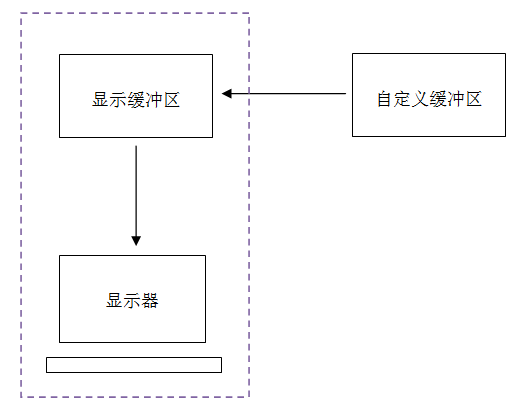

注意，**显示缓冲区是和显示器**一起的，显示器**只负责从显示缓冲区取数据显示**。**我们通常所说的在显示器上画一条直线**，其实就是往该显示缓冲区中写入数据。显示器通过不断的刷新（从显示缓冲区取数据），从而使显示缓冲区中数据的改变及时的反映到显示器上。

这也是显示**复杂图形时造成延迟**的原因，比如你现在要显示从屏幕中心向外发射的一簇射线，你开始编写代码用一个循环从0度开始到360度，每隔一定角度画一条从圆心开始向外的直线。你**每次画线其实是往显示缓冲区写入数据**，如果你还没有画完，显示器就从显示缓冲区取数据显示图形，此时你看到的是一个不完整的图形，然后你继续画线，等到显示器再次取显示缓冲区数据显示时，图形比上次完整了一些，依次下去直到显示完整的图形。**你看到图形不是一次性完整地显示出来，而是每次显示一部分，从而造成闪烁**。

##### 1.4 什么是OpenGL
[OpenGL](https://baike.baidu.com/item/OpenGL/238984?fr=aladdin)（全写Open Graphics Library）是指定义了一个跨编程语言、跨平台的编程接口规格的专业的**图形程序接口**。它用于三维图像（二维的亦可），是一个功能强大，调用方便的底层图形库。

OpenGL是Khronos Group开发维护的一个规范，它主要为我们定义了[用来操作图形和图片的一系列函数的API](https://www.zhihu.com/question/51867884)，需要注意的是OpenGL本身并非API。GPU的硬件开发商则需要提供满足OpenGL规范的实现，这些实现通常被称为“驱动”，它们负责将OpenGL定义的API命令**翻译为GPU指令**。

当然，如果硬件开发商的某款显卡**无法在硬件上支持**OpenGL所定义的所有功能(OpenGL的实现没说一定要有GPU的，像mesa 3d可以在纯软件的环境下运行)，那么硬件开发商就必须通过**软渲染的方式**提供这种功能。综上，OpenGL并非一个能够直接安装的库或包，**它只是一个规范**。我们只需要安装显卡的驱动即可，因为**显卡驱动**中就包括了对OpenGL规范的实现。


##### 1.5 OpenGL的渲染管道
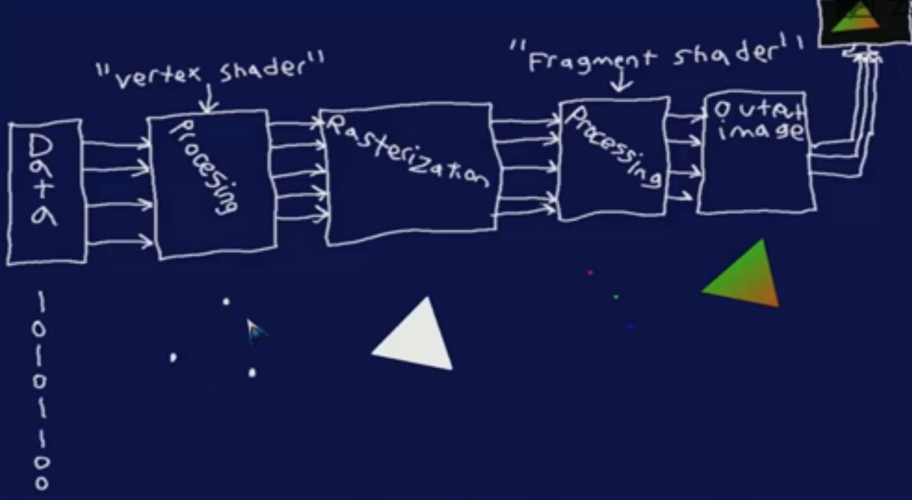

这个图的最开始是图像的真实数据，即01010的比特数据;第二步就是获取顶点数据，即所谓的vertex shader;接着就是光栅化Rasterization，此时将点连接起来得到具体的线，进而得到区域;接着进一步处理，得到每一个点的具体颜色;最后根据这些有颜色的点生成具体的图像。

###### 1.5.1 Vertex Shader
**输入**：顶点坐标（Position），该坐标值是由glVertex* 或者是glDraw*传入的。

**输出**：顶点坐标，这个是经过几何变换后的坐标。

功能：简单的说就是把输入的**顶点坐标乘以（一系列）几何变换矩阵**转化为屏幕上的具体位置。每输入一个顶点（也就是glVertex\*每调用一次），Vertex shader都会被调用一次。Vertex Shader只知道处理顶点，它不知道这些顶点是做什么用的，也就是不知道这些顶点将来会被装配成什么图元（因为Vertex shader后面才会有图元装配的过程）。
  
当然，VS还可以接收**颜色，纹理坐标，雾坐标**等属性，并在内部对他们做一点点变化，然后再输出

###### 1.5.2 Fragment Shader
Vertex Shader主要对**顶点的属性**起作用，即多边形的转角点;而我们的Fragment Shader主要处理的是多个顶点之间的像素，它们是使用特定的规则在顶点间进行**插值**。比如:你想要多边形是完全的红色，此时你会将所有的顶点都设置为红色，但是如果你想要在顶点间设置渐变效果，你可以通过Fragment Shader来完成。

###### 1.5.3 Rasterization
光栅化（Rasterization）是把**顶点数据转换为片元**的过程，具有将图**转化为一个个栅格**组成的图像的作用，特点是每个元素对应帧缓冲区中的一像素。更加通俗的讲:光栅化是将几何数据经过一系列变换后最终转换为**像素**，从而呈现在显示设备上的过程。具体光栅化的过程可以[点击这里](https://www.jianshu.com/p/54fe91a946e2?open_source=weibo_search)，变换如下图:

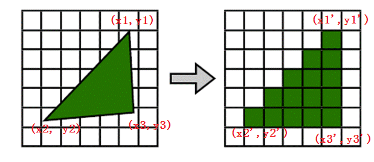

###### 1.5.4 [Frame Buffer Object](http://blog.csdn.net/wangdingqiaoit/article/details/52423060)帧缓冲对象
一直以来，我们在使用OpenGL渲染时，最终的目的地是**默认的帧缓冲区**，实际上OpenGL也允许我们创建自定义的帧缓冲区。使用自定义的帧缓冲区，可以实现**镜面，离屏渲染**，以及很酷的后处理效果。

在OpenGL中，渲染管线中的**顶点、纹理**等经过一系列处理后，最终显示在2D屏幕设备上，渲染管线的最终目的地就是帧缓冲区。帧缓冲包括OpenGL使用的**颜色缓冲区(color buffer)、深度缓冲区(depth buffer)、模板缓冲区(stencil buffer)**等缓冲区。默认的帧缓冲区由窗口系统创建，这个默认的帧缓冲区，就是目前我们一直使用的绘图命令的作用对象，称之为窗口系统提供的帧缓冲区(window-system-provided framebuffer)。

OpenGL也允许我们手动创建一个帧缓冲区，并将渲染结果**重定向**到这个缓冲区。在创建时允许我们自定义帧缓冲区的一些特性，这个自定义的帧缓冲区，称之为**应用程序帧缓冲区(application-created framebuffer object )**。

同默认的帧缓冲区一样，自定义的帧缓冲区也包含颜色缓冲区、深度和模板缓冲区，这些逻辑上的缓冲区（logical buffers）在FBO中称之为**可附加的图像**(framebuffer-attachable images)，他们是可以附加到FBO的二维像素数组（2D arrays of pixels ）。

FBO中包含两种类型的附加图像(framebuffer-attachable): **纹理图像和RenderBuffer图像**(texture images and renderbuffer images)。附加纹理时OpenGL渲染到这个纹理图像，在着色器中可以访问到这个纹理对象；附加RenderBuffer时，OpenGL执行离屏渲染(offscreen rendering)。

之所以用附加这个词，表达的是**FBO可以附加多个缓冲区**，而且可以灵活地在缓冲区中切换，一个重要的概念是附加点(attachment points)。FBO中包含一个以上的颜色附加点，但只有一个深度和模板附加点。

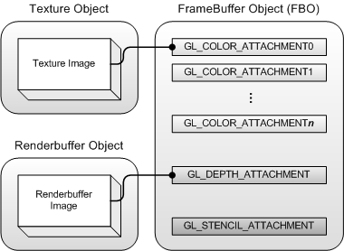

##### 1.6 [离屏渲染](http://blog.csdn.net/qq_29846663/article/details/68960512)
OpenGL中，GPU屏幕渲染有两种方式:

###### 1.6.1 On-Screen Rendering (当前屏幕渲染) 
指的是GPU的渲染操作是在**当前用于显示的屏幕缓冲区**进行。

###### 1.6.2 Off-Screen Rendering (离屏渲染)
指的是在GPU在**当前屏幕缓冲区以外开辟一个缓冲区**进行渲染操作。

当前屏幕渲染不需要额外创建新的**缓存**，也不需要**开启新的上下文**，相对于离屏渲染性能更好。但是受当前屏幕渲染的局限因素限制(只有自身上下文、屏幕缓存有限等)，当前屏幕渲染有些情况下的渲染解决不了的，就使用到离屏渲染。相比于当前屏幕渲染，离屏渲染的代价是很高的，主要体现在两个方面：
<pre>
(1）创建新缓冲区:要想进行离屏渲染，首先要创建一个新的缓冲区。
(2)上下文切换:离屏渲染的整个过程，需要多次切换上下文环境：先是从当前屏幕（On-Screen）切换到离屏（Off-Screen），等到离屏渲染结束以后，将离屏缓冲区的渲染结果显示到屏幕上又需要将上下文环境从离屏切换到当前屏幕。而上下文环境的切换是要付出很大代价的。
</pre>

##### 1.7 [VRAM](https://baike.baidu.com/item/VRAM/910598?fr=aladdin)
Video Random Access Memory:**显存，帧存储器，刷新存储器，或VRAM（缩写）**。它是[**显卡上的随机存取存储器**](https://baike.baidu.com/item/%E9%9A%8F%E6%9C%BA%E5%AD%98%E5%8F%96%E5%AD%98%E5%82%A8%E5%99%A8)。是一种双端口内存，它允许在同一时间被所有硬件（包括中央处理器、显示芯片等）访问。它比EDO DRAM快20%左右。但它的价格也是比较高的,它适用于**高色深、高分辨率**的显频设备。

它的主要功能是将显卡的**视频数据输出到数模转换器**中，有效降低绘图显示芯片的工作负担。它采用双数据口设计，其中一个数据口是并行式的数据输出入口，另一个是串行式的数据输出口。多用于高级显卡中的高档内存

##### 1.8 [skia](https://baike.baidu.com/item/skia/1287196?fr=aladdin)简介
skia是个**2D向量图形处理函数库**，包含**字型、坐标转换，以及点阵图**都有高效能且简洁的表现。不仅用于Google Chrome浏览器，新兴的Android开放手机平台也采用skia作为绘图处理，搭配OpenGL/ES与特定的硬件特征，强化显示的效果。

##### 1.9 图元
OpenGL图元是抽象的几何概念，不是真实世界中的物体，因此须用相关的数学模型来描述。所有的图元都是由一系列**有顺序的顶点集合**来描述的。OpenGL中绘制几何图元，必须使用glBegain()和glEnd()这一对函数，传递给glBegain()函数的参数唯一确定了要绘制何种几何图元，同时，在该函数对中给出了几何图元的定义，函数glEnd()标志顶点列表的结束。例如，下面的代码绘制了一个多边形：
```c
glBegin(GL_POLYGON);
glVertex2f(0.0,0.0);
glVertex2f(0.0,3.0);
glVertex2f(3.0,3.0);
glVertex2f(4.0,1.5);
glVertex2f(3.0,0.0);
glEnd();
```
函数glBegin(GLenum mode)标志描述一个几何图元的顶点列表的开始，其参数mode表示**几何图元的描述类型**，具体类型见表一：

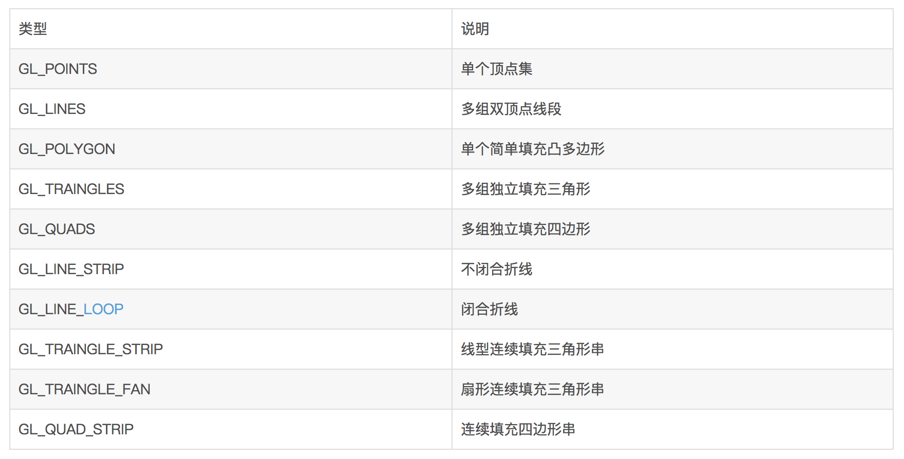

部分几何图元的示意图：

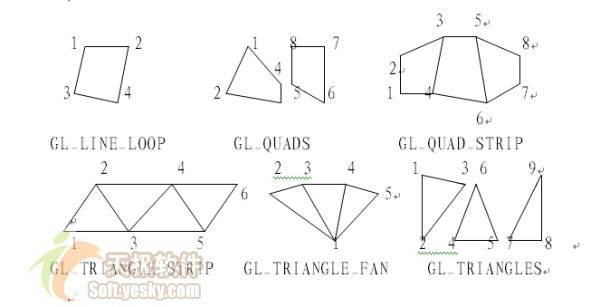

在glBegin()和glEnd()之间最重要的信息就是由函数glVertex\*()定义的顶点，必要时也可为每个顶点指定颜色（只对当前点或后续点有效）、法向、纹理坐标或其他，即调用相关的函数：

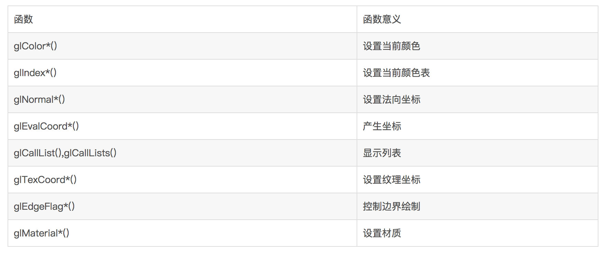

需要指出的是：OpenGL所定义的**点、线、多边形等图元与一般数学定义不太一样**，存在一定的差别。一种差别源于基于计算机计算的限制。OpenGL中所有浮点计算**精度有限**，故点、线 、多边形的坐标值存在一定的误差。另一种差别源于**位图显示的限制**。以这种方式显示图形，最小的显示图元是一个像素，尽管每个像素宽度很小，但它们仍然比数学上所定义的点或线宽要大得多。当用OpenGL进行计算时，虽然是用一系列浮点值定义点串，但每个点仍然是用单个像素显示，只是近似拟合。关于图元的更多信息请查看[OpenGL基本图元](http://blog.csdn.net/feijj2002_/article/details/466987)。

##### 1.10 法向量与光照
现实世界的光照是极其复杂的，而且会受到诸多因素的影响，这是以目前我们所拥有的处理能力无法模拟的。因此OpenGL的光照仅仅使用了简化的模型并基于对现实的估计来进行模拟，这样处理起来会更容易一些，而且看起来也差不多一样。这些光照模型都是基于我们对光的物理特性的理解。其中一个模型被称为**冯氏光照模型(Phong Lighting Model)**。冯氏光照模型的主要结构由3个元素组成：**环境(Ambient)、漫反射(Diffuse)和镜面(Specular)光照**。这些光照元素看起来像下面这样：


###### 1.10.1 环境光照(Ambient Lighting):
即使在黑暗的情况下，世界上也仍然有一些光亮(月亮、一个来自远处的光)，所以物体永远不会是完全黑暗的。我们使用环境光照来模拟这种情况，也就是无论如何永远都给物体一些颜色。
```c
void main()
{
    float ambientStrength = 0.1f;
    vec3 ambient = ambientStrength * lightColor;
    // 1.光的颜色乘以一个(数值)很小常量环境因子
    vec3 result = ambient * objectColor;
    // 2.然后乘以物体的颜色，然后使用它作为片段的颜色
    color = vec4(result, 1.0f);
}
```
###### 1.10.2 漫反射光照(Diffuse Lighting)
模拟一个发光物对物体的方向性影响(Directional Impact)。它是冯氏光照模型最显著的组成部分。面向光源的一面比其他面会更亮。环境光本身不提供最明显的光照效果，但是**漫反射光照会对物体产生显著的视觉影响**。漫反射光使物体上与光线排布越近的片段越能从光源处获得更多的亮度。为了更好的理解漫反射光照，请看下图:


图左上方有一个光源，它所发出的光线落在物体的一个片段上。我们需要测量这个光线与它所接触片段之间的角度。如果光线**垂直**于物体表面，这束光对物体的影响会最大化。为了测量光线和片段的角度，我们使用一个叫做法向量(Normal Vector)的东西，它是垂直于片段表面的一种向量(这里以黄色箭头表示。两个向量之间的角度就能够根据[点乘](https://baike.baidu.com/item/%E7%82%B9%E7%A7%AF/9648528?fr=aladdin&fromid=8251625&fromtitle=%E7%82%B9%E4%B9%98)计算出来(与[叉积](https://baike.baidu.com/item/%E5%90%91%E9%87%8F%E7%A7%AF/4601007?fr=aladdin&fromid=8251892&fromtitle=%E5%8F%89%E4%B9%98)相对，不过叉积的结果是与两个想来都垂直的另外一个向量)。而且,我们知道两个单位向量的角度越小，它们点乘的结果越倾向于1。当两个向量的角度是90度的时候，点乘会变为0。这同样适用于θ，**θ越大，光对片段颜色的影响越小**。计算公式如下:

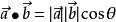

点乘返回一个**标量**，我们可以用它计算光线对片段颜色的影响，基于不同片段所朝向光源的方向的不同，这些片段被照亮的情况也不同。

###### 1.10.3 镜面光照(Specular Lighting)
模拟有光泽物体上面出现的亮点。镜面光照的颜色，相比于物体的颜色更倾向于光的颜色。和环境光照一样，镜面光照**同样依据光的方向向量和物体的法向量**，但是这次它也会依据观察方向，例如玩家是从什么方向看着这个片段的。镜面光照根据光的反射特性。如果我们想象物体表面像一面镜子一样，那么，无论我们从哪里去看那个表面所反射的光，镜面光照都会达到最大化。你可以从下面的图片看到效果:


我们通过反射法向量周围光的方向计算反射向量。然后我们计算反射向量和视线方向的角度，**如果之间的角度越小，那么镜面光的作用就会越大**。它的作用效果就是，当我们去看光被物体所反射的那个方向的时候，我们会看到一个高光。

#### 第二部分.深入GPU百科全书
##### 2.1 方程与几何
对于图形学来说，外形的改变就是多边形的改变，进一步来讲就是**顶点坐标**的变化。而顶点坐标的变化，是可以通过方程来描述的。只要通过改变这些方程的参量,就能够产生不同的图形。


其实在有关方程的问题上，要做的事情不止翻译这么简单。**首先**要把方程的结果转化成坐标，**然后**还要对这些坐标进行处理，把它们转化成实实在在看得见的点，再把这些点放在正确的位置上，对他们进行细腻的调整以达到最佳的效果，**最后**再把它们连起来形成表面。比如下面是DX10的几何处理过程:

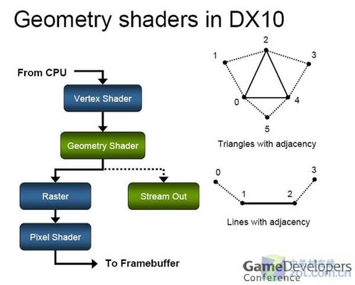

而下面将讲解我们的主角GPU:

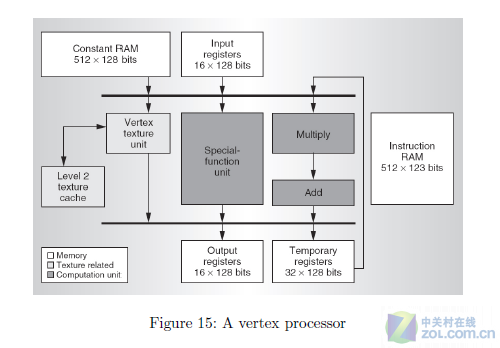

现代GPU的几何单元具备**完整的setup、顶点调节、多变性调节、基本光照调整以及相关的材质调节**等多种功能。通过几何单元的动作，程序员创造的抽象数学将被还原成实在的可视空间几何体，这些几何体还会进一步的根据程序要求被调整到适当的位置，以达到微调模型外形实现不同效果的目的。

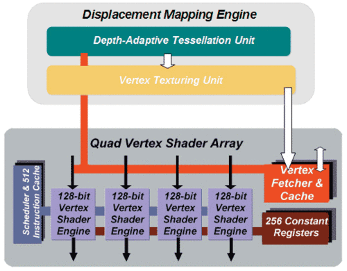

用正常的汉语来说，就是**几何单元**替我们看懂了那些晦涩的数学公式，计算了它们的结果，然后在我们可以看到的地方把那些结果所表示的点全部标了出来，接着再根据程序的要求调整它们的位置，最后把这些点全部连起来形成了物体。

##### 2.2 GPU的角色转化
###### 2.2.1 概述
要说真正的的几何处理能力，其实GPU一开始是不具备的。**GPU的前身显卡**所充当的角色曾经是单纯的画笔，CPU指哪里，显卡就画哪里，CPU让画什么显卡就画什么。第一代GPU革命虽然让CPU**丧失了对Tranform和lighting**的霸占，但第一代GPU依旧**不具备**完整的几何调节能力。顶点的位置依旧是CPU说了算，所有关于**几何形状的计算**全部由CPU来完成，而且**一旦确定就不能再行更改**。比如下图,顶点的生成就不在图形流水线过程之中，即不由GPU控制:

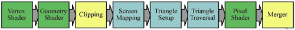

###### 2.2.2 Vertex Shader阶段
随着模型精度的一步步提升，**顶点的数目**也跟着多边形的增长一步步的激增，终于到了CPU无法负载的地步。于是，第二代GPU非常彻底的断灭了CPU复辟夺权的企图——它通过**Vertex Shader彻底拿走了CPU调节几何的能力。现在，CPU就只剩下最原始的生成顶点这一功能了**。Vertex Shader的出现，让GPU第一次有了独立自主的调节模型内顶点的能力，也让GPU内部出现了像素处理和Trangle Setup之外的新鲜事物。

###### 2.2.3 Geometry Shader阶段
第一代的VS(Vertex Shader)虽然让GPU具备了一定的几何处理能力，但它并不出色，时不时的还要CPU过来扶一把。直到DirectX 10将所有Shader执行单元统一，并由此带来了更加广泛的Shader应用领域之后，**Geometry Shader**的出现才让GPU彻底替我们背了跟数学缠斗的黑锅。
  
到了DirectX 11 GPU当中，我们发现了几何部分的重大变化——除了熟悉的**setup**(在顶点被摆放妥当之后，setup单元接下来要做的事情就是连接。按照正确的规则将顶点连接起来之后，物体的外形也就被确定下来了。正如当你抬头仰望星空时，你看到的永远都只是一颗一颗的星星，只有把它们连起来，**星座**才会出现，setup输出三角形的目的也在于此)之外，Tesselation和功能更加完善的Geometry Shader来了。

区别于以往的传统的处理方式，新的**Geometry Shader+Tesselation**允许**GPU自己生成新的顶点并完成设置工作**。现在CPU还是干以前一样的工作，基本模型的顶点还是由他来生成，而且数量也没有变化，只不过当顶点再次流入到GPU之后情况会发生些许变化。现在的几何单元会先查看程序中是否包含一种叫做**镶嵌系数**的新东西，如果没有，则几何单元重复常规过程；如果有，则几何单元将会进入一个全新的状态:

**首先**，CPU生成的模型依旧不变，几何单元在阅读了同顶点模型信息一起传过来的**镶嵌系数及方程**之后，会先让**Geometry Shader中的Hull Shader**对曲面要求进行解析，按照要求寻找其中的**控制点**，然后让Tesselator单元根据系数的要求生成全新的点(注意:setup一旦将顶点连接完成几何结构的模型构筑，就等于房子原有的结构已经造好。这时候程序如果有更高的几何外形要求而需要更多的多边形，比如实现浮雕效果，Tessellation单元就会根据需求重新生成新的顶点，并与Domain Shader一起将新的顶点放置到合适的位置上，以完成对旧有多边形的“碎裂”过程)，新生成的点全部在旧有顶点范围之内，当这些新生成的点被Tesselator单元送出之后，Hull Shader会根据程序的镶嵌说明把它们送到新的位置上并完成必要的调整，最后再**由Domain Shader**把Hull shader调整好的镶嵌点变成新的顶点输送给setup。下面给出Hull Shader和Tesselation Pipeline的处理过程:

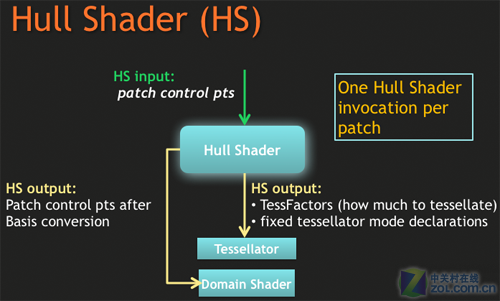

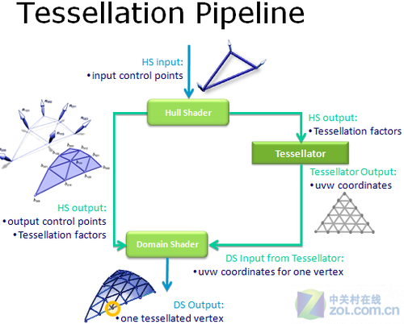

##### 2.3 顶点引证（Vertex Instancing)
对大数量的拥有**重复性但却有不能完全相同**的模型来说，程序可以先创建一个通用模型的基本信息，然后将模型的基本信息封装成一个`位于基础索引内`的只读信息包，这就是网络水军们得通用帖子模板。几何单元可以通过`SV_InstanceID`的索引来快速读取通用模型信息，并跳过重复的创建过程，这就是著名动作ctrl-V。接下来只要对通用模型进行一定的LOD修改等常规动作，即可完成一个全新模型的输出。

##### 2.4 三维转换
在图形流水线过程中，真正的具备3维空间意义的处理过程，却**只有几何单元一处而已**，当几何单元处理过图形数据之后，后续的所有步骤将`全部在2维空间中进行`，再也没有实在对应空间的3D坐标了。我们看到的所谓3D图形效果的处理，其实几乎都是在2维空间中完成的。

##### 2.5 Vertex Texture和Vertex Lighting
Vertex Texture和Vertex Lighting会按照程序要求提前访问**材质库**，并为整个模型附上最基本的**带光照信息的底层纹理**，就好像把框架模型变成一座石膏雕像一样。到这一步，常规的几何过程基本上就算完成了。

##### 2.6 光栅化
###### 2.6.1 光栅化原因
把三维世界变成二维，就因为你面前的显示器**只能显示二维的画面**。同时，Rasterizer（光栅化）收割3D世界所要面对的第一个问题，就是西方写实派美术的基础——**线透视关系**。

###### 2.6.2 Transform操作处理透视关系
Transform词如其意，就是指对立体物体的变形。三维空间中的物体会自然地呈现三维坐标系的特征，其上的每一个点均会带有完整的三维坐标向量。想要将这些点固定在二维世界中**同时还要符合透视关系**，这就是Transform的工作。

透视关系，其实归根结底还是数学关系，物体到投影面的形态属于标准欧式几何，人们可以用典型规范的数学手段加以描述，于是将三维物体二维化的过程，便可以通过方程变换的形式加以完成了。经过计算，**所有三维空间的点都可以在保证与观察者也就是摄像机位置存在正确关系的前提下，变成一个没有真实Z轴的二维点**。简单地说，就是可以被装进画里了。

由于这是整个光栅化过程的核心，因此，**光栅化也经常被称作坐标变换**。不难发现，这种基于数学关系的投影转变跟摄影有着非常接近的关系。如果没有Transform过程，我们甚至可以直接将坐标变换过程理解成是在拍照。

###### 2.6.3 为什么有进行光栅化
由于透视关系的缘故，我们显示器所在的固定视野会导致视线中**大量遮蔽关系**的出现，立体世界中那些被遮挡的以及因为角度问题背对摄像机视野的面将无法被我们所看到，`如果不进行光栅化过程`，不考虑视觉关系就直接将几何单元生成的空间全部根据需要进行**材质和像素填充**，渲染那些看不到的部分对于GPU来说显然是一种极大的资源浪费。

另外，光栅化之后GPU所要处理的操作，将会是**像素和材质**，**由于整个渲染过程所操作的最基本单位是像素，所以光栅化操作所转化的二维画面，其实就是一个以像素为基本单位构成的平面。后续的颜色处理，将围绕着这个平面内所有的像素展开。如果不进行光栅化操作，而是继续维持可操作的顶点和几何模型，未被冻结的几何外形将无法为像素和材质的操作提供保护**。世界原本是美丽的，但错误的构筑世界的工作配合却可能会毁掉这种美丽。下面是光栅化的过程:


##### 2.7 像素处理(Pixel Shader)
##### 2.7.1 [像素处理的复杂性](http://blog.csdn.net/pizi0475/article/details/7523494)
如果一个像素被摆放在静止的空间内，周围的环境完全没有任何的变化，这个像素自然也就不会有任何变化。对于这样的像素我们甚至不用处理，直接以**烘焙材质+纹理贴图**的形式就可以完成表现了。但是，现实中的像素点肯定不会是这样的，如果你想要表达真实自然的颜色效果，这些像素就必然的会与光和其他像素发生关系，并在发生关系之后表现出正确的符合物理规律的颜色。而与光以及其他像素发生关系，就势必会导致复杂的处理过程。

##### 2.7.2 ALU(Arithmetic Logic Unit)
当经过**光栅化的模型投影**，或者说**图元**出现在流水线之后，材质单元会根据程序的要求对图元进行区域划分定位，然后从**材质库**中寻找对应表面区域的材质，将其拾取出来贴到已经2D化的模型平面对应的区域内。与此同时，ALU则要根据程序的要求，对不同的像素区域中的**纹理**进行对应的操作，比如光照探针侦测、光线关系判断等等。需要注意的是这里的所谓光线关系并非仅仅是明暗之类光照度以及光照角度那么简单，这其中还包括**半漫反散射以及折射之类光线传递关系的效果**。在完成上述关系的判断之后，ALU会按照结果执行程序包含的描述这些关系的对应方程，并最终经过对方程的运算得到某个像素正确的颜色数值。最后，处理完的结果将被传送至ROP单元，它会将处理好的像素与已经存在的基本材质进行混合，然后就可以输出我们能够看到的最终效果了。

##### 2.7.3 像素处理为什么要引入烘焙材质
既然像素处理过程就是处理像素，那我们为什么还要现在物体表面蒙上一层**预先烘焙好的材质**作为基础呢？反正这些材质上大部分的颜色都不是正确的，到头来还是需要ALU(Arithmetic Logic Unit)对其进行运算并完成修改，那为何不直接让像素处理单元直接在正确的位置上生成正确的像素呢？这样既可以避免改错这么一个看上去似乎没有必要的步骤，又可以用原本进行材质操作的单元的晶体管来进一步强化ALU部分，让其拥有更强大的功能，何乐而不为呢

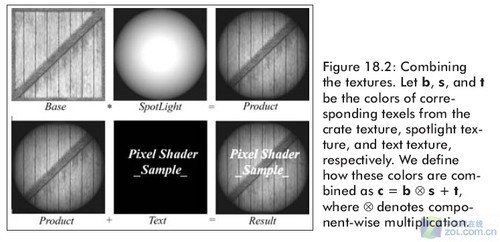

答案很简单——**因为现在的ALU根本没有那个本事面对直接生成像素所带来的运算量**。

像素的处理过程从本质上来说并不复杂，其巨大的执行难度并不来自步骤的繁琐，而是来源于对**大量像素进行数学关系运算所导致的运算量**，这10年来针对shader反复的折腾其实也只是因为人们对执行单元能够更加高效的处理数学关系的渴求。在以前的文章中我们曾经面对过类似的问题，当方程的数量达到一定级别之后，对于运算单元的压迫将让任何本来看上去很和谐优雅的方程式变得丑陋无比。而随着程序员和用户对效果要求的不断提升，对于**像素处理的方程总量**在未来将呈现出明显的只增不减的态势。更加复杂真实的光照模型，更加多变且逼近现实的光线传递效果，甚至包括更多像素透明度遮蔽所带来的混合，这些都让目前的ALU单元承受着巨大的压力。在这种情况下，要让ALU去独立生成全新的像素，为ALU添加一个近乎于100%增幅、甚至比这个还要大得多的像素处理压力，显然是不现实的。

为了减轻这种压力，人们历经10年，不断地压榨着半导体工艺的极限，以期能够在**GPU内部塞下更多的运算单元**；不断地改进着运算单元集合的逻辑关系，以期能够让它们尽可能高效率甚至全功率的运作起来；不断地开发着如Compute Shader之类能够尽可能多的以灵活的运作手段和更加贴近纯数学的应用方式来解决问题的方法，以此来进一步提升ALU在处理过程中的效率，并进一步压榨ALU的价值。对于材质的操作，也是这些努力中的一部分。**预先烘焙好的材质可以带来大量已经具备基本效果关系的像素，这些操作上相对廉价的像素中会有相当一部分不需要被处理，直接使用材质可以大大减轻ALU单元的负担，让已经不堪重负的ALU得到喘息**。

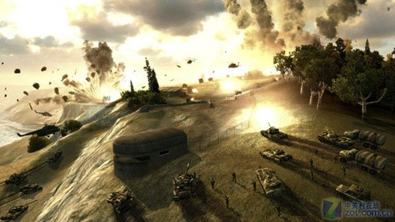

对像素的处理，**本质上就是对色彩相关的方程的处理**，这种处理的背后又附庸着大规模的数学运算和大量的指令执行，所以像素对于硬件的逻辑结构设计，存在着极高的要求。不同的逻辑结构对于庞大数学运算和指令的吞吐以及处理能力，显然是存在差距的。每一家硬件厂商对于数学以及效率的理解都不相同，设计出来的硬件也存在着极大的差异

##### 2.8 [纹理处理(TMU)](http://blog.csdn.net/pizi0475/article/details/7523495)
实际上对于**像素的处理以及对于材质的处理是没有绝对的先后次序的**，像素单元处理好像素特效，材质单元抓取并完成贴图操作之后，ROP才会将两者混合。

###### 2.8.1 TMU的作用
TMU的作用，归根到底就是对**材质的贴图和过滤操作**。根据程序的需要，在完成几何处理和光栅化之后，TMU单元会从材质库中找出合适的纹理贴在对应的位置上以实现模型的外形完整化，这就是TMU单元的日常工作，这工作从本质上其实和泥瓦匠没什么太大区别。在3D图形出现之初，人们通过贴图来实现几乎全部的特效，对于早期的图形硬件来说，材质性能几乎就意味着一切性能。几乎每一家厂商的硬件都以填充率为金科玉律，如果你的填充率比我多个几M，弄不好我的硬件销量就要下滑好几个百分点。由于来自硬件以及图形算法实用化本身的限制，最初的图形特效几乎全部来自TMU。**人们将预先设计好的效果烘焙成现成的纹理，而TMU单元则根据程序需求机械地将这些现成的材质搬到对应的多边形上去**。

既然没有其他手段，人们只能勉强的依赖着纹理来实现各种特效，而想要实现更好的效果又需要硬件具备一定的功能和性能，于是**改进TMU和材质操作手法**就成了唯一的出路。那么究竟怎样才能让欺骗进行的更有效率，甚至达到以假乱真的地步呢？答案就是**多重纹理贴图**。

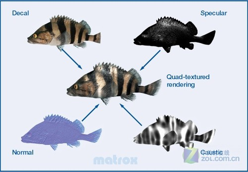

由于本身依托固定的预制烘焙材质的**先天缺陷**，材质贴图很难准确的完成对效果的表达，尤其是传统的单次贴图操作，这种操作不仅导致了过低的填充效率，同时也无法充分满足纹理精细度的要求，于是，基于**单周期双重以及多重纹理**操作的改进就成了人们迫切的需求。多重纹理贴图与以往最大的不同，在于它能够让TMU以一个周期为单位实现二重至四重，甚至是更多次的材质贴图操作。复合贴图的好处是显而易见的，他可以让多边形表面拥有更好的图案和色彩表现，从而提升物体细节的真实度，同时又不会牺牲太多的操作周期从而降低帧数表现。由于几乎是唯一的可选择对象，多重纹理贴图一经出现便马上获得了业界的广泛支持，得益于这种支持，TMU单元也得到了极其快速的发展。

###### 2.8.2 可编程Shader
通过可编程shader，程序员们对材质表面特定位置的像素进行**“精修”**，为其加入适当的光线关系等与颜色相关的处理。经过shader处理的像素可以表现出正确的颜色，而当所有像素的颜色都趋于正确时，整个图像都达到或者起码是接近程序员原本想要表达的效果了。**TMU单元只需要贴出能够表达正确物体外貌的材质，剩下的事情交给shader去做就可以了**。不难看出，在可编程shader出现之后，TMU的工作就从原来的实现全部特效很自然的过渡到了为各种特效提供基础上。

这么一个不经意的自然过渡，对TMU单元以及为实现特效而工作的人们来说却几乎意味着完全的解放。有了**直接操作像素**的手段，程序员们不必再为材质的不准确而垂头丧气，他们可以自行调节像素以弥补材质本身的不足。美工们也不需要再绞尽脑汁考虑和准备尽可能多的材质来满足光影效果，他们不用再考虑那根本不可能通过“考虑”来照顾周全的现场需求，只需要准备细节足够精致的材质即可。卸下光影和颜色负担的TMU单元则更是从所有压力的承担者摇身一变成了“高薪低责”的小布尔乔亚，**为所有物体提供正确的表面细节让TMU继续扮演着图形渲染过程中不可或缺的重要角色**，但同时TMU却又不必再对最终特效负责，起码不用负全部的责任，这种地位无可替代同时又不用担全责的感觉，我想每个人都会羡慕不已吧。

###### 2.8.3 纹理定址与纹理拾取
- VTF（Vertex Texture Fetch）
  
  VTF可以被简单直接的翻译成**顶点纹理拾取**，尽管这种基于Vertex Shader的技术严格意义上并不属于TMU单元本身的改进，但它对TMU单元的操作以及可实现特效的发展有着深远的意义。VTF允许Vertex Shader单元直接访问材质库，并从中**读取含有基本光照信息的材质然后贴在完成处理的几何模型表面**。由于Vertex Shader包含全部操作之后的顶点信息，其中的重要的信息之一就是顶点相对于网格平面的高度值，因此VTF最大的意义，便在于可以让TMU以比过去方便快捷许多的方式来实现对高度及视差极其敏感的环境凹凸贴图特效。

  物体表面的凹凸感，很大程度上来自凹凸带来的光线明暗度的不同，突出部更亮凹陷部更暗对于我们来说是非常自然的视觉经验。如果采用常规的贴图手段，表现暗部细节需要借助阴影贴图来完成，这样做不仅效率低下，而且过多的表面细节显然会给TMU单元带来沉重。现在好了，**结合顶点的高度值**，VTF可以直接将材质的所有颜色全部转化成灰度，然后根据高度差对灰度进行重新排序和修改，高度值较大的材质灰度也较大，而高度值较小的材质灰度也较小，最终的效果也就自然的变成了物体表面凸出位置的材质亮度正常或者较高，而凹陷部分的材质亮度则相对较低，这就带来了非常自然的视差凹凸效果。VTF的操作方式对于TMU来说几乎就是革命性的，它的出现不仅让TMU在不付出沉痛代价的前提下实现更好的物体表面细节，甚至成了让TMU进军通用计算领域以及GPGPU出现的发端

- Texture Address（纹理定址）以及Texture Filtering（纹理拾取）
  
  相对于VTF，TA/TF分离的改进不仅目的简单直接，而且操作过程也非常简单。随着纹理技术的发展，Texture Address（纹理定址）以及Texture Filtering（纹理拾取）过程以及这两种操作的比例发生了巨大的变化，传统的TMU单元已经无法满足新的定址及拾取操作的需要，因此从DirectX 9.0C开始，TMU单元正式分割成了TA和TF两个部分，**TA单元专门负责材质的定址操作，在完成定址之后，TF单元根据定址结果对材质进行拾取并完成贴图作业**。

  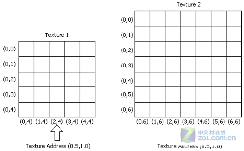
 
  TA/TF的分离不仅提升了整个纹理单元的操作效率，更为材质单元规模的扩展提供了更加多样化的选择，人们可以通过分析指令中定址及拾取操作的比例，来调节构架中TA/TF的比例，从而达到晶体管利用率最大化的目的。也正是从这里开始，TMU这个沿用了很长时间的名词变得不再能够精确的描述纹理单元了，于是Texture Array这个全新的名词也就应运而生了。

##### 2.9 [ROP,Render Output Unit](http://blog.csdn.net/pizi0475/article/details/7523497)
###### 2.9.1 ROP主要工作
其实，ROP单元并没有大多数人想象中那样神秘，除了觉得ROP是在处理光栅化过程的人之外，其他所有人并排坐在一起，把自己的观点重复一遍，ROP单元的功能就出来了——是的，ROP单元的功能，就是**处理[雾化](https://baike.baidu.com/item/%E9%9B%BE%E5%8C%96%E6%95%88%E6%9E%9C/2798835)等特定的特效，进行采样及抗锯齿操作，以及将所有图像元素混合成最终画面并予以输出**。所以从作用的角度出发，相比于Raster Operations Units这种头衔味道更重的名字来说，Render Output Unit显然更加适合用来描述ROP单元。

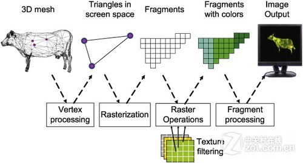

我们所看到的图像的基本构成单位是像素，而像素的形状则是一个又一个的小方格，当两个相邻像素存在巨大的**颜色反差**时，这两个像素中间就会出现一条非常显眼的颜色分界线。颜色分界线带来的界面效应是区分物体边缘的重要标识。对于垂直和水平出现的像素分界来说，由于其本身的范围非常均一(因为在同一个水平或者垂直线上，而不存在斜线的阶梯效果)，因此并不会造成界面效果之外的效应，但当像素分界以**斜线**的形式出现时，效果就完全不一样了。**斜向像素分界线，正是困扰3D图形界多年的问题——锯齿**。

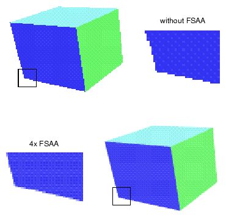

锯齿的存在极大的影响了图形效果的表达，本来应该平滑的几何模型表面，在光栅化并变成像素图元之后变得不再平滑，这极大地影响了人们观赏图形时的感受。所有影响人们观赏图形的因素最终都要被干掉，这正是图形界发展的根本动力。为了消除锯齿感给图形造成的影响，我们有了**Anti-Aliasing**以及Anti-Aliasing Unit，也就是AA以及AA单元。

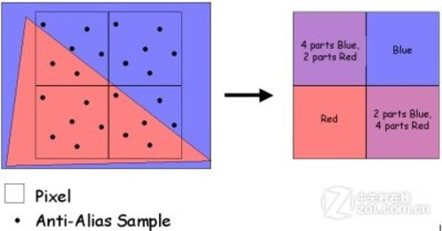

Anti-Aliasing过程的起点**开始于对图像的放大**，我们首先要将整个图像（超级采样，SSAA，[Super Sampling](https://www.zhihu.com/question/20236638)）或者比较精确的物体边缘（多重采样，MSAA，Multi-Sampling）进行放大，然后对颜色反差巨大的物体边缘部分的像素及其周围的像素进行提取和混合，形成比原来更加自然但也更加模糊的颜色过渡，最后再将图像缩小回原来的尺寸以便消除颜色过渡产生的模糊现象。ROP在AA过程中所做的事情，就是提取颜色分界线所在像素及其周围像素的颜色数值，然后对这些像素的颜色进行混合，再重新把新的过渡颜色刷上去

###### 2.9.2 ROP的z/stencil检查与透明度检查
首先，由**TMU拾取的纹理以及由shader处理完成的像素**会被传送到对应的**z/stencil buffer**，接下来ROP单元会首先对这些纹理和像素进行z/stencil检查，尽管经由光栅化处理之后的模型已经不具备实际存在的Z轴了，但其`深度信息依旧会被保存下来`，对于深度和模板信息的判断能够让ROP做出让那些像素被显示出来的决定，这不仅能够避免完全遮挡的像素被错误的显示在前面，同时也能够减少后续的**color output**部分的压力。由于存在对深度的判断和剔除操作，再加上Raster Operations Units这一特殊名称的误导，很多人都以为光栅化过程是在ROP单元才完成的，实际上Rasterization和ROP单元本身并没有什么直接联系的。**Rasterization所进行的是对模型的3D-2D坐标投影变换，而ROP则是对像素的混合和输出**。

当所有像素都完成了深度检查等操作之后，特定范围深度值的像素将被输送到alpha单元进行**透明度检查**,由透明度及透明混合所导致的效果对于雾化以及体积光等效果有至关重要的意义，因此alpha单元的检查与深度检查几乎可以说同等重要。根据程序的需要，ROP会以Blend单元对特定的像素进行[alpha Blending操作](https://baike.baidu.com/item/%CE%B1%E6%B7%B7%E5%90%88/1019033)。

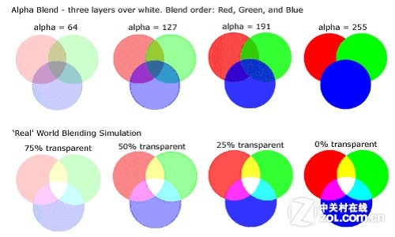

其[运算方式](https://yq.aliyun.com/articles/47983)如下:
```text
RGB3 = (1- a) * RGB1 + a * RGB2
<!-- 其中a为混合透明度取值范围[0, 1]之间, RGB3为目标像素值, RGB1与RGB2的值分别来自两
张不同的图像。 -->
```
经过上述步骤之后，剩下的像素将会被填充进2D化模型需要的范围内，也就是我们常见的**Pixel Fillrate过程**。Pixel Fillrate就好像一口大锅，作为肉丝、青椒、冬笋还有葱姜盐糖豆瓣酱之类原料出现的像素会在这里被正确的混在一起。经过混合，图形元素所包含的原本孤立的信息会像食材之间交互作用产生的香气一样被释放出来，最终形成我们能够接受的图像。

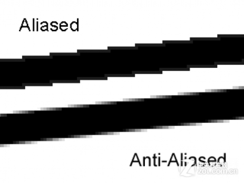

由于像素上的效果已经被shader以数学的形式处理完毕了，因此如果没有AA操作，那么到这里为止图形渲染工作就算彻底完成了，所有效果的混合及填充将会让正确的画面最终得以呈现，这幅完成处理的画面会被送入**output buffer**等待输出。而如果程序要求进行AA操作，比如MSAA，那么ROP中的AA单元还需要对填充完毕的画面进行若干次多重采样，然后再对采样出来的像素点进行color Blending操作，完成之后的画面才会被送入帧缓存等待输出到屏幕上。

###### 2.9.3 Imagination的TBR/TBDR
TBDR全称**Tile-based Deferred Rendering**，它通过将每一帧画面划分成多个矩形区域，并对区域内的所有像素分别进行Z值检查，在任务进入渲染阶段之前就将被遮挡的不可见像素剔除掉。由于在渲染之前进行Z-culling操作，TBR/TBDR理论上能够大幅削减进入shader以及ROP的像素数量，这不仅大幅降低了系统对像素的处理和输出压力，更极大的节约了显存带宽及空间的开销。

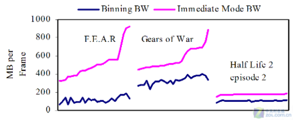

对于常规的光栅化过程来说，TBR/TBDR会带来诸多的问题。包括**深度检查耗损、频繁的Z读取、Tiles划分带来的纹理重复读取、多边形数量上升之后的scene buffer溢出**等等。最初的TBR甚至需要CPU来进行Z-Occlusion Test，尽管后来的TBDR不再像传统的TBR那样需要通过CPU来进行Z值检查，但是TBDR过程需要对画面内所有的像素进行一次“额外”的load过程，这个过程本身无论从哪个角度来讲都是与节约显存带宽背道而驰的，尤其是在复杂度极高但Z-Occlusion并不严重的场景中更是如此。

另外，尽管对画面的矩形划分越细密，GPU对像素进行Z判断的效率和准确率越高，但TBDR过程对画面的**矩形切割非常机械**，这种划分经常会导致**很多多边形和纹理被Tiles所切割，这些多边形和纹理都必须经过2次甚至4次读取才能保持自身形态的“完整”**，这无疑加重了几何和纹理处理过程的负担。如果场景的多边形数量较多，这种切割还会导致scene buffer被快速的消耗殆尽，scene buffer的溢出会直接导致Z判断延迟的急剧增大，这对整个处理过程的影响是巨大的。

**通俗的说**，TBDR需要在屏幕上画很多很多的小格子，然后把格子里的所有像素都拿出来做某种检查，没通过检查的“坏”像素就会被丢掉。尽管丢掉这些没通过检查的像素可以让后面的工作量减小，但这个检查本身对渲染没有任何意义，所以没有被丢掉的像素就相当于走了一遍无用的过场。与此同时，划分小格子的过程会切坏很多多边形和纹理，想要让这些多边形和纹理能够从“误伤”中幸存下来，你切了它们多少刀就要重新读取它们多少次。如果多边形本身就很多，被误伤的概率就更大，这会使得系统的某种缓存被快速消耗干净，缓存没了，系统干什么都不可能快得起来。

##### 2.10 缓冲体系
###### 2.10.1 显存
GPU的缓冲体系十分庞大，它包含了由**体积、延迟及位置**决定的4个主要的组成部分，分别是**显存（Memory）、纹理缓存（Texture cache）、共享缓存（shared）及寄存器（Register）**。显存置于GPU芯片外部，通过GPU内部的显存控制器进行控制和操作。纹理缓存、共享缓存及寄存器则集成在GPU内部，分别供TMU和ALU(Arithmetic Logic Unit)控制及使用。

显存作为**缓冲材质等大尺寸信息**的场合，一直以来都是显卡中最引人注目的性能指标之一。几乎与显卡同时出现的显存在经历了上古时代的EDO-RAM（Extend Data Output DRAM）甚至是FP-DRAM（Fast Page DRAM）向SDRAM的转变之后，其发展进入了GDDR的快车道。目前的中高端显卡多采用GDDR5显存，频率维持在4000MHz~5000MHz的范围内。充足的显存容量和显存带宽，是保证GPU材质性能以及最终渲染性能的重要要素之一。

###### 2.10.2 纹理缓存
和显存不同，由于`显卡最初的工作并不涉及材质工作`，所以纹理缓存的历史远没有显存来的悠久，它是在图形效果发展带来的纹理尺寸迅速增加之后才应需求出现的。诸如[mip-mapping](https://baike.baidu.com/item/MipMapping%EF%BC%88Mip%E8%B4%B4%E5%9B%BE%EF%BC%89/15270104)以及[Generating Lightmaps](https://en.wikipedia.org/wiki/Lightmap)之类的复杂纹理和操作也被更多的使用在了图形效果的表达过程中，这些操作让TMU获得一套更加快速有效的暂存系统的愿望变的迫切起来，于是**纹理缓存便开始充当显存到TMU单元**的有效缓冲了。下面是Generating Lightmaps操作过程:


###### 2.10.3 Shared共享缓存
Shared的出现则要更晚一些。当图形API进化到DirectX 10之后，ALU面对的运算环境发生了本质的变化，大幅增加的运算灵活度要求硬件能够为ALU提供一个`方便调用且独立操作的临时暂存空间`，于是Shared便应运而生了。**Shared只读不可写**，它只需要为ALU临时释放结果提供服务即可。Shared的出现对Shader的执行有一定意义，但更多的作用还是在于通用计算及通用计算参与的后效处理领域。下面是Shared在GPU中的位置:

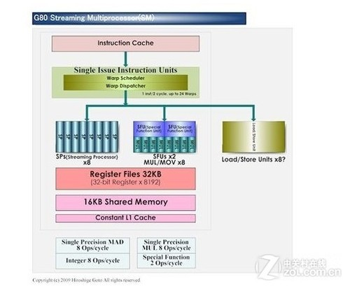

###### 2.10.4 寄存器
寄存器同显存一样，都是发源于CPU的重要缓冲组成部分。长期以来，寄存器都伴随在运算单元旁边，以**最及时的延迟和最大的带宽**为运算单元提供着指令寄存空间（IR）、程序计数缓冲（PC）以及累加器（ACC）等多方面的服务。寄存器具备最高的运行速度以及0t延迟的特性，其极高的晶体管成本令其在体系中的总量非常少。

#### 第三部分.Chrome渲染基础知识与渲染原理
#### 前言.Chrome相关概念解析
- bitmap
  
  内存中像素值的缓冲区(包括主内存或者GPU的RAM)

- texture
   
   GPU中3D模型的一块bitmap   

- texture quad
  
  其对应于一个四点多边形，比如正方形。如果你想要以**平面矩形**的方式去展示纹理的时候可以使用(可以是2D或者3D)，这也是我们在合成的时候做的事情。

- invalidation

  document中某一个区域被标注为脏数据，也就意味着它需要渲染(painting)。

- painting
  
  一个渲染阶段，RenderObjects调用GraphicsContext的API去**直观表示自身**的阶段

- rasterization
  
  一个渲染阶段，当RenderLayers的bitmap的后端存储已经写好。在RenderObjects调用GraphicsContext的时候会被立即调用，但是如果在使用SkPicture监听渲染painting的时候可能延迟，而栅格化将交给SkPicture。

- compositing
  
  将RenderLayer的纹理(是bitmap)**上传到最终的屏幕上**作为图片(final screen image)显示的阶段

- drawing
  
  渲染的一个阶段，用于将**像素绘制到屏幕上**。即将最终的屏幕图像(final screen image)绘制到屏幕上。如果使用了GPU(合成器Compositor会代理对GPU的调用)，官方文档是这样说的:When a page renders via the compositor, all of its pixels are drawn (remember, drawing != painting) directly into the window’s **backbuffer** via the GPU process

- backbuffer
 
  当使用双缓存的时候，代表写入的屏幕缓存不是当前展示数据的缓存

- frontbuffer

  当使用双缓存的时候，代表的是当前正在展示数据的缓存

- swapbuffers
  
  交换frontbufferbackbuffer

- Frame Buffer Object
  
  OpenGL团队提供的机制能够在**当前屏幕以外**的缓存写入数据，就像常规屏幕缓存一样(backbuffer)。这对于我们很有用，因为我们能够渲染到纹理中，然后合成这些纹理。通过Frame Buffer Object，仿佛给WebGL提供了它自己的帧空间(frame)，它再也不用关心页面发生了什么。
 
- damage
  
  表示因为**用户的操作或者程序原因**(JS改变了style)导致屏幕的某一个区域已经失效(脏化)。同时这个区域在repaint的时候需要更新

- retained mode
  
  图层系统通过某个方法来维持一个**将来用于渲染**的对象的完整模式。Web平台会保持对该模式下DOM的引用,因为DOM就是数据。平台(比如浏览器)会时刻监控DOM的状态以及相应的能够修改或者查询当前的状态API(JS操作该DOM)，浏览器能够在任何时候通过JS来修改该模式的数据。

- immediate mode
  
  图层系统不会监听整个屏幕的状态，而是在接受到指令的时候立即执行并不再关注该指令，因此为了redraw整个场景，**所有的命令都必须重新发送**。Direct3D就是这种模式，因为它是Canvas2D

- context virtualization
  
  GPU进程不会为每一个指定的命令缓冲区客户端创建一个驱动层面的GL上下文。多个客户端可能有一个共享的真实的上下文，同时在解析GL命令的时候将特定的客户端的GL状态保存为一个期望的状态。我们将这个阴影状态(shadowed state)叫做“virtual context”即虚拟上下文。这在Android平台上的某些驱动中能够避免很多bugs和一些性能问题(GL中慢上下文切换,多场景FBO渲染中的同步问题,使用共享组的crash)。Chrome在一些驱动中通过GPU黑名单文件启动了上下文虚拟化。


#### 1.Chrome的合成器
**Chrome的合成器(Chrome’s compositor)**是一个软件库，其用于**管理GraphicsLayer树**，同时协调**每一帧**的生命周期。我们知道渲染(Rendering)存在于两个阶段:首次渲染和合成。这允许合成器在每一个合成层的基础上做一些额外的工作。比如，合成器在合成bitmap之前通过css的transform为每一个合成层的bitmap实现相应的动画。而且，因为每一个合成层的渲染和合成操作是解耦的，某一些合成层失效只会造成这些失效的层内容单独被渲染，然后和以前没有变化的合成层一起被合成。

**每次浏览器需要一个新的帧的时候，合成器就会合成这些bitmap**。这里**合成(drawing)**
指的是:合成器将这些bitmap合成为屏幕上的最终图像，而**渲染(painting)**指的是:某一个层的后端存储被填充，例如bitmap的软件栅格化或者纹理的硬件栅格化。但是注意:最后生成的bitmap都是通过Browser进程进行绘制的。你要查看[这个图](https://github.com/liangklfangl/react-article-bucket/blob/master/chrome-core/webCore/webkit-render-process.md#721-chrome%E4%B8%AD%E4%B8%BB%E8%A6%81%E8%BF%9B%E7%A8%8B),其中合成的操作是Webkit部分里面完成的,而且里面的每一个Renderer进程都有一个Compositor进程，但是整个浏览器只有一个GPU进程。

#### 2 Chrome软件渲染通过[Browser进程完成](https://sites.google.com/a/chromium.org/dev/developers/design-documents/gpu-accelerated-compositing-in-chrome)
Webkit在**软件渲染**网页的时候是从根层级遍历整个RenderLayer层级。而Webkit代码库包含两个不同的方式来渲染页面的内容，一个是软件路径还有一个硬件加速路径。软件路径是传统的渲染模式。

软件路径是遵循**从后到前(先negative后positive,back to front)**的顺序渲染所有的RenderLayers，RenderLayer层级树是从顶层递归调用，然后在每一个节点上都会执行**RenderLayer::paintLayer()**方法，而该方法会执行下面的步骤:
<pre>
1.判断该layer是否和已经变更的层级有重叠，如果没有重叠直接进行下面的步骤
2.递归调用该层级的negZOrderList集合中每一个layer的paintLayer()方法
3.该RenderLayer下的所有RenderObjects开始绘制自己。这是通过首先递归调用创建该层级的RenderObject的方法，而如果在递归调用的时候发现了新的RenderLayer则停止
4.递归调用该层级的posZOrderList集合中每一个layer的paintLayer()方法
</pre>

在这个模型中，RenderObjects**将自己的内容绘制到目标bitmap**是通过**单个共享的GraphicsContext**来完成(在Chrome中通过Skia完成)。注意:GraphicsContext本身没有层级的概念，但是为了正确绘制半透明的层级。我们需要知道:半透明的renderLayer下的RenderObjects绘制之前会调用GraphicsContext::beginTransparencyLayer()方法。在Skia的实现中,beginTransparencyLayer()调用后将会导致所有的后续绘制调用渲染到一个独立的bitmap中，这个独立的bitmap在半透明的RenderLayer下的所有RenderObjects被渲染后，同时调用了GraphicsContext的endTransparencyLayer()时将会和**前一个bitmap合并**。具体流程如下图:

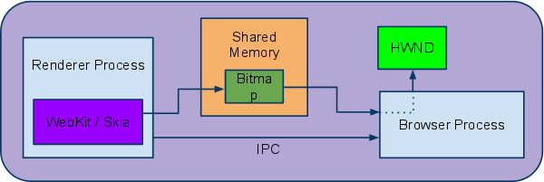

当所有的RenderLayers都已经被绘制到一个**共享的bitmap**之后，bitmap依然需要被绘制到屏幕中。在chrome中bitmap存在于共享内存中，而对共享内存的控制是通过IPC传递给Browser进程的。**Browser进程通过OS的窗口API(比如window上的HWND)负责将这些bitmap绘制到指定的Tab或者窗口中**。

而与软件渲染不同的是硬件渲染。在硬件加速机制中，递归情况有所不同，这是因为引入了合成层的概念，**每一个RenderLayer对象被绘制到祖先链中最近的合成层**。在递归调用的时候，如果它不是合成层，那么会继续绘制该层，即相当于直接绘制到父级的合成层中。如果它是合成层，那么直接返回，因为它需要绘制到一个独立的合成层中。

#### 3.GPU渲染
合成器可以使用GPU去绘制(drawing)，这和传统的软件渲染有很大的区别，在传统的软件渲染中Renderer进程
会将页面内容产生的bitmap通过IPC/共享内存传递给Browser进程，由Browser进程控制页面的展示。

在硬件加速模式下，合成(**compositing**)操作在GPU中通过调用特定的3D APIs完成(在windows上是D3D，否则是GL)。渲染进程的合成器(**compositor**)使用GPU绘制页面中的特定区域(所有合成层，都是相对于视口进行定位的)到一个特定的bitmap中，这个bitmap对应于最终的屏幕内容。**但是**最后还是通过IPC传递给Browser进程去渲染。


#### 4.GPU进程
在我们深入研究合成器产生的GPU命令之前，我们需要理解渲染进程(Renderer Process)是如何向**GPU发送命令**的。在Chrome的多进程模型中，我们有一个独立的GPU进程。GPU进程之所以存在，主要是因为安全原因。而Android是一个特例，在Android中GPU进程是做一个**线程**于Browser进程中的，但是Android中该GPU线程和其他平台的原理是一样的。

因为渲染线程的**sandbox特性**，渲染进程无法直接调用OS提供的3D APIs(GL / D3D)。而GPU进程能够在一个独立的进程中访问3D APIs，同时Render进程虽然遵循sandbox特性，也将能够通过GPU进程访问它们。GPU进程遵循客户端-服务器(client-server)模式:

- client(渲染进程中执行的代码):
  
  不能直接访问3D APIs，产生命令并序列化放入到命令缓冲区。这个缓冲区是client/server进程共享的内存空间

- server(GPU进程，运行于相对宽松的sandbox环境,允许访问3D APIs)
  
  从共享内存中获取序列化的命令，解析它并调用特定的方法


模式如下图:

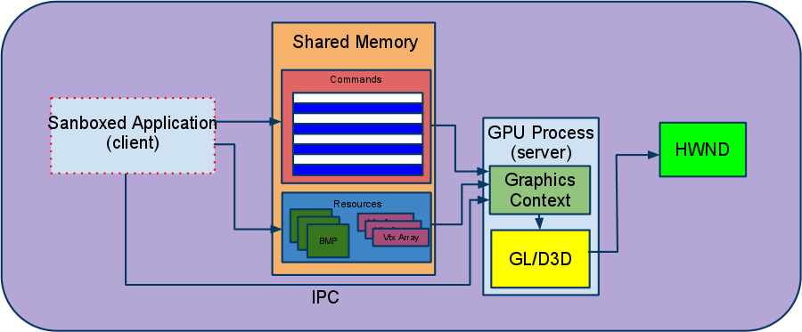

下面主要针对上图的概念做深入说明:

- 命令缓冲区(Command Buffer)

  GPU进程获取到的命令格式和GL ES 2.0 API指定的几乎是相同的。大多数GL调用都没有返回值，因此server(GPU进程)和client(渲染进程)可以异步执行，此时性能是非常低的。任何client和server的**同步化(synchronization)**，例如client通知server有新的任务需要处理，这种机制都是通过IPC机制来完成的。
  从**client的角度**来说，可以选择直接往命令缓冲区写入命令或者使用GL ES 2.0 API的客户端库，该库能够提供序列化。为了方便，目前合成器和WebGL都使用GL ES的客户端库。
  从**server的角度**来说，从命令缓冲区获取到的命令都会被ANGLE转化为对桌面OpenGL或者Direct3D的调用。

- 资源共享与同步

  除了为命令缓冲区提供存储空间,Chrome使用**共享内存**来解决在client与server端传递大量的资源，比如构建textures的bitmap,vertex arrays等。

- 命令缓冲区多路复用(Command Buffer Multiplexing)

  当前Chrome实例只有单个GPU进程，它会处理所有来自于**渲染进程和插件进程**的请求。GPU进程能够在**多个命令缓冲区之间复用**，而此时每一个命令缓冲区都有自己独立的渲染上下文(Rendering Context)。

  每一个渲染进程(Renderer)可以有多个GL来源，比如WebGL Canvas元素直接创建一个`GL命令流`。对于那些内容直接在GPU中创建的合成层(**如下图的WebGL,Pepper3D等**)来说它的工作原理如下:
 内容直接被渲染到纹理(texture,使用Frame Buffer Object)中，因此合成器可以在渲染**GraphicsLayer**时候直接使用它，而不是将它的内容直接渲染到后备缓冲区。

 注意:为了让合成器的**GL/D3D**上下文能够直接访问离屏(offscreen)产生的GL context纹理(texture)，所有GPU进程使用的GL contexts在创建的时候就能够共享资源(注意其中的**Shared Resources**)。如下图


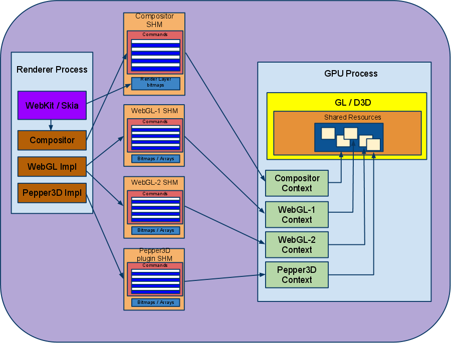

GPU进程设计模式有如下优点:
<pre>
安全(Security):所有的渲染逻辑依然在sanbox化的渲染进程中，对于3D APIs的访问只能通过GPU进程完成
健壮性(Robustness):GPU进程的crash(错误的驱动)不会导致浏览器崩溃
均匀性(Uniformity):以OpenGL ES 2.0标准作为浏览器渲染API,因此在不同OS平台上Chrome能够使用同一个易于维护的代码库。
并行性(Parallelism):渲染进程能够很快的将命令发送到命令缓冲区并立即返回执行CPU密集型的活动。这样能更好的在多核机器上使用两个进程。
</pre>

#### 5.线程化的合成器与cc LayerTree副本独立更新
合成器(**compositor**)是基于GL ES 2.0客户端库来实现的，它会**代理**对GPU进程的访问。如果一个页面是通过合成器(compositor)渲染的,那么它所有的像素都是直接**通过GPU进程渲染(drawing)到window的后端存储backbuffer(drawing!=painting)(绘制到屏幕的过程依然是Browser进程做的)中**。

理论上，每一个线程化的合成器能够**从主线程**获取足够的信息，进而独立的产生帧响应用户的输入，即使主线程处于繁忙状态，无法获取足够的信息。但是实际上也就意味着，它存有cc LayerTree(cc = Chrome Compositor，该文档中指代GraphicsLayer tree)的副本，SkPicture将会监听当前ViewPort特定区域的RenderLayer的变化。

##### 5.1 监听:从Blink的角度看重绘(painting)
我们关心的区域是视口中**SkPictures**监听的部分。当DOM改变的时候，比如某些元素的style和以前主线程帧中的值不一样，而且处于无效状态。Blink将会**重绘无效的RenderLayer区域到基于SkPicture的GraphicsContext**。这不会产生新的像素pixel，而是产生一系列的Skia命令，使用这些命令就可以产生这些新的像素pixel。这些Skia命令主要用于合成器(compositor)调配。

##### 5.2 提交:交由合成线程(Compositor Thread)
线程化的合成器(compositor)的主要属性是对**主线程状态副本**的操作，这样为了产生一个新的帧就不需要询问主线程任何数据。线程化的合成器主要包括两个部分，主线程部分以及"impl"部分。**主线程**有一个LayerTreeHost，它是LayerTree的一个副本，而impl线程(即compositor线程)对应于的是LayerTreeHostImpl，其是LayerTreeHost的一个副本。

概念上说两个LayerTree是独立的，合成器(impl)进程的**数据副本**能够产生帧，而且不需要和主线程产生任何交互。这也意味着:主线程能够长时间支持javascript，同时合成器(compositor)能够重新绘制以前在GPU中提交的内容而不用打扰主进程。

为了产生新的帧，合成线程(compositor thread)需要知道如何修改它的状态，比如更新Layer的状态来响应浏览器的scroll事件。因此，一些input事件，比如scroll,`需要从Browser进程传递到合成器(compositor)，继而传递到渲染进程Renderer的主进程。因为input/output事件都是通过线程化的合成器来管理，其能够保证用户输入的视觉响应`。除了滚动事件，合成器能够处理任何页面更新，而不需要询问Blink去重新绘制。因此，css动画或者css filter都可能造成合成器驱动的页面更新。
  
两个LayerTree(一个是主线程，一个是compositor)是通过一系列的**消息机制**，比如commit来保证内容的一致性，而内部是通过合成器的调度来完成的。每次commit都能把主线程的状态转移到合成器的线程(包括更新后LayerTree,SkPicture的监听数据等等)，**每次同步都会阻塞主线程。这是主线程更新特定的帧的最后一步，也是它唯一需要参与的一步**。

合成器在一个独立的线程中运行，这允许合成器`自动更新`LayerTree层级数据而不需要通过主线程来完成。但是主线程最终也是需要，比如scroll offset等数据(Javascript需要知道当前视口的滚动位置)。因此，**commit也将负责将基于合成器线程的layerTree数据更新到主线程的树中，同时执行其他的任务**。

有意思的是,这种架构使得Javascript的touch事件阻止合成层(composited scrolls)的滚动，但是scroll事件却不会被阻止。`JS能够在touch事件中调用preventDefault()，但是在scroll事件中是不允许的`。因此合成器(compositor)在没有询问JS(主线程)之前是不能滚动页面的，因为这个JS可能会取消接下来的touch事件。**Scroll事件在另一方面，是不允许被阻止的，而且它是被异步发送到JS中的**。因此，合成线程(compositor thread)能够立即滚动，而不需要关心主进程是否立即处理scroll事件了。

##### 5.3 树的激活(Tree Activation) 
当合成线程从主线程获取到了一个新的LayerTree，它会检查这个新的树来看那一部分已经失效了，**进而继续栅格化这部分LayerTree**。此时处于**活动态的树**依然是先前的那一棵LayTree，而Pending Tree指的就是当前的新的LayTree,也就是内容刚被栅格化的这个LayTree树。

为了保证展示的内容的一致性，Pending Tree**只有在它可见的时候(处于视口中)才会被激活**。某一棵树从激活态被转化为pending态就是激活过程。等待栅格化的内容准备完成的过程中，用户能够看到少量的内容，但是这些内容很可能是过期的。如果没有内容可用，Chrome就会显示一个空页面。

需要注意，我们很可能滚动到一个已经处于激活态的栅格区域，因为Chrome只会监听RenderLayer的SkPictures部分。`如果用户正在滚动到一个未被监听的区域，此时合成线程将会通知主线程去监听和提交额外的内容，但是如果这个新的内容不能在指定的时间被监听，提交和栅格化，用户将会看到[checkerboard(棋盘图案)](http://blog.csdn.net/wuxinliulei/article/details/9108349)区域`。

为了减少Checkerboard出现的机会，Chrome能够为Pending Tree在获取到高分辨率的内容之前`快速栅格化低分辨率的内容`。如果当前Pending Tree视口中低分辨率的内容比当前视口中的内容要好，那么就会被替换。
这个**架构**将会使得栅格化和其他的帧的产生流分离。它启动了很多技术用于改善图层系统(graphics system)的响应性。图像解码和Resize操作都是异步的，而这些操作在以前都是通过主线程在Patting的时候产生的，而且是非常昂贵的。异步的纹理传输系统是在impl方(compositor)实现的。
    
##### 5.4 Tiling与合成器输入输出
栅格化页面中所有的layer是很耗CPU和内存(RAM，每一个软件渲染的bitmap，VRAM用于纹理存储)的。为了避免栅格化整个页面，`合成器将大多数的页面内容layer绘制为不同的tiles，然后基于每一个tile来栅格化layer层`。

网页内容的层级tiles通过多个元素进行`优先级排序`，比如:**距离视口的距离和出现在屏幕中的大概时间**。然后GPU内存根据这些指标进行分配。所有的tiles将会根据优先级从SkPicture的监听数据获取内存分配。注意:Tiling对那些内容`已经存在于`GPU的不是必须的，比如硬件加速的Video或者WebGL。

合成器(Compositor)的作用是将多个合成层合成并输出一个最终的结果，所以**它的输入是多个待合成的合成层，每个层都有一些属性，如3d变形等，他的输出是一个后端存储，例如一个GPU的纹理缓冲区**。后端存储使用了瓦片状的存储。

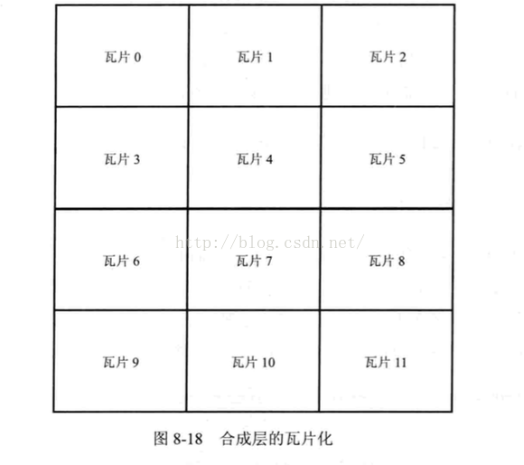

为什么使用瓦片状的后端存储？

**第一**:DOM树中HTML元素如果只是使用一个后端存储的话，那么需要一个很大的纹理对象，但是实际的GPU硬件可能只`支持非常有限`的纹理。

**第二**:在一个比较大的合成层中，可能只是其中一部分发生变化，如果需要绘制整个层必然会产生额外的开销，使用瓦片的后端存储就只需要绘制一些存在更新的瓦片

**第三**:当层发生滚动的时候，一些瓦片可能不再需要，然后Webkit需要一些新的瓦片来绘制新的区域，这些大小相同的后端存储很容易重复利用。

##### 5.5 栅格化:**渲染(painting)**从cc/Skia角度
SkPicture对合成线程(Compositor Thread)的监听而产生的bitmap会通过**两个方式**返回给GPU:

- 方式1
  
  通过Skia’s软件渲染将它绘制到bitmap中，进而作为纹理上传到GPU中。

- 方式2

  还有一种方式就是通过**Skia’s OpenGL的后端的存储**，继而直接传递给GPU作为纹理。

对于Ganesh-rasterized的Layer来说，SkPicture和Ganesh一起，而产生的GL命令流将会通过GPU进程的命令缓存进行处理。任何时候，合成线程只要决定去栅格化任何tiles将会产生GL命令，这些tiles将会打包到一起进而避免在GPU中过高的栅格化开销。

对于软件栅格化的Layer来说，整个渲染是以**渲染进程和GPU进程的内存共享**为基础的。Bitmap将会通过资源传送机制上传到GPU进程。因为软件栅格化是非常昂贵的，所以合成并不会通过合成线程自己完成(否则可能阻塞active Tree产生一个新的帧)，而是在一个`合成栅格化的工作线程中`。多个栅格化工作线程能够加速软件栅格化。每一个工作线程会从tile**优先级队列的头部**获取到数据。而完成以后的tiles将会作为渲染纹理传递给GPU。

Bitmap产生的`渲染纹理上传开销`在内存带宽大的平台上是微不足道的。如果内存带宽小的话,会导致软件渲染Layer的性能低下，进而对于上传用于硬件栅格化bitmap产生一定的性能损耗(比如图片数据或者CPU渲染的遮罩)。以前Chrome有很多不同的纹理上传机制，而最成功的是异步传输，整个过程是在GPU进程的worker线程中完成的(或者Browser进程中的一个额外的线程)。

一个好的解决纹理传输问题的方法就是**使用0复制的缓冲( zero-copy)**，整个缓冲区是CPU和GPU共享的，这是大多数设备以前统一的内存模式。而Chrome目前并没有使用该方式，未来可能会采用这种实现。更多内容可以[查看这里](https://docs.google.com/document/d/1SaTYTBvHWWDKA3MPJPpQ-79RNgdS4Xu4g3KiD39VQjU/edit?usp=sharing)。

同时你也需要注意:我们也可以采用第三种方式来处理，即采用GPU来栅格化。将每一个Layer的内容在Painting的时候直接栅格化到一个后端缓冲区，而不是提前栅格化到一个纹理(texture)中。这种方式有利于节省内存空间，因为没有产生额外的中间纹理，同时也会提升性能(在Painting的时候节省了后端缓冲中的纹理副本)。但是，这种方式对于性能也有损失，特别是当纹理Texture有效缓存了Layer内容的情况下(因为现在它需要重绘re-paint每一个帧)。这种"直接写到后端缓存的情况"或者"直接写入到Ganesh的模式"在2014.5月之前并没有实现。你可以查看[GPU栅格化设计方案](https://docs.google.com/document/d/1Vi1WNJmAneu1IrVygX7Zd1fV7S_2wzWuGTcgGmZVRyE/edit)了解更多信息。

##### 5.6 在GPU中合成(drawing), Tiling, and Quads
当所有的纹理已经填充了，渲染页面内容的过程就是深度遍历Layer层级的过程，同时发出GL命令去**绘制每一个Layer的纹理到特定的帧缓冲中(Frame Buffer)**。

合成(drawing)屏幕中的某一个层的过程其实就是合成页面中的每一个tiles。tiles其实就是2\*2的方格。合成器会产生quads和一系列的渲染passes(是一个简单的数据结构，其包括一系列的quads)。而真实合成的GL命令是针对quads来完成的。这是quad实现的抽象方式，因此针对合成器我们可以写入到non-GL的后端存储(一个显著的non-GL实现就是软件合成器)。为每一个render pass合成适量的quads来产生视口内容，进而产生动画(transform)，同时在render pass的quad集合中绘制每一个quad。

注意:**通过深度优先遍历的方式能够为CC Layer产生正确的z-index顺序，同时cc Layer中的多个RenderLayers的z-index顺序是通过RenderLayer中的RenderObject的绘制顺序遍历来保证的**。


#### 6.[chromium合成过程](http://blog.csdn.net/liangklfang/article/details/51638130)
##### 6.1 第一步
首先:创建输出结果的目标对象‘Surface’，也就是**合成结果的存储空间**。

然后:开始一个新的帧，包括计算滚动和缩放大小，动画计算，`重新计算网页的布局`，绘制每一个合成层等

然后:将Layer树中包含的这些变动同步到**LayerImpl**树中。也就是上面说的"commit"任务的调度

最后:**合成**LayerImp树中的各个层并交换前后帧缓冲区，完成一帧的绘制和显示动作

上面的步骤一是最开始的时间调用的，而且是**一次性**的动作。当后面出现网页动画或者js代码修改CSS样式或者DOM等情况的时候，一般会执行后面三个步骤，当然也可能只要修改步骤4。

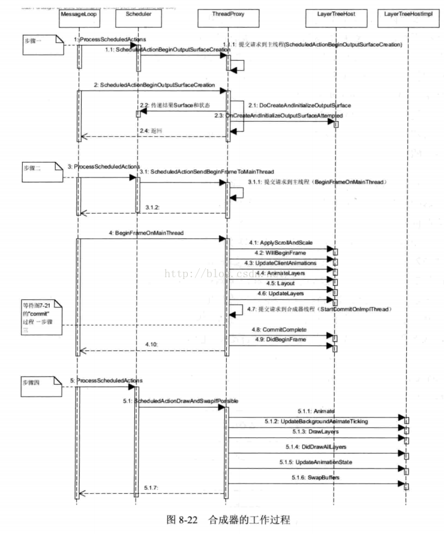

在上图中，Compositor线程首先创建**合成器需要输出结果的后端存储**。在**调度器**执行该任务时候，该线程会将任务交给**主线程**来完成。主线程会创建后端存储并把它**传回**Compositor线程。

##### 6.2 第二步
**Compositor线程告诉主线程**需要开始绘制一个新的帧，通常是通过线程间通信来传递任务。当**主线程**收到该任务的时候，**需要做的事情非常多(4.1-4.6)**。如执行动画操作，重新计算布局，以及绘制需要更新的合成层。在这之后，主线程会等待第三个步骤，当第三个步骤完成后，它通知主线程的LayerHost等类，这是因为步骤三需要阻塞主线程，需要同步Layer树。

##### 6.3 第三步
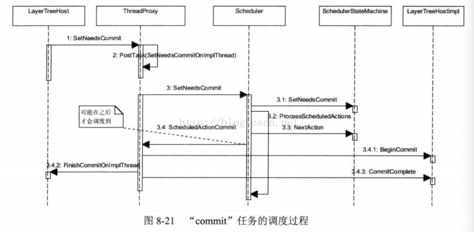

首先，当Layer树有变动的时候，他需要调用**setNeedsCommit**，这些任务是在渲染线程中的，随后他会提交到一个请求到Compositor线程(**commit表示同步Layer树到LayerImpl树**)

其次，当该Compositor线程处理到该请求的时候，他会通过调度器的**setNeedsCommit**函数设置状态机的状态

再次，调度器的setNeedsCommit会调用**ProcessScheduleActions**函数,它检查后面需要执行的任务

然后，如果没有其他任务或者时间合适的话，状态机决定下面立刻执行该任务，他调用ThreadProxy的**ScheduledActionCommit**函数，该函数实际执行commit任务需要的具体流程

最后，在ScheduledActionCommit函数中，他会调用LayerTreeHostImpl和LayerTreeHost中的相应函数来**完成同步两个树的工作，同步结束后他需要通知渲染线程**，因为事实上这一过程需要阻止主线程

##### 6.4 父子合成器，Browser进程Render进程合成
经过第三步后，**Compositor实际上已经不再需要主线程的参与就能够完成合成工作了**，这时候该线程有了需要合成这些层的所有资源。图中5.1.1到5.1.6这些子步骤就是合成各个层并交换前后缓冲区，这些过程是不需要主线程的参与的。**这样就能够解释渲染线程在做其他事情的时候，网页滚动等操作并不会受到渲染线程的影响，因为这时候合成器的工作线程仍然能够正常进行，合成器线程继续合成当前的各个合成层生成网页结果，虽然此时可能有些内容还没有更新，但是用户根本感觉不到网页被阻塞等问题，浏览器网页的用户体验更好**。

Chromium的最新设计为了**合成网页(网页中也可以包含iframe等内嵌网页)和浏览器的用户界面(典型的在Android系统中，但是在桌面系统中，用户界面通常不需要和网页内容合成)**可能需要多个合成器。每个网页可能需要一个合成器，网页的iframe可能也需要一个合成器，整个网页和浏览器的合成也需要一个合成器，这些合成器构成一个层次化的合成器结构。

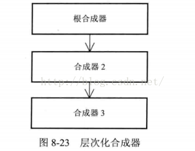

上图中的根合成器是浏览器最高的合成器，该合成器**负责网页和浏览器用户界面**的合成。他有一个子女就是合成器2，根合成器会将合成器2的结果同用户界面合成起来，合成器2就是网页的合成器，而它也包含一个合成iframe内容的合成器3(子合成器)。这里，按理来说，合成器2/3是在Renderer进程中进行的，因为他们是网页相关的合成，而**根合成器是在Browser进程中**的，这样会增加内存带宽的使用。目前Chromium设计使用mailBox机制将Renderer进程中的合成器同步到Browser进程，根合成器可以使用这些结果。


#### 7.减少页面重绘的两种方式
##### 7.1 网页分层技术
##### 7.2 网页分层技术(实际上也是分层)
使用CSS 3D变形技术，它**能够让浏览器仅仅使用合成器来合成所有的层就可以达到动画效果，而不是通过重新设置其他CSS属性并触发计算布局，重新绘制图形，重新合成所有层这一非常复杂的过程**。实际上，开发者如果需要网页中有一些动画或者特殊效果，可以给这些元素设置3D变形属性，然后通过CSS3引入的动画能力，网页就能够达到匪夷所思的效果。更重要的是，Webkit不需要大量的布局计算，不需要重新绘制元素，**只需要修改合成时候的属性**即可。当合成器需要合成的时候，每个合成层都可以设置自己的3D变形属性，这些属性仅仅改变合成层的变换参数，而不需要布局计算和绘图操作，这可以极大的节省时间。


参考资料:

[双缓冲(Double Buffer)原理和使用](http://blog.csdn.net/xiaohui_hubei/article/details/16319249)

[GPU Accelerated Compositing in Chrome](https://sites.google.com/a/chromium.org/dev/developers/design-documents/gpu-accelerated-compositing-in-chrome)

[OpenGL是什么?](https://www.zhihu.com/question/51867884)

[Textures objects and parameters](https://open.gl/textures)

[OpenGL学习脚印: 帧缓冲对象(Frame Buffer Object)](http://blog.csdn.net/wangdingqiaoit/article/details/52423060)

[OpenGL基本概念](http://blog.shengbin.me/posts/opengl-concepts)

[OpenGL ES基础视频](http://v.youku.com/v_show/id_XNjQzMTkyODUy)

[OpenGL 各个shader的作用和区别](http://www.360doc.com/content/18/0204/19/52580135_727714374.shtml)

[Graphics pipeline](https://en.wikipedia.org/wiki/Graphics_pipeline)

[光栅化](https://baike.baidu.com/item/%E5%85%89%E6%A0%85%E5%8C%96/10008122?fr=aladdin)

[图形学 光栅化详解（Rasterization）](https://www.jianshu.com/p/54fe91a946e2?open_source=weibo_search)

[光栅化的深入理解](http://blog.csdn.net/waitforfree/article/details/10066547)

[图形学 坐标系空间变换](https://www.jianshu.com/p/09095090c07f)

[OpenGL学习脚印: 帧缓冲对象(Frame Buffer Object)](http://blog.csdn.net/wangdingqiaoit/article/details/52423060)

[离屏渲染](http://blog.csdn.net/qq_29846663/article/details/68960512)

[GPU大百科全书 第一章：美女 方程与几何](http://blog.csdn.net/pizi0475/article/details/7523490)

[GPU大百科全书索引（有助于理解openGL工作流程）](https://www.cnblogs.com/BigFeng/p/5006014.html)

[GPU大百科全书 前传 看图形与装修的关系](http://blog.csdn.net/pizi0475/article/details/7523481)

[GPU大百科全书 第二章 凝固生命的光栅化](http://blog.csdn.net/pizi0475/article/details/7523491)

[DX10](https://en.wikipedia.org/wiki/DX10)

[计算机图形学——OpenGL之光照](http://blog.csdn.net/qq_29721419/article/details/70161686)

[GPU大百科全书 第三章:像素处理那点事儿](http://blog.csdn.net/pizi0475/article/details/7523494)

[GPU大百科全书 第三章:像素处理那点事儿](http://blog.csdn.net/pizi0475/article/details/7523494)

[GPU大百科全书 第五章 桌面显卡的捍卫者](http://blog.csdn.net/pizi0475/article/details/7523497)

[显卡的一些参数怎么看？](https://www.zhihu.com/question/51316424/answer/172878291)

[OpenGL基本图元](http://blog.csdn.net/feijj2002_/article/details/466987)

[光照基础](http://www.360doc.com/content/16/0314/10/19175681_542036603.shtml)
