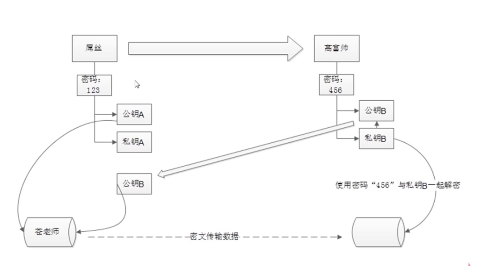
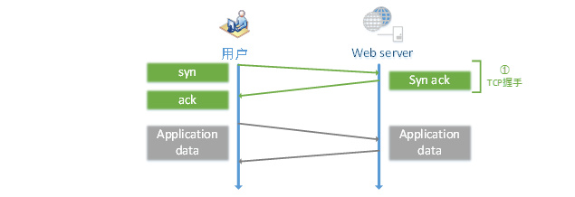
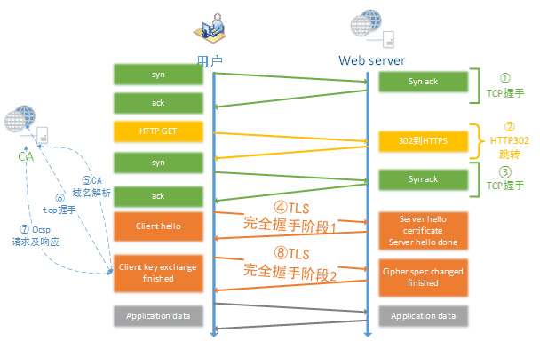

#### 前言
本部分主要说明一些前端计算机网络相关基础知识，后续会不断补充。文中部分内容可能来源于其他文章，所以你也可以参考文末的参考资料。

#### 1.HSTS与前端http/https共存
上次遇到一个问题:页面为https的，同时iframe嵌套了别人的一个https的页面，但是这个别人的https页面引入了http的资源，所以浏览器会出现页面加载了不安全脚本的警告(别人的页面是给内网用户用的，所以他们不关心这个问题)。这在页面给外网用户使用的情况下就存在很大的用户体验问题。所以尝试了解了这个概念。

##### 1.1 什么是HSTS?
下面是对网上内容的做的一个总结:

1.HSTS（HTTP Strict Transport Security）的作用是`强制客户端`（如浏览器）使用HTTPS与服务器创建连接。服务器开启HSTS的方法是，当客户端通过HTTPS发出请求时，在服务器返回的超文本传输协议响应头中包含Strict-Transport-Security字段。非加密传输时设置的HSTS字段无效。 比如，https://xxx 的响应头含有如下的头:
```text
Strict-Transport-Security: max-age=31536000; includeSubDomains
```
这意味着两点:
- 强制升级为https
  在接下来的一年（即31536000秒）中，浏览器只要向xxx或其子域名发送HTTP请求时，必须采用HTTPS来发起连接。比如，用户点击超链接或在地址栏输入http://xxx/ ，浏览器应当自动将http 转写成https，然后直接向https://xxx/发送请求 (**注意**:即使使用window.open打开http的网站也会被转化为https)。
- 无法忽略证书无效的警告
  在接下来的一年中，如果xxx服务器发送的TLS证书无效，用户不能忽略浏览器警告继续访问网站

2.HSTS可以用来抵御`SSL剥离攻击(顾名思义就是剥离http到https的转化)`。SSL剥离的实施方法是阻止浏览器与服务器创建HTTPS连接。它的**前提**是用户很少直接在地址栏输入https://， 用户总是通过点击链接或3xx重定向，从HTTP页面进入HTTPS页面。所以攻击者可以在用户访问HTTP页面时替换所有https:// 开头的链接为 http:// ，达到阻止HTTPS的目的。HSTS可以很大程度上解决SSL剥离攻击，因为只要浏览器曾经与服务器创建过一次安全连接，之后浏览器会强制使用HTTPS，即使链接被换成了HTTP。另外，如果中间人使用自己的自签名证书来进行攻击，浏览器会给出警告，但是许多用户会忽略警告。HSTS解决了这一问题，一旦服务器发送了HSTS字段，用户将不再允许忽略警告

3.用户**首次访问**某网站是不受HSTS保护的。这是因为首次访问时，浏览器还`未收到`HSTS，所以仍有可能通过明文HTTP来访问。解决这个不足目前有两种方案，一是`浏览器预置HSTS域名列表`，Google Chrome、Firefox、Internet Explorer和Spartan实现了这一方案。二是将HSTS信息加入到`域名系统记录`中。但这需要保证DNS的安全性，也就是需要部署域名系统安全扩展。截至2014年这一方案没有大规模部署

##### 1.2 HTTPS与HTTP共存的两种类型?
主要包括主动和被动两种混合内容。
- 主动混合内容
  是最危险的混合内容，浏览器会自动和完全阻止掉这部分内容。对于那些能够**修改当前页面DOM**的内容都被称为主动混合内容，比如<script>,<link>,<iframe>,<object>标签，css选择器中使用的url(如background),或者常见的XMLHTTPRequest。这些内容能够读取用户的cookie并获取认证。
- 被动混合内容
  处理主动混合内容以外就是被动混合内容。浏览器对于这部分内容的处理策略是允许加载，但是会弹出一个警告。比如:images/audio/video等，他们虽然在页面中，但是无法修改当前页面的DOM。

主动混合内容能够拦截http的请求，然后使用它们自己的内容来替换本来的内容。[这里](https://blog.cloudflare.com/fixing-the-mixed-content-problem-with-automatic-https-rewrites/)也提供了多个使用主动混合内容对网站攻击的例子。

##### 1.3 我是如何解决HTTP与HTTPS共存问题的?
下面讲解下我是如何解决https/http共存的问题的(react-router单页应用),方案如下:

- 方案一
1.用户点击某一个按钮需要iframe打开别人的含有http链接的https页面时候，我使用window.open打开,代码如下:
```js
const url = `http://${window.location.host}/#/createCrowd?accountId=${oriId}&fansMust=${defaultSubscribe}`;
window.open(url, "_self", "", true);
```
此时url被设置为当前我们域名下的http版本的URL(本域名支持https/http两种请求协议),其中createCrowd这个路由会通过iframe嵌套别人的https协议的网页，但是因为createCrowd是http协议打开的，所以它本身可以打开https的iframe，同时该iframe也可以加载http的资源。而用户在iframe的页面中操作完成的时候跳转到我们的一个页面(本身的逻辑就是这样的，因为是修改别人的代码，没有想过修改这种模式)，比如/createNewPeopleGroup，此时如果用户在这个页面中点击了完成按钮，那么回到我们页面的https版本:
```js
back2https = () => {
    const url = `https://${window.location.host}/#/usersManager`;
    // 回到最初的页面URL的https版本
    //usersManager(https)=>createCrowd(http)=>iframe(https)=>/createNewPeopleGroup(https)=>usersManager(https)
    setTimeout(() => {
      window.parent.location.href = url;
    }, 50);
};
```
这种逻辑貌似很完美，但是由于上面的HSTS，当你使用window.open打开自己网站的http版本的时候却被chrome浏览器强制定向到https版本，所以这个方案就是无效的。于是有了方案2:

- 方案二
只需要在页面的html模板中添加了下面的meta标签即可([网上](https://stackoverflow.com/questions/34909224/http-to-https-mixed-content-issue)有说这个方案不能通过meta添加其实是不正确的)。
```html
<meta http-equiv="Content-Security-Policy" content="upgrade-insecure-requests" />
```
通过在单页应用的html模板中添加这个http头，整个网站的不安全资源全部转化为https了，当然，这个方案需要保证所有警告的资源的https版本是存在的才行。其他的方案你可以参考下参考文献。

#### 2.CRL证书吊销列表
证书具有一个指定的寿命，但CA可通过称为**证书吊销**的过程来缩短这一寿命。CA发布一个证书吊销列表 (CRL,即Certificate Revocation List)，列出被认为不能再使用的证书的序列号。

#### 3.OCSP在线证书状态协议
OCSP(Online Certificate Status Protocol，在线证书状态协议)是维护`服务器`和其它`网络资源安全性`的两种普遍模式之一。OCSP克服了证书注销列表（CRL）的主要缺陷：必须**经常在客户端下载**以确保列表的更新。当用户试图访问一个服务器时，**在线证书状态协议**发送一个对于证书状态信息的请求。服务器回复一个“有效”、“过期”或“未知”的响应。协议规定了服务器和客户端应用程序的通讯语法。在线证书状态协议给了用户的到期的证书一个宽限期，这样他们就可以在更新以前的一段时间内继续访问服务器。Chrome默认关闭了ocsp功能，firefox 和 IE 都默认开启。

#### 4.HTTP三次握手协议
- 第一次握手
  主机A发送位码为syn＝1,随机产生seq number=1234567的数据包到服务器，主机B由**SYN=1**知道，A要求建立联机；

- 第二次握手
  主机B收到请求后要确认联机信息，向A发送ack number=(主机A的seq+1),syn=1,ack=1,随机产生seq=7654321的包

- 第三次握手
  主机A收到后检查ack number是否正确，即第一次发送的seq number+1,以及位码ack是否为1，若正确，主机A会再发送ack number=(主机B的seq+1),ack=1，主机B收到后确认seq值与ack=1则**连接建立成功**。

完成三次握手，主机A与主机B开始传送数据。为什么建立连接是三次握手，而关闭连接却是四次挥手呢？
  这是因为**服务端在**LISTEN状态下，收到建立连接请求的SYN报文后，把ACK和SYN放在一个报文里发送给客户端。而关闭连接时，当收到对方的FIN报文时，仅仅表示对方不再发送数据了但是还能接收数据，己方也未必全部数据都发送给对方了，所以己方可以立即close，也可以发送一些数据给对方后，再发送FIN报文给对方来表示同意现在关闭连接，因此，己方ACK和FIN`一般都会分开`发送。

那么TCP的为什么需要三次握手？最主要是防止已过期的连接再次传到被连接的主机。如果采用两次的话，会出现下面这种情况。

- 多余连接
  
  比如是A机要连到B机，结果发送的连接信息由于某种原因没有到达B机；于是，A机又发了一次，结果这次B收到了，于是就发信息回来，两机就连接。传完东西后，断开。结果这时候，原先没有到达的连接信息突然又传到了B机，于是B机发信息给A，然后B机就以为和A连上了，这个时候B机就在等待A传东西过去。

- 死锁会发生
  
  三次握手改成仅需要两次握手，死锁是可能发生。考虑计算机A和B之间的通信，假定B给A发送一个连接请求分组，A收到了这个分组，并发送了确认应答分组。按照两次握手的协定，A认为连接已经成功地建立了，可以开始发送数据分组。可是，B在A的应答分组在传输中被丢失的情况下，将不知道A是否已准备好，不知道A建议什么样的序列号，B甚至怀疑A是否收到自己的连接请求分组。在这种情况下，B认为连接还未建立成功，将忽略A发来的任何数据分组，只等待连接确认应答分组。而A在发出的分组超时后，重复发送同样的分组。这样就形成了死锁。

#### 5.公钥与私钥非对称加密与SSH
**对称加密**:不管是自己还是别人解密已经加密后的数据都是使用相同的密码作为秘钥，这在很多情况下是很危险的。比如我的QQ密码，微信密码都是123，那么就会存在密码泄露的问题，因为我需要告诉对方我的加密密码他才能解密，这就是对称加密算法

**非对称加密**:利用自己的密码,通过**对称加密**(加密和解密都是同样的密码)生成公钥和私钥，并把公钥发送给第三方，第三方利用该公钥进行加密，然后当前方使用自己的私钥解密。但是，使用私钥解密的过程中是需要自己的私钥以及自己的密码的，更加形象的说应该是需要钥匙(私钥)+密码，因为你要打开的锁实际上是`密码锁`。



比如屌丝需要将某些重要资源发送给高富帅，此时他将资源放在一个两边都能打开的桶中(羽毛球桶)，然后使用高富帅发送的公钥(锁)对数据进行加密，那么数据传送到高富帅的时候，其就可以通过自己的私钥对数据进行解密。当然，在桶的另一面，屌丝也可以使用自己的公钥对数据进行加密，这样能够保证这一端只能通过自己的私钥打开，其他人无法获取到数据，这是一个形象的比喻，实际的过程并不需要桶的两边都加密，只是说如果需要向谁发送数据就用谁的公钥进行加密而已。同时私钥是由公钥决定的，但却不能根据公钥计算出私钥，这也是对称加密一个重要的前提。

最后需要注意:SSH只能保证数据传递过程的安全，如果在传递之前传送方机器密码已经被木马记录了，那么数据即使已经加密，也是不安全的传输。当然，加密和解密也可以配合相应的数据签名，从而可以验证数据传输的完整性。下面是签名和验证的基本过程:

**签名和验证**:发送方用特殊的hash算法，由明文中产生固定长度的摘要，然后利用自己的**私钥**对形成的摘要进行加密，这个过程就叫签名。接受方利用发送方的公钥解密被加密的摘要得到结果A，然后对明文也进行hash操作(所以双方要协商摘要算法)产生摘要B。最后,把A和B作比较。此方式既可以保证发送方的身份不可抵赖，又可以保证数据在传输过程中不会被篡改。

#### 4.https与http页面访问速度影响
结论:HTTPS也会**降低**用户访问速度，**增加**网站服务器的计算资源消耗。主要体现在以下两个方面:

- 协议交互所增加的网络RTT(round trip time)
下面是http网络请求图:



 用户只需要完成TCP三次握手建立TCP连接就能够直接发送`HTTP请求`获取应用层数据，此外在整个访问过程中也没有需要消耗计算资源的地方。接下来看 HTTPS 的访问过程，相比 HTTP 要复杂很多，在部分场景下，使用 HTTPS 访问有可能增加 7 个 RTT

下面是https的网络请求图:



下面是对该图的一个全面解释:

<pre>
1:三次握手建立TCP连接。耗时一个RTT。

2:使用**HTTP**发起GET请求，服务端返回302跳转到https://www.baidu.com。需要一个RTT 以及302跳转延时。

   (a)大部分情况下用户不会手动输入 https://www.baidu.com 来访问 HTTPS，服务端只能返回 302 强制浏览器跳转到 https。

   (b)浏览器处理302 跳转也需要耗时。

3:三次握手重新建立TCP连接,耗时一个RTT。

  (a)302跳转到 HTTPS服务器之后，由于端口和服务器不同，需要重新完成三次握手，建立 TCP 连接。

4:TLS完全握手阶段一,耗时至少一个RTT。

 (a)这个阶段主要是完成`加密套件`的协商和`证书`的身份认证。

 (b)服务端和浏览器会协商出相同的`密钥交换`算法、`对称加密`算法、`内容一致性校验`算法、`证书签名`算法、椭圆曲线（非ECC 算法不需要）等。

 (c)浏览器获取到证书后需要`校验证书`的有效性，比如是否过期，是否撤销。

5:解析CA站点的DNS,耗时一个 RTT

  (a)浏览器获取到证书后，有可能需要发起OCSP或者CRL请求，查询证书状态。

  (b)浏览器首先获取证书里的CA域名。

  (c)如果没有命中缓存，浏览器需要解析CA 域名的 DNS。

6:三次握手建立CA站点的TCP连接,耗时一个RTT。

 (a)DNS 解析到IP后，需要完成三次握手建立 TCP 连接。

7:发起OCSP请求，获取响应,耗时一个 RTT。

8:完全握手阶段二，耗时一个RTT及计算时间。

 (a)完全握手阶段二主要是密钥协商

9:完全握手结束后，浏览器和服务器之间进行应用层（也就是HTTP）数据传输。

当然不是每个请求都需要增加 7 个 RTT 才能完成 HTTPS 首次请求交互。大概只有不到 0.01% 的请求才有可能需要经历上述步骤，它们需要满足
如下条件：

1:必须是首次请求。即建立TCP连接后发起的第一个请求，该连接上的后续请求都不需要再发生上述行为。

2:必须要发生完全握手，而正常情况下80%的请求能实现简化握手。

3:浏览器需要开启OCSP(Online Certificate Status Protocol)或者CRL功能。Chrome默认关闭了ocsp功能，firefox 和 IE 都默认开启。

4:浏览器没有命中OCSP缓存。Ocsp一般的更新周期是7天，firefox的查询周期也是7天，也就说是7 天中才会发生一次ocsp的查询。

5:浏览器没有命中CA站点的DNS缓存。只有没命中DN缓存的情况下才会解析CA的DNS。
</pre>

- 加解密相关的计算耗时
<pre>
(1)浏览器计算耗时

  a)RSA证书签名校验，浏览器需要解密签名，计算证书哈希值。如果有多个证书链，浏览器需要校验多个证书。

  b)RSA 密钥交换时，需要使用证书公钥加密premaster。耗时比较小，但如果手机性能比较差，可能也需要 1ms 的时间。

  c)ECC密钥交换时，需要计算椭圆曲线的公私钥。

  d)ECC密钥交换时，需要使用证书`公钥`解密获取服务端发过来的ECC公钥。

  e)ECC密钥交换时，需要根据服务端公钥计算master key。

  f)`应用层`数据对称加解密。

  g)应用层数据一致性校验。

2:服务端计算耗时

 a)RSA密钥交换时需要使用证书私钥解密`premaster`。这个过程非常消耗性能。
 
 b)ECC密钥交换时，需要计算椭圆曲线的公私钥。

 c)ECC密钥交换时，需要使用证书私钥加密ECC公钥。

 d)ECC密钥交换时，需要根据浏览器公钥计算共享的master key。

 e)应用层数据对称加解密。

 f)应用层数据一致性校验。
</pre>


参考资料:

[百度百科HSTS](https://baike.baidu.com/item/HSTS/8665782?fr=aladdin)

[Fixing the mixed content problem with Automatic HTTPS Rewrites](https://blog.cloudflare.com/fixing-the-mixed-content-problem-with-automatic-https-rewrites/)

[Upgrade Insecure Requests Sample](https://googlechrome.github.io/samples/csp-upgrade-insecure-requests/index.html)

[HTTP与HTTPS对访问速度（性能）的影响](https://www.cnblogs.com/mylanguage/p/5635524.html)

[百度百科ocsp](https://baike.baidu.com/item/ocsp/283332?fr=aladdin)

[那些年我准备的前端面试题集合](http://blog.csdn.net/liangklfang/article/details/50436536)

[非对称加密算法](https://baike.baidu.com/item/%E9%9D%9E%E5%AF%B9%E7%A7%B0%E5%8A%A0%E5%AF%86%E7%AE%97%E6%B3%95/1208652?fr=aladdin)

[非对称加密算法](http://www.360doc.com/content/16/0505/16/16915_556521577.shtml)

[非对称加密与SSH](https://www.imooc.com/video/5456)

[非对称加密里公钥、私钥的说明](http://www.cnitpm.com/pm/6014.html)

[数字签名](https://baike.baidu.com/item/%E6%95%B0%E5%AD%97%E7%AD%BE%E5%90%8D/212550?fr=aladdin)

[ 电商网站HTTPS实践之路（二）——系统改造篇](http://blog.csdn.net/zhuyiquan/article/details/69569253?locationNum=10&fps=1)
