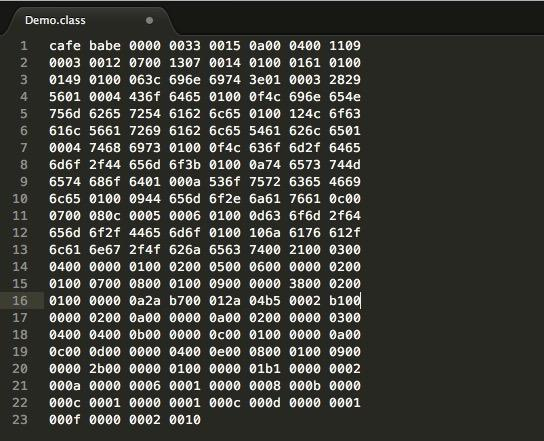
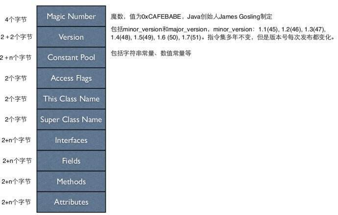

#### 前言
本部分主要说明一些计算机基础知识，后续会不断补充。文中部分内容可能来源于其他文章，所以你也可以参考文末的参考资料。

#### 1.机器码和字节码
##### 1.1 机器码
机器码(machine code)，学名机器语言指令，有时也被称为原生码（Native Code），`是电脑的CPU可直接解读的数据`。通常意义上来理解的话，机器码就是计算机可以直接执行，并且执行速度最快的代码。

用机器语言编写程序，编程人员要首先熟记所用计算机的全部指令代码和代码的涵义。手编程序时，程序员得自己处理每条指令和每一数据的存储分配和输入输出，还得记住编程过程中每步所使用的工作单元处在何种状态。这是一件十分繁琐的工作，编写程序花费的时间往往是实际运行时间的几十倍或几百倍。而且，编出的程序全是些0和1的指令代码，`直观性差，还容易出错`。现在，除了计算机生产厂家的专业人员外，绝大多数的程序员已经不再去学习机器语言了。

- 机器语言是微处理器理解和使用的，用于控制它的操作二进制代码。
- 8086到Pentium的机器语言指令长度可以从1字节到13字节。
- 尽管机器语言好像是很复杂的，然而它是有规律的。
- 存在着多至100000种机器语言的指令。这意味着不能把这些种类全部列出来。

总结：**机器码是电脑CPU直接读取运行的机器指令，运行速度最快，但是非常晦涩难懂，也比较难编写，一般从业人员接触不到**。

##### 1.2 什么是字节码
字节码（Bytecode）是一种包含执行程序、由一序列 `op 代码/数据对 组成的二进制文件`。字节码是一种**中间码**，它比机器码更抽象，需要直译器转译后才能成为机器码的中间代码。通常情况下它是已经经过编译，但与特定机器码无关。`字节码通常不像源码一样可以让人阅读，而是编码后的数值常量、引用、指令等构成的序列`。

字节码主要为了实现特定软件运行和软件环境、与硬件环境无关。字节码的实现方式是通过编译器和虚拟机器。编译器将源码编译成字节码，特定平台上的虚拟机器将字节码转译为可以直接执行的指令。字节码的典型应用为Java bytecode。字节码在运行时通过JVM（JAVA虚拟机）做一次转换生成机器指令，因此能够更好的跨平台运行。

总结：**字节码是一种中间状态（中间码）的二进制代码（文件）。需要直译器转译后才能成为机器码**。

下面图片展示的是字节码:

而每一个字节的具体含义如下:

参考资料:

[机器码和字节码](https://www.cnblogs.com/qiumingcheng/p/5400265.html)

[一文让你明白Java字节码](http://www.importnew.com/24088.html)
