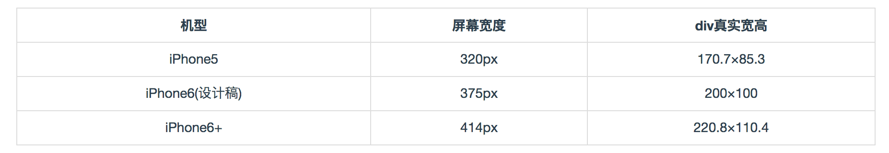

#### 简要说明
这个文章我主要会写一些CSS开发中的常用技巧，通过这些技巧不仅能够提升代码的优雅度，同时对于CSS本身的学习也是很好的参考资料。

问题1：如何实现两行省略号

```css
 .block-with-text {
    overflow: hidden;
    position: relative;
    line-height: 1.2em;
    /* max-height = line-height (1.2) * (3) 设置三行行高 */
    max-height: 3.6em;
    text-align: justify;
    /*省略号到右边距的位置 */
    margin-right: 15px;
     /*给省略号的宽度留位置,三个点的宽度大概14px, 最好不要小于这个宽度*/
    padding-right: 15px;
}
/*创建省略号*/
.block-with-text:before {
    content: '...';
    position: absolute;
    /* 省略号的显示位置定位在右下方*/
    right: 0;
    bottom: 0;
}
/*遮盖省略号*/
.block-with-text:after {
    content: '';
    position: absolute;
    /*设置遮盖省略号的位置 */
    right: 0;
    /*设置遮盖省的大小 */
    width: 1em;
    height: 1em;
    margin-top: 0.2em;
    /*设置遮盖省略号的背景颜色，这个要和背景颜色一致 */
    background: white;
}
```
其主要是通过max-height和line-height来决定的。可以通过[polished.js](https://github.com/styled-components/polished) 实现


问题2:设计稿与实际css像素计算

为了防止变形，在适配的时候有如下的规则:
<pre>
元素在设计稿上的宽度/设计稿的宽度 = 元素在设备的实际宽度/实际设备屏幕的宽度
</pre>

进而可以推出如下的公式:

<pre>
元素的实际宽度 = (元素在设计稿上的宽度/设计稿的宽度)*屏幕的宽度
</pre>

比如设计师按照ipone6的375\*667来输出设计稿,而一个元素的尺寸为400\*200,那么我们可以直接按照iphone6的尺寸来输出。即得到元素的硬件像素宽度为:(400/750)\*750=400。如果是`同一份代码`运行在414的iphone6 plus下，宽度为:(400/750)\*414\*3=662.4，很显然ipone6+中的元素要比ipone6的大，这也是合理的。那么高度是否有如此的关系呢，答案是No!即下面的等式`不成立`:

<pre>
元素的实际高度 = (元素在设计稿上的高度/设计稿的高度)*屏幕的高度
</pre>

因为设计稿可能很长，而我们也不是`一屏幕适配`，而是会出现滚动的!一个好的计算方法就是保持原来div元素的宽高比不变，因此在ipone6上，计算出来的宽度为400，而元素本身的宽高比为2，因此高度为\`200\`即可!而实际在iphone6+上按照宽高比不变就会被计算为:220.79999999999998/2 = 331.2!

UED出图的时候一般要么是640的，要么是750的两种。如果是640的，那么我们就按照ipone5进行适配，如果是750的就按照ipone6来适配。最后得到的元素的硬件像素宽度和高度为通过如下公式计算得到的值:

<pre>
元素的实际宽度 = (元素在设计稿上的宽度/设计稿的宽度)*屏幕的宽度
</pre>

但是此时计算得到的值是`硬件像素值`，因为设计稿是按照硬件像素来计算的。所以最后css像素还会和dpr有关，除以dpr后的值就是真实的css像素。但是此时，我并不想计算出来真实的css像素，因为我将把计算过程交给[rax](http://www.aliued.com/?p=4052)来完成。最后各个屏幕得到的css像素将会是如下表格:



其中ipone5,ipone6的dpr是2，而ipone6+是3!

问题3:选择器
```js
<Tab className="subscribe-tab" size="small" type="capsule">
  {tabs.map(item => (
    <TabPane key={item.key} tab={item.tab}>
      <PictureTextReply key={"pane_" + item.key} />
    </TabPane>
  ))}
</Tab>
```
如果PictureTextReply里面也用到了Tab，那么如何对我们的Tab进行css控制而不会影响PictureTextReply里面的Tab。使用如下即可:
```css
.subscribe__auto--replay {
 //PictureTextReply的css清除掉，我们的容器为next-tabs-nav-wrap
 //PictureTextReply的class为picture__text--reply
  .picture__text--reply {
    .next-tabs-nav-wrap {
      border:0;
    }
  }
  .next-tabs-nav-wrap {
    height: 60px;
    display: flex;
    align-items: center;
    .next-tabs-tab {
      margin-left: 20px;
    }
  }
}
```
但是这种情况下border会继承，所以需要在嵌套的元素里面设置border:0。


问题3:css3实现图片在容器中自动缩放居中
```css
  .auto__resize--image {
    width: 400px;
    height: 200px;
    background-image:url('images/pic.png');
    background-origin: content;
    background-position: 50% 50%;
    background-size: contain;
    background-repeat: no-repeat;
  }
```

参考资料:

[多行文本溢出显示省略号 #15](https://github.com/ShuyunXIANFESchool/FE-problem-collection/issues/15)

[Rax深入浅出 – 样式编写](http://www.aliued.com/?p=4052)
