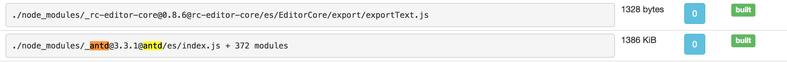

#### 前言
这部分主要讲解脚手架打包项目时候遇到的一些问题，拿走不谢。如果喜欢可以帮忙star，如果有问题记得issue。

#### 1.expose-loader暴露变量到window的问题
##### 1.1 webpack打包之前的最终配置不正确
后面我得到了打包前的webpack配置进行了分析:
```js
rules": [{
            "test": "/Users/qinliang.ql/Desktop/silk/node_modules/_react@0.14.9@react/react.js",
            "use": [{
                "loader": "/Users/qinliang.ql/Desktop/silk/node_modules/_expose-loader@0.7.4@expose-loader/index.js",
                "options": "React"
            }]
        },
```
发现rules里面的版本是不对的:
```js
rules.push({
    test: require.resolve(fullPath[i]),
    use: [
      {
        loader: require.resolve("expose-loader"),
        options: specifier
      }
    ]
});
```
里面明显可以看到**test**规则里面是0.14.9,而我们真实的版本并不是这个，所以导致没有expose出去，因为根本就没有require这个版本的React。使用了`打包工具`的时候，可能需要重新设置node模块加载路径，可以采用下面的paths属性来重新设置模块加载路径:
```js
const ROOT = process.cwd();
const DEFAULT_WEBPACK_MODULES_PATH = path.join(ROOT, "./node_modules");
const TEST = /^\//.test(fullPath[i])
        ? require.resolve(fullPath[i])
        : require.resolve(fullPath[i], {
            paths: [DEFAULT_WEBPACK_MODULES_PATH]
          });
```
如果需要指定webpack加载路径，可以通过resolve.modules来完成
```js
resolve: {
      modules: [DEFAULT_WEBPACK_MODULES_PATH, "node_modules"]
    },
```
后面又踩到一个坑(花了特别长的时间才解决，因为我的[silk](https://github.com/shaozj/silk)命令在本机上都是好的，但是在其他机器上就是一直报错说找不到模块)，就是上面的require.resolve的paths参数是在node\@8.9.0+版本上才引入的。低版本根本不支持，所以当你指定从特定的路径paths加载模块的时候它其实还是从当前项目下加载，所以后面找到了[resolve](https://www.npmjs.com/package/resolve)模块，可以使用它的basedir参数。
```js
rules.push({
      test: require.resolve(
        // 绝对路径也要通过require.resolve包装，否则expose-loader不会暴露到window
        resolve.sync(fullPath[i], {
          basedir: DEFAULT_WEBPACK_MODULES_PATH
        })
      ),
      use: [
        {
          loader: require.resolve("expose-loader"),
          options: specifier
        }
      ]
});
```
上面这句代码就是最终代码，但是还是遇到问题的，就是如果你的test里面不用**[require.resolve](http://gitbook.cn/gitchat/column/59f57e2549cd43306135e255/topic/59f98d9868673133615f7dd8)包装一下expose-loader还是不会被暴露出去的**，虽然通过resolve.sync获取到的已经是绝对路径，这一点一定要注意!

而出现某些模块暴露出去，而某些没有暴露出去，最后排查的原因是一个是绝对路径忽略require.resolve的第二个paths参数没有任何问题，而如果是第三方类库，那么导致它加载模块的路径不对导致的，使用basedir修正模块加载路径即可:
```js
  const specifier = id0imports.specifiers[i];
      if (/^\//.test(fullPath[i])) {
        // 非npm包，相对路径直接expose出去并输出为一个单独文件到output目录
        entry[`${specifier}`] = fullPath[i];
        outputFiles.push(specifier);
        rules.push({
          // 在低版本情况下已经是绝对路径，require.resolve即使忽略第二个参数也无所谓
          test: require.resolve(fullPath[i], {
            basedir: DEFAULT_WEBPACK_MODULES_PATH
          }),
          use: [
            {
              loader: require.resolve("expose-loader"),
              options: specifier
            }
          ]
        });
      } else {
        //  此时是npm包，expose出去不需要添加到entry中
        rules.push({
          test: require.resolve(
            resolve.sync(fullPath[i], {
              basedir: DEFAULT_WEBPACK_MODULES_PATH
            })
          ),
          use: [
            {
              loader: require.resolve("expose-loader"),
              options: specifier
            }
          ]
        });
      }
```
最后，**强刷下**保证你页面远程js是最新的，特别是当你推送远程的情况下。最后的最后，请确保你的**页面没有外链的react,react-dom**，有可能是本地你自己的react-dom,react没有expose出去，而用了外链的react,react-dom脚本导致的问题!!

##### 1.2 webpack打包之前的最终配置正确未能expose模块antd
后面又遇到一种问题，就是webpack在打包之前的最终配置是正确的，但是还是没有expose到window上，最后又花了很多时间去解决。而且这种情况在我试过的所有第三方类库中只有antd没有暴露成功。我的入口文件只有简单的几行，就是不正确:
```js
import React from  'react';
import ReactDOM from 'react-dom';
const antd = require("antd");
const jquery = require('jquery');
const _ = require('lodash');
import {Button} from "antd";
const antd = require('antd');
```
上面的例子中react-dom,react,jquery,lodash都已经暴露到window上，但是antd就是不成功。于是我绞尽脑汁，就想知道打包后的这个bundle中到底引入的antd是什么。我们首先必须有一点假设:**我们require进来的这个antd没有被expose-loader处理，进而没有暴露出去**。于是我想到以前自己写的[一篇文章](https://github.com/liangklfangl/commonsChunkPlugin_Config)，通过运行如下命令就知道自己打包后的bundle包含的各个模块以及模块的依赖关系:
```shell
 webpack --profile --json > stats.json
```
只需要把stats.json上传到[这个地址](http://webpack.github.io/analyse/#modules)分析就可以了。针对我的情况，我直接在所有的模块中搜索了antd，最后得到了如下的结果:



此时我只想说一句fuck,为什么路径是./node_modules/_antd@3.3.1@antd/es/index.js，即目录是**es**目录了，而我在脚手架里面require.resolve得到的明明是如下的地址啊,即lib目录?

<pre>
/Users/qinliang.ql/Desktop/expose-loader-hoc/node_modules/antd/lib/index.js
</pre>

于是我急着去看了antd的文件组织目录结构，还真有es目录，那么此时立马回想，es目录是干嘛的啊？此时直接进入到package.json中一探究竟，看到了如下惊人的事实:
```js
  "main": "lib/index.js",
  "module": "es/index.js",
  "files": [
    "dist",
    "lib",
    "es"
  ],
```
原来如此，我们的require.resolve得到的结果是相对于**main配置**来说的。而此时多了一个module配置，又开始想module配置是干么的？最后google到了[聊聊 package.json 文件中的 module 字段](http://loveky.github.io/2018/02/26/tree-shaking-and-pkg.module/)，原来是为了引入tree-shaking的。当打包工具遇到如下的内容时:
```js
{
  "main": "dist/dist.js",
  "module": "dist/dist.es.js"
}
```
1.如果它**已经支持**pkg.module字段则会优先使用ES6模块规范的版本，这样可以启用Tree Shaking机制。

2.如果它还**不识别**pkg.module字段则会使用我们已经编译成CommonJS规范的版本，也不会阻碍打包流程。


#### 2.npm publish出现sill字样
解决方法是将https替换为http即可:
```js
npm set registry http://registry.npmjs.org/
```

#### 3.多版本包依赖查看
今天遇到一个问题:node_modules下安装了多个版本的babel-generator,然而我的程序必须依赖于6.21.0否则会出现下面的错误：
<pre>
can not react auxiliaryCommentBefore of null
</pre>
于是需要查看多安装的那个版本6.26.1是什么原因，导致我每次require的时候都require到它，进而程序出错，运行下面的命令:
```shell
tnpm ls babel-generator
```
最后输入的信息如下:

<pre>
ilki@3.0.13-4 /Users/qinliang.ql/Desktop/silk
├─┬ webpackcc@0.0.11 -> /Users/qinliang.ql/Desktop/silk/node_modules/_@ali_webpackcc@0.0.11@@ali/webpackcc
│ ├─┬ webpackcc@0.0.9 invalid
│ │ └── babel-generator@6.26.1  extraneous
│ ├─┬ babel-core@6.26.0
│ │ └── babel-generator@6.26.1 
│ └── babel-generator@6.21.0 
└── babel-generator@6.21.0  extraneous
</pre>

最后你会发现原来是在@ali/webpackcc\@0.0.11下循环安装了webpackcc\@0.0.9，去掉即可。其实在node_modules下出现多个版本的同名包是比较常见的，比如下面的依赖层级:

<pre>
silki@3.0.13-4 /Users/qinliang.ql/Desktop/silk
├─┬ webpackcc@0.0.12 -> /Users/qinliang.ql/Desktop/silk/node_modules/_@ali_webpackcc@0.0.12@@ali/webpackcc
│ ├─┬ babel-cli@6.26.0
│ │ ├─┬ babel-core@6.26.0 -> /Users/qinliang.ql/Desktop/silk/node_modules/_babel-core@6.26.0@babel-core
│ │ │ └── babel-generator@6.26.1  -> /Users/qinliang.ql/Desktop/silk/node_modules/_babel-generator@6.26.1@babel-generator deduped
│ │ └─┬ babel-register@6.26.0 -> /Users/qinliang.ql/Desktop/silk/node_modules/_babel-register@6.26.0@babel-register
│ │   └─┬ babel-core@6.26.0
│ │     └── babel-generator@6.26.1  -> /Users/qinliang.ql/Desktop/silk/node_modules/_babel-generator@6.26.1@babel-generator deduped
│ ├─┬ babel-core@6.26.0
│ │ └── babel-generator@6.26.1  -> /Users/qinliang.ql/Desktop/silk/node_modules/_babel-generator@6.26.1@babel-generator
│ ├── babel-generator@6.21.0 
│ ├─┬ babel-minify-webpack-plugin@0.2.0
│ │ └─┬ babel-core@6.26.0
│ │   └── babel-generator@6.26.1  -> /Users/qinliang.ql/Desktop/silk/node_modules/_babel-generator@6.26.1@babel-generator deduped
│ └─┬ babili-webpack-plugin@0.1.2
│   └─┬ babel-core@6.26.0 -> /Users/qinliang.ql/Desktop/silk/node_modules/_babel-core@6.26.0@babel-core
│     └── babel-generator@6.26.1  -> /Users/qinliang.ql/Desktop/silk/node_modules/_babel-generator@6.26.1@babel-generator deduped
└── babel-generator@6.21.0  -> /Users/qinliang.ql/Desktop/silk/node_modules/_babel-generator@6.21.0@babel-generator extraneous
</pre>

虽然多个包比如babel-core也引入了babel-generator，但是他们都只会require自己安装的版本的包，而不会require到我的webpackcc引入的babel-generator版本，这一点一定要注意！如果你要将自己的包限定到特定的版本可以在package.json中指定:

```js
 "dependencies": {
        "babel-generator": "6.21.0"
        // 前面少了~,^,>,<等符号
    },
```

#### 4.传入babel-generator的不是AST
报错信息如下:
<pre>
/Users/qinliang.ql/Desktop/silk/node_modules/_babel-generator@6.21.0@babel-generator/lib/printer.js:279
      throw new ReferenceError("unknown node of type " + (0, _stringify2.default)(node.type) + " with constructor " + (0, _stringify2.default)(node && node.constructor.name));
      ^

ReferenceError: unknown node of type undefined with constructor "Object"
    at Generator.print (/Users/qinliang.ql/Desktop/silk/node_modules/_babel-generator@6.21.0@babel-generator/lib/printer.js:279:13)
    at Generator.generate (/Users/qinliang.ql/Desktop/silk/node_modules/_babel-generator@6.21.0@babel-generator/lib/printer.js:85:10)
    at Generator.generate (/Users/qinliang.ql/Desktop/silk/node_modules/_babel-generator@6.21.0@babel-generator/lib/index.js:62:40)
    at exports.default (/Users/qinliang.ql/Desktop/silk/node_modules/_babel-generator@6.21.0@babel-generator/lib/index.js:20:14)
    at async.parallel (/Users/qinliang.ql/Desktop/silk/src/generator/generators/readme/utils/build.js:201:30)
    at /Users/qinliang.ql/Desktop/silk/node_modules/_async@2.6.0@async/dist/async.js:3874:9
    at /Users/qinliang.ql/Desktop/silk/node_modules/_async@2.6.0@async/dist/async.js:473:16
    at iteratorCallback (/Users/qinliang.ql/Desktop/silk/node_modules/_async@2.6.0@async/dist/async.js:1050:13)
    at /Users/qinliang.ql/Desktop/silk/node_modules/_async@2.6.0@async/dist/async.js:958:16
    at /Users/qinliang.ql/Desktop/silk/node_modules/_async@2.6.0@async/dist/async.js:3871:13
    at fs.readFile (/Users/qinliang.ql/Desktop/silk/src/generator/generators/readme/utils/build.js:188:13)
    at FSReqWrap.readFileAfterClose [as oncomplete] (fs.js:511:3)
</pre>
发现我程序导出的是:
```js
return {
    inputAst
  };
```
而我直接拿着对象去处理了，而不是AST:
```js
const ast = transformHOC(results[t]);
const sourceCode = generator(ast, null, results[t]).code;
```
修改为如下代码即可:
```js
const ast = transformHOC(results[t]).inputAst;
const sourceCode = generator(ast, null, results[t]).code;
```

#### 5.react-docgen处理antd报错
报错信息如下:
<pre>
Error: No suitable component definition found.
</pre>
去掉如下代码即可:
```js
SearchForm = Form.create()(SearchForm);
```
你可以查看这个[issue](https://github.com/reactjs/react-docgen/issues/107)。当然前提是你的组件正常的被**export出去**了。后面我又遇到了这个问题，但是并不是我上面这种情况，其实际代码如下:
```js
const AuthResModal = (message) => {
  if (message == "1") {
    Modal.warning({
      title: "无权限",
      okType: "default",
      okText: "取消",
      content: (
        <AuthButton
          routerName={routerName}
          currentEnvironment={currentEnvironment}
          aut_address_map={aut_address_map}
        />
      )
    });
  } else {
    Modal.warning({
      title: message || "操作失败"
    });
  }
};
export default AuthResModal;
```
其原因在于这个组件没有导出任何jsx，可以修改为如下类型:
```js
const AuthResModal = (message) => {
  if (message == "1") {
    Modal.warning({
      title: "无权限",
      okType: "default",
      okText: "取消",
      content: (
        <AuthButton
          routerName={routerName}
          currentEnvironment={currentEnvironment}
          aut_address_map={aut_address_map}
        />
      )
    });
  } else {
    Modal.warning({
      title: message || "操作失败"
    });
  }
  return <div></div>
};
export default AuthResModal;
```
你也可以参考这个[issue](https://github.com/reactjs/react-docgen/issues/107)。

#### 6.react-docgen未能抽取出description
他和React组件是用createClass还是extends React.Component方式来构建的没有关系，只要你是满足docBlock的注释就可以了。下面是docBlock注释的[解析文件](https://github.com/reactjs/react-docgen/blob/master/src/utils/docblock.js)内容:
```js
var DOCLET_PATTERN = /^@(\w+)(?:$|\s((?:[^](?!^@\w))*))/gmi;
function parseDocblock(str) {
  var lines = str.split('\n');
  for (var i = 0, l = lines.length; i < l; i++) {
    lines[i] = lines[i].replace(/^\s*\*\s?/, '');
  }
  return lines.join('\n').trim();
}
let DOCBLOCK_HEADER = /^\*\s/;
```

#### 7.react-docgen无法处理特定格式的注释
<pre>
/Users/qinliang.ql/Desktop/silk/node_modules/_react-docgen@2.20.1@react-docgen/dist/utils/parseJsDoc.js:26
  return { name: tag.type.name ? tag.type.name : tag.type.expression.name };
                                                                    ^

TypeError: Cannot read property 'name' of undefined
    at getType (/Users/qinliang.ql/Desktop/silk/node_modules/_react-docgen@2.20.1@react-docgen/dist/utils/parseJsDoc.js:26:69)
    at /Users/qinliang.ql/Desktop/silk/node_modules/_react-docgen@2.20.1@react-docgen/dist/utils/parseJsDoc.js:70:13
    at Array.map (native)
    at getParamsJsDoc (/Users/qinliang.ql/Desktop/silk/node_modules/_react-docgen@2.20.1@react-docgen/dist/utils/parseJsDoc.js:66:6)
    at parseJsDoc (/Users/qinliang.ql/Desktop/silk/node_modules/_react-docgen@2.20.1@react-docgen/dist/utils/parseJsDoc.js:81:13)
    at /Users/qinliang.ql/Desktop/silk/node_modules/_react-docgen@2.20.1@react-docgen/dist/handlers/componentMethodsJsDocHandler.js:58:42
    at Array.map (native)
    at componentMethodsJsDocHandler (/Users/qinliang.ql/Desktop/silk/node_modules/_react-docgen@2.20.1@react-docgen/dist/handlers/componentMethodsJsDocHandler.js:53:21)
    at /Users/qinliang.ql/Desktop/silk/node_modules/_react-docgen@2.20.1@react-docgen/dist/parse.js:45:14
    at Array.forEach (native)
    at /Users/qinliang.ql/Desktop/silk/node_modules/_react-docgen@2.20.1@react-docgen/dist/parse.js:44:14
    at Array.map (native)
    at executeHandlers (/Users/qinliang.ql/Desktop/silk/node_modules/_react-docgen@2.20.1@react-docgen/dist/parse.js:42:31)
    at parse (/Users/qinliang.ql/Desktop/silk/node_modules/_react-docgen@2.20.1@react-docgen/dist/parse.js:81:12)
    at Object.defaultParse [as parse] (/Users/qinliang.ql/Desktop/silk/node_modules/_react-docgen@2.20.1@react-docgen/dist/main.js:66:30)
    at async.parallel (/Users/qinliang.ql/Desktop/silk/src/generator/generators/readme/utils/build.js:298:45)
</pre>
仔细查看docBlock格式的注释看看是否符合一定的规范,比如下面的注释是符合规范的:
<pre>
/**
  *  拖动的时候关系改变的时候触发。每次拖拽或者修改了关系这里都会触发，所以每次都会更新state中的constructRelationship
  * 但是我们将修改之前的state状态保存起来，这样当用户在弹窗中点击了取消的时候我还可以恢复到编辑之前的状态
  * @param  {[type]}  [description]
  * @return {[type]}              [description]
  */
</pre>

但是下面的注释就不符合规范，react-docgen就会报上面的错误:
<pre>
/**
  *  拖动的时候关系改变的时候触发。每次拖拽或者修改了关系这里都会触发，所以每次都会更新state中的constructRelationship
  * 但是我们将修改之前的state状态保存起来，这样当用户在弹窗中点击了取消的时候我还可以恢复到编辑之前的状态
  * @param  {[type]}  e [description]
  * @return {[type]}    eee          [description]
  */
</pre>

所以，如果看到类似的错误应该是**注释格式**的问题。还有就是因为报错的代码集中在**如下的函数**:
```js
function getType(tag) {
  if (!tag.type) {
    return null;
  } else if (tag.type.type === 'UnionType') {
    // union type
    return { name: 'union', value: tag.type.elements.map(function (element) {
        return element.name;
      }) };
  } else if (tag.type.type === 'AllLiteral') {
    // return {*}
    return { name: 'mixed' };
  }
  return { name: tag.type.name ? tag.type.name : tag.type.expression.name };
}
```
而你写的propTypes是如下的格式:
```js
Object2Relationship.propTypes = {
  /**
   * 点击某一条规则的时候触发，通知外层组件
   */
  onEdit: PropTypes.func.required,
  /**
   * 弹窗编辑然后保存的时候通知外层组件
   */
  onSave: PropTypes.func.required,
  /**
   * 原始万象关系对象
   */
  data: PropTypes.object.required
};
```
你可能怀疑是否这里的required不支持，我要告诉**你是支持的**,这个错误的最终原因就是**注释的格式**问题。
