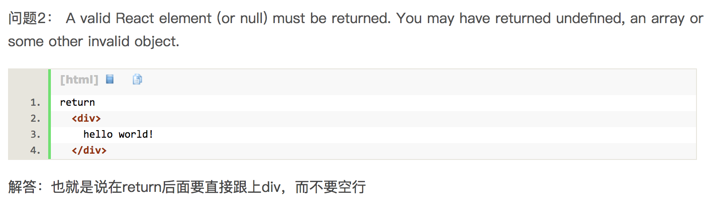

##### 写在前面的话
这个部分主要写一些自己在React学习中遇到的那些蛋疼，花了很长时间，但是最后解决的问题。希望自己以后React开发遇到问题时候能够快速解决。

##### 1.react-docgen报错
错误信息为:
<pre>
/Users/qinliang.ql/Desktop/test/node_modules/_react-docgen@3.0.0-beta9@react-docgen/dist/parse.js:78
  throw new Error(ERROR_MISSING_DEFINITION);
  ^

Error: No suitable component definition found.
    at parse (/Users/qinliang.ql/Desktop/test/node_modules/_react-docgen@3.0.0-beta9@react-docgen/dist/parse.js:78:9)
    at Object.defaultParse [as parse] (/Users/qinliang.ql/Desktop/test/node_modules/_react-docgen@3.0.0-beta9@react-docgen/dist/main.js:66:30)
    at fs.readFile (/Users/qinliang.ql/Desktop/test/index.js:10:35)
    at FSReqWrap.readFileAfterClose [as oncomplete] (fs.js:511:3)
</pre>

此时你的代码是:

```js
import React, { Component } from 'react';
import PropTypes from 'prop-types';
class MyComponent extends React.Component{
    render(){
        return <div>内容<\/div>
    }
  }
MyComponent.propTypes = {
  foo: PropTypes.number,
  bar: function(props, propName, componentName) {
  },
  baz: PropTypes.oneOfType([
    PropTypes.number,
    PropTypes.string
  ]),
};
MyComponent.defaultProps = {
  foo: 42,
  baz:12,
  bar: function(){}
};
export default Component;
```
此时很显然是因为你export default导出的是Component，这个并不是你的组件，而是MyComponent!

##### 2.babylon解析class出错
<pre>
/Users/qinliang.ql/Desktop/silk/node_modules/_babylon@6.18.0@babylon/lib/index.js:4457
  throw err;
  ^

SyntaxError: Unexpected token (111:3)
    at Parser.pp$5.raise (/Users/qinliang.ql/Desktop/silk/node_modules/_babylon@6.18.0@babylon/lib/index.js:4454:13)
    at Parser.pp.unexpected (/Users/qinliang.ql/Desktop/silk/node_modules/_babylon@6.18.0@babylon/lib/index.js:1761:8)
    at Parser.pp$3.parseIdentifier (/Users/qinliang.ql/Desktop/silk/node_modules/_babylon@6.18.0@babylon/lib/index.js:4332:10)
    at Parser.pp$3.parsePropertyName (/Users/qinliang.ql/Desktop/silk/node_modules/_babylon@6.18.0@babylon/lib/index.js:4156:96)
    at Parser.parsePropertyName (/Users/qinliang.ql/Desktop/silk/node_modules/_babylon@6.18.0@babylon/lib/index.js:6229:23)
    at Parser.pp$1.parseClassBody (/Users/qinliang.ql/Desktop/silk/node_modules/_babylon@6.18.0@babylon/lib/index.js:2483:12)
    at Parser.pp$1.parseClass (/Users/qinliang.ql/Desktop/silk/node_modules/_babylon@6.18.0@babylon/lib/index.js:2406:8)
    at Parser.pp$1.parseStatement (/Users/qinliang.ql/Desktop/silk/node_modules/_babylon@6.18.0@babylon/lib/index.js:1843:19)
    at Parser.parseStatement (/Users/qinliang.ql/Desktop/silk/node_modules/_babylon@6.18.0@babylon/lib/index.js:5910:22)
    at Parser.pp$1.parseBlockBody (/Users/qinliang.ql/Desktop/silk/node_modules/_babylon@6.18.0@babylon/lib/index.js:2268:21)
    at Parser.pp$1.parseTopLevel (/Users/qinliang.ql/Desktop/silk/node_modules/_babylon@6.18.0@babylon/lib/index.js:1778:8)
    at Parser.parse (/Users/qinliang.ql/Desktop/silk/node_modules/_babylon@6.18.0@babylon/lib/index.js:1673:17)
    at Object.parse (/Users/qinliang.ql/Desktop/silk/node_modules/_babylon@6.18.0@babylon/lib/index.js:7305:37)
    at parser (/Users/qinliang.ql/Desktop/silk/src/generator/generators/readme/utils/transform_index.js:7:18)
    at transformer (/Users/qinliang.ql/Desktop/silk/src/generator/generators/readme/utils/transform_index.js:76:20)
    at fs.readFile (/Users/qinliang.ql/Desktop/silk/src/generator/generators/readme/utils/build.js:161:40)
</pre>
最后发现是代码中有一块代码注释有问题，如果不满足如下的格式，可能出现该问题,建议使用[DocBlockr](https://github.com/spadgos/sublime-jsdocs)。如果react-docgen抛出了如下的错误也可能是该问题:

<pre>
# /Users/qinliang.ql/Desktop/silk/node_modules/_react-docgen@2.20.1@react-docgen/dist/utils/parseJsDoc.js:26
#   return { name: tag.type.name ? tag.type.name : tag.type.expression.name };
# TypeError: Cannot read property 'name' of undefined
#     at getType (/Users/qinliang.ql/Desktop/silk/node_modules/_react-docgen@2.20.1@react-docgen/dist/utils/parseJsDoc.js:26:70)
#     at getReturnsJsDoc (/Users/qinliang.ql/Desktop/silk/node_modules/_react-docgen@2.20.1@react-docgen/dist/utils/parseJsDoc.js:53:13)
#     at parseJsDoc (/Users/qinliang.ql/Desktop/silk/node_modules/_react-docgen@2.20.1@react-docgen/dist/utils/parseJsDoc.js:82:14)
#     at /Users/qinliang.ql/Desktop/silk/node_modules/_react-docgen@2.20.1@react-docgen/dist/handlers/componentMethodsJsDocHandler.js:58:42
#     at Array.map (<anonymous>)
#     at componentMethodsJsDocHandler (/Users/qinliang.ql/Desktop/silk/node_modules/_react-docgen@2.20.1@react-docgen/dist/handlers/componentMethodsJsDocHandler.js:53:21)
#     at /Users/qinliang.ql/Desktop/silk/node_modules/_react-docgen@2.20.1@react-docgen/dist/parse.js:45:14
#     at Array.forEach (<anonymous>)
#     at /Users/qinliang.ql/Desktop/silk/node_modules/_react-docgen@2.20.1@react-docgen/dist/parse.js:44:14
#     at Array.map (<anonymous>)
#     at executeHandlers (/Users/qinliang.ql/Desktop/silk/node_modules/_react-docgen@2.20.1@react-docgen/dist/parse.js:42:31)
#     at parse (/Users/qinliang.ql/Desktop/silk/node_modules/_react-docgen@2.20.1@react-docgen/dist/parse.js:81:12)
#     at Object.defaultParse [as parse] (/Users/qinliang.ql/Desktop/silk/node_modules/_react-docgen@2.20.1@react-docgen/dist/main.js:66:30)
#     at async.parallel (/Users/qinliang.ql/Desktop/silk/src/generator/generators/readme/utils/build.js:191:43)
#     at /Users/qinliang.ql/Desktop/silk/node_modules/_async@2.6.0@async/dist/async.js:3874:9
#     at /Users/qinliang.ql/Desktop/silk/node_modules/_async@2.6.0@async/dist/async.js:473:16

</pre>


##### 3.重复引入多版本的react解决方案
遇到下面的错误:
<pre>
Uncaught Error: addComponentAsRefTo(...): Only a ReactOwner can have refs. You might be adding a ref to a component that was not created inside a component's `render` method, or you have multiple copies of React loaded (details: https://fb.me/react-refs-must-have-owner).
    at invariant (invariant.js?7839*:41)
    at Object.addComponentAsRefTo (ReactDOM.js:19810)
    at attachRef (ReactDOM.js:20080)
    at Object.ReactRef.attachRefs (ReactDOM.js:20099)
    at ReactDOMComponent.attachRefs (SyntheticEvent.js?00d7*:118)
    at CallbackQueue.notifyAll (EventPluginRegistry.js?f2c2*:214)
    at ReactReconcileTransaction.close (ReactDOM.js:19953)
    at ReactReconcileTransaction.closeAll (LinkedValueUtils.js?98bc*:67)
    at ReactReconcileTransaction.perform (LinkedValueUtils.js?98bc*:14)
    at batchedMountComponentIntoNode (ReactNoopUpdateQueue.js?4a11*:78)
</pre>

原因:我在组件中没有`import ReactDOM from "react-dom"`但是我的页面中有如下调用ReactDOM的代码:
```js
ReactDOM.render(<App name="liangklfangl"/>, document.getElementById('app'));
```
index.html中通过script标签引入了特定版本的react-dom。此时会报出错误。

解决方法如下:

(1)首先在页面中直接import依赖ReactDOM
```js
import ReactDOM from "react-dom";
```

(2)删除页面通过script标签引入的特定版本的ReactDOM。如果不是出于特定原因，我们可以把React,ReactDOM直接打包到最后的bundle中。这样，即使有多个版本的React也不会出现问题。比如我的组件依赖于0.9.1版本的React，同时依赖于A组件，A组件依赖于B版本的React\@15.4.0。那么如果是直接打包，那么我组件使用0.9.1版本的React，同时A组件使用B版本的React即可，因为它们只会使用特定版本的API，所以并没有什么关系。但是如果你使用script引入React，那么就是全局的，可能会B版本的冲突，从而出现上面的问题。

##### 4.React版本冲突的问题
报错信息如下:
<pre>
Trigger.render(): A valid React element (or null) must be returned. You may have returned undefined, an array or some other invalid object.
</pre>

这个问题首先想到的是以前自己写的这段话:



但是由于代码较多，而且**同一份代码在别人的机器上是没有问题的，在我的机器上运行命令就是不ok**，所以又开始了我的艰难之旅。下面是我的问题查找的思路(太深刻了,记录下以后还能回忆下):

- 首先
  
  是不是忘了装某个babel插件，比如add-module-exports，导致我现在的打包工具不认识里面的某种语法？最后我对比了下，排除了这个可能性。

- 接着
 
  因为我使用的是[wcf](https://github.com/liangklfangl/wcf)而不是[silk](https://github.com/shaozj/silk),那我猜测有可能是silk server和wcf --dev --devServer的webpack配置不一致导致的。但是最后也不一而终。

- 然后
  
  回去想了想，不会和上面的问题一样是React版本的问题，导致别人安装了高版本的React，然后使用了里面的新特性，而我外部通过script标签引入的React版本和其不匹配导致的呢？最后我果断删除了外链的js，最后真是如此。

总结一下原因:上一个问题是外链的react和内部打包到bundle里面的react版本不一致导致的，因为外链的js是全局的,从而对内部打包到bundle里面的js产生了影响，导致版本冲突。而这个问题的原因在于，开发者自己安装了react,react-dom，然后webpack的[external](https://github.com/liangklfangl/react-article-bucket)配置要求外部加载react,react-dom，而恰巧我又外链了react,react-dom以为这样就万事大吉了。**但是其实不是的**!开发者用了React@16.\✖的新特性，然后开发完成后预览都是OK，因为本地他的react,react-dom️至少是存在于node_modules里面的(dependencies,devDepencies,peerDependencies),而当你为了防止react,react-dom在页面中多次引用而导致页面加载较慢的问题，所以你决定全网加载一个react,react-dom版本，即外链的react,react-dom。**问题来了**：刚才开发者预览的效果是依赖于本地的react,react-dom版本的，而你现在统一引入的可能是一个React@15.\✖的版本，这样开发者打包的这个组件里面很多新特性可能都没法用了,导致直接抛出错误(因为里面可能有用到版本react@16的API而react@15的版本根本不存在)。️最后我采用了这种方案:

**开发者必须在js中import本地安装的React,ReactDOM,然后我自己使用expose-loader并挂载到window上，这样全局的React,ReactDOM就一定是你本地的版本。Everything is Done!**

##### 5.为DOM赋值
比如下面的错误:
<pre>
ERROR in ./src/page/iron-man-lottery2/index.js
Module build failed: SyntaxError: /Users/qinliang.ql/Desktop/year-card-lottery/src/page/iron-man-lottery2/index.js: Assigning to rvalue (1562:10)
         if(isCorrect){
          //  猜对了
          document.getElementById(`vote_${el}`)= `url(${correct})`;
         }else{
          // 猜错了
          document.getElementById(`vote_${el}`)= `url(${uncorrect})`;
    at Parser.pp.raise (/Users/qinliang.ql/Desktop/year-card-lottery/node_modules/_babylon@5.8.38@babylon/lib/parser/location.js:24:13)
</pre>
很显然这里的错误原因是我**直接给DOM赋值了**!
