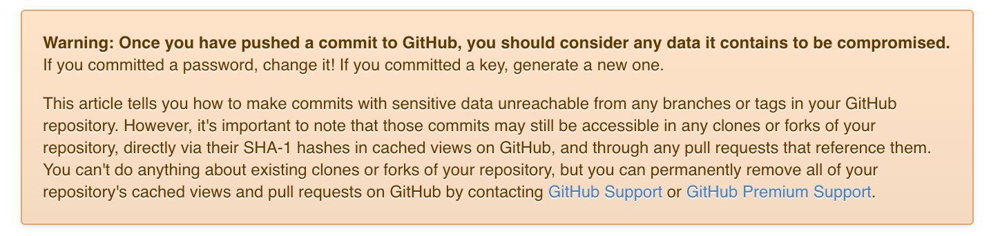
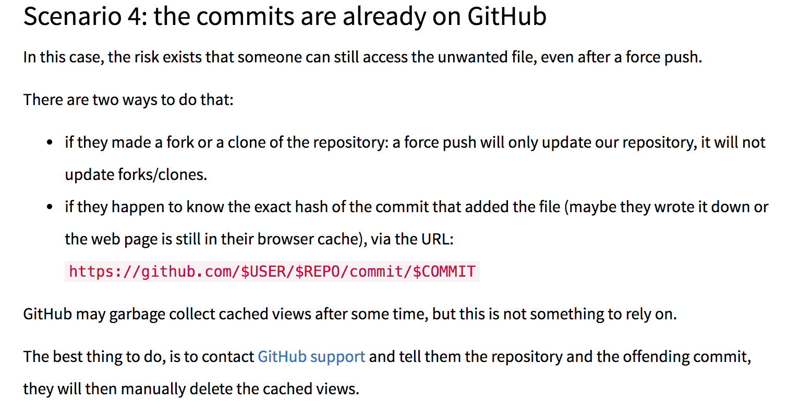

### 备注
下面的内容都是可能经常遇到的问题，给出了问题的解决方案。欢迎star，有问题也欢迎issue。

### 1.github数据不是你想删除就能删除的


> Github的建议很明确:如果泄露了密码可以考虑更改，如果泄露私钥可以重新生成一个。但是也讲述了如何处理那些通过正常的branch/tag无法访问到的敏感数据。需要注意的是:这些commit在fork/clone/pr的仓库中依然可以通过基于SHA-1的hash直接访问,因为它还存在于Github的cache view。这些都是**没法处理**的，但是可以移除自己仓库的所有的cache views以及所有的pr,途径就是通过[联系Github](https://github.com/contact)。


### 2.删除无用文件
#### 2.1 删除github仓库以前的某个无用提交终极方法
```bash
git filter-branch --force --index-filter \ 'git rm --cached --ignore-unmatch others/xx/xx.md'\   -- --all
# 我是cd到项目目录下执行的，路径为others/xx/xx.md(确保你是存在这个文件的)
git push origin --force --all
# --ignore-unmatch表示如果没有找到这个文件不抛出错误，可用于shell脚本中
```
在运行命令的时候会不断的输出ReWrite:
<pre>
Rewrite 7ce29ea30156b6a7a5cac594cd30aa8aa60b9987 (274/280) (679 seconds passed, remaining 14 predicted)    rm 'others/nodejs-QA/egg-QA.md'
Rewrite 2f2c56641d042064a1ae1c60a4ef6a84a245ef21 (275/280) (682 seconds passed, remaining 12 predicted)    rm 'others/nodejs-QA/egg-QA.md'
Rewrite fd72dbe8004ff0b706240d5adbd24fad01342a34 (277/280) (688 seconds passed, remaining 7 predicted)    rm 'others/nodejs-QA/egg-QA.md'
Rewrite f7837a5ff98b449f4d37df07f0bff452e8503fb1 (278/280) (692 seconds passed, remaining 4 predicted)    rm 'others/nodejs-QA/egg-QA.md'
</pre>

该命令会把所有的提交记录中这个指定的文件删除掉，同时修改了commitId(SHAs)，此时以前的所有的commitId都被修改为新的值了，执行下面命令:
```bash
git push origin --force --all
```
后以前的commitId都会在github上被删除，此时即使你的仓库被fork了也是没有以前你删除的那个文件了。但是有一个问题，以前的commitId是不见了，但是通过类似于如下路径（其中SHA是以前的某一个commitId）依然可以访问到:

<pre>
https://github.com/${USER}/${Repository}/blob/${SHA}/${PATH_OF_FILE}
</pre>

尝试过了很多方法:

- 方法1:修改username
> 想修改github的username让以前的地址失效，但是你会发现访问修改后的username对应的url依然会被**重定向**到以前的url;

- 方法2:想修改某个分支上提交的内容
> 尝试了git reset;git rebase;git push SHA:master --force;[删除master分支](https://blog.csdn.net/jimmysmith/article/details/70183777)都不好使

- 方法3:看到了一个文章
 >  这不明显就是我的问题嘛，所以果断给了github邮件。没过几分钟再次通过以前的SHA1访问后链接已经打不开了。

#### 2.2 filter-branch的参数
> --prune-empty

   > Some filters will generate **empty commits** that leave the tree untouched. This option instructs git-filter-branch to remove such commits if they have exactly one or zero non-pruned parents; merge commits will therefore remain intact. This option cannot be used together with --commit-filter, though the same effect can be achieved by using the provided git_commit_non_empty_tree function in a commit filter.

> --tag-name-filter

 > The original tags are not deleted, but can be overwritten; use "--tag-name-filter cat" to simply update the tags. In this case, be very careful and make sure you have the old tags backed up in case the conversion has run afoul.


### 3.删除远程的分支
假如我需要删除patch-1远程分支，执行下面命令就可以了:

```bash
git branch -r
# 查看远程分支
git branch -r -d origin/patch-1
git push origin :patch-1
```

### 4.git的--force-with-lease参数

#### 4.1 git push --force安全问题
 > --force会使用本地分支的提交覆盖远端推送分支的提交。也就是说，如果其他人在相同的分支推送了新的提交，你的这一举动将“删除”他的那些提交！就算在强制推送之前先fetch并且merge或rebase了也是不安全的，因为这些操作到推送之间依然存在**时间差，别人的提交可能发生在这个时间差之内**。

#### 4.2 git push --force-with-lease问题
 > 如果你fetch之后在本地的origin相关分支上已经看到了别人的提交，依然进行强制推送，你还是会覆盖别人的提交。也就是说，**--force-with-lease解决的是本地仓库不够新时，依然覆盖了远端新仓库的问题，如果你执意想要覆盖远端提交，只需要先fetch再推送，它也不会拒绝的**。

### 5.删除最近**commit**中未push的一个文件
```bash
git rm --cached ${FILE}
# rm移除暂存区+工作区
# --cache移除暂存区但依然保留在工作区
git commit --amend -CHEAD
git push
```


### 参考资料

[Removing data from a repository](https://help.github.com/articles/removing-sensitive-data-from-a-repository/)

[gitHub删除默认的master分支](https://blog.csdn.net/jimmysmith/article/details/70183777)

[How to remove a dangling commit from GitHub?](https://stackoverflow.com/questions/4367977/how-to-remove-a-dangling-commit-from-github)

[Request GitHub deletes cached views of this repository](https://github.com/cirosantilli/all-github-commit-emails/issues/3)

[How to completely remove a file from a Git repository(经典)](https://itextpdf.com/blog/how-completely-remove-file-git-repository)

[Git 更安全的强制推送，--force-with-lease](https://blog.csdn.net/wpwalter/article/details/80371264)

[Removing files from a repository's history](https://help.github.com/articles/removing-files-from-a-repository-s-history/)

[git-filter-branch命令](https://git-scm.com/docs/git-filter-branch)

[git官网](https://git-scm.com/docs/git-add)