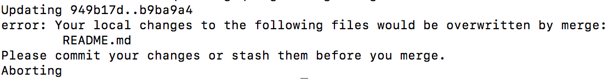
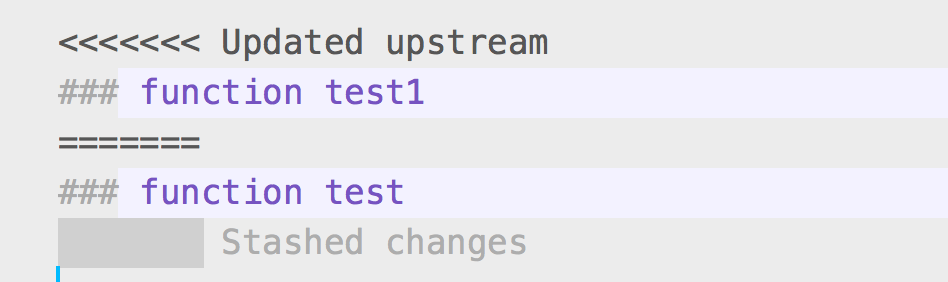
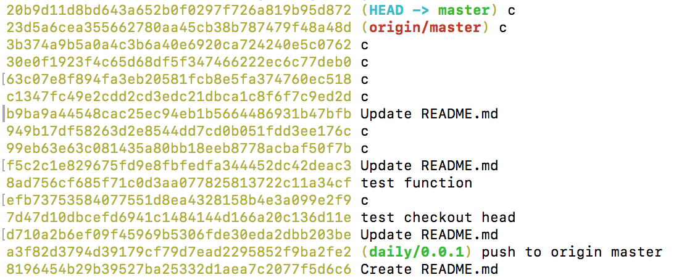
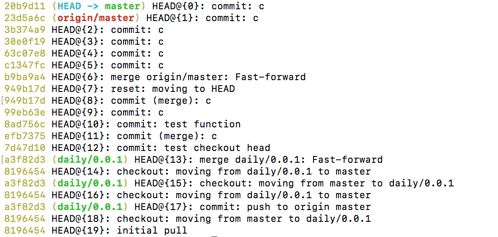
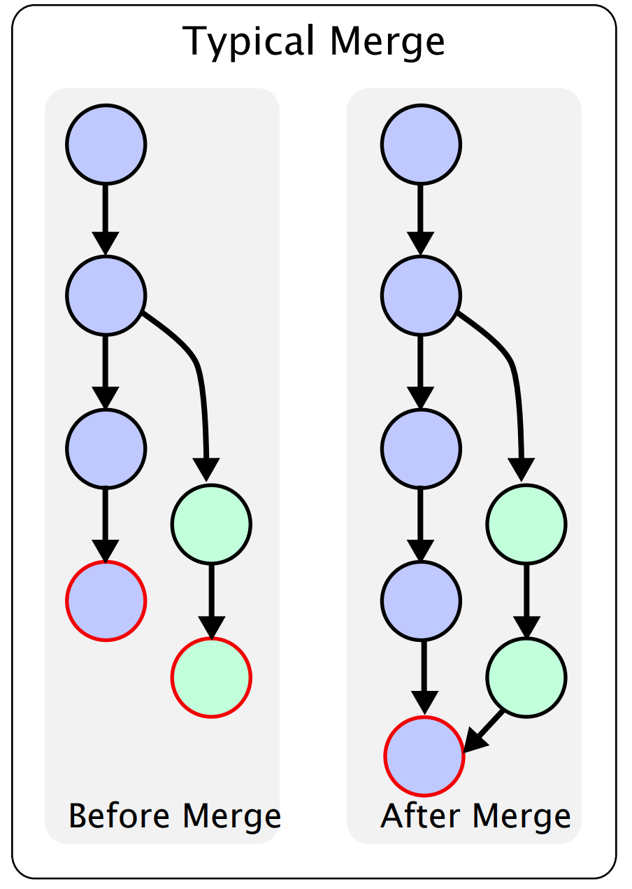
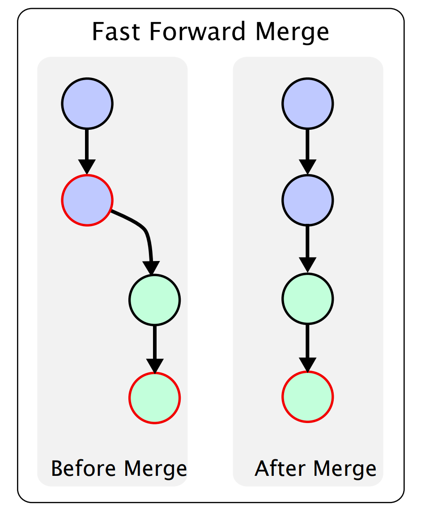
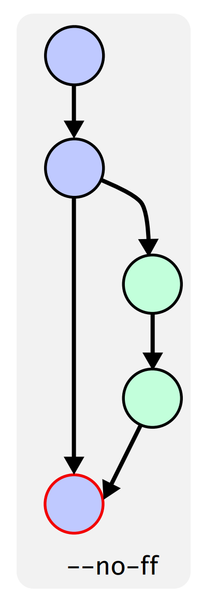
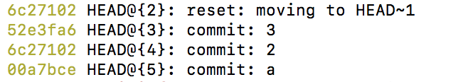
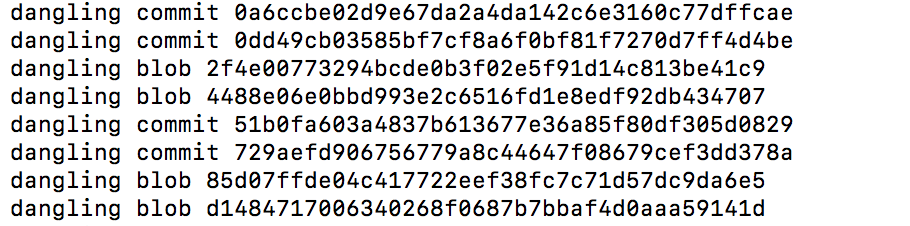
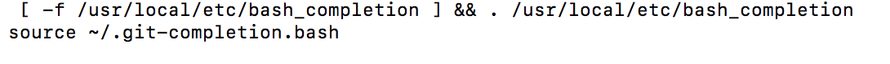

### 1.写在前面的话
在这个文章中我主要将git常见的命令做一个总结，希望能对git多一点的了解

### 2.从本地的非master分支推送到远程的master分支
本地的非master分支是无法直接推送到远程的master分支的，必须和本地的master分支合并后才能推送

### 3.git fetch&merge vs git pull
对于git fetch操作我们一般会执行下面的语句:

#### git fetch&merge
```js
git fetch origin master
//其中origin是对远程服务器的称呼，默认为master。git clone的时候可以自己指定.
//如git clone -o booyah，那么你默认的远程分支名字将会是 booyah/master
//(1)目的:从远程的origin仓库的master主分支更新最新的版本到origin/master分支上
git log -p master..origin/master
//(2)目的:对比本地master和origin/master的区别，而且git fetch只会推送到本地仓库，不会到本地
git merge origin/master
//(3)目的:将本地的master和远程fetch下面的master合并
```

#### git pull
一般我们会执行下面的语句

```js
git pull origin master
//相当于git fetch 和 git merge，即更新远程仓库的代码到本地仓库，然后将内容合并到当前分支。
//所以，简单的说git pull相当于git fetch后再做一个git merge
```

#### git fetch和git merge区别
请看我下面盗取的这张图:


我们先看看几个工作区:

工作区(workspace): 我们新创建的文件，修改的文件如果没有提交都是保存到工作区的

暂存区（index）: git add的时候我们会将代码提交到暂存区.只能通过git GUI或git shell 窗口显示，提交代码、解决冲突的中转站。(*从上面这张图来说，我们的暂存区也会受到影响*)

本地仓库（local repository）:git commit的时候会将暂存区的代码提交到本地仓库。只能在git shell 窗口显示，连接本地代码跟远程代码的枢纽，不能联网时本地代码可先提交至该处；

远程仓库（remote repository）: git push会将本地仓库代码提交到远程仓库

从上面的例子我们可以看到：git fetch只是将代码从远程拉取到本地仓库而已，我们的暂存区以及工作区代码都是不会受到任何影响的。而git pull和git rebase会对本地仓库，暂存区和工作区都产生影响。

### 4.git分支
分支（branches）是用来标记特定的代码提交，每一个分支通过`SHA1sum`值来标识，所以对分支进行的操作是轻量级的——你改变的仅仅是SHA1sum值。所以为什么git提倡大家多使用分支，因为它即轻量级又灵活。对于本地仓库的分支，可以执行下面的命令:

```js
git branch
```
而对于远程分支，执行下面的命令即可

```js
git branch -r
```

对于远程分支，你需要了解:远程分支（remote branch）是对远程仓库中的分支的索引。它们是一些`无法移动的本地分支`；只有在 Git 进行网络交互时才会更新。远程分支就像是书签，提醒着你`上次连接远程仓库`时上面各分支的位置。我们看看下面这张图:


通过该图你应该了解到：我们每次克隆的时候得到的远程master分支是通过origin/master来标记的，而本地也会对应于一个master分支，初始的时候master和origin/master分支指向同一个位置，然后对于本地master分支进行操作我们的origin/master是不会移动的，因为origin/master的移动只会与远程仓库交互后才会移动。如下图：


当你在本地 master分支做了些改动（在本地工作区commit了代码到本地仓库），与此同时，其他人向 同一个远程仓库推送了他们的更新，那么`服务器上的master分支`就会向前推进，而与此同时，你在本地的提交历史正朝向不同方向发展。不过`只要你不和服务器通讯，你的 origin/master指针仍然保持原位不会移动`,但是很显然，我们的本地origin/master已经是过时的了。此时，我们可以运行上面说的git fetch命令，从而使得我们的本地origin/master分支向前移动。此时，我们会得到下面这种图:


通过上面这张图，你应该知道:`我们的origin/master已经在上一次与远程库交互的基础上向前移动了，但是我们的本地master分支依然是在上一次与远程库的交互的基础上移动的，从而形成了以上一次origin/master为基点的双向移动，即一方面是远程库更新从而fetch远程库导致origin/masster前移，另一方面是本地master是基于上一次与远程库交互的基础上移动的`

### 5.图解git命令

(1)我们常见的git clone命令会将远程仓库的内容拉取到本次仓库和工作区,但是我们的暂存区依然是空白的


(2)解决多人协作开发的冲突问题

每次拉取数据之前我们都会做一次git pull(自动合并，建议用git fetch&merge)用于将远程master分支做的修改拉取下来，但是拉取数据的时候常见的问题就是出现了冲突,即远程分支的内容和我们工作区的内容出现了冲突,冲突报错如下:



冲突原理如下图:


此时我们有如下的两种方式用于解决冲突:

方案一:放弃本地修改

放弃本地修改意味着将远程仓库的代码完全覆盖本地仓库以及本地工作区间， 如果对git的指令不熟悉那大可以将本地工程完全删除，然后再重新拷贝一次（`git clone`）。当然， git如此强大没必要用这么原始的方法，可以让本地仓库代码覆盖本地修改，然后更新远程仓库代码(*本地仓库是git pull之前但是没有git add和git commit操作时候的版本*)。本地仓库代码完全覆盖本地工作区间，具体指令如下：

```js
git checkout head .
// (注意： 别遗漏 "head" 后的 " ." )
```
然后更新远程仓库的代码就不会出现冲突了。

```js
git pull
```

方案二:解决冲突后提交本地修改

此时我们会接触到git的另外一个工作区，即"工作现场"。


跟缓存区一样， 工作现场是独立存在于本地仓库、工作区。解决冲突后提交本地修改的思路大概如下：首先：将本地修改的代码放在`工作现场`;然后从远程仓库拉取最新代码，拉取成功后再从工作现场将修改的代码取出， `这样最新代码跟本地修改的代码就会混杂在一起`， 手工解决冲突后， 提交解决冲突后的代码。原理如下图:


具体指令如下:

```js
git stash 
//将本地修改放入工作现场(成功后本地工作区间的代码跟本地仓库代码会同步,回退到上次没有修改的版本)
//git stash save "存储说明"
//如直接 "git stash"则将上次commit注释作为说明
git pull
//从远程仓库获取最新代码
git stash pop
//然后， 取出本地修改的代码，手动解决冲突后执行git add -A,git commit进行代码提交
```

此时在冲突的文件中会有如下的输出:



其中Updated upstream表示远程的更改，而Stashed changes表示本地的修改。

(3)git代码回退

(3.1)暂存区代码覆盖工作区代码

如果前一次执行了git add(git commit/git push也可以一起执行)，然后之后又在原来的文件上做了一些修改，突然想撤销本次修改回到前一个`git add`(可能已经push到远程了)的时候的版本，可以执行下面命令:

```js
git checkout -- README.md
//覆盖README.md
git checkout -- *.txt
// 将匹配的文件覆盖：
git checkout -- .
// 将所有文件覆盖：
```
具体原理如下图:


(3.2)本地仓库代码覆盖缓存区代码

场景：发现之前add的文件不需要了，又不想工作区间重新改回去。即存在一种情况，我们执行了git add，但是突然想撤销这一次git add而且不想对`当前工作区`产生任何影响。执行的命令如下:

```js
// 将本地仓库某一文件覆盖缓存区： 
git reset HEAD README.md 
// 将匹配的文件覆盖缓存区：
git reset HEAD *.md
// 将所有文件覆盖缓存区：
git reset HEAD .
```
图解如下:


注意： 改变的是缓存区代码， `工作区间代码不变`（编辑器代码不会改变）

(3.3)本地仓库代码覆盖工作区代码（常用）

场景： 当前*工作区间*代码混乱（一般更新或合并分支后),废弃当前改动。命令如下:

```js
// 将本地仓库某一文件代码 覆盖本地工作区： 
git checkout head README.md
// 将本地仓库所有文件代码 覆盖本地工作区：(谨慎操作)：
git checkout head .
```
图解如下:


我们知道本地仓库中有一个commit 列表， 记录了所有commit的记录， 查看commit列表指令：

```js
// 查看commit id， 查看提交记录（git commit的记录）
git log 
git log --pretty=oneline 
// 查看以往提交历史（包括 撤销回退 记录） 
git reflog 
```
其中git log输出的内容如下:



其中第一列表示本次提交的hash值，而第二列表示commit信息。下面我们再来看看reflog的信息:



其中第一列表示本次提交的hash值(但是做一个截断，即只显示前几位,和git log比较一下你就知道了)，其他列的信息都很容易理解(比如第二列表示上一个版本，上上一个版本等等;第三列表示commit信息)。根据commit列表， *工作区*间代码能实现更灵活的回退：

```js
// 本地工作区间代码回退到上一次版本、上上次、前10个版本 
git reset --hard HEAD^ 
git reset --hard HEAD^^ 
git reset --hard HEAD~10 
// 本地工作区间代码 回退到指定版本(“d362816”为commit id） 
git reset --hard d362816 
```

(3.4)远程仓库代码覆盖本地仓库代码（`清除未push的commit`）

对应的指令如下:

```js
// 本地工作区间代码回退到远程版本 
git reset –-hard origin/master 
//其中origin/master代表上一次和远程库交互的时候远程代码的版本
```
写到了git reset指令， 就不得不说下它与 git revert 的区别：

(3.4.1) git revert是用一次新的commit来*回滚*之前的commit，git reset是*直接删除*指定的commit。

(3.4.2) 在回滚这一操作上看，效果差不多。但是在日后继续merge以前的老版本时有区别。因为git revert是用一次逆向的commit*中和*之前的提交，因此日后合并老的branch时，导致*这部分改变不会再次出现*，但是git reset是直接把某些commit在某个branch上删除，因而和老的branch再次merge时，这些被回滚的commit*应该还会被引入*(这一点不太理解，我们的git reset已经移除了本地的commit，那么显然无法回退啊？)。

(3.4.3) git reset 是把HEAD向后移动了一下，而git revert是HEAD继续前进，只是新的commit的内容和要revert的内容正好相反，能够抵消要被revert的内容。

其中git reset如下图所示，其直接撤销了上一次的操作:


而git revert只是用上一次的提交来在不需要的提交上产生一个新的提交:


比如下面的例子,我提交了一次不需要的提交，我直接使用git reset就可以完成回到上一个版本了:

```js
git add -A
git commit -m "本次需要是我不需要的"
//(1)此时你运行git log会得到一次新的提交历史
git reset --hard HEAD^
//(2)此时你运行git log你发现上一次提交历史已经不见了
```
如果是使用git revert可以看看下面的例子:

```js
git add -A
git commit -m "添加hello world"
//本次提交不是我们需要的
git log
//获取上一次commit时候的hash值，如ed6ef542f521a533d5bbb42429f7da4264cde560
git revert ed6ef542f521a533d5bbb42429f7da4264cde560
//这样就相当于直接取消上一次的commit提交，此时执行git log你会看到下面的信息
// This reverts commit ed6ef542f521a533d5bbb42429f7da4264cde560.
```

(3.5)远程仓库代码回滚（*线上代码回滚*）

场景： 提交了一个commit（该提交包含很多文件）， 发现有问题， 需要回滚， 将*线上分支*（master）回滚到上一次commit;网上有删除分支进行线上代码回滚的教程， 那种操作其实很危险， 因为一般线上的分支是master分支， 而*这个分支不允许删除*。合理一些的是使用 git reset或git revert方式进行回滚

git reset图解:


git revert图解:


我们可以使用git revert将新的commit替换掉;（*不用git reset而用git revert的原因是保留commit方便后续代码恢复*,因为git reset是直接回到上一个版本了，本次的提交就被删除了,git log不会有任何信息）。对应的代码如下:

```js
git revert HEAD
//取消本次的commit提交，其中HEAD表示当前，而HEAD^表示上一次,HEAD~10表示前10次
// 但是本次的commit记录会保留
git commit -m "回滚上次commit"
//回滚代码然后push
git push origin master
```


### 6.git常用命令对比
#### 6.1 git merge与git rebase

假设你现在基于远程分支"origin"，创建一个叫"mywork"的分支。

```js
 git checkout -b mywork origin
```
此时我们的分支图为:


现在我们在这个分支做一些修改，然后生成两个提交(commit).

```js
 vi file.txt
 git commit
 vi otherfile.txt
 git commit
 ```
但是与此同时，有些人也在"origin"分支上做了一些修改并且做了提交了。 这就意味着"origin"和"mywork"这两个分支各自"前进"了，它们之间"分叉"了。也就是我们本地保存的远程分支已经过时了，此时我们通过git pull将最新的远程master分支代码拉取下来:


如果我们想将本地的代码和远程最新的代码进行合并，可以通过git merge命令，从而得到下面的结构:


此时远程的分支和本地的mywork分支合并生成了一个新的分支C7,那如果是我们采用git rebase呢?

```js
git checkout mywork
//(1)首先必须切换到我们的mywork分支，因为我们是对mywork分支产生的commit取消掉并保存为补丁
git rebase origin
//(2)将mywork分支指向原来的origin分支,并将补丁应用到mywork分支上
```
这些命令会把你的"mywork"分支里的每个提交(commit)取消掉，并且把它们临时*保存为补丁(patch)*(这些补丁放到".git/rebase"目录中),然后把"mywork"分支更新 到最新的"origin"分支，最后把保存的这些*补丁应用到"mywork"分支*上。所以一开始的分支结构为:


进而将原来的分支C5,C6进行了删除，从而得到下面的结构:


其实git merge与git rebase的主要区别在于提交历史的不同，如下面是git rebase产生的提交历史:


而git merge的提交历史如下:


在rebase的过程中，也许会出现冲突,`比如你的mywork代码和origin分支同时修改了一段代码`。在这种情况，Git会停止rebase并会让你去解决 冲突；在解决完冲突后，用"git-add"命令去更新这些内容的索引(index), 然后，你无需执行 git-commit,只要执行:

```js
git rebase --continue
```
这样git会继续应用(apply)余下的补丁。在任何时候，你可以用--abort参数来终止rebase的行动，并且"mywork" 分支会回到rebase开始前的状态。

```js
git rebase --abort
```

#### 6.1 git reset与git revert
关于git reset的内容你应该知道:如果你的*更改还没有共享给别人*，git reset是撤销这些更改的简单方法。当你开发一个功能的时候发现『糟糕，我做了什么？我应该重新来过！』时，reset就像是go-to命令一样。

除了在当前分支上操作，你还可以通过传入这些标记来修改你的*缓存区*(git add)或*工作目录*(还没有git add)：

<pre>
--soft – 缓存区和工作目录都不会被改变(git reset HEAD只会影响本地仓库回到上一个版本)
--mixed – 默认选项。缓存区和你指定的提交同步，但工作目录不受影响。即缓存区和本地仓库同步
--hard – 缓存区和工作目录都同步到你指定的提交(工作目录,缓存区和本地仓库都一致)
</pre>

如下图:


这些标记往往和HEAD作为参数一起使用。比如，git reset --mixed HEAD将你当前的改动从缓存区中移除，但是这些改动还留在工作目录中。另一方面，如果你想完全舍弃你没有提交的改动，你可以使用git reset --hard HEAD。这是git reset最常用的两种用法。

当你传入HEAD以外的其他提交的时候要格外小心，因为reset操作会*重写当前分支的历史*。正如Rebase黄金法则所说的，在*公共分支上这样做可能会引起严重的后果*。

而对于revert操作来说，Revert撤销一个提交的同时会创建一个新的提交。这是一个安全的方法，因为它不会重写提交历史。比如，下面的命令会找出倒数第二个提交，然后创建一个新的提交来撤销这些更改，然后把这个提交加入项目中。

```js
git checkout hotfix
git revert HEAD~2
```


相比git reset，它不会改变现在的提交历史。因此，`git revert可以用在公共分支上，git reset应该用在私有分支上`。你也可以把git revert当作撤销已经提交(push过了)的更改，而git reset HEAD用来撤销没有提交的更改。就像git checkout 一样，git revert 也有可能会重写文件。所以，Git会在你执行revert之前要求你提交或者缓存你工作目录中的更改。请查看下面的黄金准则:

| 命令 | 作用域 | 常用情景 |
| :-: | :-: | :- |
| git reset | 提交层面 | 在私有分支上舍弃一些没有提交的更改 |
| git reset | 文件层面 | 将文件从缓存区中移除 |
| git checkout | 提交层面 | 切换分支或查看旧版本 |
| git checkout | 文件层面 | 舍弃工作目录中的更改 |
| git revert | 提交层面 | 在公共分支上回滚更改 |
| git revert | 文件层面 | （然而并没有） |


### 7.git常用概念
#### 7.1 什么是Fast-forward merge
如果我们的master分支已经分叉了(执行了git pull后远程分支已经分叉)，那么这就是典型的merge操作。如下图:



很显然，这种merge的时候我们会自动生成一次commit。而下面我们看看fast-forward merge，其概念表示:如果我们的master分支没有分叉，此时我们的git不需要创建一次新的commit，而只是需要将我们的master指向最新的那个分支就行了，如下图:



当然你可以通过指定"--no-ff"强制要求git产生一次新的commit，即是如下的图:




### 8.常见git命令
(1)git remote add origin

```js
git init
git add README.md
git commit -m "first commit"
git remote add origin https://github.com/wteam-xq/testGit.git
//git remote add origin命令
//将本地仓库与指定的远程仓库创建联系
git push -u origin master
```

(2)git branch -a

```js
git branch -a
//白色显示为本地分支、绿色显示为当前分支、红色显示为远程分支
git checkout remotes/origin/master
//切换到远程master分支，这个分支是被拉取到本地的，可以在本地操作
git checkout -b newBranchName
//基于远程master分支创建新分支
git push origin newBranch:newBranch
//这样就可以基于本地分支来创建远程分支
//git push <远程主机名> <本地分支名>:<远程分支名>
```

(3)git stash

git stash操作之后会将*工作区(没有git add)*和*暂存区(git add)*的改动放到工作现场。*工作现场*独立存在于所有分支， 也就是一个git项目中只有一个工作现场，即使这个项目中有N个分支。如果有修改的文件从*暂存区间(git add)*中放入工作现场（git stash）, 当再次从工作现场取出时（git stash pop）， 该修改的文件会变回在*工作区间(变回工作区间了)*;(新增的文件则正常恢复到*暂存区间*)。常见命令如下:

```js
git stash save "这些是注释啦"
//新增工作现场（将当前的所有改动全部放入工作现场）, git stash的默认注释为当前分支上一次commit的注释
git stash list
//显示工作现场列表
git stash clear
//清空工作现场列表（慎操作！）
git stash drop
//删除工作现场
git stash drop stash@{0}
//删除某一个工作现场，默认删除最新工作现场：git stash drop = git stash drop stash@{0}
git stash pop
git stash pop stash@{0}
git stash pop --index stash@{0}
//恢复工作现场的代码（即将工作现场的代码取出来,并删除），默认恢复最新工作现场：git stash pop = git stash pop stash@{0}, --index 参数：不仅恢复工作区，还恢复暂存区;
git stash apply
git stash apply --index stash@{0}
//恢复工作现场的代码（即将工作现场的代码取出来,不删除），默认恢复最新工作现场：git stash apply = git stash apply --index stash@{0}, --index 参数：不仅恢复工作区，还恢复暂存区
```

(4)git blame

比如多人协作的情况下线上出问题了，可以通过git blame清楚的知道是谁对文件进行了修改了。下面给出一个例子:

```js
//(1)第一步进入到我们的本地git仓库
git branch -a
//(2)假如我们是要查看远程的daily/1.1.68分支的修改情况，执行下面的命令
git checkout  remotes/origin/daily/1.1.68
//(3)查看远程分支src/pages/item/ItemTable/ItemTable.js文件的修改
git blame src/pages/item/ItemTable/ItemTable.js
//(4)此时会显示每一行代码的修改者
```

(5)git log

下面只是给出几种显示log的方式：

```js
git log --oneline
//压缩模式，在每个提交的旁边显示经过精简的提交哈希码和提交信息，以一行显示
git log --graph
//图形模式，使用该选项会在输出的左边绘制一张基于文本格式的历史信息表示图。如果你查看的是单个分支的历史记录的话，该选项无效
git log --all
// 显示所有分支的历史记录
```

(6)git reflog + git cherry-pick

场景: 你提交了几个commit，然后用 git reset --hard 撤销了这些修改，接着你又意识到：*你希望还原这些修改！*

原理: git reflog 对于恢复项目历史是一个超棒的资源。你可以恢复几乎任何东西 — 任何你commit 过的东西 — 只要通过 reflog。

你可能已经熟悉了 git log 命令，它*会显示commit的列表*。 git reflog 也是类似的，不过它显示的是一个*HEAD发生改变的时间列表*。

一些注意事项：

(1)它涉及的只是*HEAD的改变*。在你切换分支、用git commit进行提交、以及用 git reset撤销 commit时，HEAD会改变，但当你用 git checkout -- <bad filename>撤销时(只是替换文件，分支不变)，HEAD 并不会改变 — 如前所述，这些修改从来没有被提交过，因此reflog 也无法帮助我们恢复它们。

(2)git reflog不会永远保持。Git 会定期清理那些 “用不到的” 对象。不要指望几个月前的提交还一直躺在那里。

(3)你的reflog就是你的，只是你的。你不能用 git reflog 来恢复另一个开发者没有 push 过的 commit。

下面我们演示一个例子:

```js
git add -A
git commit -m "1"
//(1)第一次修改并提交
git add -A
git commit -m "2"
//(2)第二次修改和提交
git add -A
git commit -m "3"
//(3)第三次修改和提交
git reset --hard HEAD~1
//(4)取消第三次提交
//注意：此时运行git log会没有第三次提交的log信息，但是reflog却可以看到HEAD指针的移动历史
```
下面我们看看git reflog的HEAD的改变历史:



如果我们要恢复上一次的修改只要执行如下的命令就可以了:

```js
git cherry-pick 52e3fa6
//52e3fa6表示第三次的修改的hash
```
此时运行了git cherry-pick之后，我们通过git log可以看到第三次的提交信息了。


(7)git commit -p

一般情况下，创建一个基于特性的提交是比较好的做法，意思是每次提交都必须代表一个新特性的产生或者是一个bug的修复。如果你修复了两个bug，或是添加了多个新特性但是却没有提交这些变化会怎样呢？在这种情况下，你可以把这些变化放在一次提交中。但更好的方法是把文件暂存(Stage)然后分别提交。例如你对一个文件进行了多次修改并且想把他们分别提交。这种情况下，你可以在 add 命令中加上 -p 参数

```js
git add -p [file_name]
```
看上去，Git 假定所有的改变都是针对同一件事情的，因此它把这些都放在了一个块里。你有如下几个选项：

<pre>
输入 y 来暂存该块

输入 n 不暂存

输入 e 手工编辑该块

输入 d 退出或者转到下一个文件

输入 s 来分割该块，从而单独提交某一块
</pre>

(8)git fsck --lost-found

Git中把commit删了后，并不是真正的删除，而是变成了*悬空对象*（dangling commit）。我们只要把把这悬空对象（dangling commit）找出来，用*git rebase*也好，用git merge也行就能把它们给恢复。这里最重要的一个命令就是git fsck，下面是一个例子:

```js
git add -A
git commit -m "1"
git checkout -b daily/1.1.1
//创建一个分支
git add -A
git commit -m "2"
//分支上添加内容
git checkout master
//回到主分支
git branch -D daily/1.1.1
//删除原来的分支
git fsck –lost-found 
//最重要的执行上面这句代码，得到如下的内容
```
此时你会看到下面的内容:



此时继续执行下面的代码:

```js
git show 0a6ccbe02d9e67da2a4da142c6e3160c77dffcae
//此时比如找到了你的分支的代码，然后执行git rebase
git rebase 0a6ccbe02d9e67da2a4da142c6e3160c77dffcae
git log
//此时你会看到原来的代码已经找回来了
git merge
//使用git merge进行代码恢复
```

(9)git diff

```js
 git remote -v
 //查看远程分支
 git fetch origin master:temp
 //将远程master分支拉取到temp分支，自己默认会在master分支上
 git diff temp
 //本地master分支和远程拉取的temp分支进行对比
 git merge temp
 //将远程的分支合并到本地master分支
 git branch -d temp
 //删除多余的分支
```


### 9.高级git知识
#### 9.1 git自动补全功能添加
```js
brew install bash-completion
brew info bash-completion 　
//(1)打印 [ -f /usr/local/etc/bash_completion ] && . /usr/local/etc/bash_completion
//将这段代码直接添加到~/.bash_profile中
git clone https://github.com/git/git.git
//(2)到git目录下运行如下命令
cp git/contrib/completion/git-completion.bash ~/.git-completion.bash
//(3)在~/.bash_profile中添加如下内容
source ~/.git-completion.bash
//(4)开始完成
```
下面是我的bash_profile文件内容:



#### 9.2 在git中忽略文件
你是不是很烦那些编译过的文件 (比如 .pyc) 出现在你的 Git 仓库中？或者说你已经受够了已经把它们都加进了 Git 仓库？好了，这有个办法可以让你告诉 Git 忽略掉那些特定的文件和文件夹。只需要创建一个名为 .gitignore 然后列出那些你不希望 Git 跟踪的文件和文件夹。你还可以添加例外，通过使用感叹号(!)。

```js
*.pyc
*.exe
my_db_config/
!main.pyc
```

#### 9.3 detached HEAD
在执行checkout的时候，如果既没有指定*文件名*，也没有指定*分支名*，而是一个*标签(tag)*、*远程分支*、*SHA-1(commit后形成的)*值或者是像*master~3*类似的东西，就得到一个匿名分支，称作detached HEAD（被分离的HEAD标识）。这样可以很方便地在历史版本之间互相切换。比如说你想要编译1.6.6.1版本的git，你可以运行git checkout v1.6.6.1（这是一个标签，而非分支名），编译，安装，然后切换回另一个分支，比如说git checkout master。然而，当提交操作涉及到“分离的HEAD”时，其行为会略有不同。

当HEAD处于分离状态（不依附于任一分支）时，提交操作可以正常进行，但是不会更新任何已命名的分支。(你可以认为这是在更新一个匿名分支)。如下图:


一旦此后你切换到别的分支，比如说master，那么这个提交节点（可能）再也不会被引用到，然后就会被丢弃掉了。注意这个命令之后就不会有东西引用2eecb。


但是，如果你想保存这个状态，可以用命令git checkout -b name来创建一个新的分支。


参考资料:

[Git中pull对比fetch和merge](http://www.zhanglian2010.cn/2014/07/git-pull-vs-fetch-and-merge/)

[git图解：代码区域总结](https://zhuanlan.zhihu.com/p/20175919)

[git图解（2）：代码回退](https://zhuanlan.zhihu.com/p/22734098)

[git图解（3）：分支操作](https://zhuanlan.zhihu.com/p/25426071)

[rebase](http://gitbook.liuhui998.com/4_2.html)

[5.2 代码回滚：Reset、Checkout、Revert的选择](https://github.com/geeeeeeeeek/git-recipes/wiki/5.2-%E4%BB%A3%E7%A0%81%E5%9B%9E%E6%BB%9A%EF%BC%9AReset%E3%80%81Checkout%E3%80%81Revert%E7%9A%84%E9%80%89%E6%8B%A9)

[what is fast-forward merge](https://sandofsky.com/images/fast_forward.pdf)

[git stash常用命令](https://github.com/wteam-xq/testGit/blob/master/learn_log/git_stash.md)

[Mac 中 Git 命令自动补全](http://chars.tech/2016/07/17/git-auto-completion-mac/)

[10 个迅速提升你 Git 水平的提示](https://www.oschina.net/translate/10-tips-git-next-level)

[图解Git之detached节点](https://marklodato.github.io/visual-git-guide/index-zh-cn.html#detached)

[A Visual Git Reference](http://marklodato.github.io/visual-git-guide/index-en.html#detached)

[如何在 Git 里撤销(几乎)任何操作](http://blog.jobbole.com/87700/)

[ 如何用git reflog和git cherry-pick找回已删除的commit记录](http://blog.csdn.net/xqs83/article/details/9125077)

[git blame && git fsck –lost-found](http://blog.csdn.net/wh_19910525/article/details/7842503)

[Git更新远程仓库代码到本地](http://www.zhanglian2010.cn/2014/05/git-fetch-remote-repo/)
