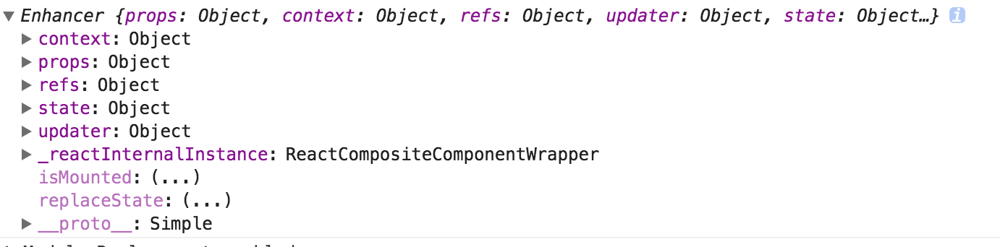

### 运行

```js
npm install webpackcc -g
//修改package.json顺次添加下面内容
  // "entry": {
  //   "index": "./simple.js"
  // },
// "entry": {
//     "index": "./react-tree-manipulation.js"
//   }
//  "entry": {
  //   "index": "./debugPropsaState.js"
  // }
npm run dev
```

### 个人理解
(1)Inheritance Inversion因为采用继承的方式，所以可以通过this获取到WrappedComponent的所有实例方法，state,props,context等

(2)通过渲染劫持（`Render Highjacking`）可以将WrappedComponent的render方法渲染出来的组件树进行修改，从而得到我们需要的组件树。通过渲染劫持你可以：

 (2.1)在由 render输出的任何 React 元素中读取、添加、编辑、删除 props
 
 (2.2)读取和修改由 render 输出的 React 元素树,有条件地渲染元素树,把样式包裹进元素树（就像在 Props Proxy 中的那样）

你不能编辑或添加 WrappedComponent实例的 props，因为 React 组件不能编辑它接收到的 props，但你可以修改由 render 方法返回的组件的 props。就像上面说的，II 类型的 HOC 不一定会解析完整子树，意味着渲染劫持有一些限制。根据经验，使用`渲染劫持你可以完全操作 WrappedComponent 的 render 方法返回的元素树`。但是如果元素树包括一个函数类型的 React 组件，你就不能操作它的子组件了。（被 React 的一致化处理推迟到了真正渲染到屏幕时）


### 1.高阶组件通过`this`访问WrappedComponent实例

```js
import React from "react";
import ReactDOM from "react-dom";
function iiHOC(WrappedComponent) {
  return class Enhancer extends WrappedComponent {
    render() {
      //(1)本身是通过继承WrappedComponent，所以当然可以通过this获取到WrappedComponent上的所有的
      //方法
      console.log('this===',this);
      return super.render()
    }
  }
}

@iiHOC
class Simple extends React.Component{
  state={
    name:"liangklfangl"
  }
  sayHello(){

  }
  render(){
    return (
        <div>Simple<、/div>
      )
  }
}
ReactDOM.render(<Simple/>,document.getElementById('react-content'));
```
上面的this具有的内部签名如下所示:



Inheritance Inversion(`II`)允许 HOC 通过`this`访问到 WrappedComponent，意味着它可以访问到 state、props、组件生命周期方法和render方法。通过 II你可以创建新的生命周期方法。为了不破坏 WrappedComponent，记得调用`super.[lifecycleHook]`。


### 2.Inheritance Inversion 的高阶组件`不一定会解析完整子树`

```js
import React from "react";
import ReactDOM from "react-dom";

function iiHOC(WrappedComponent) {
  return class Enhancer extends WrappedComponent {
    render() {
      const elementsTree = super.render()
      console.log('elementsTree---',elementsTree);
      //(2)此时调用父级组件的render方法得到React组件树，每一个rendersTree都有props,type,ref,key,$$typeof等属性
      let newProps = {};
      //如果render方法中返回的是一个<input/>字符串
      if (elementsTree && elementsTree.type === 'input') {
        newProps = {value: 'may the force be with you'}
      }
      const props = Object.assign({}, elementsTree.props, newProps)
      //(3)通过React.cloneElement来对调用super.render返回的组件树进行clone并附加新的属性
      const newElementsTree = React.cloneElement(elementsTree, props, elementsTree.props.children)
      return newElementsTree
    }
  }
}
@iiHOC
class TreeManipulation extends React.Component{
  state={
    name:"liangklfangl"
  }
  sayHello(){

  }
  render(){
    return (
         <div>TreeManipulation<\/div>
      )
  }
}
//(1)TreeManipulation此时是已经经过HOC处理后的结果了
ReactDOM.render(<TreeManipulation/>,document.getElementById('react-content'));
```
这个例子展示了如何对`WrappedComponent`返回的组件树进行修改，从而按照我们所想的来对WrappedComponent进行渲染。你可以在这里做各种各样的事，你可以`遍历整个元素树`，然后修改元素树中任何元素的 props。这也正是样式处理库[Radium](http://formidable.com/open-source/radium/) 所用的方法。

### 3.采用debug模式输出WrappedComponent的state/props
```js
import React from "react";
import ReactDOM from "react-dom";

function getDisplayName(WrappedComponent) {
  return WrappedComponent.displayName ||
         WrappedComponent.name ||
         'Component'
}
export function IIHOCDEBUGGER(WrappedComponent) {
  return class II extends WrappedComponent {
    render() {
            console.log("WrappedComponent==",WrappedComponent.displayName);
            //WrappedComponent的displayName输出为undefined
            //可以通过getDisplayName来设置
         console.log("getDisplayName==",getDisplayName(WrappedComponent));
      return (
        <div>
          <h2>HOC Debugger Component</h2>
          <p>Props</p> <pre>{JSON.stringify(this.props, null, 2)}</pre>
          <p>State</p><pre>{JSON.stringify(this.state, null, 2)}</pre>
          {super.render()}
          {/*实例化我们的WrappedComponent组件*/}
        </div>
      )
    }
  }
}
@IIHOCDEBUGGER
class PropsDebug extends React.Component{
  state={
    name:"liangklfangl"
  }
  sayHello(){

  }
  render(){
    return (
         <div>PropsDebug<\/div>
      )
  }
}
PropsDebug.displayName ="PropsDebug";
ReactDOM.render(<PropsDebug school="DUT"/>,document.getElementById('react-content'));
```
同时这个例子也展示了如何为我们的HOC组件添加displayName(`默认的displayName会被设置为undefined`)

参考资料:

[深入理解 React 高阶组件](https://zhuanlan.zhihu.com/p/24776678?group_id=802649040843051008)
