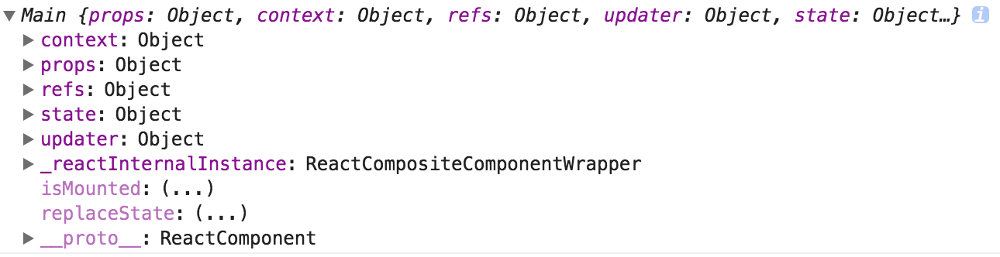

### 运行

```js
npm install webpackcc -g
//修改package.json
//如果测试ref请添加如下内容
// "entry": {
  //   "index": "./getWrappedInstanceByRef.js"
  // }
// 如果测试state-get请添加
//  "entry": {
  //   "index": "./state-get.js"
  // }
npm run dev
```

### 个人理解
(1)这里的prop-proxy完成的事情很简单，就是在我们的WrappedComponent组件被实例化之前去完成一系列的操作，比如得到props，然后封装到我们的WrappedComponent组件上。而`这一套逻辑在很多情况下都是可以复用的`。

(2)同时，这部分的内容也展示了，在我们的HOC中如何调用我们的WrappedComponent的实例方法或者获取他的state,context,props等上的属性和方法，这主要是通过`ref`来完成的。为我们的WrappedComponent添加一个ref函数，该函数会在WrappedComponent被挂载的时候被调用，从而在HOC中可以获取到被挂载的WrappedComponent的实例对象。

(3)这部分内容也展示了如何在高阶组件中维护一个state，然后同步到WrappedComponent中，从而实现HOC组件中的state与WrappedComponent中的`受控组件的状态同步`。

### 1.通过高阶组件为我们的WrappedComponent添加props

```js
function currentLoggedInUser(){
  return "liangklfangl";
}
function ppHOC(WrappedComponent) {
  return class PP extends React.Component {
    render() {
      //当前登录的用户可以在 WrappedComponent 中通过 this.props.user 访问到
      //访问当前user的逻辑在高阶组件内部就完成了
      const newProps = {
        user:currentLoggedInUser()
      }
      return <WrappedComponent {...this.props} {...newProps}/>
    }
  }
}
```

### 2.高阶组件中通过`ref`获取WrappedComponent的实例

```js
import React from "react";
import ReactDOM from "react-dom";
function refsHOC(WrappedComponent) {
  return class RefsHOC extends React.Component {
  //我们的WrappedComponent被挂载后具有ref，其ref是一个函数，挂载的时候就会传入挂载的这个实例对象，即wrappedComponentInstance
    proc(wrappedComponentInstance) {
      console.log('wrappedComponentInstance====',wrappedComponentInstance);
      //可以获取到挂载的组件的context,state,props,refs,updater等等
      wrappedComponentInstance.method()
    }
    render() {
      const props = Object.assign({}, this.props, {ref: this.proc.bind(this)})
      //(2)通过这里为我们的WrappedComponent添加ref属性，其值为一个函数，这个函数会接受到一个参数，其参数就是
      //被包裹的WrappedComponent的实例化对象
      return <WrappedComponent {...props}/>
    }
  }
}
@refsHOC
class Main extends React.Component{
   state={
     age:26
   }
   method(){
     console.log('WrappedComponent的method方法被调用');
   }
   render(){
     return (
       <div ref="name">
           Main
      <\/div>)
   }
}
//(1)此时的Main是经过高阶组件装饰后的组件
ReactDOM.render(<Main name="liangklfangl"/>,document.getElementById('react-content'));
```
通过ref获取到`WrappedComponent`的实例以后，我们可以获取到如下的关于WrappedComponent的实例的所有属性:



Ref的回调函数会在`WrappedComponent`渲染时执行(即WrappedComponent挂载完成后执行)，你就可以得到WrappedComponent的引用。从而可以在HOC内部对WrappedComponent进行处理。

### 3.维持高阶组件和受控input的值同步
```js
import React from "react";
import ReactDOM from "react-dom";
function ppHOC(WrappedComponent) {
  //该PP组件接受到lastname="liangklfangl"的this.props
  return class PP extends React.Component {
    constructor(props) {
      super(props)
      this.state = {
        name: ''
      }
      this.onNameChange = this.onNameChange.bind(this)
    }
    onNameChange(event) {
      //(3)input触发onChange事件导致高阶组件重新渲染，此时state与input的值也会同步
      console.log('input触发onChange事件导致高阶组件重新渲染，此时state与input的值也会同步',event.target.value);
      this.setState({
        name: event.target.value
      })
    }
    render() {
      // console.log('this.props===',this.props);
      // {
      //   "lastname": "liangklfangl"
      // }
      const newProps = {
        name: {
          value: this.state.name,
          onChange: this.onNameChange
        }
      }
      //(2)此时高阶组件自己维护的value,onChange的state会被传入到我们的WrappedComponent
      //而WrappedComponent在实例化的时候将它传递给我们的input,此时我们的input变成了受控的input
      return <WrappedComponent {...this.props} {...newProps}/>
    }
  }
}

@ppHOC
class Example extends React.Component {
  render() {
    return <input name="name" {...this.props.name}/>
  }
}
//(1)此时实例化的Example组件是已经经过ppHOC包裹了
ReactDOM.render(<Example lastname="liangklfangl"/>,document.getElementById('react-content'));
```
你可以通过传入`props`(value值)和回调函数(`onChange`)把state提取出来，放在HOC中，类似于 smart component 与 dumb component。


参考资料:

[深入理解 React 高阶组件](https://zhuanlan.zhihu.com/p/24776678?group_id=802649040843051008)

[react-hoc-examples](https://github.com/franleplant/react-hoc-examples)

