#### 1.defer与async的分析
##### 1.1 defer,async与保证js加载完成后才调用的实现
```html
<script src="script.js"></script>
```
没有 defer 或 async，浏览器会立即加载并执行指定的脚本，“立即”指的是在渲染该 script 标签之下的文档元素之前，也就是说不等待后续载入的文档元素，读到就加载并执行。
```html
<script async src="script.js"></script>
```
有async，加载和渲染后续文档元素的过程将和 script.js 的加载与执行并行进行（异步）。
```html
<script defer src="myscript.js"></script>
```
有 defer，加载后续文档元素的过程将和 script.js 的加载并行进行（异步），但是 script.js 的执行要在`所有元素解析完成之后，DOMContentLoaded 事件触发之前`完成。
然后从实用角度来说呢，首先把所有脚本都丢到 <\/body>(body结束符) 之前是最佳实践，因为对于旧浏览器来说这是唯一的优化选择，此法可保证非脚本的其他一切元素能够以最快的速度得到加载和解析。参见下图:


defer和async在`网络读取（下载）这块儿`是一样的，都是异步的（相较于 HTML 解析）
它俩的差别在于脚本下载完之后何时执行，显然defer是最接近我们对于应用脚本加载和执行的要求的。
async则是一个`乱序执行`的主，反正对它来说脚本的加载和执行是紧紧挨着的，先下载完成的脚本必先执行。然而，因为浏览器本身是[单线程，只有一个调用栈](https://github.com/liangklfangl/react-article-bucket/blob/master/others/nodejs-QA/browser-QA.md)，所以当js下载完后执行的过程中页面DOM解析依然是阻塞的，不过它对于那些可以不依赖任何脚本或不被任何脚本依赖的脚本来说却是非常合适的，所以不管你声明的顺序如何，只要它加载完了就会立刻执行。最典型的例子：[`Google Analytics`](https://developers.google.cn/analytics/devguides/collection/analyticsjs/command-queue-reference#ready-callback)比如下面的例子:
```js
    // window,document,'script','//www.google-analytics.com/analytics.js','ga'
    (function(i, s, o, g, r, a, m) {
        i['GoogleAnalyticsObject'] = r;
        // 1.window['GoogleAnalyticsObject'] =  'ga';
        i[r] = i[r] || function() {
            (i[r].q = i[r].q || []).push(arguments)
        }, i[r].l = 1 * new Date();
        /* 2. 在 JavaScript 中，函数也是对象，这意味着函数中也可以包含属性。跟踪代码段在 ga函数对象上定义了一个值为空数据的 q 属性。在 analytics.js 库尚未加载完成之前，调用 ga() 函数会将传递给 ga() 函数的参数列表附加到 q 数组的尾部。analytics.js 加载完成(onload)后，会立即查看 ga.q 数组的内容并依次执行每条命令。然后，ga() 函数将被重新定义以立即执行之后的调用。
         * window['ga'] = window['ga'] || function(){
         *   window['ga'].q = (window['ga'].q || []).push(arguments)
         * },
         * window['ga'].l = 1 * new Date();
        */
        a = s.createElement(o),
            m = s.getElementsByTagName(o)[0];
        /**3.
         * a = document.createElement('script'),
         * m = document.getElementsByTagName('script')[0]
         */
        a.async = 1;
        /**4.async表示加载完成后就直接执行，此时DOM可能并没有解析完毕，可以继续往下解析。但是我们后续直接调用了create，send方法，此时后续分析代码可能并没有下载完成，所以会直接push到队列里面，如果onload触发了就会执行队列里面的回调并重置相应方法。
         * script.async = 1;
         */
        a.src = g;
        /**5.
         * script.src = '//www.google-analytics.com/analytics.js'
         */
        m.parentNode.insertBefore(a, m)
        /**6. Insert Analytics Script Before First Script Tag !
         * document.getElementsByTagName('script')[0].parentNode.insertBefore(document.createElement('script'),document.getElementsByTagName('script')[0])
         */
    })(window, document, 'script', '//www.google-analytics.com/analytics.js', 'ga');
    ga('create', 'UA-72788897-1', 'auto');
    ga('send', 'pageview');
    /**7.
     * 在第一条命令中，create 接受了通过第二个、第三个和第四个可选参数指定的相应 trackingId、cookieDomain 和 name 字段。send 命令接受通过第二个可选参数指定的 hitType。
     * 所有命令均接受普遍适用的 fieldsObject 参数，该这种参数可用于指定任何字段。例如，可将上述跟踪代码段中的两条命令改写为：
      ga('create', {
        trackingId: 'UA-XXXXX-Y',
        cookieDomain: 'auto'
      });
      ga('send', {
        hitType: 'pageview'
      });
     */
```
。至于defer和async的支持情况可以使用[caniuse](https://caniuse.com/#search=defer)进行查看。

##### 1.2 单页面例子优化
```html
  <script type="text/javascript" src="www.ddd.com/0.0.1/prism.min.js"></script>
  <script type="text/javascript" src="http://cdn.bootcss.com/codemirror/5.2.0/codemirror.min.js"></script>
  <script type="text/javascript" src="http://cdn.bootcss.com/codemirror/5.2.0/mode/htmlmixed/htmlmixed.min.js"></script>
  <script type="text/javascript" src="http://cdn.bootcss.com/codemirror/5.2.0/mode/css/css.min.js"></script>
  <script type="text/javascript" src="http://cdn.bootcss.com/codemirror/5.2.0/mode/javascript/javascript.min.js"></script>
  <script type="text/javascript" src="http://cdn.bootcss.com/codemirror/5.2.0/mode/xml/xml.min.js"></script>
  <script type="text/javascript" src="http://cdn.bootcss.com/codemirror/5.2.0/addon/edit/closetag.min.js"></script>
  <script type="text/javascript" src="http://cdn.bootcss.com/codemirror/5.2.0/addon/edit/closebrackets.min.js"></script>
  <script type="text/javascript" src="https://cdn.bootcss.com/react/15.4.2/react.min.js"></script>
  <script type="text/javascript" src="https://cdn.bootcss.com/react/15.4.2/react-dom.min.js"></script>
  <script type="text/javascript" src="https://cdn.bootcss.com/babel-standalone/6.22.1/babel.min.js"></script>
  <script src="/common.js"></script>
  <script src="/index.js"></script>
```
上面的例子常见于单页面应用，其中common.js和index.js来自于Webpack的打包文件，而上面的其他的js都是单页面的第三方类库，那么上面的资源加载顺序有没有问题呢？下面[分析](https://github.com/liangklfangl/react-article-bucket/blob/master/chrome-core/webCore/webkit-render-process.md#22-dom%E5%81%9C%E6%AD%A2%E6%9E%84%E5%BB%BA%E4%BD%86%E6%98%AF%E8%B5%84%E6%BA%90%E7%BB%A7%E7%BB%AD%E5%8A%A0%E8%BD%BD)下:
<pre>
1.推测加载策略在network面板很容易就看到了,所以js文件不阻塞后面js文件的加载
2.除了react-dom,react是后续common.js和index.js渲染必须的资源以外，其他资源都可以异步加载，即非关键路径资源
</pre>

##### 1.3 前端性能
- 白屏时间（first Paint Time）

  用户从打开页面开始到页面开始有东西呈现为止。

- 首屏时间
  
  用户浏览器首屏内`所有内容都呈现出来`所花费的时间

- 用户可操作时间(dom Interactive)
  
  用户可以进行正常的点击、输入等操作，默认可以统计`domready`时间，因为通常会在这时候绑定事件操作

- 总下载时间
  
  页面所有资源都加载完成并呈现出来所花的时间，即页面`onload`的时间

##### 1.4 标签位置与页面呈现First Paint(web页面什么时候对用户可见)
按照传统的做法，所有的script元素都应该放在页面的head元素中，例如:
```html
<!DOCTYPE html>
<html>
<head>
  <title></title>
  <script type="text/javascript" src="index1.js"></script>
  <script type="text/javascript" src="index2.js"></script>
</head>
<body>
<!--这里放内容-->
</body>
</html>
```
这里做法的目的就是把所有的外部文件(CSS文件或者JS文件)的引用都放在相同的地方。可是，在文档的head元素中包含所有JS文件，意味着必须等到全部JS代码都被下载，解析和执行完成以后，才能开始呈现页面的内容(**浏览器在遇到\<body\>标签时才开始呈现内容**)。对于那些需要很多JS代码的页面来说，这无疑会导致浏览器在呈现页面时出现明显的延迟，而延迟期间的浏览器窗口中将是一片空白。为了避免这个问题，现在Web应用程序一般都把全部JS引用放在body元素中页面内容的后面，如下面的实例:
```html
<!DOCTYPE html>
<html>
<head>
  <title></title>
</head>
<body>
<!--这里放内容-->
<script type="text/javascript" src="index1.js"></script>
<script type="text/javascript" src="index2.js"></script>
</body>
</html>
```
这样，**在解析包含的JS代码之前，页面的内容将完全呈现在浏览器中**。而用户也会因为浏览器窗口显示空白页面的时间缩短而感到打开页面的速度加快了。

上面说过，浏览器在遇到\<body\>标签时才开始呈现内容，这个时机肯定是早于load事件，否则就不会存在下面说的页面呈现出来，但是[进度条一直处于loading的状态了](https://github.com/liangklfangl/react-article-bucket/blob/master/js-native/foundamental-QA.md#55-iframe%E9%98%BB%E5%A1%9E%E4%B8%BB%E9%A1%B5%E9%9D%A2onload%E4%BA%8B%E4%BB%B6%E7%9A%84%E8%A7%A3%E5%86%B3%E6%96%B9%E6%B3%95),这从另一方面证明了:**浏览器在显示网页内容给用户时候无需等待onload事件触发!**。那么有没有具体的**时机**来描述用户真实在浏览器中可以看到页面的呢？DOMContentLoaded还是 load的呢？其实它是早于DOMContentLoaded这个时机的!我们先回到以前页面优化的一个军规:**将css放在头部，将js文件放在尾部**。

在面试的过程中，经常会有人在回答页面的优化中提到将js放到body标签底部，原因是因为浏览器生成DOM树的时候是一行一行读HTML代码的，script标签放在最后面就不会影响前面的页面的渲染。那么问题来了，既然DOM树完全生成好后页面才能渲染出来，浏览器又必须读完全部HTML才能生成完整的DOM树，**script标签不放在body底部是不是也一样**，因为DOM树的生成需要整个文档解析完毕。

这里就需要引入一个**First Paint**的概念。现代浏览器为了更好的用户体验,渲染引擎将尝试尽快在屏幕上显示内容。它**不会**等到所有HTML解析之前开始构建和布局渲染树。部分的内容将被解析并显示。也就是说浏览器能够渲染不完整的DOM树和CSSOM，尽快的减少白屏的时间。假如我们将js放在header，js将阻塞解析DOM，DOM的内容会影响到First Paint，导致First Paint延后。所以说我们会将js放在后面，以减少First Paint的时间，**但是不会减少DOMContentLoaded被触发的时间**。

那么First Paint相关时间能否从数字上得到衡量呢?在chrome中可以通过**window.chrome.loadTimes()**来测量，其返回如下的对象:
```js
{
  "requestTime": 1519565893.88,
  // 开始请求时间点
  "startLoadTime": 1519565893.88,
  // 开始加载时间点
  "commitLoadTime": 1519565895.126,
  "finishDocumentLoadTime": 1519565907.536,
  "finishLoadTime": 1519565913.611,
  "firstPaintTime": 1519566467.788,
  // firstPaintTime就是首次渲染的时间，以s来测量
  "firstPaintAfterLoadTime": 0,
  "navigationType": "Other",
  "wasFetchedViaSpdy": false,
  "wasNpnNegotiated": false,
  "npnNegotiatedProtocol": "unknown",
  "wasAlternateProtocolAvailable": false,
  "connectionInfo": "http/1.1"
}
```
通过结合**window.performance.timing.navigationStart**(window.performance的更多时机可以[查看这里](http://blog.csdn.net/liangklfang/article/details/52074738)，我们可以测量从浏览器地址栏输入URL到First Paint的时间(兼容各种浏览器版本请[查看这里](https://github.com/axemclion/karma-telemetry/blob/master/src/scripts/benchmarks.js)):
```js
window.chrome.loadTimes().firstPaintTime * 1000 -
  window.performance.timing.navigationStart
```

##### 1.4 defer(延迟脚本)与async(异步脚本) vs DOMContentLoaded vs load执行时机
```html
<!DOCTYPE html>
<html>
<head>
  <title></title>
  <script type="text/javascript" defer src="index1.js"></script>
  <script type="text/javascript" defer src="index2.js"></script>
</head>
<body>
  <!--这里是内容-->
</body>
</html>
```
在这个例子中，虽然我们把script元素放在了head元素中，但其中包含的脚本将**延迟到浏览器遇到<\/html>标签后再执行**。HTML5规范要求脚本按照出现的先后顺序执行，因此第一个延迟脚本会在第二个延迟脚本之前执行，而这两个脚本会先于DOMContentLoaded事件执行。在现实当中，**延迟脚本并不一定会按照顺序执行，也不一定会在DOMContentLoaded事件触发前执行，因此最好只包含一个延迟脚本**。

上面说了defer延迟脚本的情况，而对于async脚本来说并不保证按照它们的先后顺序执行，比如:
```html
<!DOCTYPE html>
<html>
<head>
  <title></title>
  <script type="text/javascript" async src="index1.js"></script>
  <script type="text/javascript" async src="index2.js"></script>
</head>
<body>
<!--这里存放内容-->
</body>
</html>
```
在上面的例子中，第二个脚本文件可能会在第一个脚本之前执行。因此，确保两者之间不依赖非常重要。指定async属性的目的是不让页面等待两个脚本下载和执行，从而异步加载页面其他内容。为此建议异步脚本不要在加载期间修改DOM。

**异步async脚本一定会在页面的load事件之前执行，但是可能会在DOMContentLoaded事件触发之前或者之后执行**。顺便插入一句:DOMContentLoaded触发的时候某些元素的[`尺寸获取可能不准确`](http://blog.csdn.net/ios0213/article/details/51760059)，比如图片的宽度和高度，因为图片可能需要等到onload事件触发的时候才会真实被插入到DOM中，从而导致整个文档重新渲染。

#### 2.遍历数组并删除项的时候要用splice而不是用delete
```js
const arr = [{id:4,name:'ql'},{id:5,name:'罄天'},{id:6,name:'liangklfangl'},{id:8,name:'liangklfangl'}];
/**
 * 将数组中id与newObj的id相等的元素的值设置为新的值newObj,
 * 但是如果arr中有些元素的id不在ids列表中，那么我们直接删除这个元素
 * @param  {[type]} arr    [description]
 * @param  {[type]} newObj [description]
 * @param  {[type]} ids    [description]
 * @return {[type]}        [description]
 */
function updateById(arr,newObj,ids){
 for(let _j=0;_j<arr.length;_j++){
   if(arr[_j].id===newObj.id){
     arr[_j]=Object.assign(arr[_j],newObj)
   }
   if(ids.indexOf(arr[_j].id)==-1){
     //从原来的数组中删除
     //这里必须使用splice，此时我们的数组的长度会同时变化，如果使用delete
     //那么只是将数组的某一项设置为undefined，所以会报错
     arr.splice(_j,1);
   }
 }
 return arr;
}

const result = updateById(arr,{id:6,title:'罄天测试'},[5,6,8]);
//更新后的结果为
//[
//   {
//     "id": 5,
//     "name": "罄天"
//   },
//   {
//     "id": 6,
//     "name": "liangklfangl",
//     "title": "罄天测试"
//   },
//   {
//     "id": 8,
//     "name": "liangklfangl"
//   }
// ]
console.log('result===',result)
```
遍历数组并删除元素的时候一定要用splice而不是delete，因为后者的数组长度不会发生变化只是将该项设置为undefined而已。

#### 3.深入理解setTimeout与setInterval
其中网上经常看到的就是下面这张图:

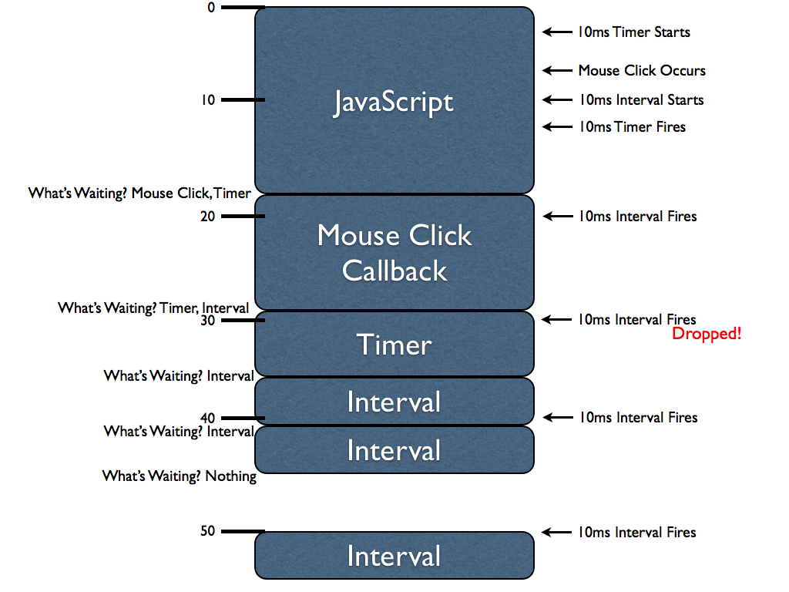

这张图告诉我们以下几个事实:

- 1.事件队列顺序执行

所有进入事件队列里面的函数都是顺序执行的，比如10ms Timer Starts,Mouse Click Occurs,10ms Interval Starts等，先进入到队列里面的往往按顺序先执行。因此当10ms的Timer执行完毕以后，等待在队列里面的只有Mouse Click和10ms的Interval，而鼠标事件先被推入到事件队列，因此会被先执行。但是要注意:图上Mouse Click Callback并不是要等到10ms后才能执行，而是当调用栈空的时候会立即执行。如果在Mouse Click Callback执行的时候10ms Interval时间到了，也要求执行，此时10ms的Interval只有`排队等待`了，而如果Mouse Click Callback执行时间超过了10ms，那么10ms的Interval又要求执行了，那么此时必须注意，10ms Interval根本不会插入，而是会`直接丢掉`，因为事件队列中已经有一个回调函数等待执行了!在图中采用的是30ms的时候,10ms Interval在执行的时候，又要求插入一个新的定时器，这种情况和前面的有一点不同，因为**上次的定时器已经在执行了，因此事件队列中的这个setInterval回调其实已经被移出事件队列了，所以可以继续插入而不是直接drop**(原文你可以[点击这里](https://johnresig.com/blog/how-javascript-timers-work/#postcomment))，这也就意味着，如果此时任务队列为空，那么前一个setInterval回调函数执行后后一个插入的函数就会立即执行，于是所谓的指定间隔执行的**黄金规则**也就打破了。但是该文章是为了告诉我们:队列中最多有一个回调函数等待执行(执行的那个已经不在队列中，而是在调用栈中了)。下面是对setInterval的说明:

<pre>
如果你每次都将setInterval的回调函数推入队列，那么当在执行耗时代码结束后将会有大量的回调函数被同时执行，而他们之间的执行间隔将会非常短。因此，聪明的浏览器会判断当前队列中是否有setInterval的回调函数没有执行完，如果有，那么在它执行完毕之前不会再次插入。
</pre>

- 2.setTimeout至少会延迟指定的时间
比如下面的代码:
```js
setTimeout(function(){
  /* Some long block of code... */
  setTimeout(arguments.callee, 10);
}, 10);
 
setInterval(function(){
  /* Some long block of code... */
}, 10);
```
咋一看两个代码功能是一致的，其实不是的。setTimeout会保证在前面一个回调执行后至少指定的时间才会执行后面的回调(**可多不可少**)。而setInterval是不管前面一个回调的具体执行时间的(同一个setInterval队列中最多1个等待执行的)。

- setTimeout定时器执行时间可能比预期的长
 如果一个定时器在执行的时候被阻塞了，那么它会继续等待`指定的时间`等待执行，因此它的实际执行时间可能比预期的要长。

- setInterval的执行间隔时间可能非常短
 setInterval如果本身的执行时间很长(超过指定的interval间隔)，那么多个回调函数之间可能会间隔很短时间执行(其实只有两个，因为setInterval最多有一个等待执行，注意是`等待`执行，在执行的不算)。

#### 4.如何使得页面的js文件能够并行加载
下面是百度首页并行加载js的图，看到这里我忽然对js并行加载产生了浓厚的兴趣。
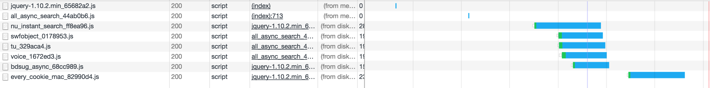

以前的认知是:'如果脚本通过<script type="text/javascript" src=''></script>这种方式加载，它会阻塞页面中处于该标签后面所有资源的加载以及后续页面的渲染，直到脚本加载并执行完成。因此才有了将script内容放到body最后的[最佳实践](http://stevesouders.com/hpws/move-scripts.php)'。后面google到了[stevesouders大神](http://www.stevesouders.com/blog/2009/04/27/loading-scripts-without-blocking/)关于并行加载js文件的系列文章。文中引入了下面的图:

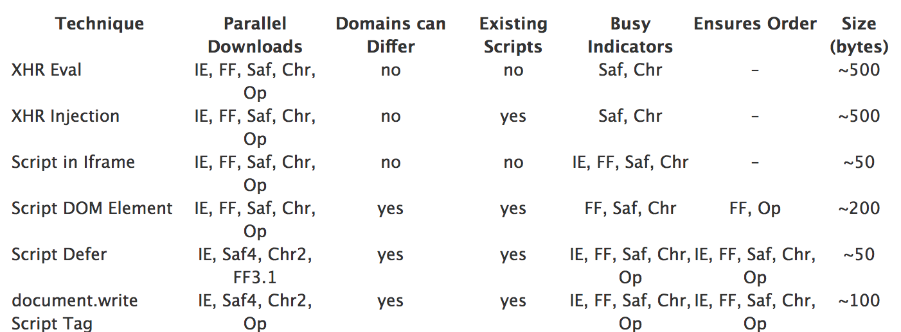

但是文中没有对这个图做细致的区分，所以我在这里作下具体的分析，并提供相应的实例:

##### 4.1 Script in Iframe
iframe和主页面中的其他资源都是并行加载的。因为iframe常用于在页面中加入另一个页面，而该种加载js的方式就是利用了iframe的这种特性。比如下面的代码:
```html
<iframe src='A.html' width=0 height=0 frameborder=0 id=frame1></iframe>
```
这种方式使用A.html而不是A.js，这是必须的，因为iframe默认需要加载一个文档而不是一个js文件。因此你需要将外链的script脚本转换化为HTML文档中的内联脚本(下面使用的iframe是没有src属性的,同时通过iframe加载的js是可以在页面中直接使用的，比如iframe加载jQuery，在页面中可以直接使用$)。和XHR Eval和XHR Injection方式一样，iframe的URL需要和主页面是同源的，因为XSS(Cross-site security)限制JS访问不同源的父文档或者子文档。即使主页面和iframe来源于同一个域，你仍然需要修改你的js来在两个文档之间建立联系。一个方法就是通过frames数组/document.getElementById来访问iframe本身。比如下面的代码:
```js
// access the iframe from the main page using "frames"
window.frames[0].createNewDiv();
// access the iframe from the main page using "getElementById"
document.getElementById('frame1').contentWindow.createNewDiv();
```
而子级iframe通过parent来访问父级页面:
```js
// access the main page from within the iframe using "parent"
function createNewDiv() {
    var newDiv = parent.document.createElement('div');
    parent.document.body.appendChild(newDiv);
}
```
下面再该出完成的实例:

将你的script代码包裹到一个iframe中，然后以iframe的方式进行加载:
```html
<iframe id="frameID" width="200" height="200"></iframe>
```
下面是js部分:
```js
var iframe = document.getElementById('frameID'),
    iframeWin = iframe.contentWindow || iframe,
    iframeDoc = iframe.contentDocument || iframeWin.document;
window.myId = 'parent';
// <1>父级窗口设置myId属性，iframe中无法获取到window.myId的值
//  即iframe脚本的运行上下文与父容器隔离
window.hello = function () {
    alert('hello from owner!');
};
// <4>ready,onload后document.write会重写iframe内容
$(iframeDoc).ready(function (event) {
    iframeDoc.open();
    iframeDoc.write('iframe here');
    iframeDoc.write('\<script>alert("hello from iframe!");\<\/script>');
    iframeDoc.write('\<script>parent.hello();\<\/script>');
    iframeDoc.write('\<script>alert(window.myId);\<\/script>');
    iframeDoc.write('\<script>alert(parent.myId);\<\/script>');
    // <2>iframe无法通过window直接访问父级iframe上的window属性，必须通过parent才行
    iframeDoc.close();
    // <3>通过DOM API互操作，要求iframe与父容器是同域的。 与前面所有DOM操作的注入方式
    // 同样会存在XSS安全问题
});
```
这种情况一般有什么用呢？其实典型的使用场景就是广告，比如第三方提供的广告是一个js文件的情况。因为浏览器一定要把外部的js抓回来并且执行完，才会继续载入网页下面的部分。如果对方放置js 的主机连线速度很慢，就会发生网页载入到一半卡住等对方的情况，因此无法直接把js通过script标签的src引入。

这种情况`最简单`的解决方式就是自己另外写一个网页，把对方提供的<script src=""><\/script>放进去，在侧栏改用<iframe>嵌入自己写的网页。但这个方法的问题就是你要有**网页空间**放置你写的网页。那么有没有办法不用浏览器**等待**把广告的js抓取回来才继续解析后面的网页，同时也不用自己在网页中添加一个广告空间(比如div)来存放自己的内容呢？我们看看下面的方法:

```js
<iframe id="_if1" scrolling="no" style="width : 100%" ><\/iframe>
<script>
  (function() {
    var iframe = document.getElementById('_if1'),
      iframeWin = iframe.contentWindow || iframe ,
      iframDoc = iframeWin.document || iframe.contentDocument;
    iframDoc.write('<html><head></head><body><script src="http://postpet.jp/webmail/blog/clock_v1_moco.js" ></sc' + 'ript></script></body></html>');
    // 1.写入脚本
    if(iframDoc.all) {
      // 3.以前用户判断IE，现在很多浏览器都支持
      var scArr = iframDoc.getElementsByTagName('script'),
        oSc = scArr[scArr.length - 1];  
      // 4.检查一下iframe所有的js是否已经加载完成
      _check();
      return;
      function _check() {
        var rs = oSc.readyState;
        if(rs == 'loaded' || rs == 'complete') {
          iframDoc.close();
          _height();
          return;
        }
        setTimeout(_check, 100);
      }     
    }
    iframeWin.onload = _height;
    // 2.iframe执行了onload以后将它的高度设置为内容的高度
    doc.write('<script> document.close(); </sc' + 'ript>');
    function _height() {
      // 5._height 函式的功用是把iframe 的高度撑到可以显示iframe内所有东西的高度
      iframe.style.height = iframDoc.body.scrollHeight + 'px';
    }
  })();
<\/script>
<script type="text/javascript" src="http://apps.bdimg.com/libs/jquery/1.11.1/jquery.min.js"><\/script>
// 6.即使这里没有加载jquery，通过iframe加载的js也是有jquery的
```
查看[example1](./examples/example1.html),同时在页面中查看瀑布流，你也可以看到页面的js和iframe中的js(第三方广告的js)是并行加载的:

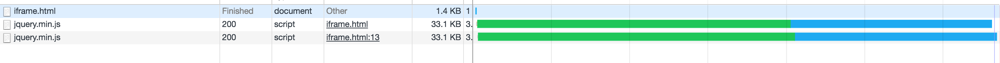

假如第三方广告提供了如下的资源:
```html
<script src="http://www.lucido-l.jp/blogparts/parts.js"><\/script>
```
同时该资源具有writeTag方法，那么我们依然可以采用这个方式来完成第三方资源和网页本身资源的并行加载:

```js
<iframe id="_if2" scrolling="no" style="width : 100%" ></iframe>
<script>
  (function() {
    var oIf = document.getElementById('_if2'),
      win = oIf.contentWindow,
      doc = oIf.contentWindow.document;
    doc.write('<html><head></head><body><script src="http://www.lucido-l.jp/blogparts/parts.js" ></sc' + 'ript>');
    if(doc.all) {
      var scArr = doc.getElementsByTagName('script'),
        oSc = scArr[scArr.length - 1];
      _check();
      return;
      function _check() {
        var rs = oSc.readyState;
        if(rs == 'loaded' || rs == 'complete') {
          doc.write('<script> writeTag(10, 13, 17, 22); </sc' + 'ript><body></html>');
          doc.close();
          _height();
          return;
        }
        setTimeout(_check, 100);
      }
    }
    win.onload = _height;
    doc.write('<script> writeTag(10, 13, 17, 22); document.close(); </sc' + 'ript><body></html>');
    function _height() {
      oIf.style.height = doc.body.scrollHeight + 'px';
    }
  })();
<\/script>
```

如果要嵌入的HTML与这类似，其实将HTML中的doc.write('<html><head></head><body><script src="... src后的网址改掉就可以了。但有个例外，如果载入的js中有再用document.write('<script...')写入其他的script tag ，那么上面的html是有问题的，可以采用下面这种方式来完成:

```js
<iframe id="_if3" scrolling="no" style="width : 100%" ></iframe>
<script>
  (function() {
    var oIf = document.getElementById('_if3'),
      win = oIf.contentWindow,
      doc = oIf.contentWindow.document;
    doc.write('<html><head></head><body><script> google_ad_client = "pub-1821434700708607"; google_ad_slot = "8156194155"; google_ad_width = 200; google_ad_height = 200; </sc' + 'ript><script src="http://pagead2.googlesyndication.com/pagead/show_ads.js"></sc' + 'ript>');
    if(doc.all) {
      // (1)假如我们知道加载的广告完成后会产生一个iframe标签，那么我们可以查看iframe完成否
      var ifArr = doc.getElementsByTagName('iframe');
      _check();
      return;
      function _check() {
        if(ifArr.length) {
          doc.close();
          // (2)关闭iframe文档流
          _height();
          return;
        }
        setTimeout(_check, 100);
      }
    }
    win.onload = _height;
    doc.write('<script> document.close(); </sc' + 'ript><body></html>');
    function _height() {
      oIf.style.height = doc.body.scrollHeight + 'px';
    }
  })();
</script>
```
这里例子的详细说明可以参考[这里](http://blog.xuite.net/vexed/tech/21851083-%E7%94%A8+JavaScript+%E6%8A%8A+script+tag+%E5%A1%9E%E9%80%B2+iframe+%E5%8A%A0%E5%BF%AB%E7%B6%B2%E9%A0%81%E8%BC%89%E5%85%A5%E9%80%9F%E5%BA%A6)  。其实，这个方法不仅仅是js是并行加载的，你仔细查看[实例3](./examples/example3.html)，你会发现，在前面的jquery.js还没有加载完成的情况下，后面的image已经开始加载了，所以说，这种方法根本不会阻塞页面其他资源如image,stylesheet,iframe的同步加载。如下图(每次查看效果记得disable cache，同时查看的是[TTFB](../computer-QA/network-QA.md)):

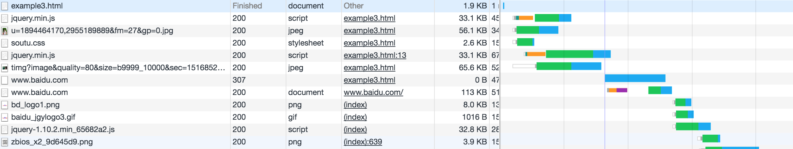

##### 4.2 XHR Eval
该方法的完整实例如下:
```js
var xhrObj = getXHRObject();
xhrObj.onreadystatechange =function() {
        if ( xhrObj.readyState == 4 && 200 == xhrObj.status ) {
            eval(xhrObj.responseText);
        }
};
xhrObj.open('GET', 'A.js', true); 
//和主页面必须是同源的
xhrObj.send('');
function getXHRObject() {
  var xhrObj = false;
  try {
      xhrObj = new XMLHttpRequest();
  }
  catch(e){
      var progid = ['MSXML2.XMLHTTP.5.0', 'MSXML2.XMLHTTP.4.0',
'MSXML2.XMLHTTP.3.0', 'MSXML2.XMLHTTP', 'Microsoft.XMLHTTP'];
      for ( var i=0; i < progid.length; ++i ) {
          try {
              xhrObj = new ActiveXObject(progid[i]);
          }
          catch(e) {
              continue;
          }
          break;
      }
  }
  finally {
      return xhrObj;
  }
}
```
这个方法的明显特点就是**XMLHttpRequest**必须是同源策略。

##### 4.3 XHR Injection
```js
var xhrObj = getXHRObject(); 
// defined in the previous example
xhrObj.onreadystatechange =
  function() {
      if ( xhrObj.readyState == 4 ) {
          var scriptElem = document.createElement('script');
          document.getElementsByTagName('head')[0].appendChild(scriptElem);
          scriptElem.text = xhrObj.responseText;
      }
  };
xhrObj.open('GET', 'A.js', true); 
// must be same domain as main page
xhrObj.send('');
```
XHR Injection和XHR Eval一样使用XMLHttpRequest来获取js文件，但是他的不同之处在于不是使用eval而是通过创建一个script元素插入到DOM中，同时把xhr.responseText的作为script元素的text属性而完成数据加载。但是使用XHR Injection的方式明显要比eval的方法更快!

##### 4.4 Script DOM Element
该方式通过创建一个script元素，同时把src属性设置为一个URL。比如下面的代码:
```js
var scriptElem = document.createElement('script');
scriptElem.src = 'http://anydomain.com/A.js';
document.getElementsByTagName('head')[0].appendChild(scriptElem);
```
通过这种创建script标签的方式不会阻碍其他组件的下载。这种方式可以允许你从另外一个域名加载数据，因为script本身不具有同源特性。

##### 4.5 Script Defer
IE支持script的defer属性，该属性告诉浏览器当前脚本是异步加载的。这在脚本本身没有调用**document.write**，同时也不被其他脚本依赖的情况下很有用。当IE加载defer属性的脚本的时候，其允许其他资源同步加载。
```html
<script defer src='A.js'></script>
```
但是这种方式只在[IE以及高版本的浏览器中](https://caniuse.com/#search=defer)适用。

##### 4.6 document.write Script Tag
这种模式，和script的defer一样，可以在IE中并行加载script资源。该方式虽然可以让js资源并行加载，但是[其他资源在script加载的过程中却仍然是阻塞的](https://www.safaribooksonline.com/library/view/even-faster-web/9780596803773/ch04.html)。(经过在chrome52中的测试结果并不会阻塞其他的资源，详见[例子](./examples/document.write.html))。但是这种方式不能用于加载有依赖关系的资源(百度实例见4.7),用法如下:
```js
document.write("<script type='text/javascript' src='A.js'><\/script>");
```
其中jquery中加载js文件是通过[$.ajax](http://blog.csdn.net/liangklfang/article/details/49638215)来完成的，你可以阅读我的这个文章。

而上面的方法的选择可以参考下面的图:

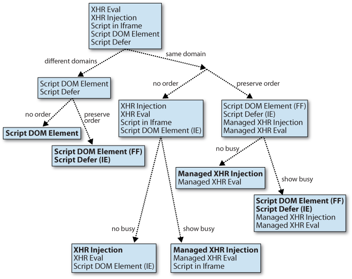


##### 4.7 百度首页并行加载js方式
回到前面百度的例子，那么他是如何实现并行加载的呢?
```js
var s="https://ss1.bdstatic.com/5eN1bjq8AAUYm2zgoY3K/r/www/cache/static/protocol/https/global/js/all_async_search_441981b.js",n="/script";document.write("<script src='"+s+"'><"+n+">")
// 1.通过document.write方法
function(){var e="https://ss1.bdstatic.com/5eN1bjq8AAUYm2zgoY3K/r/www/cache/static/protocol/https/plugins/every_cookie_4644b13.js";("Mac68K"==navigator.platform||"MacPPC"==navigator.platform||"Macintosh"==navigator.platform||"MacIntel"==navigator.platform)&&(e="https://ss1.bdstatic.com/5eN1bjq8AAUYm2zgoY3K/r/www/cache/static/protocol/https/plugins/every_cookie_mac_82990d4.js"),setTimeout(function(){$.ajax({url:e,cache:!0,dataType:"script"})},0)
// 2.通过$.ajax方法加载js脚本。1，2的脚本可以并行加载......
// 3.在上面的all_async_search_441981b.js中又并行加载了下面几个资源
Fe=$.ajax({dataType:"script",cache:!0,url:1===bds.comm.logFlagSug?"https://ss1.bdstatic.com/5eN1bjq8AAUYm2zgoY3K/r/www/cache/static/protocol/https/sug/js/bdsug_async_sam_sug_a97d823.js":"https://ss1.bdstatic.com/5eN1bjq8AAUYm2zgoY3K/r/www/cache/static/protocol/https/sug/js/bdsug_async_68cc989.js"})
// 3.1 通过$.ajax加载
```
所以从整体来说，在百度首页的异步加载js中以document.write与$.ajax居多。其实你仔细看百度首页的瀑布流图:

[瀑布流](./images/jquery.png)

你会发现jquery本身就是同步加载的，而其他的资源却是异步加载的,加载jquery代码的逻辑是:
```html
<script type="text/javascript" src="https://ss1.bdstatic.com/5eN1bjq8AAUYm2zgoY3K/r/www/cache/static/protocol/https/jquery/jquery-1.10.2.min_65682a2.js"></script>
```

##### 4.8 内联脚本和异步加载脚本存在依赖关系的情况
这种情况可以通过以下方式来解决:

(1)window.onload/[Asynchronous Script Loading](http://www.stevesouders.com/blog/2008/12/27/coupling-async-scripts/):内联脚本可以通过监听onload事件来完成，但是这个方式有一个问题就是内联脚本必须等待onload事件触发后才能执行，而不能尽快执行。
```js
window.onload = function(){
 // 异步脚本加载完成后开始执行这里的逻辑
}
```

(2)script的onreadystatechange:内联脚本可以监听onreadystatechange和onload事件(为了兼容所有的浏览器应该实现两个方法)，这种实现代码比较长同时也比较复杂，但是可以保证内联代码可以在异步加载的外链脚本加载完成后尽快执行。比如下面的代码(建议使用jquery的[$.getScript](http://blog.csdn.net/liangklfang/article/details/49638215)):
```js
function loadJS(src, callback) {
    var s = document.createElement('script');
    s.src = src;
    s.async = true;
    s.onreadystatechange = s.onload = function() {
        var state = s.readyState;
        if (!callback.done && (!state || /loaded|complete/.test(state))) {
            callback.done = true;
            callback();
        }
    };
    document.getElementsByTagName('head')[0].appendChild(s);
}
loadJS('/script/script.js', function() { 
  // put your code here to run after script is loaded
});
```
(3)提供回调的方式(和第一种方式类型):修改外链脚本，当它加载完成后通知内联脚本执行特定的回调。如果你可以同时处理外链脚本和内联脚本的情况下这个方式是有效的。
```js
var script = document.createElement('script');
script.src = "sorttable-async.js";
script.text = "sorttable.init()"; 
// 使用text属性需要考虑浏览器的兼容
// this is explained in the next section
document.getElementsByTagName('head')[0].appendChild(script);
```
这种方式有一点需要说明:默认的[sorttable](https://kryogenix.org/code/browser/sorttable/sorttable.js)本身在onload上添加了一个init方法:
```js
window.onload = sorttable.init;
```
这样的话，当外部脚本加载完成后，我们可以通过调用该方法来尽快完成需要的功能。但是这种方式有一个限制:我必须明确知道这个暴露的API是什么？那么有没有更加灵活的方式呢？
(4)Degrading Script Tags

比如下面的代码:
```js
<script src="jquery.js">
jQuery("p").addClass("pretty");
</script>
```
这样内联的脚本必须等待外部的脚本加载完成后才会执行，这种方式有很多优点:首先，我们只需要一个script标签即可;从代码上看,内部脚本依赖于外部脚本是很明显的;更加安全,因为如果外链脚本加载失败，那么内联脚本根本不会执行。这种方式在外部脚本是异步加载的情况下也是适用的，但是我需要同时修改内联的脚本和外链的脚本。对于内联脚本来说，我只需要添加**script.text**属性，对于外链脚本我需要添加下面的代码:
```js
//1.下面是内联的脚本
var script = document.createElement('script');
script.src = "sorttable-async.js";
script.text = "sorttable.init()"; 
// 使用text属性需要考虑浏览器的兼容
document.getElementsByTagName('head')[0].appendChild(script);
//2.下面是需要在外链代码中添加的脚本
var scripts = document.getElementsByTagName("script");
var cntr = scripts.length;
while ( cntr ) {
    var curScript = scripts[cntr-1];
    if ( -1 != curScript.src.indexOf('sorttable-async.js') ) {
        eval( curScript.innerHTML );
        break;
    }
    cntr--;
}
```
这段代码迭代页面中所有的脚本，如果发现sorttable-async.js已经加载在页面中，那么直接执行内部的代码即可，这个实例中就是sorttable.init方法。

##### 4.9 document.write的问题
<pre>
(1)document.write在XHTML中不适用
(2)document.write只有在页面加载(onload之前)的情况下适用，否则会重写整个页面
(3)document.write在遇到的时候就会执行，不能在指定的Node中插入元素
(4)document.write写入的都是序列化的文本，这和操作DOM的方式还是有区别的。容易产生bug
</pre>
但是这种方式对于如Google Analytics来说是最好的。因为他们不用担心该方法会覆盖原有的页面的onload事件，或者想方设法去添加自己的onload事件。因为遇到该脚本后就会异步加载它并执行，而且这种方式浏览器兼容也比较好。
```html
<body>
    <!--[if lte IE 9]>
        <p class="browserupgrade">You are using an <strong>outdated</strong> browser. Please <a href="https://browsehappy.com/">upgrade your browser</a> to improve your experience and security.</p>
    <![endif]-->
    <!-- Add your site or application content here -->
    <p>Hello world! This is HTML5 Boilerplate.</p>
    <script src="js/vendor/modernizr-{{MODERNIZR_VERSION}}.min.js"></script>
    <script src="https://code.jquery.com/jquery-{{JQUERY_VERSION}}.min.js" integrity="{{JQUERY_SRI_HASH}}" crossorigin="anonymous"></script>
     <!--1.采用document.write并行加载资源，但是并不是按顺序执行的。不适用于依赖关系的代码-->
    <script>window.jQuery || document.write('<script src="js/vendor/jquery-{{JQUERY_VERSION}}.min.js"><\/script>')</script>
    <script src="js/plugins.js"></script>
    <script src="js/main.js"></script>
    <!-- Google Analytics: change UA-XXXXX-Y to be your site's ID. -->
    <script>
        window.ga=function(){ga.q.push(arguments)};ga.q=[];ga.l=+new Date;
        ga('create','UA-XXXXX-Y','auto');ga('send','pageview')
    </script>
    <!--2.第三方资源异步加载，并尽可能延迟执行-->
    <script src="https://www.google-analytics.com/analytics.js" async defer></script>
</body>
```
更多讨论你可以[查看这个](https://stackoverflow.com/questions/802854/why-is-document-write-considered-a-bad-practice)讨论。

#### 5.iframe相关内容总结
##### 5.1 iframe创建成本很高
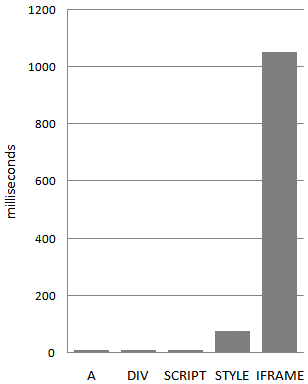

通过上图知道:创建100个不同类型的元素，创建iframe的时间花销是创建如script,style标签的1-2个量级。虽然我们页面中并不会有如此多的iframe，但是从另一方面来说iframe的时间花销确实要比普通元素高得多。

##### 5.2 Iframes阻塞主页面的onload
window的onload方法应该尽快触发，这样浏览器很多与[加载中](https://www.safaribooksonline.com/library/view/even-faster-web/9780596803773/ch04.html)相关的图标就会停止，比如status bar,cursor, tab icon,progress bar等。同时该事件的触发也能让用户知道当前页面已经加载完成，如果onload迟迟未触发就会让用户感觉当前的页面加载缓慢。

window的onload事件必须等到iframe中所有的资源都加载完成才行。在SF和Chrome中，动态设置iframe的src的值能够避免这种阻塞行为。

##### 5.3 和主页面共享连接池
浏览器针对某一个服务器只会打开有限的链接，比如一些老的浏览器，包括[IF6&7](http://www.stevesouders.com/blog/2008/03/20/roundup-on-parallel-connections/),FF2等只会针对一个域名打开两个连接。当然针对新的浏览器比如SF3或者Opera 9+针对一个域名会打开4个连接，而Chrome 1+,,IE 8,FF3会打开[6个连接](chrome://net-internals/#events)。

我们可能期望iframe有自己的连接池，但是现实是残酷的。对于大多数的浏览器两者**共享**同一个连接池，这也就是意味着iframe可能占用所有的可用连接进而阻塞主页面资源的加载。
如果iframe中的资源和主页面中资源同样重要，或者更重要，那么并没有问题，反之就不合理了。当然，这个问题可以通过当重要资源加载完毕后动态设置iframe的src来解决

#### 5.4 iframe跨域通信
对于现代浏览器，postMessage API还是无可撼动的。IE6/7下，使用的是一个被认为是bug或安全漏洞的特性，即navigator对象在父窗口和iframe之间是**共享**的。基于这一点，我们可以在父窗口中，在navigator对象上注册一个消息回调函数；在iframe中，调用navigator上的这个函数并传入参数。此时可看作，iframe往父窗口的一个函数传递了一个参数，并在父窗口的上下文中执行了，那么就相当于iframe向父窗口发送了一条消息。反之亦然。

这种方式的好处也是很明显的：
<pre>
(1)该方案不依赖浏览器的各项设计，不受设置影响，同时完美支持HTTPS
(2)不用创建多余iframe，基于接口调用，不需要轮询，性能大幅提升
(3)良好的接口封装，所有窗口对象统一对待
(4)多iframe也不怕，navigator对象的共享，让iframe之间直接通信成为可能
</pre>
下面是具体的代码:
```js
window.Messenger = (function(){
    // 消息前缀, 建议使用自己的项目名, 避免多项目之间的冲突
    // !注意消息前缀应使用字符串类型
    var prefix = "[PROJECT_NAME]",
        supportPostMessage = 'postMessage' in window;
    // Target 类, 消息对象
    function Target(target, name, prefix){
        var errMsg = '';
        if(arguments.length < 2){
            errMsg = 'target error - target and name are both required';
        } else if (typeof target != 'object'){
            errMsg = 'target error - target itself must be window object';
        } else if (typeof name != 'string'){
            errMsg = 'target error - target name must be string type';
        }
        if(errMsg){
            throw new Error(errMsg);
        }
        this.target = target;
        this.name = name;
        this.prefix = prefix;
    }
    // 往 target 发送消息, 出于安全考虑, 发送消息会带上前缀
    if ( supportPostMessage ){
        // IE8+ 以及现代浏览器支持
        Target.prototype.send = function(msg){
            this.target.postMessage(this.prefix + '|' + this.name + '__Messenger__' + msg, '*');
        };
    } else {
        // 兼容IE 6/7
        Target.prototype.send = function(msg){
          // 主页面注册了事件到window.navigator上，iframe调用send方法时主页面调用
          // window.navigator上的方法
            var targetFunc = window.navigator[this.prefix + this.name];
            if ( typeof targetFunc == 'function' ) {
                targetFunc(this.prefix + msg, window);
            } else {
                throw new Error("target callback function is not defined");
            }
        };
    }
    // 信使类
    // 创建Messenger实例时指定, 必须指定Messenger的名字, (可选)指定项目名, 以避免Mashup类应用中的冲突
    // !注意: 父子页面中projectName必须保持一致, 否则无法匹配
    function Messenger(messengerName, projectName){
        this.targets = {};
        this.name = messengerName;
        this.listenFunc = [];
        this.prefix = projectName || prefix;
        this.initListen();
    }
    // 添加一个消息Target对象
    Messenger.prototype.addTarget = function(target, name){
        var targetObj = new Target(target, name,  this.prefix);
        this.targets[name] = targetObj;
    };
    // 初始化消息监听，IE6&7通过window.navigator绑定事件
    Messenger.prototype.initListen = function(){
        var self = this;
        // 接受到消息的值
        var generalCallback = function(msg){
            if(typeof msg == 'object' && msg.data){
                msg = msg.data;
            }
            var msgPairs = msg.split('__Messenger__');
            var msg = msgPairs[1];
            var pairs = msgPairs[0].split('|');
            var prefix = pairs[0];
            var name = pairs[1];
            for(var i = 0; i < self.listenFunc.length; i++){
                if (prefix + name === self.prefix + self.name) {
                    self.listenFunc[i](msg);
                }
            }
        };
        if ( supportPostMessage ){
            if ( 'addEventListener' in document ) {
                window.addEventListener('message', generalCallback, false);
            } else if ( 'attachEvent' in document ) {
                window.attachEvent('onmessage', generalCallback);
            }
        } else {
            // 兼容IE 6/7
            // window.navigator上绑定回调事件
            window.navigator[this.prefix + this.name] = generalCallback;
        }
    };
    // 监听消息
    Messenger.prototype.listen = function(callback){
        var i = 0;
        var len = this.listenFunc.length;
        var cbIsExist = false;
        for (; i < len; i++) {
            if (this.listenFunc[i] == callback) {
                cbIsExist = true;
                break;
            }
        }
        if (!cbIsExist) {
            this.listenFunc.push(callback);
        }
    };
    // 注销监听
    Messenger.prototype.clear = function(){
        this.listenFunc = [];
    };
    // 广播消息，遍历Target并发送消息
    Messenger.prototype.send = function(msg){
        var targets = this.targets,
            target;
        for(target in targets){
            if(targets.hasOwnProperty(target)){
                targets[target].send(msg);
            }
        }
    };
    return Messenger;
})()
```
#### 5.5 iframe阻塞主页面onload事件的解决方法
[iframe加载性能提升](http://www.aaronpeters.nl/blog/iframe-loading-techniques-performance?utm_source=feedburner&utm_medium=feed&utm_campaign=Feed:+aaronpeters+(Aaron+Peters))的文章指出了好几种提升iframe性能的方法，其中大部分方法的不足在于会阻塞主页面的onload事件，同时会显示资源加载中，使得用户感知网页加载非常慢。比如[这个例子](./examples/dynamic-insert.html)：
```html
<script>
    //doesn't block the load event
  function createIframe(){
    console.log('onload已经触发了');
    //(1) 你会发现页面这句代码，即onload已经早早就触发了
    var i = document.createElement("iframe");
    var a = Math.random() + "";
    var t = a * 10000000000000;
    i.src = "http://1.cuzillion.com/bin/resource.cgi?type=gif&sleep=2&n=1&t=" + t;
    // (2)iframe设置src为图片表示加载图片，产生的DOM结构为:
    // <body style="margin: 0px;"></body>
    // (3)iframe设置为css，那么iframe原样显示css内容
    //  <iframe src="./antd.css"></iframe>
    i.scrolling = "auto";
    i.frameborder = "0";
    i.width = "200px";
    i.height = "100px";
    document.getElementById("test1").appendChild(i);
  };
  //(2)DOMContentLoaded早已经触发了，chrome控制台的蓝线被绘制出来
  if (window.addEventListener)
  window.addEventListener("load", createIframe, false);
  else if (window.attachEvent)
  window.attachEvent("onload", createIframe);
  else window.onload = createIframe;
</script>
````
这个方法的明显之处在于:主页面onload后才创建一个iframe，通过该iframe去加载指定的资源。我们首先看看页面加载的瀑布流:

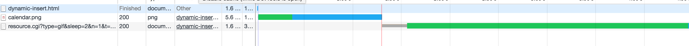

很显然瀑布流也显示onload后才去加载iframe内容。但是该方法有一个明显的不足:Chrome中DOMContentLoaded(蓝色的线)早已显示出来，但是在iframe加载的过程中上面的onload句柄createIframe虽然已经被调用了(打印了log)，但是浏览器的onload线(红线)并没有绘制出来，同时浏览器一直显示有资源在**加载中**的图标。文中最后提供了一个方法：
```js
<script>
(function(d){
  var iframe = d.body.appendChild(d.createElement('iframe')),
  doc = iframe.contentWindow.document;
  // style the iframe with some CSS
  iframe.style.cssText = "position:absolute;width:200px;height:100px;left:0px;";
  doc.open().write('<body onload="' + 
  'var d = document;d.getElementsByTagName(\'head\')[0].' + 
  'appendChild(d.createElement(\'script\')).src' + 
  '=\'\/path\/to\/file\'">');
  doc.close(); 
  //iframe onload event happens
  })(document);
</script>
```
完整的实例代码[点击这里](./examples/dynamic-async.html)，此时我们可以查看瀑布流：

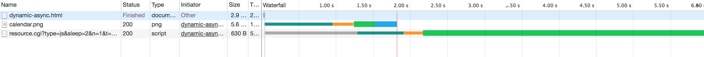

你会发现页面图片早早的下载完了，同时onload也已经触发(但是红线在iframe中资源加载完成后chrome才绘制出来)，页面**不再显示资源加载中**，而js文件在onload后才开始加载。这样的页面会使得用户感觉到明显的速度加快。看到这里是不是幡然醒悟，这不是就前面我说的"Script in Iframe"吗？该js和主页面的内容就是并行加载的，同时也不会阻塞主页面的onload事件。

#### 6.onload事件所有的资源都加载完成了吗


其实蓝线表示DOMContentLoaded，而红线表示onload被触发。那我的问题是:onload触发后所有的资源就已经确定加载完了吗?我认为答案是否，我们看看百度首页的加载瀑布流:

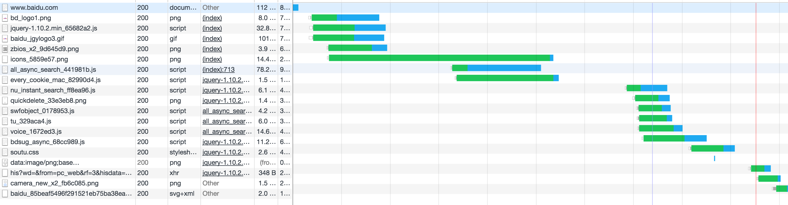

在onload后依然有资源在加载，一般表示使用的是**js动态加载的资源**，而且这些资源并没有阻塞主页面的onload事件(比如上面iframe的onload未阻塞主页面onload的情况)。这些资源加载完成后会造成页面的重绘或者重排。所以，当在网速特别慢的情况下，你会发现页面部分绘制出来的情况。

#### 7.display:none的元素在DOM树中吗?
答案:**在**!如果这个元素本身不在DOM树中，那么通过document.getElementById这种方式来获取它根本就获取不到。但是值得注意的是:该元素并[**不在渲染树中**](../chrome-core/webCore/webkit-render-process.md),渲染树中需要展示的是那些可见的元素，除了display:none以外，比如head等也不会出现在渲染树中。这样，当通过设置display:block让display:none的元素可见的时候，浏览器就需要重新计算每一个元素在页面中的位置，即产生回流reflow操作，因为元素的状态从不在渲染树改成需要出现在渲染树中了。

讲到这里牵涉到了重绘和重排的概念，重排需要[**重新构建RenderObject树**](../chrome-core/webCore/webkit-render-process.md)(可能是DOM树改变或者[CSSOM](https://developers.google.com/web/fundamentals/performance/critical-rendering-path/constructing-the-object-model)，比如display改变了)，然后重新计算改变的元素在窗口中最新的位置，最后将合成的bitmap绘制到后端存储并上传到显存中由显示器进行绘制。而如果是重绘，比如背景色的改变，那么可以省去最新位置的计算，因为元素没有因为尺寸的变化而导致其具体的位置发生变化，这样就减少了更新元素位置从而导致的回流reflow操作。下面是某一个具体的CSSOM树:


其对应的CSS为:
```css
body { font-size: 16px }
p { font-weight: bold }
span { color: red }
p span { display: none }
img { float: right }
```
其HTML结构为:
```html
<html>
  <head>
    <meta name="viewport" content="width=device-width,initial-scale=1">
    <link href="style.css" rel="stylesheet">
    <title>Critical Path</title>
  </head>
  <body>
    <p>Hello <span>web performance</span> students!</p>
    <div></div>
  </body>
</html>
```
你可能会问:CSSOM为何具有树结构？为页面上的任何对象计算最后一组样式时，浏览器都会先从适用于该节点的**最通用规则**开始（例如，如果该节点是body元素的子项，则应用所有body样式），然后通过应用更具体的规则（即规则“向下级联”）以递归方式优化计算的样式。

以上面的 CSSOM 树为例进行更具体的阐述。span标记内包含的任何置于body元素内的文本都将具有16 像素字号，并且颜色为红色 — font-size指令从body向下级联至span。不过，如果某个span 标记是某个段落 (p) 标记的子项，则其内容将不会显示。

还**请注意**，以上树并非完整的CSSOM树，它只显示了我们决定在样式表中替换的样式。每个浏览器都提供一组`默认样式`（也称为“User Agent样式”），即我们不提供任何自定义样式时所看到的样式，我们的样式只是替换这些默认样式。


#### 8.table会导致多余的reflow
http://www.stubbornella.org/content/2009/03/27/reflows-repaints-css-performance-making-your-javascript-slow/

#### 9.层叠上下文
你可以查看前端大佬张鑫旭的[深入理解CSS中的层叠上下文和层叠顺序](http://www.zhangxinxu.com/wordpress/2016/01/understand-css-stacking-context-order-z-index/)文章，通过这个文章，我学到了以下几点:

##### 9.1 层叠上下文的比较
普通元素的层叠水平**优先**由层叠上下文决定,因此,层叠水平的比较只有在当前层叠上下文元素中才有意义。换成好理解一点的例子:A官员家里的管家和B官员家里的管家做PK实际上是没有意义的,因为他们牛不牛逼完全由他们的主子决定的。比如下面的例子:
```html
<div id="horizontal" style="position:relative;display: block; border:2px solid red;z-index:0;">
    
  </div>
<div id="vertical" style="position:relative; border:2px solid blue;z-index:0;">
    
</div>
```
在通过z-index:0创建了层叠上下文的时候，我们不会关心内部img的z-index，因为对他们层叠上下文的比较是没有意义的，他们就像A和B官员家的管家一样，主要受到他们主子也就是div#horizontal,div#vertical的元素决定。

##### 9.2 层叠上下文的创建
###### 9.2.1 **根层叠上下文**
指的是页面根元素，也就是滚动条的默认的始作俑者<html>元素。这就是为什么，绝对定位元素在left/top等值定位的时候，如果没有其他定位元素限制，会相对浏览器窗口定位的原因。

###### 9.2.2 **定位元素与传统层叠上下文**
对于包含有position:relative/position:absolute的定位元素，以及FireFox/IE浏览器（不包括Chrome等webkit内核浏览器）（目前，也就是2016年初是这样）下含有position:fixed声明的定位元素，当其`z-index值不是auto的时候`，会创建层叠上下文。

###### 9.2.3 **CSS3与新时代的层叠上下文**:
下面的CSS3属性都会创建自己的层叠上下文:
<pre>
z-index值不为auto的flex项(父元素display:flex|inline-flex).
元素的opacity值不是1.
元素的transform值不是none.
元素mix-blend-mode值不是normal.
元素的filter值不是none.
元素的isolation值是isolate.
will-change指定的属性值为上面任意一个。
元素的-webkit-overflow-scrolling设为touch.
</pre>

##### 9.3 父子关系与层叠顺序
层叠顺序表示元素发生**层叠时候有着特定的垂直显示顺序**:

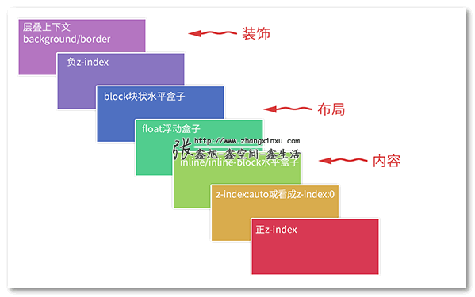

其中关键信息如下:
<pre>
(1)位于最低水平的border/background指的是层叠上下文元素的边框和背景色(比如下例的box > div元素,可能是某一个层叠上下文的父级元素)。每一个层叠顺序规则适用于一个完整的层叠上下文元素。
(2)inline-block和inline水平元素是同等level级别。
(3)z-index:0实际上和z-index:auto单纯从层叠水平上看，是可以看成是一样的。注意这里的措辞——“单纯从层叠水平上看”，实际上，两者在层叠上下文领域有着根本性的差异。因为后者不会创建层叠上下文。
</pre>

既然表示的是发生重叠时候的顺序，那么对于**父子元素**本身也会存在此类情况，比如下面的例子:
```html
<div class="box">
    <div>
      
    </div>
</div>
```
CSS样式为:
```css
.box {  }
.box > div { background-color: blue; z-index: 1; }    
// 绘制顺序可以查看我下面推荐的另外一篇文章:实例一（同一层叠上下文中的时代）
.box > div > img { 
  position: relative; z-index: -1; right: -150px; 
}
```
因为.box>div元素本身并不是层叠上下文元素，它只是一个普通的元素，所以它不会影响内部.box>div>div元素。按照上面的层叠顺序图:**block块状水平盒子(用于布局)>负z-index**的值,所以导致.box>div元素处于.box>div>img元素的上面。而如果将css调整为如下内容:
```css
.box { display: flex; }
.box > div { background-color: blue; z-index: 1; }   
/* 此时该div是层叠上下文元素，同时z-index生效 */
.box > div > img { 
  position: relative; z-index: -1; right: -150px;     
  /* 注意这里是负值z-index */
}
```
因为.box>div是层叠上下文元素，而按照前面的层叠顺序图，最后一层是层叠上下文的背景色/border,然后才是负z-index，继而导致负z-index处于蓝色背景的前面。这里再推荐一个[层叠上下文的文章](http://web.jobbole.com/83409/)。其将上面提到的层叠顺序图通过下面的方式更加细致的讲解出来:
。其将上面提到的层叠顺序图通过下面的方式更加细致的讲解出来:

<pre>
1.创建层叠上下文的元素的背景和边界；
2.z-index为负值的子元素，数值越小越早被绘制；
3.同时满足“in-flow”、“non-inline-level”、“non-positioned”的后代元素；
4.“non-positioned”的浮动元素；
5.满足“in-flow”、“inline-level”、“non-positioned”的后代元素；
6.层叠级数为0的子层叠上下文以及“positioned”且层叠级数为0的后代元素；
7.层叠级数大于等于1的“positioned”子层叠上下文，数值越小越早被绘制；
</pre>

##### 10.事件处理函数中的[passive:true](http://blog.csdn.net/shenlei19911210/article/details/70198771)配置
由于浏览器无法预先知道一个事件处理函数中会不会调用preventDefault()，它需要**等到事件处理函数执行完后，才能去执行默认行为**，然而事件处理函数执行是要耗时的，这样一来就会导致页面卡顿，可以动手试试，比如在事件处理函数里面写一个耗时的循环。

其实passive就是为此而生的。设置了passive:true的情况下，即使滚动事件里面写了一个死循环，浏览器也能够正常处理页面的滑动。在DOM的最新规范中，事件处理函数的第三个参数变成了一个对象:
```js
target.addEventListener(type, listener[, options]);
```
我们可以通过传递passive为true来明确告诉浏览器，事件处理程序不会调用preventDefault来阻止默认滑动行为。此时浏览器就能**快速生成事件(滚动事件)**，从而提升页面性能，而不用等待滚动事件处理完成后才触发。


##### 11.[MessageChannel](http://www.zhangxinxu.com/wordpress/2012/02/html5-web-messaging-cross-document-messaging-channel-messaging/)通道通信

消息通道提供了一个**直接，双向浏览上下文之间**的通信手段。跟跨文档通信一样，DOM不直接暴露。取而代之，管道每端为端口，数据从一个端口发送，另一个变成输入（反之亦然）。消息通道是有用的，**特别是跨多个起源的沟通**。请考虑以下情形：人人网上(http://renren.com)嵌入了一个第三方的游戏页面（通过iframe的形式，如“人人餐厅”），同时，这个第三方的游戏页面(http://game.com)又需要从另外一个通讯录网站(http://address.com)获取用户的通讯信息。咋办？

也就是说通讯录站点要发送信息给游戏站点，根据跨文档通信，我们让父页面作为代理（也就是这里的人人网页面）。然而，这种做法意味着**通讯录站点需要有和人人网页面一样的信任级别**。人人网这个社交站点需要信任每一个请求，或者为我们过滤（应该指：一个一个指定）。但是，使用渠道通信(MessageChannel)，通讯录站点(http://address.com)和游戏站点(http://game.com)可以直接沟通。

主页面的js代码如下:
```js
// 监听从右侧框架传来的信息
window.addEventListener('message', function(evt) {
    if (evt.origin == 'http://www.zhangxinxu.com') {
        if ( evt.ports.length > 0 ) {
            // 将端口转移到其他iframe文档
            window.frames[0].postMessage('端口打开','http://www.zhangxinxu.com', evt.ports);
        }
    }    
}, false);
```

左侧iframe的内容如下:
```js
var eleForm = document.querySelector("form"), port;
eleForm.onsubmit = function() {
    var message = document.querySelector("input[type='text']").value;
    if (port === undefined) {
        alert('信息发送失败，目前没有可用端口！');
    } else {
        port.postMessage(message);
    }
    return false;    
};
window.addEventListener('DOMContentLoaded', function(e) {
    window.addEventListener('message', function(evt) {
        // 扩大端口范围，该iframe接受到port后保存下来用于和其他iframe通信
        if (evt.origin == 'http://www.zhangxinxu.com') {
            port = evt.ports[0];
        } else {
            alert(evt.origin +'这厮我不认识哈！');
        }    
    }, false);
    window.parent.postMessage('发送页加载完毕', 'http://www.zhangxinxu.com');
} ,false);
```

而右侧iframe的代码如下:
```js
var eleBox = document.querySelector("#message");
var messageHandle = function(e) {
    eleBox.innerHTML = '接受到的信息是：' + e.data;
};
window.addEventListener('DOMContentLoaded', function() {
    if (window.MessageChannel) {
        // 创建一个新的 MessageChannel 对象
        var mc = new MessageChannel();
        // 给父级发送一个端口,这个端口会通过父级转发给其他的iframe
        // 进而实现两个iframe之间的直接通信
        window.parent.postMessage('显示页加载完毕','http://www.zhangxinxu.com',[mc.port1]);
        // 接受从其他iframe通过port1发送过来的消息，显示发送的信息
        mc.port2.addEventListener('message', messageHandle, false);
        mc.port2.start();
    } else {
        eleBox.innerHTML = '搞咩乃赛，您的浏览器不支持通道通信。';    
    }
}, false);
```
而其与postMessage的区别如下(来自于[stackoverflow](https://stackoverflow.com/questions/37539941/stuck-in-postmessage-and-messagechannel)):

<pre>
MessageChannel is basically a 2-way communication pipe. Think of it as an alternative to window.postMessage / window.onmessage - but a somewhat easier and more configurable.
</pre>

#### 12.nodejs中process.nextTick如何实现在浏览器中
Nodejs中有一个process.nextTick方法用于在下次事件循环空闲的时候指定某个函数。浏览器端一般都用setTimeout(0)去实现该功能，但是setTimeout(0)并不会立即执行函数，而是依然会等待一定时间。即所谓的setTimeout的4ms延迟。而这可能会导致一定的性能问题。[作者](http://www.nonblocking.io/2011/06/windownexttick.html)使用了在worker，iframe,当前window中postMessag的方法来模拟尽快执行一个函数,最后得到结论:**在当前window中postMessage是模拟process.nextTick的最佳方法**。每一种方式的代码实现如下:
```js
var echoSetTimeout = (function() {
    return function(msg, cb) {
      setTimeout(cb, 0);
    }
  })();
 /**
  * https://www.cnblogs.com/zoho/archive/2012/05/27/2520468.html
  * 利用 W3C 草案中的 Blob，我们有了新的方法来保存本地文件
  *
  * echoWorker(payload.shortString, function resolve() {
  *  deferred.resolve();
  * });
  */
  var echoWorker = (function() {
    var code = 'onmessage = function(e) { postMessage(e.data) };';
    var blobBuilder = window.BlobBuilder || window.WebKitBlobBuilder || window.MozBlobBuilder;
    if(!blobBuilder) {
      return echoSetTimeout;
      // 直接返回setTimeout(0)
    }
    var bb = new (blobBuilder)();
    bb.append(code);
    var blobURL = (window.URL || window.webkitURL || window.mozURL).createObjectURL(bb.getBlob());
    // 得到blockURL类型并创建worker对象
    var worker = new Worker(blobURL);
    // 主页面调用worker.postMessage通知worker，并通过worker.onmessage监听worker发送过来的数据
    return function(msg, cb) {
      worker.onmessage = cb;
      worker.postMessage(msg);
    };
  })();

  /**
   * iframe设置postMessage方式，给iframe传递一个消息并在主页面监听window.onmessage事件
   *
   * 调用方式如下:
   *
   * echoIFramePostMessage(payload.shortString, function resolve() {
   *  deferred.resolve();
   * });
   */
  var echoIFramePostMessage = (function() {
    var iframe = document.createElement('iframe');
    window.onload = function() {
      iframe.style.display = 'none';
      document.body.appendChild(iframe);
      iframe.contentDocument.write('<html><head><script>onmessage = function(e) { e.source.postMessage(e.data, \'*\') };<'+'/script><'+'/head><'+'/html>');
    };
    return function(msg, cb) {
      window.onmessage = cb;
      iframe.contentWindow.postMessage(msg, '*');
    };
  })();
  /**
   * postMessage方式，在当前window上绑定即可
   */
  var echoPostMessage = (function() {
    return function(msg, cb) {
      async = false;
      window.onmessage = cb;
      window.postMessage(msg, '*');
      async = true;
    };
  })();
  var payload = {
    shortString: 'test',
    simple: {
      foo: "bar",
      arr: []
    }
  };
```

#### 13.浏览器中process.nextTick兼容
下面是[Q](https://github.com/kriskowal/q/blob/v1/q.js#L101)这个库实现的process.nextTick，感觉有很多干货、该方法用于在下一次事件循环的时候尽快执行某一个任务:
```js
// Use the fastest possible means to execute a task in a future turn
// of the event loop.
var nextTick =(function () {
    // linked list of tasks (single, with head node)
    var head = {task: void 0, next: null};
    var tail = head;
    var flushing = false;
    var requestTick = void 0;
    var isNodeJS = false;
    // queue for late tasks, used by unhandled rejection tracking
    var laterQueue = [];
    function flush() {
        var task, domain;
        while (head.next) {
            head = head.next;
            task = head.task;
            // task表示当前任务,next表示下一个任务
            head.task = void 0;
            domain = head.domain;
            if (domain) {
                head.domain = void 0;
                domain.enter();
                // 设置活动态的domain
            }
            // head.task和head.domain都会被重置为空
            runSingle(task, domain);
            // 拿着task和head.domain执行runSingle方法
        }
        // 执行指定的对象
        while (laterQueue.length) {
            task = laterQueue.pop();
            runSingle(task);
        }
        flushing = false;
    }
    // runs a single function in the async queue
    // 在异步队列里面执行单个函数
    function runSingle(task, domain) {
        try {
            task();
            // 直接执行某一个task
        } catch (e) {
            if (isNodeJS) {
                // In node, uncaught exceptions are considered fatal errors.
                // Re-throw them synchronously to interrupt flushing!
                // 在Node中，uncaught exceptions是致命错误，同步抛出这个错误，防止继续调用flush方法
                // Ensure continuation if the uncaught exception is suppressed
                // listening "uncaughtException" events (as domains does).
                // Continue in next event to avoid tick recursion.
                if (domain) {
                    domain.exit();
                }
                setTimeout(flush, 0);
                if (domain) {
                    domain.enter();
                }
                throw e;
            } else {
                // In browsers, uncaught exceptions are not fatal.
                // Re-throw them asynchronously to avoid slow-downs.
                // 在浏览器中，uncaught exceptions不是致命的，可以异步抛出这个错误
                setTimeout(function () {
                    throw e;
                }, 0);
            }
        }
        if (domain) {
            domain.exit();
        }
    }
    nextTick = function (task) {
        // tail重新设置它的next值
        tail = tail.next = {
            task: task,
            // 需要执行的task任务
            domain: isNodeJS && process.domain,
            // 当前活动态的domain，用于捕捉异常
            next: null
        };
         // 如果不处于flushing状态，调用requestTick，其实就是最新的方式调用flush方法
        if (!flushing) {
            flushing = true;
            requestTick();
        }
    };
    if (typeof process === "object" &&
        process.toString() === "[object process]" && process.nextTick) {
        // 保证Q是真实的运行在Node环境中的，而且是存在process.nextTick方法的，下面是查找非真实的Node环境:
        //(1)Mocha的测试:process全局变量是不存在nextTick的
        //(2)Browserify测试:通过setTimeout的方式实现了一个process.nextTick,此时setImmediate要早于setTimeout
        //   同时Browserify的`process.toString()`是`[object Object]`而真实的Node环境中输出的是`[object process]`
        // * Browserify - exposes a `process.nexTick` function that uses
        isNodeJS = true;
        // 是在Nodejs执行环境中
        requestTick = function () {
            process.nextTick(flush);
        };
    } else if (typeof setImmediate === "function") {
        // In IE10, Node.js 0.9+, or https://github.com/NobleJS/setImmediate
        // 通过MessageChannel,postMessage,onreadystatechange使得脚本比setTimeout(0)更加高效的执行
        // In a manner that is typically more efficient and consumes less power than the usual setTimeout(..., 0) pattern
        if (typeof window !== "undefined") {
            requestTick = setImmediate.bind(window, flush);
        } else {
            requestTick = function () {
                setImmediate(flush);
            };
        }
    } else if (typeof MessageChannel !== "undefined") {
        // 测试结果是在在当前页面postMessage的函数最快执行(比iframe等都快)
        // http://www.nonblocking.io/2011/06/windownexttick.html
        // https://jsperf.com/postmessage
        var channel = new MessageChannel();
        // At least Safari Version 6.0.5 (8536.30.1) intermittently(间歇性的) cannot create
        // working message ports the first time a page loads.
        // 监听onmessage并初次调用flush方法
        channel.port1.onmessage = function () {
            requestTick = requestPortTick;
            channel.port1.onmessage = flush;
            flush();
        };
        var requestPortTick = function () {
            // Opera requires us to provide a message payload, regardless of
            // whether we use it.
            // Opera要求我们首次调用postMessage方法并提供一个参数，不管我们是否使用它
            channel.port2.postMessage(0);
        };
        requestTick = function () {
            setTimeout(flush, 0);
            // setTimeout(0)期间channel.port1.onmessage可能已经触发，此时requestTick已经被重置为空
            //  channel.port1.onmessage = flush调用flush方法
            requestPortTick();
        };
    } else {
        // old browsers
        // 老版本的浏览器直接调用setTimeout(0)执行代码
        requestTick = function () {
            setTimeout(flush, 0);
        };
    }
    // runs a task after all other tasks have been run
    // this is useful for unhandled rejection tracking that needs to happen
    // after all `then`d tasks have been run.
    // 当所有的task已经执行完毕后再执行该task，其常用于追踪unhandled rejection，这些unhandled rejection
    // 当所有的then指定的microtask执行完毕以后调用
    nextTick.runAfter = function (task) {
        laterQueue.push(task);
        if (!flushing) {
            flushing = true;
            requestTick();
        }
    };
    // nextTick的runAfter方法模拟microtask
    return nextTick;
})();
```
关于domain模块的使用你可以[查看这里](../others/nodejs-QA/node-core/domain.md)

#### 15.postMessage与macrotask


参考资料:

[defer和async的区别](https://segmentfault.com/q/1010000000640869)

[How JavaScript Timers Work](https://johnresig.com/blog/how-javascript-timers-work/#postcomment)

[你真的了解setTimeout和setInterval吗？](http://qingbob.com/difference-between-settimeout-setinterval/)

[为Iframe注入脚本的不同方式比较](http://harttle.land/2016/04/14/iframe-script-injection.html)

[用JavaScript把script tag塞进iframe加快网页载入速度](http://blog.xuite.net/vexed/tech/21851083-%E7%94%A8+JavaScript+%E6%8A%8A+script+tag+%E5%A1%9E%E9%80%B2+iframe+%E5%8A%A0%E5%BF%AB%E7%B6%B2%E9%A0%81%E8%BC%89%E5%85%A5%E9%80%9F%E5%BA%A6)

[Chapter 4. Loading Scripts Without Blocking](https://www.safaribooksonline.com/library/view/even-faster-web/9780596803773/ch04.html)

[Loading Scripts Without Blocking](http://www.stevesouders.com/blog/2009/04/27/loading-scripts-without-blocking/)

[Coupling asynchronous scripts](http://www.stevesouders.com/blog/2008/12/27/coupling-async-scripts/)

[Why is document.write considered a “bad practice”?](https://stackoverflow.com/questions/802854/why-is-document-write-considered-a-bad-practice)

[why-use-document-write](https://stackoverflow.com/questions/556322/why-use-document-write
)

[Using Iframes Sparingly](https://www.stevesouders.com/blog/2009/06/03/using-iframes-sparingly/)

[Roundup on Parallel Connections](http://www.stevesouders.com/blog/2008/03/20/roundup-on-parallel-connections/)

[iframe跨域通信的通用解决方案-第二弹!（终极解决方案）](http://www.alloyteam.com/2013/11/the-second-version-universal-solution-iframe-cross-domain-communication/)

[跨文档通信解决方案](https://github.com/biqing/MessengerJS)

[Iframe loading techniques and performance](http://www.aaronpeters.nl/blog/iframe-loading-techniques-performance?utm_source=feedburner&utm_medium=feed&utm_campaign=Feed:+aaronpeters+(Aaron+Peters))

[DOMContentLoaded与load的区别](https://www.cnblogs.com/caizhenbo/p/6679478.html)

[Measuring First Paint Time in Chrome](http://www.tuanhuynh.com/blog/2015/measuring-first-paint-time-in-chrome/)

[前端性能——监控起步](https://www.cnblogs.com/chuaWeb/p/PerformanceMonitoring.html)

[利用performance统计网站的加载新能](https://www.jianshu.com/p/5f3968a5e7ee)

[层叠上下文 Stacking Context](http://web.jobbole.com/83409/)

[移动端Web界面滚动性能优化: Passive event listeners](http://blog.csdn.net/shenlei19911210/article/details/70198771)

[HTML5 postMessage iframe跨域web通信简介](http://www.zhangxinxu.com/wordpress/2012/02/html5-web-messaging-cross-document-messaging-channel-messaging/)

[Messing with MessageChannel](https://blog.humphd.org/messing-with-messagechannel/)

[NonBlocking.io - Malte Ubl's Asynchronous Identity Disorder](http://www.nonblocking.io/2011/06/windownexttick.html)

[setImmediate.js](https://github.com/YuzuJS/setImmediate)
