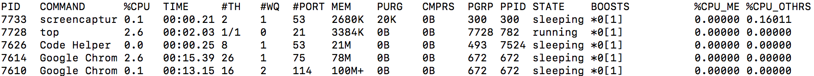

#### 1.vscode运行时候code helper导致mac的cpu占用很高？
你可以运行下面的命令:
```shell
top
#或者下面的命令来查看资源占用情况
#ps aux | grep PID
```
如下面就是ps输出的内容:
<pre>
USER PID  %CPU %MEM      VSZ    RSS   TT  STAT STARTED      TIME COMMAND
ql   7713   0.0  0.0  2432804   1408 s000  R+   10:04下午   0:00.00 grep PID
</pre>

而下面就是top命令输出的内容:


很显然后者输出的内容更加丰富。其中解决方法也是很简单的:"code"=>"首选项"=>"设置"，此时你会看到当前的编辑器设置的内容如下:
```text
 // 配置 glob 模式以排除文件和文件夹。
  "files.exclude": {
    "**/.git": true,
    "**/.svn": true,
    "**/.hg": true,
    "**/CVS": true,
    "**/.DS_Store": true
  },

  //配置文件路径的 glob 模式以从文件监视排除。模式必须在绝对路径上匹配(例如 ** 前缀或完整路径需正确匹配)。更改此设置需要重启。如果在启动时遇到 Code 消耗大量 CPU 时间，则可以排除大型文件夹以减少初始加载。
  "files.watcherExclude": {
    "**/.git/objects/**": true,
    "**/.git/subtree-cache/**": true,
    "**/node_modules/**": true
  },
```
于是你可以添加自己的设置去覆盖它，如排除node_modules,bower_components的文件夹监听等:
```text
"files.exclude": {
        "**/.git": true,
        "**/.svn": true,
        "**/.hg": true,
        "**/CVS": true,
        "**/.DS_Store": true,
        "**/tmp": true,
        "**/node_modules": true,
        "**/bower_components": true,
        "**/dist": true
    },
    "files.watcherExclude": {
        "**/.git/objects/**": true,
        "**/.git/subtree-cache/**": true,
        "**/node_modules/**": true,
        "**/tmp/**": true,
        "**/bower_components/**": true,
        "**/dist/**": true
    }
```
其中*watcherExclude*如果包含了node_modules，也会监听node_modules目录，然后比如自动美化代码等都会大量占用于对该文件夹的监听~~。更多shell命令使用请查看[前端工程师的shell命令集合](https://github.com/liangklfangl/shellGlobStar)


参考资料:

[vscode占用内存过高的情况](https://github.com/Microsoft/vscode/issues/11963)
