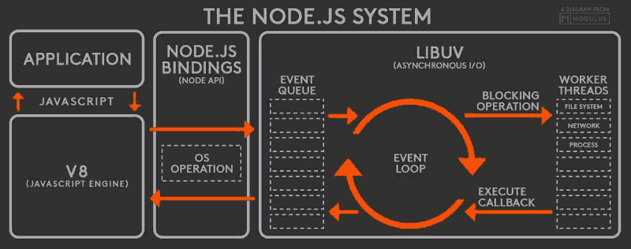
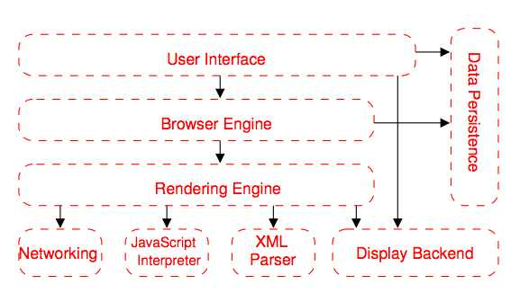
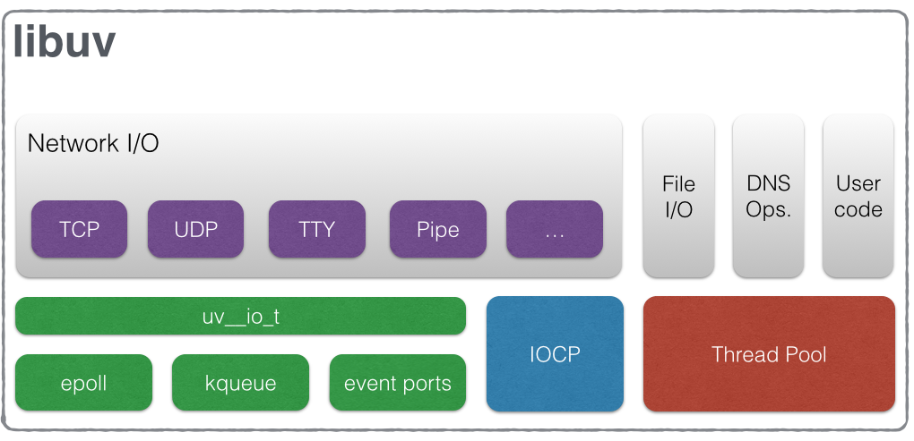

#### nodejs如何处理CPU密集型任务
大多数网站的服务器端都不会做太多的计算，它们只是接收请求，交给其它服务（比如文件系统或数据库），然后等着结果返回再发给客户端。所以聪明的Node.js针对这一事实采用了第二种策略，它不会为每个接入请求繁衍出一个线程，而是用一个主线程处理所有请求。`避开了`创建、销毁线程以及在线程间切换所需的开销和复杂性。这个主线程是一个非常快速的event loop，它接收请求，把需要长时间处理的操作交出去，然后继续接收新的请求，服务其他用户。下图描绘了Node.js程序的请求处理流程：


主线程event loop收到客户端的请求后，将*请求对象*、*响应对象*以及*回调函数*交给与请求对应的函数处理。这个函数可以将需要长期运行的I/O或本地API调用交给内部线程池处理，在线程池中的线程处理完后，通过回调函数将结果返回给主线程，然后由主线程将响应发送给客户端。那么event loop是如何实现这一流程的呢？这要归功于Node.js平台的V8引擎和libuv。

#### nodejs中同步与异步，阻塞和非阻塞
##### (1) 同步与异步(*指令执行顺序*)

同步和异步关注的是消息通信机制 (synchronous communication/ asynchronous communication)所谓同步，就是在发出一个*调用*时，在没有得到结果之前，该*调用*就不返回。但是一旦调用返回，就得到返回值了。换句话说，就是由*调用者主动等待这个调用的结果*。而异步则是相反，*调用*在发出之后，这个调用就直接返回了，所以没有返回结果。换句话说，当一个异步过程调用发出后，调用者不会立刻得到结果。而是在*调用*发出后，*被调用者通过状态、通知来通知调用者，或通过回调函数处理这个调用*。典型的异步编程模型比如Node.js:

举个通俗的例子：你打电话问书店老板有没有《分布式系统》这本书，如果是同步通信机制，书店老板会说，你稍等，”我查一下"，然后开始查啊查，等查好了（可能是5秒，也可能是一天）告诉你结果（返回结果）。而异步通信机制，书店老板直接告诉你我查一下啊，查好了打电话给你，然后直接挂电话了（不返回结果）。然后查好了，他会主动打电话给你。在这里老板通过“回电”这种方式来回调。异步的方式在平时情况还是很多的，比如典型的Promise调用:
```js
  Promise.all([getPersonDrawResult, getLotteryCount])
          .then(values => {})
          .catch(err => {
          });
  console.log('接口请求已经发送出去了!');
```
你会发现，我们的程序不会等待两个接口请求的返回值，而是直接返回，继续运行下面的代码。而当我们的网络I/O结束后，nodejs会通过*事件循环*通知主线程去执行回调。这种异步的方式在nodejs中非常常见，比如文件操作等等，但是对于异步有一点要注意：*我们的所有回调函数都是串行执行的，即如果一个回调函数耗时太长，那么后续的回调函数也是需要等待的*。而同步的方式也比较容易理解，比如函数调用:
```js
function blockFunc(){
  for(let i=0;i<10000;i++){
     console.log(i);
  }
}
blockFunc();
console.log('end');
```
这里当我们的blockFunc函数没有执行结束之前，我们的*end*是不会打印出来的，这就是同步的情况!

##### (2) 阻塞与非阻塞(*线程与进程*)

阻塞和非阻塞关注的是程序在等待调用结果（消息，返回值）时的状态.阻塞调用是指调用结果返回之前，当前线程会被挂起。调用线程只有在得到结果之后才会返回。非阻塞调用指在不能立刻得到结果之前，该调用不会阻塞当前线程。

还是上面的例子，你打电话问书店老板有没有《分布式系统》这本书，你如果是阻塞式调用，你会一直把自己“挂起”，直到得到这本书有没有的结果，如果是非阻塞式调用，你不管老板有没有告诉你，你自己先一边去玩了， 当然你也要偶尔过几分钟check一下老板有没有返回结果。在这里阻塞与非阻塞与是否同步异步无关。跟老板通过什么方式回答你结果无关。

本段内容参考自[怎样理解阻塞非阻塞与同步异步的区别？](https://www.zhihu.com/question/19732473)。总之，同步与异步一个是主动等待结果，而另一个是等待别人通知;而阻塞与非阻塞一个表示是否影响当前线程!


参考来自[阻塞非阻塞与同步异步区别](http://originlee.com/2015/04/18/difference-between-block-nonblock-and-sync-async/)

#### nodejs中回调函数是否是阻塞的
Node.js中的回调函数一般是指异步操作完成之后调用的函数。基于异步事件模型的Node.js大致是这样运行的:

1.向Node.js提交异步操作，比如建立网络连接，读取网络流数据，向文件写入数据，请求数据库服务等，同时针对这些异步操作注册回调函数。这些异步操作会提交给IO线程池或者工作线程池。

2.在线程池中，操作是并发的执行，也就是读网络流和向文件写数据，或者请求数据库服务都是并发的（可能是这样子的，具体的操作怎么完成，是node的事） ，执行完毕后会将就绪事件放入完成队列中。

3.Node.js 在提交完操作请求之后，进入循环(或叫事件循环吧)。循环的过程如下： 

a. 检查有没有计时器超时(setTimeout/setInterval)   

b. 检查当前是否为空闲状态，执行空闲任务(process.nextTick)   

c. 检查IO完成队列（各种网络流读写、文件读写、标准输入输出上的事件都会进入这个队列）是否有就绪事件，       若完成队列中有就绪事件，就把队列里的所有事件（可能有多个操作已经完成）信息都取出来，对这些事件信息，挨个地调用与其相关的回调函数。这个过程是同步的，执行“写数据完成”事件的回调函数完成之后，才会去调用“读到网络数据”事件的回调函数；       若是队列中没有就绪事件，而且没有空闲(idle)任务，就会做一段时间的等待（线程被阻塞在此处），等待的超时时间由计时器周期决定。（不能因为等待而耽误timer和idle的事件处理）。  

d. 进入下一轮循环。从上面这个过程可以看出，你脚本中注册的所有回调函数都是在这个循环过程中被`依次`调用的。若有一个回调函数执行大的计算任务，很长时间不返回的话，就会让整个循环停顿下来，其它回调函数就不能在事件到来时即时被回调。因此，建议长任务处理过程中，即时将剩下的处理通过`process.nextTick`丢入下一轮循环中有idle事件中，或者process.spawn一个进程来执行。总之，`除了你的代码是同步执行的以外，其它所有的事情都是并发的`。

#### Node.js中的I/O操作指的是什么
解答：I/O操作包括读写操作、输入输出(硬盘等)、请求响应(网络)等等。

#### for循环里面使用异步调用
```js
var fs = require('fs');
var files = ['a.txt','b.txt','c.txt'];
for(var i=0; i < files.length; i++) {
    //读取文件是异步操作的
    fs.readFile(files[i], 'utf-8', function(err, contents) {
        console.log(files[i] + ': ' + contents);
    });
}
```
假设这三个文件的内容分别为：AAA、BBB、CCC，我们得到的结果是:
<pre>
undefined: AAA
undefined: BBB
undefined: CCC
</pre>

fs.readFile的回调函数中访问到的i值都是循环结束后的值，因此files[i]的值为undefined。可以通过闭包来完成包装，或者通过如下的方式:
```js
var fs = require('fs');
var files = ['a.txt', 'b.txt', 'c.txt'];
files.forEach(function(filename) {
    fs.readFile(filename, 'utf-8', function(err, contents) {
        console.log(filename + ': ' + contents);
    });
});
```
详见[node.js在遇到“循环+异步”时的注意事项](http://blog.csdn.net/fangjian1204/article/details/50585073)

#### Nodejs中的yield顺序执行(for循环中的yield命令)
```js
var co = require('co');
var fs = require('fs');
var readFile = function (fileName){
  return new Promise(function (resolve, reject){
    fs.readFile(fileName, function(error, data){
      if (error) reject(error);
       resolve(data);
    });
  });
};
const fileNames = ['./folder/1.txt','./folder/2.txt','./folder/3.txt'];
co(function*(){
    for(let i=0;i<3;i++){
        var a = yield readFile(fileNames[i]);
        //按顺序读取文件内容
        console.log(a.toString());
    }
})
```
此时你会发现三个文件中的内容是按顺序输出的,而且因为是co自动执行了Generator函数，他会将yield后文件读取的内容直接赋值给前面的变量，从而我们可以在后面的代码中直接打印文件的内容。总之:

Generator函数是协程在ES6的实现，最大特点就是可以交出函数的执行权（读取一个文件后没有返回结果时候暂停执行）。Generator 函数可以*暂停执行和恢复执行(等待请求完成后再恢复执行)*，这是它能封装异步任务的根本原因。除此之外，它还有两个特性，使它可以作为异步编程的完整解决方案：函数体内外的数据交换和错误处理机制。 next 方法返回值的 value 属性，是 Generator 函数向外输出数据；next 方法还可以接受参数，这是向 Generator函数体内输入数据。详见[Generator与其他异步处理方案](https://github.com/liangklfangl/react-article-bucket/tree/master/async-programing)

#### 异步情况必须弄懂的事件循环
注意：下面内容原文摘自[JavaScript 运行机制详解：再谈Event Loop](http://www.ruanyifeng.com/blog/2014/10/event-loop.html)
##### (1)同步任务与异步任务
所有任务可以分成两种，一种是同步任务（synchronous），另一种是异步任务（asynchronous）。同步任务指的是，在*主线程*上排队执行的任务，只有前一个任务执行完毕，才能执行后一个任务；异步任务指的是，不进入主线程、而进入"任务队列"（task queue）的任务，只有"任务队列"通知主线程，某个异步任务可以执行了，该任务才会进入主线程执行。异步执行的机制如下:

<pre>
（1）所有同步任务都在主线程上执行，形成一个执行栈（execution context stack）。
（2）主线程之外，还存在一个"任务队列"（task queue）。只要异步任务有了运行结果，就在"任务队列"之中放置一个事件。
（3）一旦"执行栈"中的所有同步任务执行完毕，系统就会读取"任务队列"，看看里面有哪些事件。那些对应的异步任务，于是结束等待状态，进入执行栈，开始执行。
（4）主线程不断重复上面的第三步。
</pre>

如下图,只要主线程空了，就会去读取"任务队列"，这就是JavaScript的运行机制。这个过程会不断重复。


##### (2)事件进入任务队列等待主线程读取
"任务队列"是一个事件的队列（也可以理解成*消息的队列*），I/O设备完成一项任务，就在"任务队列"中*添加一个事件*，表示相关的异步任务可以进入"执行栈"了。主线程读取"任务队列"，就是读取里面有哪些事件。
"任务队列"中的事件，除了I/O设备的事件以外，还包括一些用户产生的事件（比如鼠标点击、页面滚动等等）。只要*指定过*回调函数，这些*事件发生时就会进入"任务队列"，等待主线程读取*。
所谓"回调函数"（callback），就是那些会被主线程挂起来的代码。异步任务必须指定回调函数，当主线程开始执行异步任务，就是执行对应的回调函数。
"任务队列"是一个先进先出的数据结构，排在前面的事件，优先被主线程读取。主线程的读取过程基本上是自动的，只要*执行栈(同步代码)*一清空，"任务队列"上第一位的事件就自动进入主线程。但是，由于存在后文提到的"定时器"功能，主线程首先要检查一下执行时间，某些事件只有到了规定的时间，才能返回主线程。

##### (3)Event Loop
主线程从"任务队列"中读取事件，这个过程是循环不断的，所以整个的这种运行机制又称为Event Loop（事件循环）。比如下图:


上图中，主线程运行的时候，产生堆（heap）和栈（stack），栈中的代码*调用各种外部API*，它们在"任务队列"中加入各种事件（click，load，done）。只要栈中的代码执行完毕，主线程就会去读取"任务队列"，依次执行那些事件所对应的回调函数。
执行栈中的代码（同步任务），总是在读取"任务队列"（异步任务）之前执行。请看下面这个例子。
```js
 var req = new XMLHttpRequest();
  req.open('GET', url);    
  req.onload = function (){};    
  req.onerror = function (){};    
  req.send();
```
上面代码中的req.send方法是Ajax操作向服务器发送数据，它是一个异步任务，意味着只有当前脚本的所有代码执行完，系统才会去读取"任务队列"。所以，它与下面的写法等价:
```js
  var req = new XMLHttpRequest();
  req.open('GET', url);
  req.send();
  req.onload = function (){};    
  req.onerror = function (){};   
```
也就是说，指定回调函数的部分（onload和onerror），在send()方法的前面或后面无关紧要，因为它们属于执行栈的一部分，系统总是执行完它们，才会去读取"任务队列"。

##### (4)异步任务与定时器
除了放置异步任务的事件，"任务队列"还可以放置*定时事件*，即指定某些代码在多少时间之后执行。这叫做"定时器"（timer）功能，也就是定时执行的代码。
定时器功能主要由setTimeout()和setInterval()这两个函数来完成，它们的内部运行机制完全一样，区别在于前者指定的代码是一次性执行，后者则为反复执行。以下主要讨论setTimeout()。
setTimeout()接受两个参数，第一个是回调函数，第二个是推迟执行的毫秒数。
```js
console.log(1);
setTimeout(function(){console.log(2);},1000);
console.log(3);
```
上面代码的执行结果是1，3，2，因为setTimeout()将第二行推迟到1000毫秒之后执行。
如果将setTimeout()的第二个参数设为0，就表示当前代码执行完（注意这里表示:`执行栈`清空）以后，立即执行（0毫秒间隔）指定的回调函数。
```js
setTimeout(function(){console.log(1);}, 0);
console.log(2);
```
上面代码的执行结果总是2，1，因为只有在执行完第二行以后，系统才会去执行"任务队列"中的回调函数。
总之，setTimeout(fn,0)的含义是，指定某个任务在*主线程最早可得的空闲时间*执行，也就是说，尽可能早得执行。它在"任务队列"的尾部添加一个事件，因此要等到*同步任务*和*"任务队列"现有的事件*都处理完，才会得到执行。

HTML5标准规定了setTimeout()的第二个参数的最小值（最短间隔），不得低于4毫秒，如果低于这个值，就会`自动增加`。在此之前，老版本的浏览器都将最短间隔设为`10`毫秒。另外，对于那些DOM的变动（尤其是涉及页面重新渲染的部分），通常不会立即执行，而是每16毫秒执行一次。这时使用requestAnimationFrame()的效果要好于setTimeout()。
需要注意的是，setTimeout()只是将事件插入了"任务队列"，必须等到当前代码（*执行栈*）执行完，主线程才会去执行它指定的回调函数。要是当前代码耗时很长，有可能要等很久，所以并没有办法保证，回调函数一定会在setTimeout()指定的时间执行。

##### (5)nodejs中的事件循环与异步非阻塞I/O
如下图:



根据上图，Node.js的运行机制如下。
<pre>
（1）V8引擎解析JavaScript脚本。
（2）解析后的代码，调用Node API。
（3）libuv库负责Node API的执行。它将不同的任务分配给不同的"线程"，形成一个Event
    Loop（事件循环），以异步(异步I/O由此而来)的方式将任务的执行结果返回给V8引擎。
（4）V8引擎再将结果返回给用户。
</pre>

除了setTimeout和setInterval这两个方法，Node.js还提供了另外两个与"任务队列"有关的方法：process.nextTick和setImmediate。它们可以帮助我们加深对"任务队列"的理解。

process.nextTick方法可以在*当前"执行栈"的尾部*----下一次Event Loop（*主线程读取"任务队列"*）之前----触发回调函数。也就是说，它指定的任务总是发生在所有异步任务之`前`。setImmediate方法则是在当前"任务队列"的尾部添加事件，也就是说，它指定的任务总是在`下一次Event Loop时执行`，这与setTimeout(fn, 0)很像。请看下面的例子:
```js
process.nextTick(function A() {
  console.log(1);
  process.nextTick(function B(){console.log(2);});
});
setTimeout(function timeout() {
  console.log('TIMEOUT FIRED');
}, 0)
// 1
// 2
// TIMEOUT FIRED
```
上面代码中，由于process.nextTick方法指定的回调函数，总是在当前"执行栈"的尾部触发，所以不仅函数A比setTimeout指定的回调函数timeout先执行，而且函数B也比timeout先执行。这说明，如果有多个process.nextTick语句（`不管它们是否嵌套`），将全部在当前"执行栈"执行。现在，再看setImmediate。
```js
setImmediate(function A() {
  console.log(1);
  setImmediate(function B(){console.log(2);});
});

setTimeout(function timeout() {
  console.log('TIMEOUT FIRED');
}, 0);
```
上面代码中，setImmediate与setTimeout(fn,0)各自添加了一个回调函数A和timeout，都是在下一次Event Loop触发。那么，哪个回调函数先执行呢？答案是不确定。运行结果可能是1--TIMEOUT FIRED--2，也可能是TIMEOUT FIRED--1--2。
令人困惑的是，Node.js文档中称，setImmediate指定的回调函数，总是排在setTimeout前面。实际上，这种情况只发生在递归调用的时候。
```js
setImmediate(function (){
  setImmediate(function A() {
    console.log(1);
    setImmediate(function B(){console.log(2);});
  });
  setTimeout(function timeout() {
    console.log('TIMEOUT FIRED');
  }, 0);
});
// 1
// TIMEOUT FIRED
// 2
```
上面代码中，setImmediate和setTimeout被封装在一个setImmediate里面，它的运行结果总是1--TIMEOUT FIRED--2，这时函数A一定在timeout前面触发。至于2排在TIMEOUT FIRED的后面（即函数B在timeout后面触发），是因为setImmediate总是将事件注册到下一轮Event Loop，所以函数A和timeout是在同一轮Loop执行，而函数B在下一轮Loop执行。
我们由此得到了process.nextTick和setImmediate的一个重要区别：多个process.nextTick语句总是在当前"执行栈"一次执行完，多个setImmediate可能则需要多次loop才能执行完。事实上，这正是Node.js 10.0版添加setImmediate方法的原因，否则像下面这样的递归调用process.nextTick，将会没完没了，主线程根本不会去读取"事件队列"！
```js
process.nextTick(function foo() {
  process.nextTick(foo);
});
```
事实上，现在要是你写出递归的process.nextTick，Node.js会抛出一个警告，要求你改成setImmediate。另外，由于process.nextTick指定的回调函数是在本次"事件循环"触发，而setImmediate指定的是在下次"事件循环"触发，所以很显然，前者总是比后者发生得早，而且执行效率也高（因为不用检查"任务队列"）。


#### Node.js中yield\*与yield的区别
首先要注意:我们的return语句不会消耗一次*next调用*比如下面的例子:
```js
function* outer(){
    yield 'begin';
    var ret = yield* inner();
    console.log(ret);
    yield 'end';
}

function * inner(){
    yield 'inner';
    return 'return from inner';
}
var it = outer(),v;
v = it.next().value;
console.log(v);
v = it.next().value;
//这里是第二次调用next方法，返回`inner`
console.log(v);
v = it.next().value;
//这里是第三次调用next方法，*inner这个generator函数直接返回了，而把这次next调用作用到了outer这个generator函数上
console.log(v)
```
即第三次调用next方法，\*inner这个generator函数直接返回了，而把这次next调用作用到了outer这个generator函数上，从而"end"也被打印出来。打印的结果如下:
<pre>
begin
inner
return from inner
end   
</pre>

下面讲解下yield和yield\*的不同,给出下面的例子:
```js
function* outer(){
    yield 'begin';
    yield inner();
    //这里直接调用Generator函数相当于是返回一个Generator指针
    yield 'end';
}
function* inner(){
    yield 'inner';
}
var it = outer(),v;
v= it.next().value;
console.log(v);
v= it.next().value;
//此时第二次调用next方法直接得到调用inner()的返回值
console.log(v);
console.log(v.toString());
v = it.next().value;
console.log(v);
```
打印的结果如下:
<pre>
1.begin
2.inner {[[GeneratorStatus]]: "suspended"}__proto__: Generator[[GeneratorStatus]]: "suspended"[[GeneratorFunction]]: ƒ* inner()[[GeneratorReceiver]]: Window[[GeneratorLocation]]: VM3678:8[[Scopes]]: Scopes[2]
3.[object Generator]
4.end   
</pre>
所以直接调用yield得到的是一个指向Generator函数的指针，是一个对象。这个*对象里面的yield是不会执行的，因为并没有调用他的next方法*!

下面我们再给出通过co来运行Generator函数的例子:
```js
var co = require('co');
co(function* (){
    var a = yield Promise.resolve(1);
    console.log(a);
    //1.打印1
    var b = yield later(10);
    //2.resolve的时候传入的是10，yield后返回的是一个Promise
    console.log(b);
    var c = yield fn;
    console.log(c);
    //3.yield一个Generator函数,返回fn_1
    var d = yield fn(5);
    console.log(d);
    //4.yield一个Generator函数调用的返回值，即指针。返回fn_5
    var e = yield [
        Promise.resolve('a'),
        later('b'),
        fn,
        fn(5)
    ];
    console.log(e);
     //5.yield后是一个数组，直接执行数组里面的每一个thunkify函数，[ 'a', 'b', 'fn_1', 'fn_5' ]
    var f = yield{
        'a':Promise.resolve('a'),
        'b':later('b'),
        'c':fn,
        'd':fn(5)
    };   
console.log(f);
  //5.yield后是一个对象，直接执行对象里面的每一个thunkify函数，{ a: 'a', b: 'b', c: 'fn_1', d: 'fn_5' }
function* fn(n){
    n = n || 1;
    var a = yield later(n);
    return 'fn_'+ a;
}
//co里面会将yield后的函数处理为如下内容
  function later(n,t){
        t = t || 1000;
        return function(done){
            setTimeout(function(){done(null,n)},t);
        };
    }
}).catch(function(e){
    console.error(e);
});
```
上面的例子展示了，在[co](https://github.com/tj/co/blob/master/index.js)执行Generator函数遇到yield后，将会进行下面的处理:
```js
//将Object对象转化为Promise
function objectToPromise(obj){
  var results = new obj.constructor();
  var keys = Object.keys(obj);
  var promises = [];
  for (var i = 0; i < keys.length; i++) {
    var key = keys[i];
    var promise = toPromise.call(this, obj[key]);
    if (promise && isPromise(promise)) defer(promise, key);
    else results[key] = obj[key];
  }
  return Promise.all(promises).then(function () {
    return results;
  });
  function defer(promise, key) {
    // predefine the key in the result
    results[key] = undefined;
    promises.push(promise.then(function (res) {
      results[key] = res;
    }));
  }
}
//判断一个对象是否是promise就是看是否有then方法
function isPromise(obj) {
  return 'function' == typeof obj.then;
}
//将数组转化为promise处理
function arrayToPromise(obj) {
  return Promise.all(obj.map(toPromise, this));
}
//如果object.next是函数，同时throw也是函数那么就是Generator，比如调用Generator函数的返回值
//var it = outer()这里的it返回true
function isGenerator(obj) {
  return 'function' == typeof obj.next && 'function' == typeof obj.throw;
}
/**
 * Check if `obj` is a generator function.
 * 比如上面的outer.constructor.name就是GeneratorFunction() { [native code] }
 */
function isGeneratorFunction(obj) {
  var constructor = obj.constructor;
  if (!constructor) return false;
  //如果constructor.name或者displayName是GeneratorFunction返回true
  if ('GeneratorFunction' === constructor.name || 'GeneratorFunction' === constructor.displayName) return true;
  return isGenerator(constructor.prototype);
}

function toPromise(obj) {
  if (!obj) return obj;
  if (isPromise(obj)) return obj;
  //5.如果是Promise，那么直接返回，不做处理，因为co能处理yield一个Promise的情况!
  if (isGeneratorFunction(obj) || isGenerator(obj)) return co.call(this, obj);
  //1.如果是Generator函数或者是指向Generator函数的指针，那么直接包裹该函数并执行
  if ('function' == typeof obj) return thunkToPromise.call(this, obj);
  //2.如果是函数，那么直接将这个函数包裹成为Promise，也就是thunkify处理后接受一个唯一的参数
  //为function(err,res)这种nodejs常见的回调方式!
  if (Array.isArray(obj)) return arrayToPromise.call(this, obj);
  //3.如果是数组，那么数组里面的每一个元素都经过Promise.all处理
  if (isObject(obj)) return objectToPromise.call(this, obj);
  //4.如果是对象，那么对对象中的每一个value都进行Promise处理
  return obj;
}
function thunkToPromise(fn) {
    var ctx = this;
    return new Promise(function (resolve, reject) {
      fn.call(ctx, function (err, res) {
        if (err) return reject(err);
        if (arguments.length > 2) res = slice.call(arguments, 1);
        resolve(res);
      });
    });
  }
```

#### javascript是单线程怎么理解？
下面的问题来自于知乎问答[javascript既然是单线程语言 ， 为什么会分主线程和消息线程(event loop) ?](https://www.zhihu.com/question/35905242)
##### (1) 主线程和工作线程之间如何通信?
实际上，浏览器是通过一个*消息队列*来实现，工作线程发出数据时，通过事件event，向js主线程发一个通知，然后将数据插入到消息队列中，这样，js在主线程就能收到通知，并从消息队列中去拿到数据（这是一个基本的过程，具体实现视浏览器而定)。

###### (2) WebWorker引入之前ajax请求是在一个单独的线程中执行的？
在没有引入web worker之前，javascript确确实实是运行在一个单线程里面！那ajax 怎么说？ 回忆一下调用ajax的过程，我们是需要把*成功回调传递给xhr*，典型的代码如下：
```js
 xhr = new XMLHttpRequest();
 xhr.onreadystatechange＝function(){} //传入我们的回调
 xhr.open(...)
 xhr.send(...)
```
*浏览器虽然会在一个单独的线程去进行网络请求*，但是我们是通过传递一个回调的方式去处理数据，浏览器在网络请求成功后，然后会*切换回*js线程来执行我们的回调，也就是说*我们所有的js代码都是在js线程中运行的*。所以javascript确实是在一个单线程中。

###### (3) WebWorker为什么不能共享主线程的变量？
我们的js代码可以运行在js主线程之外，这也是为什么不能在web worker里面直接共享js主线程中定义的变量，不能操作ui (dom树)的原因，因为*根本不在一个线程*。

###### (4) WebWorker为什么不能操作UI？
无论是windows c开发，或者java 界面开发，一条黄金原则就是*不要在其它线程中操作ui*，android中如果发现在非ui线程中操作ui会直接抛出异常！*线程之间同步是有开销的，并且面临着同步问题，如果所有的线程都能操作ui，一旦cpu发生线程切换，都会面临数据不完整的风险*。例如a线程ui界面改了一半，cpu发生线程切换，b线程又去改同一处。而界面本质上来说只是操作系统对数据在显示器上的一个映射，各个线程操作的都是数据，这么一来，你改我也改，你还没改完我有改，你改了一半我接着改，那还怎么玩，所以要支持多线程，必须*提供同步工具*（让线程之间不会彼此发生冲突）。而如果在js中支持多线程，不仅会*增加js虚拟机的复杂度，也会增加编码的复杂度*（程序猿不得不自己处理好同步问题），所以，这才是js 为什么到现在还是一个主线程的本质原因（先忽略web worker）。

###### (5) javascript所有的回调都在队列当中？
js vm会将我们所有的*回调都会放在一个队列当中*，比如我们监听的某个单击事件的回调，当用户单击了我们监听的元素，浏览器捕获到事件，然后就去执行我们的回调，而*执行回调的环境都在同一个javasricpt线程中*，其实也就是说*event loop是在浏览器中的*，而javascript是运行在同一个线程当中的！这也是js的特点－异步，node中也是延续了这个特点，当然，为了利用多核cpu，node 提供了child_process 。但这不是严格意义上的多线程，相当于起了*多个node实例(在系统进程中可以看到)*，也就有多个js线程。

###### (6) 为什么JavaScript被设计成单线程的？


<pre>
1.The user interface/用户接口: 除了网页显示区域以外的部分，比如地址栏、搜索栏、前进后退、书签菜单等窗口。
2.The brower engine/浏览器引擎: 查询与操作渲染引擎的接口，包含事件驱动引擎，提供浏览器进程及其线程之间的资源共享调度机制。
3.The rendering engine/渲染引擎: 负责显示请求的内容，比如请求到HTML, 它会负责解析HTML 与 CSS 并将结果显示到窗口中，也是后面几个线程或引擎的父级控制线程。
4.Networking/网络: 用于网络请求, 如HTTP请求，执行POST、GET等操作就是由它来处理的。
5.UI backend/UI后台:  绘制基础元件，如消息窗口（alert默认的样子）、下拉选项卡等等。
6.JavaScript interpreter/JavaScript解释器：也就是JavaScript引擎，用于解析和执行JavaScript代码。
7.Data storage/数据存储：数据持久层，在我们浏览页面时，浏览器需要把一些数据存到硬盘或内存上，如Cookies、localStorage、sessionStorage、webSql等。我们用浏览器看到的每一个页面，背后都是由以上的组件或功能来完成的。浏览器完成打开一个页面的整个过程，通俗地说这是页面“渲染”。这里的“渲染”，其实是一个组合概念，即浏览器的“渲染引擎”并不是单独工作的，必须依赖其他引擎（组件），经过某种协同机制联合起来完成页面的展示及交互。
</pre>

因为JavaScript出生的时候，CPU和OS都不支持多线程，浏览器*单进程*在运作，渲染线程、JavaScript线程、网络线程等多个线程已经需要排队才能处理了，这种情况下如果将JavaScript设计成多线程有意义吗？考虑到当时的项目需求（运行在浏览器上）、周期（10天）、硬件环境以及软件环境等因素，换作其他人也都会将JavaScript设计成单线程的！完整内容查看知乎问答[javascript既然是单线程语言 ， 为什么会分主线程和消息线程(event loop) ?](https://www.zhihu.com/question/35905242)

###### (7) javascript有哪些线程？
所谓单线程，是指*负责解释并执行JS代码的线程只有一个*(但是浏览器中还会有各种其他的线程，比如上面的渲染UI的线程),我们不妨叫它主线程。其实还有其他很多线程的，比如进行ajax请求的线程、监控用户事件的线程、定时器线程、读写文件的线程(例如在NodeJS中)等等。但是，所有的这些代码都是在同一个线程中运行的，这一点一定要注意!


#### 阻塞IO与非阻塞IO的区别？
操作系统内核对于I/O只有两种方式：`阻塞与非阻塞`

阻塞I/O的一个特点是调用之后一定要等到*系统内核*层面完成所有操作后，调用才结束。以读取 磁盘上的一段文件为例，系统内核在完成磁盘寻道、读取数据、复制数据到内存中之后，这个调用才结束。阻塞I/O造成*CPU*等待I/O，浪费等待时间，CPU的处理能力不能得到充分利用。为了提高性能，内核提供了非阻塞I/O。非阻塞I/O跟阻塞I/O的差别为调用之后会立即返回。

非阻塞I/O返回之后，*CPU的时间片*可以用来处理其他事务，此时的性能提升是明显的。但非阻塞I/O也存在一些问题。由于完整的I/O并没有完成，立即返回的并`不是业务层期望的数据`，而仅仅是当前调用的状态。为了获取完整的数据，应用程序需要重复调用I/O操作来确认是否完成。
这种重复调用判断操作是否完成的技术叫做轮询。

Node中还存在一些与I/O无关的异步API：
```js
setTimeout()
setInterval()
setImmediate()
process.nextTick()
```
setTimeout()和setInterval() 与浏览器中API是一致的，分别用于单次和多次定时执行任务，它们的实现原理和异步I/O比较类似，只是`不需要I/O线程池`的参与。本部分内容来自[Node.js学习记录： 异步I/O](https://segmentfault.com/a/1190000009300468)

#### 异步和非阻塞的区别?
在大多数情况下，他们是相同的，只是叫法不同而已，但是在特定的情况下，他们又是有区别的。因此，两者是否有区别视情况而定。

比如，在典型的socket的API中，一个非阻塞的socket表示的是立即返回一个"would block"的错误信息，而一个阻塞的socket却不是立即返回，而是直接进入阻塞状态。对于非阻塞的情况，你可能需要通过类似于\'poll\'这种方式来决定什么时候去重新连接。

对于异步的socket(windows支持),或者.NET中使用的异步的I/O模式是比较容易实现的。你调用一个方法开始一个操作，而框架在操作真实完成的时候会*回调*你的方法。但是两者还是有区别,在Win32中，异步的socket将他们的消息放在一个特定的GUI线程中，而.NET中的异步的I/O并不会局限于某一个特定的线程。

因此两者还是有区别的，区别如下:
<pre>
1.同步和阻塞的含义相同。你调用某一个API，那么当前线程被挂起，直到某一个特定的结果被返回。
2.非阻塞表示:如果结果不能立即返回，那么我们调用的API会通过返回一个错误码立即返回，然后不做其他任何处理。此时必须有相关的方法去查询当前的API调用是否真实完成了(也就是以一种高效的方式来避免密集型的查询，比如nodejs的事件轮询操作)
3.异步表示API立即返回，然后在后台去完成这个真实请求，因此必须有相关的方法获取到结果并通知给调用者。
</pre>
所以，异步和阻塞的主要区别是:异步是等待通知，比如libuv通知V8引擎;而我们的非阻塞是主动轮询的过程!回答原文请[点击这里](https://stackoverflow.com/questions/2625493/asynchronous-vs-non-blocking)



<pre>
1.异步I/O
  在nodejs中，我们的libuv是总调度者。所以，调度完成以后,会将结果通知给我们的v8引擎，这个过程是异步的
2.非阻塞I/O
  当调用nodejs的API时候，真实I/O的操作并没有完成，而是立即返回。进而继续运行下面的代码。
</pre>


#### 在for循环中依赖上一次数据库的查询状态
假如有下面的伪代码:
```js
var co = require('co');
co(function*(){
 for(let i=0;i<100;i++){
    var componentMap =  yield scope.app.mysql.get("table_name", {
         name:'xxx'
    });
    //依赖上一次的查询状态
    if(componentMap){
       yield update();
    }else{
      yield insert();
    }
  }
})
```
此时会存在一个问题，当上一次insert/update还没有在多台数据库中同步，下一次for循环又去查询数据库的状态(多台数据库数据可能压根就没有同步)，此时会存在数据不同步的问题。解决的方法是在for循环中记录那些记录是需要更新的，那些记录是需要插入的，然后一次性全部更新！


参考资料:

[Node.js软肋之CPU密集型任务](http://www.infoq.com/cn/articles/nodejs-weakness-cpu-intensive-tasks/)

[Nodejs中 Callback 的执行是否造成阻塞？](https://www.zhihu.com/question/20156099)

[Node.js 探秘：初识单线程的 Node.js](http://taobaofed.org/blog/2015/10/29/deep-into-node-1/)

[同步，异步，阻塞，非阻塞等关系轻松理解 #40](https://github.com/calidion/calidion.github.io/issues/40)

[nodejs之yield 和 yield\*](http://blog.csdn.net/qq_21816375/article/details/74820568)

[JavaScript既然是单线程的，那么异步要怎么理解？](https://segmentfault.com/q/1010000004266993?_ea=568689)
