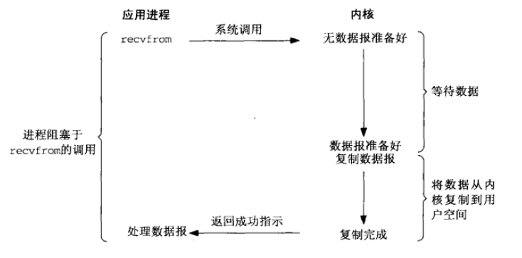
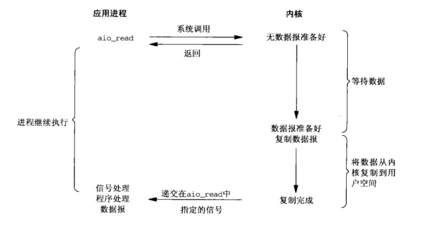
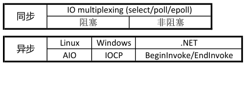

#### 1.nodejs如何处理CPU密集型任务
大多数网站的服务器端都不会做太多的计算，它们只是接收请求，交给其它服务（比如文件系统或数据库），然后等着结果返回再发给客户端。所以聪明的Node.js针对这一事实采用了第二种策略，它不会为每个接入请求繁衍出一个线程，而是用一个主线程处理所有请求。`避开了`创建、销毁线程以及在线程间切换所需的开销和复杂性。这个主线程是一个非常快速的event loop，它接收请求，把需要长时间处理的操作交出去，然后继续接收新的请求，服务其他用户。下图描绘了Node.js程序的请求处理流程：


主线程event loop收到客户端的请求后，将*请求对象*、*响应对象*以及*回调函数*交给与请求对应的函数处理。这个函数可以将需要长期运行的I/O或本地API调用交给内部线程池处理，在线程池中的线程处理完后，通过回调函数将结果返回给主线程，然后由主线程将响应发送给客户端。那么event loop是如何实现这一流程的呢？这要归功于Node.js平台的V8引擎和libuv。那么假如我有如下的服务端接口:
```js
'use strict';
const fs = require('mz/fs');
function*time(){
  for(let i=0;i<1000000;i++ ){
   console.log('i='+i);
  }
}
module.exports = function* () {
  this.body = 'liangklfangl';
  //CPU密集型计算
  this.runInBackground(function* saveUserInfo(ctx) {
    yield time;
  });
};
```


#### 2.nodejs中同步与异步，阻塞和非阻塞
##### 2.1 同步与异步(*指令执行顺序*)

同步和异步关注的是消息通信机制 (synchronous communication/ asynchronous communication)所谓同步，就是在发出一个*调用*时，在没有得到结果之前，该*调用*就不返回。但是一旦调用返回，就得到返回值了。换句话说，就是由*调用者主动等待这个调用的结果*。而异步则是相反，*调用*在发出之后，这个调用就直接返回了，所以没有返回结果。换句话说，当一个异步过程调用发出后，调用者不会立刻得到结果。而是在*调用*发出后，*被调用者通过状态、通知来通知调用者，或通过回调函数处理这个调用*。典型的异步编程模型比如Node.js:

举个通俗的例子：你打电话问书店老板有没有《分布式系统》这本书，如果是同步通信机制，书店老板会说，你稍等，”我查一下"，然后开始查啊查，等查好了（可能是5秒，也可能是一天）告诉你结果（返回结果）。而异步通信机制，书店老板直接告诉你我查一下啊，查好了打电话给你，然后直接挂电话了（不返回结果）。然后查好了，他会主动打电话给你。在这里老板通过“回电”这种方式来回调。异步的方式在平时情况还是很多的，比如典型的Promise调用:
```js
  Promise.all([getPersonDrawResult, getLotteryCount])
          .then(values => {})
          .catch(err => {
          });
  console.log('接口请求已经发送出去了!');
```
你会发现，我们的程序不会等待两个接口请求的返回值，而是直接返回，继续运行下面的代码。而当我们的网络I/O结束后，nodejs会通过*事件循环*通知主线程去执行回调。这种异步的方式在nodejs中非常常见，比如文件操作等等，但是对于异步有一点要注意：*我们的所有回调函数都是串行执行的，即如果一个回调函数耗时太长，那么后续的回调函数也是需要等待的*。而同步的方式也比较容易理解，比如函数调用:
```js
function blockFunc(){
  for(let i=0;i<10000;i++){
     console.log(i);
  }
}
blockFunc();
console.log('end');
```
这里当我们的blockFunc函数没有执行结束之前，我们的*end*是不会打印出来的，这就是同步的情况!

##### 2.2 阻塞与非阻塞(*线程与进程*)

阻塞和非阻塞关注的是程序在等待调用结果（消息，返回值）时的状态.阻塞调用是指调用结果返回之前，当前线程会被挂起。调用线程只有在得到结果之后才会返回。非阻塞调用指在不能立刻得到结果之前，该调用不会阻塞当前线程。

还是上面的例子，你打电话问书店老板有没有《分布式系统》这本书，你如果是阻塞式调用，你会一直把自己“挂起”，直到得到这本书有没有的结果，如果是非阻塞式调用，你不管老板有没有告诉你，你自己先一边去玩了， 当然你也要偶尔过几分钟check一下老板有没有返回结果。在这里阻塞与非阻塞与是否同步异步无关。跟老板通过什么方式回答你结果无关。

本段内容参考自[怎样理解阻塞非阻塞与同步异步的区别？](https://www.zhihu.com/question/19732473)。总之，同步与异步一个是主动等待结果，而另一个是等待别人通知;而阻塞与非阻塞一个表示是否影响当前线程!

##### 2.3 常见问题
问题:同步是否一定是阻塞的?

答案是否定的，下面是一个*同步阻塞*的例子:

(1)Linux上的IO默认情况下均为阻塞IO（aio系列除外），所有的套接字也默认为阻塞套接字。下图以UDP数据报为例，展示了阻塞IO的基本过程：



调用recvfrom，其系统调用直到数据报到达并且被复制到用户缓冲区中或者发生错误才返回。我们所说的「阻塞」是指系统调用*等待数据报达到*这一行为。*也就是我们上面说的同步表示主动等待结果*。

这个过程就相当于一个人去书店买书，但是书卖完了，于是他就在书店一直等到书店到货并买到书之后才回家。

(2)我们再给出一个*同步非阻塞*的例子

把一个套接字设置为非阻塞相当于在告诉内核：当一个IO操作所请求的数据并未到达或其他原因导致该操作不能进行时，不要把本线程投入睡眠，而是返回一个错误。比如下图:


前三次调用recvfrom时数据报并没有到达，所以立即返回一个EWOULDBLOCK错误，这便是所谓的*「非阻塞」*，第四次调用recvfrom时数据包已到达，它就被复制到用户缓冲区后，recvfrom成功返回，程序接着往后执行。

同样以买书的例子来说，非阻塞这一过程就是一个人去书店买书，如果书卖完了就回家。后面可能伴随着另一行为就是过一段时间再来书店看看书到货没（这就是轮询）。也就是说，当前线程并没有被挂起，而是伴随着*轮询*。


问题:异步是否一定是非阻塞的？

异步IO是由POSIX规范定义的。在Linux上主要是aio系列函数，它们的具体工作机制是：告知内核启动某个操作，并让内核在整个操作（包括把数据从内核复制到用户缓冲区这一过程）完成后再通知我们。



调用aio_read函数，传递给*内核描述符、用户缓冲区指针、用户缓冲区大小和文件偏移*，并告知内核当整个操作完成时如何通知我们（注册信号或回调）。该系统*调用立刻返回且不阻塞用户线程*，当内核完成整个操作并通知我们后，用户缓冲区就可以使用了（省去了用户把数据从内核拷贝到用户缓冲区这一过程）。

可以看到异步与同步的区别就在将数据从*内核复制到用户缓冲区*这一过程上。对于同步操作来说，这个过程是由用户来完成，用户在进行复制的过程中是不能做其他的动作的。而对于异步操作来说，将数据报复制到用户缓冲区这一过程是由内核来完成的，只是在内核完成这一操作后通知用户该缓冲区可以用了，用户在内核复制的过程中可以进行其他的动作行为。

相应的，对于买书这一行为就与同步时不同了。相当于一个人打电话向书店订购一本书，书店负责送货上门，书店有货就立即送货，如果没货就等到货后再送货，但是此人对这一过程不关心，他只知道当书店送货上门后就可以阅读这本书了。

总结:

UNP中关于同步IO和异步IO有这样一段话,POSIX把这两个属于定义如下：
<pre>
同步IO操作（synchronous I/O operation）导致请求阻塞，直到I/O操作完成。
异步IO操作（asynchronous I/O operation）不导致请求阻塞。
</pre>




问题:异步回调是否会阻塞主线程调用?


参考来自[阻塞非阻塞与同步异步区别](http://originlee.com/2015/04/18/difference-between-block-nonblock-and-sync-async/)

#### 3.nodejs中回调函数是否是阻塞的
Node.js中的回调函数一般是指异步操作完成之后调用的函数。基于异步事件模型的Node.js大致是这样运行的:

1.向Node.js提交异步操作，比如建立网络连接，读取网络流数据，向文件写入数据，请求数据库服务等，同时针对这些异步操作注册回调函数。这些异步操作会提交给IO线程池或者工作线程池。

2.在线程池中，操作是并发的执行，也就是读网络流和向文件写数据，或者请求数据库服务都是并发的（可能是这样子的，具体的操作怎么完成，是node的事） ，执行完毕后会将就绪事件放入完成队列中。

3.Node.js 在提交完操作请求之后，进入循环(或叫事件循环吧)。循环的过程如下： 

a. 检查有没有计时器超时(setTimeout/setInterval)   

b. 检查当前是否为空闲状态，执行空闲任务(process.nextTick)   

c. 检查IO完成队列（各种网络流读写、文件读写、标准输入输出上的事件都会进入这个队列）是否有就绪事件，       若完成队列中有就绪事件，就把队列里的所有事件（可能有多个操作已经完成）信息都取出来，对这些事件信息，挨个地调用与其相关的回调函数。这个过程是同步的，执行“写数据完成”事件的回调函数完成之后，才会去调用“读到网络数据”事件的回调函数；       若是队列中没有就绪事件，而且没有空闲(idle)任务，就会做一段时间的等待（线程被阻塞在此处），等待的超时时间由计时器周期决定。（不能因为等待而耽误timer和idle的事件处理）。  

d. 进入下一轮循环。从上面这个过程可以看出，你脚本中注册的所有回调函数都是在这个循环过程中被`依次`调用的。若有一个回调函数执行大的计算任务，很长时间不返回的话，就会让整个循环停顿下来，其它回调函数就不能在事件到来时即时被回调。因此，建议长任务处理过程中，即时将剩下的处理通过`process.nextTick`丢入下一轮循环中有idle事件中，或者process.spawn一个进程来执行。总之，`除了你的代码是同步执行的以外，其它所有的事情都是并发的`。

#### 4.Node.js中的I/O操作指的是什么
解答：I/O操作包括读写操作、输入输出(硬盘等)、请求响应(网络)等等。

#### 5.Node.js中yield\*与yield的区别
首先要注意:我们的return语句不会消耗一次*next调用*比如下面的例子:
```js
function* outer(){
    yield 'begin';
    var ret = yield* inner();
    console.log(ret);
    yield 'end';
}

function * inner(){
    yield 'inner';
    return 'return from inner';
}
var it = outer(),v;
v = it.next().value;
console.log(v);
v = it.next().value;
//这里是第二次调用next方法，返回`inner`
console.log(v);
v = it.next().value;
//这里是第三次调用next方法，*inner这个generator函数直接返回了，而把这次next调用作用到了outer这个generator函数上
console.log(v)
```
即第三次调用next方法，\*inner这个generator函数直接返回了，而把这次next调用作用到了outer这个generator函数上，从而"end"也被打印出来。打印的结果如下:
<pre>
begin
inner
return from inner
end   
</pre>

下面讲解下yield和yield\*的不同,给出下面的例子:
```js
function* outer(){
    yield 'begin';
    yield inner();
    //这里直接调用Generator函数相当于是返回一个Generator指针
    yield 'end';
}
function* inner(){
    yield 'inner';
}
var it = outer(),v;
v= it.next().value;
console.log(v);
v= it.next().value;
//此时第二次调用next方法直接得到调用inner()的返回值
console.log(v);
console.log(v.toString());
v = it.next().value;
console.log(v);
```
打印的结果如下:
<pre>
1.begin
2.inner {[[GeneratorStatus]]: "suspended"}__proto__: Generator[[GeneratorStatus]]: "suspended"[[GeneratorFunction]]: ƒ* inner()[[GeneratorReceiver]]: Window[[GeneratorLocation]]: VM3678:8[[Scopes]]: Scopes[2]
3.[object Generator]
4.end   
</pre>
所以直接调用yield得到的是一个指向Generator函数的指针，是一个对象。这个*对象里面的yield是不会执行的，因为并没有调用他的next方法*!

下面我们再给出通过co来运行Generator函数的例子:
```js
var co = require('co');
co(function* (){
    var a = yield Promise.resolve(1);
    console.log(a);
    //1.打印1
    var b = yield later(10);
    //2.resolve的时候传入的是10，yield后返回的是一个Promise
    console.log(b);
    var c = yield fn;
    console.log(c);
    //3.yield一个Generator函数,返回fn_1
    var d = yield fn(5);
    console.log(d);
    //4.yield一个Generator函数调用的返回值，即指针。返回fn_5
    var e = yield [
        Promise.resolve('a'),
        later('b'),
        fn,
        fn(5)
    ];
    console.log(e);
     //5.yield后是一个数组，直接执行数组里面的每一个thunkify函数，[ 'a', 'b', 'fn_1', 'fn_5' ]
    var f = yield{
        'a':Promise.resolve('a'),
        'b':later('b'),
        'c':fn,
        'd':fn(5)
    };   
console.log(f);
  //5.yield后是一个对象，直接执行对象里面的每一个thunkify函数，{ a: 'a', b: 'b', c: 'fn_1', d: 'fn_5' }
function* fn(n){
    n = n || 1;
    var a = yield later(n);
    return 'fn_'+ a;
}
//co里面会将yield后的函数处理为如下内容
  function later(n,t){
        t = t || 1000;
        return function(done){
            setTimeout(function(){done(null,n)},t);
        };
    }
}).catch(function(e){
    console.error(e);
});
```
上面的例子展示了，在[co](https://github.com/tj/co/blob/master/index.js)执行Generator函数遇到yield后，将会进行下面的处理:
```js
//将Object对象转化为Promise
function objectToPromise(obj){
  var results = new obj.constructor();
  var keys = Object.keys(obj);
  var promises = [];
  for (var i = 0; i < keys.length; i++) {
    var key = keys[i];
    var promise = toPromise.call(this, obj[key]);
    if (promise && isPromise(promise)) defer(promise, key);
    else results[key] = obj[key];
  }
  return Promise.all(promises).then(function () {
    return results;
  });
  function defer(promise, key) {
    // predefine the key in the result
    results[key] = undefined;
    promises.push(promise.then(function (res) {
      results[key] = res;
    }));
  }
}
//判断一个对象是否是promise就是看是否有then方法
function isPromise(obj) {
  return 'function' == typeof obj.then;
}
//将数组转化为promise处理
function arrayToPromise(obj) {
  return Promise.all(obj.map(toPromise, this));
}
//如果object.next是函数，同时throw也是函数那么就是Generator，比如调用Generator函数的返回值
//var it = outer()这里的it返回true
function isGenerator(obj) {
  return 'function' == typeof obj.next && 'function' == typeof obj.throw;
}
/**
 * Check if `obj` is a generator function.
 * 比如上面的outer.constructor.name就是GeneratorFunction() { [native code] }
 */
function isGeneratorFunction(obj) {
  var constructor = obj.constructor;
  if (!constructor) return false;
  //如果constructor.name或者displayName是GeneratorFunction返回true
  if ('GeneratorFunction' === constructor.name || 'GeneratorFunction' === constructor.displayName) return true;
  return isGenerator(constructor.prototype);
}

function toPromise(obj) {
  if (!obj) return obj;
  if (isPromise(obj)) return obj;
  //5.如果是Promise，那么直接返回，不做处理，因为co能处理yield一个Promise的情况!
  if (isGeneratorFunction(obj) || isGenerator(obj)) return co.call(this, obj);
  //1.如果是Generator函数或者是指向Generator函数的指针，那么直接包裹该函数并执行
  if ('function' == typeof obj) return thunkToPromise.call(this, obj);
  //2.如果是函数，那么直接将这个函数包裹成为Promise，也就是thunkify处理后接受一个唯一的参数
  //为function(err,res)这种nodejs常见的回调方式!
  if (Array.isArray(obj)) return arrayToPromise.call(this, obj);
  //3.如果是数组，那么数组里面的每一个元素都经过Promise.all处理
  if (isObject(obj)) return objectToPromise.call(this, obj);
  //4.如果是对象，那么对对象中的每一个value都进行Promise处理
  return obj;
}
function thunkToPromise(fn) {
    var ctx = this;
    return new Promise(function (resolve, reject) {
      fn.call(ctx, function (err, res) {
        if (err) return reject(err);
        if (arguments.length > 2) res = slice.call(arguments, 1);
        resolve(res);
      });
    });
  }
```

#### 6.javascript是单线程怎么理解？
下面的问题来自于知乎问答[javascript既然是单线程语言 ， 为什么会分主线程和消息线程(event loop) ?](https://www.zhihu.com/question/35905242)
##### 6.1 主线程和工作线程之间如何通信?
实际上，浏览器是通过一个*消息队列*来实现，工作线程发出数据时，通过事件event，向js主线程发一个通知，然后将数据插入到消息队列中，这样，js在主线程就能收到通知，并从消息队列中去拿到数据（这是一个基本的过程，具体实现视浏览器而定)。

###### 6.2 WebWorker引入之前ajax请求是在一个单独的线程中执行的？
在没有引入web worker之前，javascript确确实实是运行在一个单线程里面！那ajax 怎么说？ 回忆一下调用ajax的过程，我们是需要把*成功回调传递给xhr*，典型的代码如下：
```js
 xhr = new XMLHttpRequest();
 xhr.onreadystatechange＝function(){} //传入我们的回调
 xhr.open(...)
 xhr.send(...)
```
*浏览器虽然会在一个单独的线程去进行网络请求*，但是我们是通过传递一个回调的方式去处理数据，浏览器在网络请求成功后，然后会*切换回*js线程来执行我们的回调，也就是说*我们所有的js代码都是在js线程中运行的*。所以javascript确实是在一个单线程中。

###### 6.3 WebWorker为什么不能共享主线程的变量？
我们的js代码可以运行在js主线程之外，这也是为什么不能在web worker里面直接共享js主线程中定义的变量，不能操作ui (dom树)的原因，因为*根本不在一个线程*。

###### 6.4 WebWorker为什么不能操作UI？
无论是windows c开发，或者java 界面开发，一条黄金原则就是*不要在其它线程中操作ui*，android中如果发现在非ui线程中操作ui会直接抛出异常！*线程之间同步是有开销的，并且面临着同步问题，如果所有的线程都能操作ui，一旦cpu发生线程切换，都会面临数据不完整的风险*。例如a线程ui界面改了一半，cpu发生线程切换，b线程又去改同一处。而界面本质上来说只是操作系统对数据在显示器上的一个映射，各个线程操作的都是数据，这么一来，你改我也改，你还没改完我有改，你改了一半我接着改，那还怎么玩，所以要支持多线程，必须*提供同步工具*（让线程之间不会彼此发生冲突）。而如果在js中支持多线程，不仅会*增加js虚拟机的复杂度，也会增加编码的复杂度*（程序猿不得不自己处理好同步问题），所以，这才是js 为什么到现在还是一个主线程的本质原因（先忽略web worker）。

###### 6.5 javascript所有的回调都在队列当中？
js vm会将我们所有的*回调都会放在一个队列当中*，比如我们监听的某个单击事件的回调，当用户单击了我们监听的元素，浏览器捕获到事件，然后就去执行我们的回调，而*执行回调的环境都在同一个javasricpt线程中*，其实也就是说*event loop是在浏览器中的*，而javascript是运行在同一个线程当中的！这也是js的特点－异步，node中也是延续了这个特点，当然，为了利用多核cpu，node 提供了child_process 。但这不是严格意义上的多线程，相当于起了*多个node实例(在系统进程中可以看到)*，也就有多个js线程。

###### 6.6 为什么JavaScript被设计成单线程的？


<pre>
1.The user interface/用户接口: 除了网页显示区域以外的部分，比如地址栏、搜索栏、前进后退、书签菜单等窗口。
2.The brower engine/浏览器引擎: 查询与操作渲染引擎的接口，包含事件驱动引擎，提供浏览器进程及其线程之间的资源共享调度机制。
3.The rendering engine/渲染引擎: 负责显示请求的内容，比如请求到HTML, 它会负责解析HTML 与 CSS 并将结果显示到窗口中，也是后面几个线程或引擎的父级控制线程。
4.Networking/网络: 用于网络请求, 如HTTP请求，执行POST、GET等操作就是由它来处理的。
5.UI backend/UI后台:  绘制基础元件，如消息窗口（alert默认的样子）、下拉选项卡等等。
6.JavaScript interpreter/JavaScript解释器：也就是JavaScript引擎，用于解析和执行JavaScript代码。
7.Data storage/数据存储：数据持久层，在我们浏览页面时，浏览器需要把一些数据存到硬盘或内存上，如Cookies、localStorage、sessionStorage、webSql等。我们用浏览器看到的每一个页面，背后都是由以上的组件或功能来完成的。浏览器完成打开一个页面的整个过程，通俗地说这是页面“渲染”。这里的“渲染”，其实是一个组合概念，即浏览器的“渲染引擎”并不是单独工作的，必须依赖其他引擎（组件），经过某种协同机制联合起来完成页面的展示及交互。
</pre>

因为JavaScript出生的时候，CPU和OS都不支持多线程，浏览器*单进程*在运作，渲染线程、JavaScript线程、网络线程等多个线程已经需要排队才能处理了，这种情况下如果将JavaScript设计成多线程有意义吗？考虑到当时的项目需求（运行在浏览器上）、周期（10天）、硬件环境以及软件环境等因素，换作其他人也都会将JavaScript设计成单线程的！完整内容查看知乎问答[javascript既然是单线程语言 ， 为什么会分主线程和消息线程(event loop) ?](https://www.zhihu.com/question/35905242)

###### 6.7 javascript有哪些线程
所谓单线程，是指*负责解释并执行JS代码的线程只有一个*(但是浏览器中还会有各种其他的线程，比如上面的渲染UI的线程),我们不妨叫它主线程。其实还有其他很多线程的，比如进行ajax请求的线程、监控用户事件的线程、定时器线程、读写文件的线程(例如在NodeJS中)等等。但是，所有的这些代码都是在同一个线程中运行的，这一点一定要注意!

参考资料:

[Node.js软肋之CPU密集型任务](http://www.infoq.com/cn/articles/nodejs-weakness-cpu-intensive-tasks/)

[Nodejs中 Callback 的执行是否造成阻塞？](https://www.zhihu.com/question/20156099)

[Node.js 探秘：初识单线程的 Node.js](http://taobaofed.org/blog/2015/10/29/deep-into-node-1/)

[同步，异步，阻塞，非阻塞等关系轻松理解 #40](https://github.com/calidion/calidion.github.io/issues/40)

[nodejs之yield 和 yield\*](http://blog.csdn.net/qq_21816375/article/details/74820568)

[JavaScript既然是单线程的，那么异步要怎么理解？](https://segmentfault.com/q/1010000004266993?_ea=568689)
