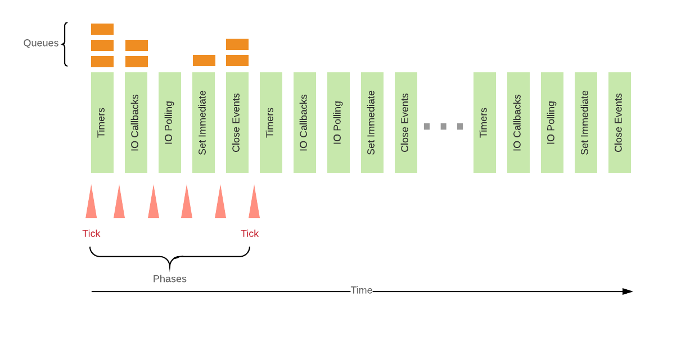
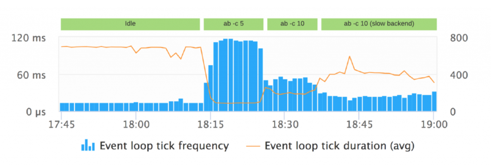
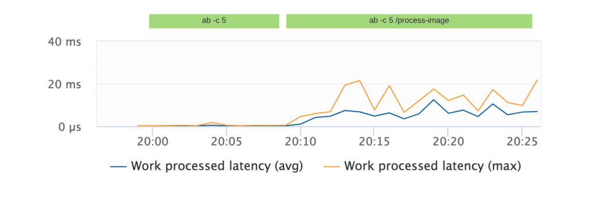
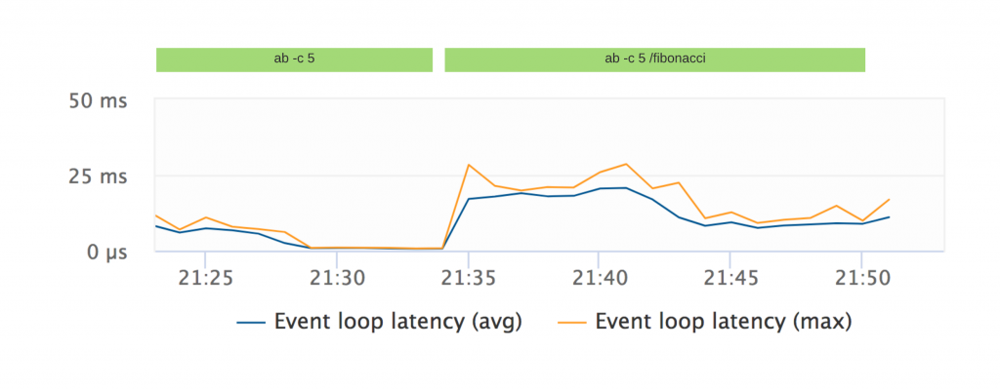
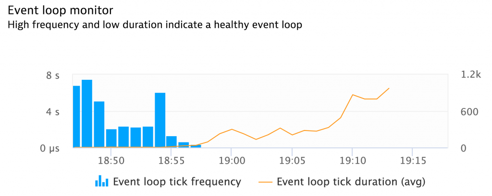
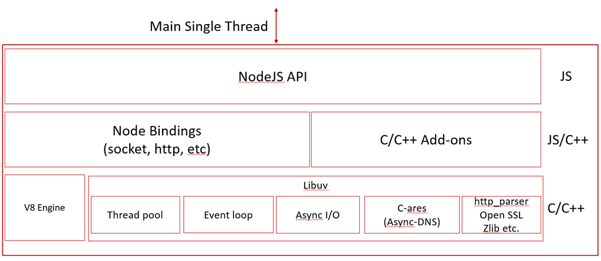
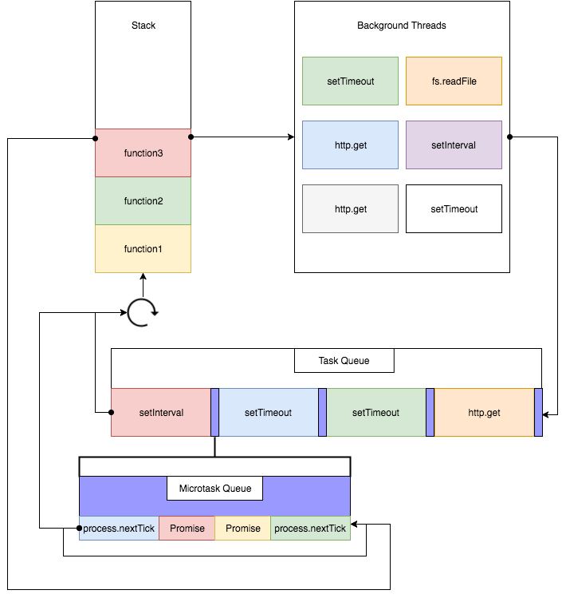

#### 前言
该部分内容更多的是关于nodejs中的常见问题以及误解。文章的内容有可能来自于对其他文章的翻译，但是也会加上一点自己的理解，如果有不对的地方欢迎指出。同时，该部分内容会随着自己对于nodejs加深而继续优化或者排错。欢迎star

#### 1.Event Loop不是在一个独立的线程中执行
**误解**:很多人都认为:nodejs有一个主线程，该线程用于执行用户编写的代码，而另一个线程用于执行Event Loop。每一次异步的操作出现的时候，主线程就会将它交给Event Loop线程，而当该异步操作完成的时候，Event Loop会将回调的执行交给主线程。其实并不是这样的:

**正解**:其实执行用户代码的线程和执行Event Loop的线程是[同一个](https://www.tuicool.com/articles/vyM77n)。而回调函数的执行其实是通过Event Loop来实现的。

#### 2.并不是所有的异步操作都需要通过线程池
**误解**:所有的异步操作，比如和文件系统打交道，Http请求或者数据库访问都会通过libuv提供的线程池来完成。

**正解**:Libuv默认创建的线程池有四个线程，用于处理异步的请求。目前的操作系统已经为很多I/O任务提供了异步的接口(比如Linux上的[AIO](http://blog.csdn.net/zhxue123/article/details/21087165)，即异步IO)。如果可能，Libuv会使用这些操作系统本身就有的异步接口，而不是使用线程池。第三方的子系统，比如数据库也是同样的道理。某一个系统的driver在可以使用异步接口的情况下都会尽量避免使用线程池。也就是说:只有在不存在异步接口的情况下才会使用线程池。

#### 3.事件循环类似于栈或者队列的误解
**误解**:很多人认为事件循环会不断的遍历一个异步的先进先出的任务，当任务完成的时候就会执行回调函数。

**正解**:虽然有类似于队列的结构，Event Loop不是执行处理栈。而事件循环牵涉的是很多的阶段，每一个阶段有特定的task任务，而任务的执行是以`round-robin方式`来完成的。

#### 4.nodejs的Event Loop生命周期
如下图(详细内容可以参考[nodejs官网](https://nodejs.org/en/docs/guides/event-loop-timers-and-nexttick/)):



下面是具体的执行阶段执行的回调:
 - Timers
   所有的setTimeout或者setInterval都是在这个阶段执行的。
 - IO Callbacks
   大多数的回调(Network,disk,child process)都会在这里执行。因为nodejs中所有的用户代码几乎都是异步的(比如http请求会触发一系列的回调函数)。
 - IO Polling
   获取新的事件，用于下一轮的事件循环
 - Set Immediate
   执行通过setImmediate注册的所有回调
 - Close
   所有的通过*on('close')*注册的回调

下图是来自于[Bert的演讲](https://webapplog.com/event-loop/)。


#### 5.nodejs的Event Loop监听指标
nodejs中所有的代码执行都是通过Event Loop来实现的。也就是说，如果我们能知道事件循环的一些指标，那么我们就可以知道整个应用的状态以及性能。然而，在nodejs中并没有指标获取event loop的这些状态。但是可以通过侧面的指标了解它:

##### 5.1 事件循环的频率和平均时长
- Tick Frequency
  指定时间循环的次数
- Tick Duration
  每一次tick持续的时间

我们创建一个情景:启动一个express服务器，该服务器会请求另外一个http服务器。同时提供了四个状态：

- Idle状态
  没有Http请求
- ab -c 5
  同时有5个http请求发出
- ab -c 10
  同时有10个http请求发出
- ab -c 10 (slow backend)
  Http的服务器1s后才会真实返回数据去模拟慢的服务器请求。这种情形表示后端服务器压力比较大，因为很多请求会等待后端服务器去返回数据，从而请求在Node中被累积。

如下图:



如果我们仔细查看上图会发现:

(1)每一次Event Loop的持续时间和Event Loop的频率都是动态适应的。如果应用处于闲置状态，比如没有定时器或者回调等等待执行，那么以很快的速度来执行完所有的阶段是没有意义的，此时Event Loop会适应这个状况，从而在**poll阶段**进行阻塞，进而等待更多的外部事件。

(2)同时从上图也可以看到:当应用处于闲置状态的时候，比如低频率高持续时间的情况下和应用处于高负荷的情况下是一样的。此次每一次事件循环的`持续时间都比较长，而频率本身比较低`。

##### 5.2 任务处理延迟
该指标衡量的是:异步事件直到被线程池真实处理耗费的时间。高的事件处理延迟表示该线程池处于繁忙状态。下面提供一个例子:Express服务器提供了一个路由，该路由会用[Sharp](https://www.npmjs.com/package/sharp)来处理图片。图片处理花销本身是昂贵的，而Sharp本身使用线程池去处理它:



上图表示如果有5条并发请求时候的真实状况。该图展示了对于`并发处理图片的请求要比常规的请求事件处理延迟要高的多`。

##### 5.3 事件循环(Event Loop)延迟
该指标表示:setTimeout(X)设置的时间到了以后，由于事件循环本身繁忙导致回调被执行多花销的时间。高的事件循环延迟表示事件循环本身处理回调的繁忙程度。比如下面的例子展示了某一个路由处理fibonacci计算和不处理fibonacci计算，并发量为5的情况下的事件循环本身的延迟数据:



在并发量为5的情况下访问存在fibonacci计算的路由时，回调函数处于繁忙状态,**事件循环延迟也会比较大**!

#### 6 Event Loop的健康状况
上面的指标可以从某一方面反应事件循环的状况，而当事件循环处于繁忙状况的时候我们依然可以做一些事情。



- 利用多CPU
  Nodejs应用是单线程的，在多核机器的情况下，负载并不会被分配到多核。使用Nodejs的[cluster模块](https://nodejs.org/api/cluster.html)可以在每一个CPU上创建一个独立的子进程。**每一个子进程维护它自己的Event Loop，而每一个master进程将会在多个子进程中分配负载**。
- 调整线程池
  默认情况下，libuv创建的线程池的大小为4。你可以使用UV_THREADPOOL_SIZE变量来覆盖它。虽然这种方式可以解决I/O密集应用存在的负载问题，但是这种方式也是有风险的，因为大的线程池很可能消耗大量的内存或者CPU资源。
- 转嫁负载到Service
  如果Nodejs在CPU密集型的操作上花费了大量的时间，将负载转嫁到Service上可能是一个好的方式。而这个service可以使用另外一种语言编写，其适用于特定的环境。

#### 7 Nodejs的组成
Nodejs的组成可以通过下面的等式来说明:
<pre>
NodeJS =  Google's V8 Engine + Libuv
</pre>
其中Libuv是支持多平台的，其主要在于实现异步IO。它开始的时候用于Nodejs,但是也可以用于Luvit, Julia, pyuv等。其主要特点是:

- 通过epoll, kqueue, IOCP, event ports等实现了全功能的Event Loop
- 异步的TCP/UDP套接字
- 异步的DNS解析
- 异步的文件和文件系统操作
- 文件系统事件
- ANSI转义码控制的tty
- 套接字共享的IPC，在windows上使用Unix domain sockets或者named pipes(命名管道)
- 子进程
- 线程池
- 消息处理
- 高分辨率时钟
- 线程和同步原语

Nodejs可以通过下图来表示:



这里有一句题外话:Nodejs本身是支持缓存的，因此在第一次请求的时候Node会在服务端缓存JS模块，而第二次请求到来的时候，该模块会直接从缓存中读取。

#### 8 Nodejs中的C++ API与Chrome中的Web API
当在Nodejs中调用如setTimeout, http.get, process.nextTick, or fs.readFile方法的时候会发生什么?这些代码并不存在于V8引擎中，在浏览器中存在于Chrome的WebAPI中，而在Nodejs中它们是以C++的API实现的。比如下面的代码:
```js
'use strict'
const express = require('express')
const superagent = require('superagent')
const app = express()
app.get('/', sendWeatherOfRandomCity)
function sendWeatherOfRandomCity (request, response) {
  getWeatherOfRandomCity(request, response)
  sayHi()
}
const CITIES = [
  'london',
  'newyork',
  'paris',
  'budapest',
  'warsaw',
  'rome',
  'madrid',
  'moscow',
  'beijing',
  'capetown',
]
function getWeatherOfRandomCity (request, response) {
  const city = CITIES[Math.floor(Math.random() * CITIES.length)]
  superagent.get(`wttr.in/${city}`)
    .end((err, res) => {
      if (err) {
        console.log('O snap')
        return response.status(500).send('There was an error getting the weather, try looking out the window')
      }
      const responseText = res.text
      response.send(responseText)
      console.log('Got the weather')
    })
  console.log('Fetching the weather, please be patient')
}
function sayHi () {
  console.log('Hi')
}
app.listen(3000)
```
输出结果为:
<pre>
Fetching the weather, please be patient
Hi
Got the weather   
</pre>
虽然V8引擎(见上图Nodejs的组成)是单线程的，但是Node中实现的C++ API却不是。也就是说，在Nodejs中，当调用了非阻塞的API，那么Node会执行某些代码，这些代码将会和我们自己的代码**并发**执行。当调用C++函数产生的线程得到了它需要的结果或者抛出了一个错误，那么它提供的回调将会获取到特定的参数。而这里所指的**某些代码**其实是libuv的一部分。libuv是一个开源的库，它会处理线程池等用于处理异步任务的部分。

#### 9 Nodejs中的Task Queue
JavaScript是单线程事件驱动的语言。也就是说，我们可以为某些事件添加监听函数，当指定的事件触发的时候，监听函数将会被执行。当你调用setTimeout, http.get 或者 fs.readFile的时候，Nodejs将会将这些操作发送到**不同的线程**，此时V8可以继续执行余下的代码。对于setTimeout/Http也是同样的道理。同时，回调函数可以继续在队列中推入新的任务，而这些任务的回调函数又可以推入新的任务，依次类推。此时，当你的服务器在处理一个请求的时候，它可以同时读取文件，然后获取该文件的内容用于发送一个新的http请求而不会阻塞其他的请求被处理。

然而，我们只有一个主线程和一个调用栈，当某一个异步操作的回调函数在执行的时候，另一个异步操作的回调函数必须等待。回调函数就在一个不断执行的循环中被处理，但是前提是主线程已经完成了前一个task任务的处理。比如下面的例子:
```js
'use strict'
const express = require('express')
const superagent = require('superagent')
const app = express()
app.get('/', sendWeatherOfRandomCity)
function sendWeatherOfRandomCity (request, response) {
  getWeatherOfRandomCity(request, response)
  sayHi()
}
const CITIES = [
  'london',
  'newyork',
  'paris',
  'budapest',
  'warsaw',
  'rome',
  'madrid',
  'moscow',
  'beijing',
  'capetown',
]
function getWeatherOfRandomCity (request, response) {
  const city = CITIES[Math.floor(Math.random() * CITIES.length)]
  superagent.get(`wttr.in/${city}`)
    .end((err, res) => {
      if (err) {
        console.log('O snap')
        return response.status(500).send('There was an error getting the weather, try looking out the window')
      }
      const responseText = res.text
      response.send(responseText)
      console.log('Got the weather')
    });
  console.log('Fetching the weather, please be patient')
}
function sayHi () {
  console.log('Hi')
}
app.listen(3000)
```
(1)Express注册了一个'request'事件的处理函数，当有一个请求访问了"/"的时候将会被调用

(2)跳过后续函数的执行，然后监听3000端口号

(3)此时调用栈已经为空，等待`request`事件被触发

(4)当请求来到的时候，`request`事件被触发，此时调用`sendWeatherOfRandomCity`函数

(5)`sendWeatherOfRandomCity`函数被推入到执行栈中

(6)`getWeatherOfRandomCity`被推入到执行栈中

(7)`Math.floor`和`Math.random`被推入执行栈然后被推出，`city`变量被赋值为`cities`

(8)`superagent.get`被调用，传入参数`wttr.in/${city}`。同时为`end`事件添加回调函数

(9)`http://wttr.in/${city}`的请求被放到一个**后台线程**，继续执行后续的代码

(10)`'Fetching the weather, please be patient' `打印出来，`getWeatherOfRandomCity`函数return

(11)调用`sayHi`函数并输出`Hi`

(12)`sendWeatherOfRandomCity`函数返回并从栈中被推出。此时**执行栈再次为空**~

(13)等待`http://wttr.in/${city}`请求得到结果

(14)当`http://wttr.in/${city}`结果已经得到，那么调用`end`回调函数

(15)`.end`方法的回调函数被推入到执行栈中，因为**闭包**的存在，它可以修改express, superagent, app, CITIES, request, response, city变量。

(16)`response.send()`被调用，传入`200`或`500`的状态码，同时它被推入到**后台线程**,因此response的流不会阻塞后续代码的执行。此时，`end`事件的回调函数被推出执行栈。

#### 10.Nodejs中的Microtasks和Macrotasks
我们其实有两个任务队列(Task Queue)，一个是Microtasks，还有一个是Macrotasks。而Macrotasks主要包括:
<pre>
script(整体代码),
setTimeout, 
setInterval, 
setImmediate, 
I/O, 
UI rendering
</pre>
而Microtasks包括:
<pre>
process.nextTick,
Promises, 
Object.observe, 
MutationObserver
</pre>

比如下面的例子:
```js
console.log('script start')
const interval = setInterval(() => {
  console.log('setInterval')
}, 0)
setTimeout(() => {
  console.log('setTimeout 1');
  //调用resolve将Promise状态改为resolved!then中方法是异步的
  //https://developer.mozilla.org/zh-CN/docs/Web/JavaScript/Reference/Global_Objects/Promise
  Promise.resolve().then(() => {
    console.log('promise 3')
  }).then(() => {
    console.log('promise 4')
  }).then(() => {
    setTimeout(() => {
      console.log('setTimeout 2')
      Promise.resolve().then(() => {
        console.log('promise 5')
      }).then(() => {
        console.log('promise 6')
      }).then(() => {
        clearInterval(interval)
      })
    }, 0)
  })
}, 0)
Promise.resolve().then(() => {
  console.log('promise 1')
}).then(() => {
  console.log('promise 2')
})
```
打印的结果如下:
```js
script start
promise1
promise2
// 第一次循环
setInterval
// 第二次执行Macrotasks中的setInterval
setTimeout1
promise3
promise4
// 此时Macrotasks为setInterval setTimeout
setInterval
//继续执行setInterval这个Macrotasks
setTimeout2
setInterval
promise5
promise6
```
根据[WHATVG](https://html.spec.whatwg.org/multipage/webappapis.html#task-queue),每一次事件循环只会有一个Macrotasks从Macrotasks队列中拿出来被执行。当指定的Macrotasks完成了以后，本次循环中所有的Microtasks将会被执行，在这些Microtasks被执行的时候它们可以插入更多Microtasks，但是所有的Microtasks将会在本次循环中执行完毕。比如下图:



- 第一轮循环
 (1)`setInterval`作为task被调度
 (2)`setTimeout`也作为task被调度
 (3)`Promise.resolve 1`和`then`方法作为microtasks被调度
 (4)调用栈为空，microtasks被执行
  因为该轮有两个任务Macrotasks,因此先执行`setInterval`然后移除并执行所有的microtasks。此时Macrotasks为`setTimeout 1`
- 第二轮循环
  此时microtask队列为空，`setInteval`的回调可以执行，另一个`setInteval`可以作为task被调度，其在`setTimeout 1`之后。此时的任务队列为`setTimeout 1, setInterval`。
- 第三轮循环
  (1)此时microtask队列为空,setTimeout 1的回调函数可以被执行，`promise 3`和`promise 4` 作为microtasks被调度
  (2)`promise 3`和`promise 4`作为microtasks被执行。此时`setTimeout 2`作为一个新的task被插入。
  (3)此时的task队列为`setInterval, setTimeout 2`

- 第四轮循环
  (1)microtasks已经为空，setInterval可以被执行，而另一个`setInterval`又被插入作为一个新的task
  (2)此时task队列为`setTimeout 2, setInteval`
  (3)`setTimeout 2`'被调用，`promise 5`和 `promise 6`作为microtasks为调度

  此时`promise 5`和`promise 6`被执行的时候会清除我们的interval定时器，但是一些[奇怪的原因](https://github.com/nodejs/node/issues/15081)setInterval又会被调用，但是如果你把代码放在chrome中运行那么结果却是正确的(其实在Chrome中结果也是不同的，[作者可能没有考虑到](https://blog.risingstack.com/node-js-at-scale-understanding-node-js-event-loop/),但是第二次运行的时候确实正确的)。在Nodejs中可以使用`process.nextTick`解决这个问题:
```js
const interval = setInterval(() => {
  console.log('setInterval')
}, 0)
setTimeout(() => {
  console.log('setTimeout 1')
  process.nextTick(() => {
    console.log('nextTick 3')
    process.nextTick(() => {
      console.log('nextTick 4')
      setTimeout(() => {
        console.log('setTimeout 2')
        process.nextTick(() => {
          console.log('nextTick 5')
          process.nextTick(() => {
            console.log('nextTick 6')
            clearInterval(interval)
          })
        })
      }, 0)
    })
  })
})
process.nextTick(() => {
  console.log('nextTick 1')
  process.nextTick(() => {
    console.log('nextTick 2')
  })
})
```
这段代码逻辑和上面的promise调用逻辑是一致的，只是嵌套的有点可怕，但是至少可以得到我们期望的结果。

#### 11.Nodejs事件循环的一个例子
假如我们有如下的代码:
```js
const fs = require('fs');
const setTimeOutlogger = ()=>{
    console.log('setTimeout logger');
}
const setImmediateLogger = ()=>{
    console.log('setImmediate logger');
}
//For timeout
//在我们的例子中，第一个阶段是setTimeout阶段
setTimeout(setTimeOutlogger, 1000);
//File I/O operation
//在这个阶段，目前是一个空的队列，因为fs.readFile还没有结束。在等待的时候，1s的timer也没有到期，所以Event Loop就会检查通过setImmediate()在check阶段注册的回调。在我们的例子中有三个
fs.readFile('test.txt', 'utf-8',(data)=>{
    console.log('Reading data 1');
});
fs.readFile('test.txt', 'utf-8',(data)=>{
    console.log('Reading data 2');
});
fs.readFile('test.txt', 'utf-8',(data)=>{
    console.log('Reading data 3');
});
fs.readFile('test.txt', 'utf-8',(data)=>{
    console.log('Reading data 4');
});
fs.readFile('test.txt', 'utf-8',(data)=>{
    console.log('Reading data 5');
});
//For setImmediate
// 执行所有的通过setImmediate()注册的回调函数。此时setTimeout还没有到时间，然而readFile已经完成。在执行readFile回调的时候如果Timer到期了，那么必须等待前者执行完成
setImmediate(setImmediateLogger);
setImmediate(setImmediateLogger);
setImmediate(setImmediateLogger);
```
该例子的执行顺序如下:
<pre>
setImmediate logger
setImmediate logger
setImmediate logger
Reading data 1
Reading data 2
Reading data 3
Reading data 4
Reading data 5
setTimeout logger
</pre>

下面再给出一个[例子](https://www.jianshu.com/p/3ed992529cfc):
```js
setImmediate(function(){
    console.log(1);
},0);
setTimeout(function(){
    console.log(2);
},0);
// setTimeout优先级比setImmediate高
new Promise(function(resolve){
    console.log(3);
    resolve();
    console.log(4);
}).then(function(){
    console.log(5);
});
console.log(6);
process.nextTick(function(){
    console.log(7);
});
console.log(8);
```
执行结果为:"3 4 6 8 7 5 2 1"。而nextTick的优先级要比Promise.then的高,原因如下:

**process.nextTick永远大于promise.then**，原因其实很简单。在Node中，\_tickCallback在每一次执行完TaskQueue中的一个任务(是任务队列，一次支持一个)后被调用，而这个\_tickCallback中实质上干了两件事:
1.nextTickQueue中所有任务(microtask)执行掉(长度最大1e4，Node版本v6.9.1)
2.第一步执行完后执行_runMicrotasks函数，执行microtask中的部分(promise.then注册的回调)
所以很明显，**process.nextTick > promise.then**。

更多的可以查看[这个](https://www.baidu.com/s?ie=utf-8&f=8&rsv_bp=1&rsv_idx=2&tn=baiduhome_pg&wd=process.nextTick%E4%B8%8Ethen%E9%A1%BA%E5%BA%8F&rsv_spt=1&oq=promise%25E5%25AF%25B9%25E8%25B1%25A1&rsv_pq=ae9bb44c0000afbc&rsv_t=3cddA%2BF8iuavK8CqgJm9SDXHQYy3H041oK1Neoi%2FOOf%2BdLpTpK8c30UFm3uCqdI9W4hq&rqlang=cn&rsv_enter=1&inputT=6448&rsv_sug3=54&rsv_sug2=0&rsv_sug4=6448)文章以及[知乎问答](https://www.zhihu.com/question/36972010/answer/71338002)

#### 12.什么是Nodejs的bindings
在理解Nodejs的binding之前，我们需要理解什么是binding。比如你要写一个Nodejs的Web应用:(1)接受客户端的请求 (2)查询数据库 (3)对查询的结果排序 (4)将结果返回给客户端。在这种情况下，所有的代码都是你写的。然而，忽然有一天你知道第三步有一个非常好的库可以完成，唯一的问题是该库是使用了系统编程语言，比如C/C++编写的，而你的代码是通过JS编写的。一般情况下你无法在你的代码中使用该库，因为他们的编程语言是完全不同的，但是使用binding你就可以!

Bindings常用于"bind"两种不同的编程语言。通过一种语言编写的代码可以在另一种语言中使用，这样就不会存在你想使用一个库，但是该库使用了和你当前不同的语言的困境。还有一种动机是:你可以**集成不同编程语言的优点**。比如，C/C++一般都是比JavaScript要快的，因此使用C/C++也能够提升代码的性能。

V8引擎是通过C++编写的，而libuv创建一个抽象层，其提供了很多异步IO相关的内容，是通过C来编写的。而Nodejs中的核心模块，比如网络，数据查询，文件系统IO是通过Javascript编写的。而且，你自己的代码也是通过Javascript编写的。因此，为了让不同的库能够相互融合，你就必须将他们binding起来。这就是Nodejs bindings!

#### 13.nodejs中模块缓存
假如main.js内容如下:
```js
function Test1(){}
function Test2(){}
console.log('---start----');
module.exports = {
  Test1,
  Test2
}
console.log('---end----');
```
入口文件(test.js)如下:
```js
const require1 = require('./main');
const require2 = require('./main');
console.log('require1==require2 ? '+(require2==require1));
```
此时执行node test.js，你会看到如下的输出:
<pre>
---start----
---end----
require1==require2 ? true
</pre>

**首先**:在nodejs中require一个模块后该模块代码会立即执行。**然后**:多次require同一个模块后获取到的是同一个对象。**最后**:虽然多次require了同一个模块main.js，但是main.js中start,end的代码只会执行一次，即该模块代码只会执行一次，这一点一定要注意!下面还有几个需要注意的点:

1.Node模块缓存是**基于解析后的文件名**(require.resolve)的,文件名不同那么返回对象也不同

2.在大小写不敏感的文件系统或者操作系统上，对于**大小写文件返回的对象是不一样的**，而与文件路径是否相同无关。比如下面的代码将会返回false:
```js
const require1 = require('./main');
const require2 = require('./MAIN');
console.log('require1==require2 ? '+(require2==require1));
```

3.**Node核心模块，即使多次调用返回的对象也是不一样的**
```js
// fs,http,cluster等都是返回false
const util = require('http');
const util1 = require('http');
console.log('util1===util'+util==util1);
```

#### 14.nodejs中模块循环引用
比如main.js内容如下:
```js
console.log('main starting');
const a = require('./a.js');
const b = require('./b.js');
console.log('in main, a.done=%j, b.done=%j', a.done, b.done);
```
然后a.js内容如下:
```js
console.log('a starting');
exports.done = false;
// a.js已经执行到这里了然后去执行b.js，后续的代码必须等到b.js执行完毕才能执行
// 所以b.js再次引入a.js得到的就是a.js中已经执行的代码的exports对象
const b = require('./b.js');
console.log('in a, b.done = %j', b.done);
exports.done = true;
console.log('a done');
```
而b.js内容如下:
```js
console.log('b starting');
exports.done = false;
const a = require('./a.js');
//1.此时监听到循环引用b模块立即去require我们的a模块,此时将a模块已经执行的内容的exports返回过来
// 并结束a模块的加载。所以此时得到的a模块的exports.done=false
// 2.在b.js立即加载a.js，后者不会再执行一次
console.log('in b, a.done = %j', a.done);
exports.done = true;
console.log('b done');
```
此时输入的结果如下:

<pre>
main starting
a starting
b starting
in b, a.done = false
b done
in a, b.done = true
a done
in main, a.done=true, b.done=true
</pre>

#### 15.nodejs中node_modules模块加载
如果传递给**require**方法的不是一个内置模块，同时**也不是以"/",'../','./'**开头，此时Nodejs将会从**当前目录的父级目录**开始，在父级目录后面添加node_modules,然后从这里加载特定的模块。如果没有发现当前模块，就会继续往父级目录搜索，**直到文件系统的根目录**。

比如'/home/ry/projects/foo.js'调用了require('bar.js')，此时Nodejs的模块搜索路径将会按照下面的路径进行:

<pre>
/home/ry/projects/node_modules/bar.js
/home/ry/node_modules/bar.js
/home/node_modules/bar.js
/node_modules/bar.js
</pre>

而且也可以按照下面这种**方式加载模块**:
```js
const webpack = require('webpackcc/lib/build');
```
此时将会在模块webpackcc下的路径"/lib/build"下加载资源。

#### 16.Nodejs模块包裹函数
```js
(function(exports, require, module, __filename, __dirname) {
// Module code actually lives in here
});
```
通过这种函数包裹的方式，在模块中定义的var,const,let变量将会被**限制到模块内部而不是全局变量**。同时也提供了一些该模块中全局的变量，比如module,exports可以用于将模块的值导出。而\__dirname,\__filename表示了模块的目录与地址。此处添加一个[require.paths](https://stackoverflow.com/questions/5390886/nodejs-require-paths-resolve-problem)的问题可以学习下。

#### 17.require.resolve的包查询机制
```js
var path = require('path');
var fs = require('fs');
var parse = path.parse || require('path-parse');
/**
 * start:表示从哪个路径开始解析
 * opts.moduleDirectory:如果指定，那么就从这个目录开始搜索
 */
function nodeModulesPaths(start, opts) {
    var modules = opts && opts.moduleDirectory
        ? [].concat(opts.moduleDirectory)
        : ['node_modules'];
    var absoluteStart = path.resolve(start);
    //开始搜索的绝对路径 /Users/qinliang.ql/Desktop/test/src
    var prefix = '/';
    if (/^([A-Za-z]:)/.test(absoluteStart)) {
        prefix = '';
    } else if (/^\\\\/.test(absoluteStart)) {
        prefix = '\\\\';
    }
    var paths = [absoluteStart];
    // paths搜索路径["/Users/qinliang.ql/Desktop/test/src"]
    // 开始解析的路径
    // var pathParse = require('path-parse');
    // pathParse('/home/user/dir/file.txt');
    //=> {
    //       root : "/",
    //       dir : "/home/user/dir",
    //       base : "file.txt",
    //       ext : ".txt",
    //       name : "file"
    //   }
    var parsed = parse(absoluteStart);
    // 符号"/"的dir也是"/"，此时退出循环
    while (parsed.dir !== paths[paths.length - 1]) {
        paths.push(parsed.dir);
        parsed = parse(parsed.dir);
    }
    // ["/Users/qinliang.ql/Desktop/test/src","/Users/qinliang.ql/Desktop/test","/Users/qinliang.ql/Desktop","/Users/qinliang.ql","/Users","/"]
    var dirs = paths.reduce(function (dirs, aPath) {
        // dirs表示已经获取到的目录,即(prev,cur)
        return dirs.concat(modules.map(function (moduleDir) {
            // aPath表示就是当前的reduce循环的cur变量
            return path.join(prefix, aPath, moduleDir);
        }));
    }, []);
    return opts && opts.paths ? dirs.concat(opts.paths) : dirs;
};
const t = nodeModulesPaths(path.join(__dirname,"./src"),{moduleDirectory:'module',paths:[path.join(__dirname,'./demo')]});
console.log('t==='+JSON.stringify(t));
//["/Users/qinliang.ql/Desktop/test/src/module","/Users/qinliang.ql/Desktop/test/module","/Users/qinliang.ql/Desktop/module","/Users/qinliang.ql/module","/Users/module","/module","/Users/qinliang.ql/Desktop/test/demo"]
```
源代码来自于[resolve](https://github.com/browserify/resolve/blob/master/lib/node-modules-paths.js)模块的包查询机制。从这个源码你应该要知道:

- **opts.basedir**
  
  表示从这个字段指定的路径开始解析模块。

- **opts.moduleDirectory**
  
  默认和Nodejs一样，逐级从node_modules查找模块。比如上面我的例子指定的是module，所以所有的查询路径后面都是module后缀而不是node_modules。

- **opts.paths**
   
   如果通过opts.moduleDirectory递归遍历没有查询到模块就会从这个数组指定的路径中查找。比如上面的例子我指定了path.join(\__dirname,'./demo')。

#### 18.module.exports和exports比较
##### 18.1 module.exports和exports比较
**exports变量是存在于文件级别的作用域的，而且在模块执行之前它会设置为module.exports的值**。所以exports变量是一种更加简便的module.exports的表现方式。 module.exports.f = ...这种形式即可以通过exports.f = ....来表示。但是，一定要注意:和其他变量一样，如果为exports对象赋值为一个新的值，那么它将不再指向module.exports了:
```js
module.exports.hello = true; 
//require这个模块的时候将会被导出
exports = { hello: false };  
//exports被重新赋值，它只会在当前模块里面有效
```
所以当module.exports被重新赋值为一个新的对象的时候，我们一般也会同时为exports赋值:
```js
module.exports = exports = function Constructor() {
  // ... etc.
};
```
我们可以将require方法理解为如下的形式:
```js
function require(/* ... */) {
  const module = { exports: {} };
  ((module, exports) => {
    // 这里相当于模块代码，此处是一个函数
    function someFunc() {}
    exports = someFunc;
    // 此时exports不再是module.exports的简写了，但是模块还是会导出一个空对象
    // 因为module.exports依然存在
    module.exports = someFunc;
    // 此时，模块将会导出一个函数而不是默认的{}
  })(module, module.exports);
  return module.exports;
}
```

##### 18.2 module.exports与exports的例子
比如如下的模块exports.js:
```js
exports = {name:'qinliang',sex:'男'};
// 此时exports被重新赋值，其值不再是module.exports了，但是后者依然导出{}
```
下面对该模块进行引用:
```js
const data = require('./exports.js');
console.log(JSON.stringify(data));
// 此时得到一个空的对象
```
上面的JSON.stringify的结果是一个**空对象**。如果将exports.js内容修改为:
```js
exports = {name:'qinliang',sex:'男'};
// 此时exports被重新赋值，其值不再是module.exports了，但是后者依然导出{}
module.exports = {
  name:'liangklfangl',
  sex:'男'
}
```
上面的JSON.stringify将会是完整的module.exports的值。即:
```js
{
  name:'liangklfangl',
  sex:'男'
}
```

#### 13.Nodejs中的轮转法(Round Robin)
[轮转法(Round Robin)](https://baike.baidu.com/item/调度算法/3017645)


[Linux Programmer's Manual AIO(7)](http://man7.org/linux/man-pages/man7/aio.7.html)

[What you should know to really understand the Node.js Event Loop](https://medium.com/the-node-js-collection/what-you-should-know-to-really-understand-the-node-js-event-loop-and-its-metrics-c4907b19da4c)

[慢慢聊Linux AIO](http://blog.csdn.net/zhxue123/article/details/21087165)

[Understanding the Node.js Event Loop](https://blog.risingstack.com/node-js-at-scale-understanding-node-js-event-loop/)

[W3C官网](https://html.spec.whatwg.org/multipage/webappapis.html#task-queue)

[Welcome to the libuv documentation](http://docs.libuv.org/en/v1.x/)

[Getting Started With NodeJS](http://www.c-sharpcorner.com/article/getting-started-with-nodejs/)

[Node.js - Event Loop](http://www.c-sharpcorner.com/article/node-js-event-loop/)

[How Node Event Loop REALLY Works: Or Why Most of the Event Loop Diagrams are WRONG](https://webapplog.com/event-loop/)

[Walking Inside the Node.js Event Loop](https://medium.freecodecamp.org/walking-inside-nodejs-event-loop-85caeca391a9)

[What are node.js bindings?](https://stackoverflow.com/questions/20382396/what-are-node-js-bindings)

[c and c plus addons](https://pinggod.gitbooks.io/nodejs-doc-in-chinese/content/doc/c-and-c-plus-plus-addons.html)

[深入理解 setTimeout、setImmediate、process.nextTick](https://cnodejs.org/topic/58d7d2f26f8b9bf02d1d0b1b)

[Macrotask Queue和Microtask Queue](https://www.jianshu.com/p/3ed992529cfc)

[Promises/A+](https://promisesaplus.com/)

[Object.observe()](https://developer.mozilla.org/en-US/docs/Web/JavaScript/Reference/Global_Objects/Object/observe)

[Promise method](https://developer.mozilla.org/zh-CN/docs/Web/JavaScript/Reference/Global_Objects/Promise)

[Is NodeJs Single Threaded – Let’s Find Out](https://www.tuicool.com/articles/vyM77n)
