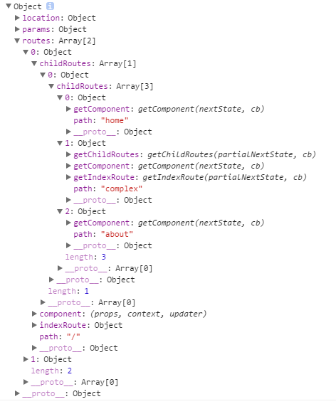
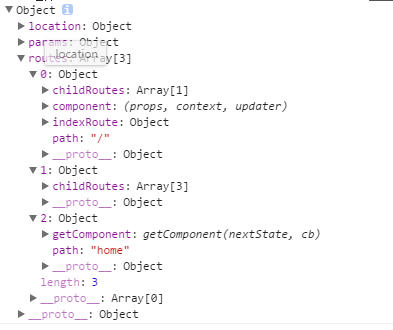

### 1.服务器端我们不要采用code  splitting或者System.import

```js
module.exports = {
    path: 'about',
    getComponent(nextState, cb) {
        //Server-side，we just use require method
        if (ONSERVER) {
            cb(null, require('./components/About.jsx'));
        } else {
            System.import('./components/About.jsx')
                .then((About) => cb(null, About));
        }
    }
}
```

System.import和require.ensure是一样的效果，前者是ES6特性，也是为了[按需加载](https://webpack.js.org/guides/code-splitting-import/#components/sidebar/sidebar.jsx)而生的！此时，对于服务端渲染来说，会根据request.url将About一起渲染成为html字符串然后返回给客户端，而此时客户端只需要加载该About组件单独打包成为的一个客户端chunk来注册事件，响应用户请求就可以了。这样，真正的达到了按需加载，同时结合服务端渲染，对于SEO和首屏加载都是有利的。

### 2.我们在webpack.config.js中使用plugin来定义变量

```js
new webpack.DefinePlugin({
            // http://stackoverflow.com/a/35372706/2177568
            // for server side code, just require, don't chunk
            // use `if (ONSERVER) { ...` for server specific code
            // 服务器端的代码直接require而不是通过if判断
            ONSERVER: false
        })
```

此时我们可以直接在程序中，如入口文件中使用变量：

```js
module.exports = {
    path: 'home',
    getComponent(nextState, cb) {
            // http://stackoverflow.com/a/35372706/2177568
            // for server side code, just require, don't chunk
            // use `if (ONSERVER) { ...` for server specific code
        if (ONSERVER) {
            cb(null, require('./components/Home.jsx'));
        } else {
            System.import('./components/Home.jsx')
                .then((Home) => cb(null, Home));
         //服务器端我们直接require，而客户端我们采用lazyload，采用System.import
        }
    }
}
```

### 3.Server-Rendering的三个打包步骤

```js
"scripts": {
    "test": "echo \"Error: no test specified\" && exit 1",
    "dev": "webpack-dev-server --hot --progress --host 0.0.0.0 --port 8000 --config webpack.client.config.js",
    "server-build": " webpack -p --progress --config webpack.server.config.js",
    //第二步：打包服务器端代码
    "client-build": " webpack -p --progress --config webpack.client.config.js",
    //第一步：打包客户端代码
    "start": "concurrently \"npm run client-build\" \"npm run server-build\" && node build/server.js"
    //第三步：最后启动服务器，其中server-build的入口文件是我们的server.js
  }
```

下面是我们的webpack.server.config.js的内容：

```js
    entry: path.join(__dirname, 'server.js') ,
    //入口文件是server.js，而且target是'node'
    output: {
        path: path.join(__dirname, './build'),
        filename: 'server.js',
    }
```

入口文件是server.js而且target是"node"。但是注意这里并没有html-webpack-plugin，所以html只会包括前面client-build的打包文件，但是这里的文件也会被打包到build/server.js中,然后直接执行node build/server.js!其中server.js的内容是:

```js
// express.js
import path from 'path'
import http from 'http'
import express from 'express'
import fs from 'fs'
// react-router
import React from 'react';
import routes from '~/das_routes.js';
import { match, RouterContext } from 'react-router';
import { renderToString } from 'react-dom/server';
// Create HTTP server
const app = new express()
const server = new http.Server(app)
const index = fs.readFileSync('build/index.html', 'utf8')
//html是通过htmlWebpackPlugin来完成的
const PORT = process.env.PORT || 8000
// Serve static files
app.use(express.static('build'))
// React application rendering
app.use((req, res) => {
    // Match current URL to the corresponding React page
    // req.url必须是完整的URL，包含hash和query等
    match({ routes, location: req.url }, (error, redirectLocation, renderProps) => {
        if (error) {
            res.status(500).send(error.message);
        } else if (redirectLocation) {
            res.redirect(302, redirectLocation.pathname + redirectLocation.search);
        } else if (renderProps) {
            res.status(200)
            var react_stuff = renderToString(<RouterContext {...renderProps} />);
            //renderProps传递给RouterContext
            var c =  index.replace(
                /<div id="root"><\/div>/,
                '<div id="root">' + react_stuff + '</div>'
            );
            //将root中在服务端填充内容
            console.log(c);
            res.send(c);
        } else {
            res.status(404).send('not found');
        }
    })
})
// Start the HTTP server
server.listen(PORT)
console.log("\nApplication available at http://localhost:" + PORT + "\n")
```

该server.js实现了服务端渲染，但是其中使用import等语法，所以相当于通过webpack进行一次编译，以后我们可以直接通过node命令来执行了。这也是为什么我们后面webpack配置中target设置为node的原因：

```js
target: "node"
```


### 4.如何实现了服务端渲染之内部原理初探

其中server.js的内容如下：

```js
// express.js
import path from 'path'
import http from 'http'
import express from 'express'
import fs from 'fs'
// react-router
import React from 'react';
import routes from '~/das_routes.js';
import { match, RouterContext } from 'react-router';
import { renderToString } from 'react-dom/server';
// Create HTTP server
const app = new express()
const server = new http.Server(app)
const index = fs.readFileSync('build/index.html', 'utf8')
//html是通过htmlWebpackPlugin来完成的
const PORT = process.env.PORT || 8000
// Serve static files
app.use(express.static('build'))
// React application rendering
app.use((req, res) => {
    // Match current URL to the corresponding React page
    // req.url必须是完整的URL，包含hash和query等
    match({ routes, location: req.url }, (error, redirectLocation, renderProps) => {
        if (error) {
            res.status(500).send(error.message);
        } else if (redirectLocation) {
            res.redirect(302, redirectLocation.pathname + redirectLocation.search);
        } else if (renderProps) {
            res.status(200)
            var react_stuff = renderToString(<RouterContext {...renderProps} />);
            //renderProps传递给RouterContext
            var c =  index.replace(
                /<div id="root"><\/div>/,
                '<div id="root">' + react_stuff + '</div>'
            );
            //将root中在服务端填充内容
            console.log(c);
            res.send(c);
        } else {
            res.status(404).send('not found');
        }
    })
})
// Start the HTTP server
server.listen(PORT)
console.log("\nApplication available at http://localhost:" + PORT + "\n")
```

首先：通过htmlTemplate指定了我们的html模板，同时我们的所有的客户端打包的代码都会被注入到该template中(也就是compilation.assets所有的内容)

```js
const index = fs.readFileSync('build/index.html', 'utf8')
```

然后：指定静态文件的加载路径为build，也就是我们打包后存放的位置

```js
app.use(express.static('build'))
```

然后，我们加载中间件，拦截网络请求，并替换我们的html模板中的指定的元素内容。

```js
app.use((req, res) => {
    // Match current URL to the corresponding React page
    // req.url必须是完整的URL，包含hash和query等
    match({ routes, location: req.url }, (error, redirectLocation, renderProps) => {
        if (error) {
            res.status(500).send(error.message);
        } else if (redirectLocation) {
            res.redirect(302, redirectLocation.pathname + redirectLocation.search);
        } else if (renderProps) {
            res.status(200)
            var react_stuff = renderToString(<RouterContext {...renderProps} />);
            //renderProps传递给RouterContext
            var c =  index.replace(
                /<div id="root"><\/div>/,
                '<div id="root">' + react_stuff + '</div>'
            );
            //将root中在服务端填充内容
            console.log(c);
            res.send(c);
        } else {
            res.status(404).send('not found');
        }
    })
})
```

最后：启动服务器

```js
server.listen(PORT)
```

### 5.深入理解各个细节部分

#### 5.1给出下面的例子：

```jsx
import React from 'react';
import { render, findDOMNode } from 'react-dom';
import { Router, Route, Link, IndexRoute, Redirect } from 'react-router';
import { createHistory, createHashHistory, useBasename } from 'history';
// 此处用于添加根路径
const history = useBasename(createHashHistory)({
  queryKey: '_key',
  basename: '/blog-app',
});
 
React.render((
  <Router history={history}>
    <Route path="/" component={BlogApp}>
      <IndexRoute component={SignIn}/>
      <Route path="signIn" component={SignIn}/>
      <!-- SignIn组件 -->
      <Route path="signOut" component={SignOut}/>
      <Redirect from="/archives" to="/archives/posts"/>
      <Route onEnter={requireAuth} path="archives" component={Archives}>
        <Route path="posts" components={{
          original: Original,
          reproduce: Reproduce,
        }}/>
      </Route>
      <Route path="article/:id" component={Article}/>
      <Route path="about" component={About}/>
    </Route>
  <\/Router>
), document.getElementById('example'));
```

每一个路由（Route）中声明的组件（比如 SignIn）在渲染之前都会被传入一些 props，具体是在源码中的 RoutingContext.js 中完成，主要包括：

第一个是history 对象：它提供了很多有用的方法可以在路由系统中使用，比如history.replaceState，用于替换当前的 URL，并且会将被替换的 URL 在浏览器历史中删除。函数的第一个参数是 state 对象（和HTML5中的history API是一样的）

第二个是路径；location 对象，它可以简单的认为是 URL 的对象形式表示，这里要提的是 location.state，这里 state 的含义与 HTML5 history.pushState API 中的 state 对象一样。每个 URL 都会对应一个 state 对象，你可以在对象里存储数据，但这个数据却不会出现在 URL 中。实际上，数据被存在了 sessionStorage 中；
事实上，刚才提到的两个对象同时存在于路由组件的 context 中，你还可以通过 React 的 context API 在组件的子级组件中获取到这两个对象。比如在 SignIn 组件的内部又包含了一个 SignInChild 组件，你就可以在组件内部通过 this.context.history 获取到 history 对象，进而调用它的 API 进行跳转等操作。

#### 5.2 使用components实例化某个URL下的多个组件

```js
  <Redirect from="/archives" to="/archives/posts"/>
  <Route onEnter={requireAuth} path="archives" component={Archives}>
     // 常规这里我们是通过this.props.children来实例化内部的Route的 
    <Route path="posts" components={{
     //在/archives/posts下要实例化多个组件
      original: Original,
      reproduce: Reproduce,
    }}/>
 <\/Route>
```

我们看看Archives组件内部如何处理的：

```js
const Archives = React.createClass({
  render() {
    return (
      <div>
        原创：<br/> {this.props.original}
        转载：<br/> {this.props.reproduce}
      <\/div>
    );
  }
});
//父组件接受到的props包括要实例化的哪些组件
const Original = React.createClass({
  render() {
    return (
      <div className="archives">
        <ul>
          {blogData.slice(0, 4).map((item, index) => {
            return (
              <li key={index}>
                <Link to={`/article/${index}`} query={{type: 'Original'}} state={{title: item.title}}>
                  {item.title}
                <\/Link>
              <\/li>
            )
          })}
        <\/ul>
      <\/div>
    );
  }
});
 
const Reproduce = React.createClass({
  // 与 Original 类似
})
```

如果某一个URL下的子组件实例化的时候要实例化多个组件，那么我们在父组件中进行处理，可以通过this.props来获取到！这和配置一个component是一样的，后者是通过this.protps.children来获取，而前者是通过this.props.original而已(内部的Route是`子路由而已`)


#### 5.3 从点击Link到视图改变的路径

可以查看下面这张图：


该图表明，我们的React-router来说，其实就是通过获取浏览器的Location(react-router自己创建的对象，非浏览器原生Location)对象，然后导致UI改变的过程。下面该图详细的表明了从点击Link到UI改变的过程：


其中这里要提的是 location.state，state 的含义与 HTML5 history.pushState API 中的 state 对象一样。`每个 URL` 都会对应一个 state 对象，你可以在对象里存储数据，但这个数据却不会出现在 URL 中。实际上，数据被存在了 sessionStorage 中。

Link 组件最终会渲染为 HTML 标签 <a>，它的 to、query、hash 属性会被组合在一起并渲染为 href 属性。虽然 Link 被渲染为超链接，但在内部实现上使用脚本拦截了浏览器的默认行为，然后调用了history.pushState 方法（注意，文中出现的 history 指的是通过 history 包里面的 create*History 方法创建的对象，window.history 则指定浏览器原生的 history 对象，由于有些 API 相同，不要弄混）。history 包中底层的 pushState 方法支持传入两个参数 state 和 path，在函数体内有将这两个参数传输到 createLocation 方法中，返回 location 的结构如下：

```js
location = {
  pathname, // 当前路径，即 Link 中的 to 属性
  search, // search
  hash, // hash
  state, // state 对象,和HTML5中的state作用一样，每一个URL都会有一个用于保存数据
  action, // location 类型，在点击 Link 时为 PUSH，浏览器前进后退时为 POP，调用 replaceState 方法时为 REPLACE
  key, // 用于操作 sessionStorage存取state对象
};
```

系统会将上述 location 对象作为参数传入到 TransitionTo 方法中，然后调用 window.location.hash 或者window.history.pushState() 修改了应用的 URL，这取决于你创建 history 对象的方式。同时会触发history.listen 中注册的事件监听器。

接下来请看路由系统内部是如何修改 UI 的。在得到了新的 location 对象后，系统内部的 matchRoutes 方法会匹配出 Route 组件树中与当前 location 对象匹配的一个子集，并且得到了 nextState，具体的匹配算法不在这里讲解，感兴趣的同学可以点击查看，state 的结构如下：

```js
nextState = {
  location, // 当前的location 对象，也就是要替换成的location对象，通过Link(to,query,hash,state)
  routes, // 与 location 对象匹配的 Route 树的子集，是一个数组
  params, // 传入的 param，即 URL 中的参数
  components, 
  // routes 中每个元素对应的组件，同样是数组
};
```

我们看看routes对象的内容吧，先给出下面的例子：

```js
module.exports = {
    path: '/',
    component: require('./components/App.jsx'),
    //routes[0]
    indexRoute: {
        onEnter: (nextState, replace) => {
            replace('/home')
        }
    },
    childRoutes: [ {
        childRoutes: [
            require('./routes/Home'),
            //这里三个都是App.jsx的this.props.children，默认是实例化这个组件Home
            require('./routes/Complex'),
            require('./routes/About')
        ],
    } ]
};
```

此时，当我们访问'localhost:8000/'会被重定向到'http://localhost:8000/home'，而我们得到的routes将会是如下的内容：



如果直接在Home组件中访问nextState就会得到下面的对象：



在 *Router* 组件的 componentWillMount(也就是说最后还是通过Router的history对象来修改) 生命周期方法中调用了 history.listen(listener) 方法。listener 会在上述 matchRoutes 方法执行成功后执行 listener(nextState)，nextState 对象每个属性的具体含义已经在上述代码中注释，接下来执行 this.setState(nextState) 就可以实现重新渲染 Router 组件。举个简单的例子，当 URL（准确的说应该是 location.pathname） 为 /archives/posts 时，应用的匹配结果如下图所示：


注意：我们构建了location(点击Link),然后通过location得到nextState，最后通过window.history.pushState来触发Router对象的上的listen，最后导致UI改变！！


参考资料：

[深入理解 react-router 路由系统](http://web.jobbole.com/84418/)

[react-router API](https://github.com/ReactTraining/react-router/blob/v3/docs/API.md)
