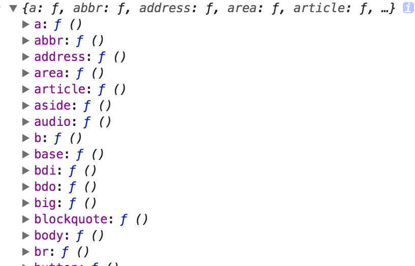

#### 主要内容
在本章节，主要是一些React相关内容，比如React组件中加载js文件，findDOMNode，原型链属性方法与constructor属性方法调用顺序等
#### 1.学会使用findDOMNode(this)与React.DOM[element]
```js
import hljs from 'highlight.js';
import React from 'react';
import ReactDOM from 'react-dom';

class Highlight extends React.Component {
    componentDidMount() {
        this.highlightCode();
    }
    componentDidUpdate() {
        this.highlightCode();
    }
    highlightCode() {
        const domNode = ReactDOM.findDOMNode(this);
        //(1)获取该组件挂载的所有的DOM节点而不是虚拟DOM，挂载的方式是将this.props.children放到特定的标签里面完成挂载，同时用户可以指定挂载的元素的标签类型
        const nodes = domNode.querySelectorAll('pre code');
        let i;
        for (i = 0; i < nodes.length; i++) {
            hljs.highlightBlock(nodes[i]);
        }
    }
    render() {
        const {children, className, element, innerHTML} = this.props;
        let Element = element ? React.DOM[element] : null;
        //(2)用户指定了特定的标签类型，将this.props.children挂载到该类型的标签上并返回
        if (innerHTML) {
           //(3)Enable to render markup with dangerouslySetInnerHTML!如果允许使用dangerouslySetInnerHTML方法
           //如果没有指定标签那么使用div即可
            if (!Element) {
                Element = React.DOM.div
            }
            //将children作为dangerouslySetInnerHTML插入进去
            return Element({dangerouslySetInnerHTML: {__html: children}, className: className || null}, null);
        } else {
            if (Element) {
                //(4)如果指定了放置到特定的元素里面，那么我们手动创建这个元素(通过React.DOM可以获取创建特定标签的函数)，然后将children放进去
                return Element({className}, children);
            } else {
                //(5)如果没有指定特定的元素，那么久直接返回一个pre+code标签，同时将children放到这个code标签里面
                return <pre><code className={className}>{children}</code></pre>;
            }
        }
    }
}
Highlight.defaultProps = {
    innerHTML: false,
    className: null,
    element: null,
};
export default Highlight;
```
组件并不是真实的 DOM 节点，而是存在于内存之中的一种数据结构，叫做虚拟 DOM （virtual DOM）。只有当它插入文档以后，才会变成真实的 DOM 。根据 React 的设计，所有的 DOM 变动，都先在虚拟 DOM 上发生，然后再将实际发生变动的部分，反映在真实 DOM上，这种算法叫做 DOM diff ，它可以极大提高网页的性能表现。
但是，有时需要从组件获取真实 DOM 的节点，这时就要用到 React.findDOMNode 方法。基础信息你可以[点击这里](https://www.kancloud.cn/kancloud/react/67582)，该例子给出了[通过ref来获取到真实的用户输入](../react-ref/index.md)。上面的代码片段来自于[react-highlight](https://github.com/akiran/react-highlight/blob/master/src/index.js)的源码，通过这个源码很容易就知道，通过findDOM(this)可以获取到当前组件所有挂载的真实DOM节点，然后进行高亮显示。而React.DOM[element]可以获取到React构建特定标签的构造函数，如下图:



我们给出一个简单的例子:
```js
class Demo extends React.Component{
       render(){
         return (
           <div>demo<\/div>
         ) 
       }
     }
 class Test extends React.Component{
   componentDidMount(){
      const reactDOM = ReactDOM.findDOMNode(this);
      console.log('reactDOM',reactDOM);
   }
   render(){
     const reactDOM = ReactDOM.findDOMNode(this);
     console.log('reactDOM',reactDOM);
     return (
        <div>
         <Demo/>
         <h1>Hello, world!</h1>
         <span></span>
       <\/div>
     )
   }
 }
  ReactDOM.render(
   <Test\/>,
    document.getElementById('example')
  );
```
此时你会发现在render方法中reactDOM为undefined，而在componentDidMount中获取到的是这个组件的真实DOM。此时内容如下:
```html
<div data-reactroot="">
  <div>demo</div>
  <h1>Hello, world!</h1>
  <span></span>
</div>
```
即reactDOM是将该组件所有的子组件都渲染为真实的DOM以后得到的nativeDOM对象。此时，你可以通过调用querySelectorAll来继续获取DOMNode的子元素，因为React中最外层不能有平级的元素，所以此处相当于调用含有data-reactroot属性的元素的native方法。

#### 2.在React的html字符串中添加组件
假如我有如下的方法:
```js
  generateTableDOM=(data)=>{
    let thead = `<tr>`;
    let row = ``;
    for(let j=0,len=data.length;j<len;j++){
      thead += `<th>${data[j].profileValue}</th>`
      row +=`<td align='center'><div>`;
      //得到了一列数据
      for(let i=0,length=data[j].children.length;i<length;i++){
        row +=`<Tooltip><p title=${data[j].children[i].name+":"+data[j].children[i].value} alt=${data[j].children[i].name+":"+data[j].children[i].value}>${data[j].children[i].value}</p></Tooltip>`
      }
      row+="</div></td>";
    }
    thead +=`</tr>`;
    //得到表头了
    return `<table style='width:100%'><thead>${thead}</thead><tbody>${row}</tbody></table>`
  }
```
很显然，我里面使用了Antd的Tooltip组件，而且这个组件是插入到html字符串中。那么当我以dangerlySetInnerHTML的方式插入到组件中，你会发现我们的Tooltip直接被浏览器解析为`"<tooltip>"`标签了，而因为html5中没有这个标签，所有可能会被解析为inline元素。那么我们如何处理呢?答案是通过React.createElement来完成。结果方法如下:
```js
generateTableDOM=(data)=>{
  let thead = React.createElement('tr');
  const thContainers = [];
  const rowContainers = [];
  let childContainers = [];
  for(let j=0,len=data.length;j<len;j++){
    thContainers.push(React.createElement('th',{},data[j].profileValue));
    //得到了一列数据
    for(let i=0,length=data[j].children.length;i<length;i++){
      const tooltipDOM = React.createElement(Tooltip,{title:data[j].children[i].name+":"+data[j].children[i].value},<p>{data[j].children[i].value}</p>);
      //此时是一个React元素
      childContainers.push(tooltipDOM);      
    }
    rowContainers.push(React.createElement('td',{'name':'覃亮',style:{textAlign:'center'}},React.createElement('div',{},childContainers))); 
    childContainers=[];
  }
  //得到表头了
  return <table style={{width:'100%'}}><thead>{thContainers}</thead><tbody>{React.createElement('tr',{},rowContainers)}</tbody></table>
}
```
很显然，我们最后返回的是React组件，而不再是我们的字符串。当然，你也可以通过[babel.transform](https://stackoverflow.com/questions/38965088/how-to-put-react-component-inside-html-string)来完成，我们这里不再演示。

#### 3.React的splice方法删除数据组件渲染问题
比如有如下的代码:
```js
 const materials = this.state.materials.map((elem, index) => {
      return (
        <Row style={{ marginTop: "10px", marginLeft: "100px" }} key={index}>
          <Col style={{ textAlign: "left", width: "100px", float: "left" }}>
            <label style={{ fontSize: "14px" }}>{elem.sourceText} :</label>
          </Col>
          <Col span={10}>
            <InputNumber style={{ marginLeft: "60%" }} defaultValue={elem.weight} onChange={(value)=>{this.resourceValueChange(index,value)}}/> %
          </Col>
          <Col span={2}>
            <Icon type="minus-circle-o" style={{lineHeight: "28px"}} onClick={()=>{this.deleteResource(index)}}/>
          </Col>
        </Row>
      );
    });
```
而`this.state.materials`数据如下:
```js
  "taskMaterialList": [
    {
      "sourceText": "video",
      "sourceValue": "www.baidu.com",
      "weight": 0
    },
    {
      "sourceText": "video",
      "sourceValue": "www.baidu.com",
      "weight": 20
    },
    {
      "sourceText": "video",
      "sourceValue": "www.baidu.com",
      "weight": 30
    }
  ]
```
通过splice修改了数据，删除weight为20的元素。一开始产生的三个Row元素的key为[0,1,2]，而删除后我们的key为[0,1]，这样React会认为key为2的元素被删除了，而key为[0,1]的元素可以复用，从而产生每次都删除最后一个Row元素的效果。解决方法就是在Row中指定如下的key:
```js
const randomKeys = [];
export function generateRandomKey() {
  let key = Math.random().toString().substring(2);
  while (randomKeys.includes(key)) {
    key = Math.random().toString().substring(2);
  }
  return key;
}
```
这样每一个Row元素都会被重新渲染，而React不会重用它!上面使用的是自己产生独立key的方法，但是如果this.state.materials中有一个独立无二的属性标志该条记录的字段，那么使用它就可以了，比如ID！

#### 4.React组件被渲染多次执行componentDidMount导致的问题
比如我们有如下的代码:
```js
  <ExposeCrowd {...descriptorForm} key={"crowd_"+key}  exposureCrowd={exposureCrowd}/>
```
这里的key每次都是不同的，这样当上层组件变化导致该组件ExposeCrowd被渲染多次的时候就会存在问题。比如下面的代码:
```js
componentDidMount() {
    IO.get("/rule/listByIds.json", { ids: this.props.exposureCrowd })
      .then(res => {
        if (res.success) {
          const {data} = res;
          console.log("lebel内容为:", res);
          if (this._isMounted) {
            const map = {};
            for (let id in res.data) {
              map[id] = res.data[id].ruleName;
            }
            //只有在组件没有被卸载的时候才能setState
            this.setState({
              selectedRuleMap: map
            });
          }
        } else {
          message.error('获取已选规则列表失败：' + res.message);
        }
      })
      .catch(e => {
        message.error('获取已选规则列表失败，请稍后尝试');
      });
  }
```
因为ExposeCrowd被渲染的时候key都是不同的，所以该组件一直都是调用componentDidMount方法。但是，如果渲染多次的时候，就会存在这种情况:第一次请求出去了，但是key被重新赋值了，相当于组件已经被卸载了，这时候请求回来再调用setState就会存在问题:
<pre>
warning.js:33 Warning: setState(...): Can only update a mounted or mounting component. This usually means you called setState() on an unmounted component. This is a no-op. Please check the code for the ExposeCrowd component.
</pre>

其中解决方法如下:
```js
  componentWillUnmount() {
    this._isMounted = false;
  }
  componentDidMount() {
    this._isMounted = true;
    IO.get("/rule/listByIds.json", { ids: this.props.exposureCrowd })
      .then(res => {
        if (res.success) {
          const {data} = res;
          if (this._isMounted) {
            const map = {};
            for (let id in res.data) {
              map[id] = res.data[id].ruleName;
            }
            //只有在组件没有被卸载的时候才能setState
            this.setState({
              selectedRuleMap: map
            });
          }
        } else {
          message.error('获取已选规则列表失败：' + res.message);
        }
      })
      .catch(e => {
        message.error('获取已选规则列表失败，请稍后尝试');
      });
  }
```
就是通过_isMounted来记录该组件是否已经被卸载了，如果卸载了就不再执行setState，导致出现这种问题。

其实React官方网站提供了isMounted方法去避免在组件卸载后重新调用setState方法。因为在卸载的组件上调用setState方法意味着你的应用或者组件没有清理已经不需要的属性，这也意味着你的应用一直保存着对于这个卸载的组件的引用，这可能会出现内存泄露。可以使用如下的方法来解决:
```js
if (this.isMounted()) { // This is bad.
  this.setState({...});
}
```
这种方式虽然可以取消React的警告信息，但是不是好的方法，因为它并没有解决对于卸载组件的引用问题。因此，我们可以使用上面我的那个例子，使用_isMounted属性来达到效果。在componentDidMount中设置为true,而componentWillUnmount设置为false，通过这种方式来检测组件当前的状态。而且在ES6的class类型的组件中，我们的isMount方法已经被禁止使用了。原理请[点击这里](https://reactjs.org/blog/2015/12/16/ismounted-antipattern.html)。

最后采用的是如下的[makeCancelable](https://github.com/facebook/react/issues/5465#issuecomment-157888325)方案:
```js
import React from "react";
import ReactDOM from "react-dom";
export default class Texst extends React.Component{
 promise = new Promise((resolve,reject)=>{});
 //默认Promise
 makeCancelable = (promise) => {
  let hasCanceled_ = false;
  const wrappedPromise = new Promise((resolve, reject) => {
    //（1）直接为原来的promise添加then方法
    // promise.then(
    //   val => hasCanceled_ ? reject({isCanceled: true}) : resolve(val),
    //   error => hasCanceled_ ? reject({isCanceled: true}) : reject(error)
    // );
    // （2）上面这种模式如果success回调函数抛出了错误，那么第二个error函数是不能捕获到的
    // https://www.tuicool.com/articles/6fqQ3aB
    // promise.then((val) =>
    //   hasCanceled_ ? reject({isCanceled: true}) : resolve(val)
    // );
    // promise.catch((error) =>
    //   hasCanceled_ ? reject({isCanceled: true}) : reject(error)
    // );
    // One of the changes in node 6.6.0 is that all unhandled promise rejections result in a warning. The existing code from @vpontis had separate then and catch calls on the same base promise. Effectively, this creates two promises, one which only handles success, and one which only handles errors. That means that if there is an error, the first promise will be viewed by node as an unhandled promise rejection.
    // （3）在nodejs中上面这种方案相当于创建了两个promise，一个处理success，一个处理error。当抛出错误后，第一个promise将会被看做是unhandled project rejection，从而抛出UnhandledPromiseRejectionWarning。
     promise
      .then((val) =>
        hasCanceled_ ? reject({isCanceled: true}) : resolve(val)
      )
      .catch((error) =>
        hasCanceled_ ? reject({isCanceled: true}) : reject(error)
      );
      // 这种方式
  });
  return {
    promise: wrappedPromise,
    cancel() {
      hasCanceled_ = true;
    },
  };
};

/**
 * 如果组件已经卸载就直接将hasCanceled_设置为true
 * any callbacks should be canceled in componentWillUnmount, prior to unmounting.
 * 任何的回调应该在componentWillUnmount中被取消，同时要早于组件被卸载!
 */
 componentWillUnmount(){
   this.promise.cancel();
 }
  /**
   *模拟ajax请求，我们在回调中不是立即setState，而是根据条件判断是否应该使用setState。而是在this.makeCancelable
   *产生的回调then中进行判断
   */
  componentDidMount(){
   this.promise = this.makeCancelable(new Promise((resolve,reject)=>{
       setTimeout(()=>{
        const random = Math.random();
         if(random<0.7){
           resolve('success!');
          //模拟ajax请求成功了
           // this.setState({
           //   name:'覃亮'
           // });
         }else{
           reject('reject!');
          //模拟ajax请求成功了
           // this.setState({
           //   name:'Not found!'
           // });
         }
       },0)
    }))
   //(1)如果成功，那么我setState，否则不做处理，打印组件已经被卸载。
   //此时，我们知道组件并没有被卸载掉，所有可以直接setState
    this.promise.promise.then(() => {
      this.setState({
        name:'覃亮'
      });
      console.log('resolved')
    })
    .catch((reason) => {
      //如果reject就会进入这里的逻辑
      //(2)此时我们知道组件已经被卸载，不再调用this.setState,因为this表示的组件已经被卸载掉了
      //但是，componentDidMount中打印this还是可以获取到组件实例的。在componentWillUnmount组件将会被卸载，因为没有引用他的任何方法
      //   this.setState({
      //   name:'1'
      // });
      // console.log('this--------->',this);
      console.log('组件已经被卸载，不能调用setState', reason.isCanceled)
    });
  }
  render(){
    console.log('render');
    //后面的四次渲染因为是key变化，所以每次组件都是不一样的实例对象，总共执行5次
    return <div>Texst内容</div>
  }
}
//其中Promise可以是如下的类型
///**
//  * 对 fetch 过程的通用包装
//  */
// function fetchW(req, opt) {
//   return fetch(req, opt).then(checkStatus).catch(function (err) {
//     console.error('fetch failed', err); // eslint-disable-line
//   }).then(parseJSON).then(function (data) {
//     return data;
//   });
// }
```
代码请在react-QA目录下运行`npm run dev`。


#### 5.[transform-class-properties](http://babeljs.io/docs/plugins/transform-class-properties)使得constructor方法在class属性后赋值调用
```js
 class Test extends React.Component{
       constructor(props){
        super(props);
         this.name = "覃亮";
         console.log('constructor被调用');
       }
       resourceCopy = console.log(this.props.getValue()|| [])
}
```
此时，我们的class上的属性resourceCopy会在constructor方法之前被调用，但是他们同属于prototype chain上的属性。babel打包后的代码为:
```js
"use strict";
function _classCallCheck(instance, Constructor) { if (!(instance instanceof Constructor)) { throw new TypeError("Cannot call a class as a function"); } }
function _possibleConstructorReturn(self, call) { if (!self) { throw new ReferenceError("this hasn't been initialised - super() hasn't been called"); } return call && (typeof call === "object" || typeof call === "function") ? call : self; }
function _inherits(subClass, superClass) { if (typeof superClass !== "function" && superClass !== null) { throw new TypeError("Super expression must either be null or a function, not " + typeof superClass); } subClass.prototype = Object.create(superClass && superClass.prototype, { constructor: { value: subClass, enumerable: false, writable: true, configurable: true } }); if (superClass) Object.setPrototypeOf ? Object.setPrototypeOf(subClass, superClass) : subClass.__proto__ = superClass; }
var Test = function (_React$Component) {
  _inherits(Test, _React$Component);
  //(1)继承React.Component
  function Test(props) {
    _classCallCheck(this, Test);
  //(2)检查组件的this指向
    var _this = _possibleConstructorReturn(this, (Test.__proto__ || Object.getPrototypeOf(Test)).call(this, props));
  //(3)调用super方法
    _this.resourceCopy = console.log(_this.props.getValue() || []);
  //(4)class的property在super方法调用后，而super方法里面的this赋值之前被调用
    _this.name = "覃亮";
    console.log('constructor被调用');
    return _this;
  }
  return Test;
}(React.Component);
```

#### 6.Babel在打包class时先添加class property(属性和方法)然后添加constructor方法
比如有下面的代码:
```js
 class Parent{}
 class Test extends Parent{
   constructor(props){
     super(props);
     this.name = "覃亮";
     this.resourceCopy = this.getStatus();
     console.log(this.resourceCopy);
   }
    getStatus=()=>{
      return "已婚";
    }
 }
new Test()
```
因为在super(props)后面代码执行之前,我们的class属性和方法(getStatus)已经被添加了，所以在super方法后面是可以调用class属性或者方法的。上面的代码编译后的结果为:
```js
"use strict";
function _possibleConstructorReturn(self, call) { if (!self) { throw new ReferenceError("this hasn't been initialised - super() hasn't been called"); } return call && (typeof call === "object" || typeof call === "function") ? call : self; }
function _inherits(subClass, superClass) { if (typeof superClass !== "function" && superClass !== null) { throw new TypeError("Super expression must either be null or a function, not " + typeof superClass); } subClass.prototype = Object.create(superClass && superClass.prototype, { constructor: { value: subClass, enumerable: false, writable: true, configurable: true } }); if (superClass) Object.setPrototypeOf ? Object.setPrototypeOf(subClass, superClass) : subClass.__proto__ = superClass; }
function _classCallCheck(instance, Constructor) { if (!(instance instanceof Constructor)) { throw new TypeError("Cannot call a class as a function"); } }
var Parent = function Parent() {
  _classCallCheck(this, Parent);
};
var Test = function (_Parent) {
  _inherits(Test, _Parent);
  function Test(props) {
    _classCallCheck(this, Test);
    var _this = _possibleConstructorReturn(this, (Test.__proto__ || Object.getPrototypeOf(Test)).call(this, props));
    //(1)第一步执行super(props)
    _this.getStatus = function () {
      return "已婚";
    };
   //(2)添加class属性或者方法
    _this.name = "覃亮";
    _this.resourceCopy = _this.getStatus();
    console.log(_this.resourceCopy);
   //(3)执行super后的结果
    return _this;
  }
  return Test;
}(Parent);
new Test();
```
从上面的代码顺序:
```js
 //(1)第一步执行super(props)
    _this.getStatus = function () {
      return "已婚";
    };
   //(2)添加class属性或者方法
    _this.name = "覃亮";
    _this.resourceCopy = _this.getStatus();
    console.log(_this.resourceCopy);
   //(3)执行super后的结果
```
知道，因为_this.getStatus()在调用之前已经被定义过了，所以代码是正常的。这也是Babel处理class属性和方法的原理!

#### 4.一个页面中有多个相同组件的问题
比如下面的例子:
```js
class XCounter extends React.Component{
    static idCounter = 0;
    static scriptLoaderContainer = [];
     // Notice 1:静态属性属于类对象，而不是类实例
    constructor(props) {
    super(props);
     this.scriptLoaderId = `id${this.constructor.idCounter++}`; 
     this.constructor.scriptLoaderContainer.push(this.scriptLoaderId);
      //Notice 2:这里的this属性属于类实例，而不是类对象
    }
    render(){
     return null
    }
  }
  ReactDOM.render(<div>
     <XCounter/><XCounter/>
  </div>,document.getElementById('example'));
  console.log('当前的数量为:',XCounter.idCounter);
  //2
  console.log('当前的数量为:',XCounter.scriptLoaderContainer);
  //["id0", "id1"]
```
在页面中有多个XCounter组件被实例化，而其对应的构造函数是同一个，该构造函数的静态变量idCounter是共享的，所以上面的XCounter.idCounter为2。但是每一个组件都是有自己独立的scriptLoaderId属性的，这一点一定要注意!从这里例子我们知道:静态变量是类所**共享**的，可以利用这个特性做出很多有意思的判断，比如下面的例子。

#### 5.如何在react组件中加js文件
```js
export default class Script extends React.Component {
  static propTypes = {
    attributes: RPT.object, // eslint-disable-line react/forbid-prop-types
    onCreate: RPT.func,
    onError: RPT.func.isRequired,
    onLoad: RPT.func.isRequired,
    url: RPT.string.isRequired,
  };
  static defaultProps = {
    attributes: {},
    onCreate: () => {},
    onError: () => {},
    onLoad: () => {},
  }
  // A dictionary mapping script URLs to a dictionary mapping
  // component key to component for all components that are waiting
  // for the script to load.
  static scriptObservers = {};
  // 特定的URL是否已经加载完成
  // this.constructor.scriptObservers[url][this.scriptLoaderId] = this.props;
  // 每一个URL对应于多个scriptLoaderId，但是只会检查一个是否已经加载完毕
  static loadedScripts = {};
  // this.constructor.loadedScripts[url] = true;
  static erroredScripts = {};
  // this.constructor.erroredScripts[url] = true;
  static idCount = 0;
  // 该组件已经被实例化了多少个对象
  constructor(props) {
    super(props);
    this.scriptLoaderId = `id${this.constructor.idCount++}`; 
    //1.如果某一个页面有多个该Script标签，那么其特定的this.scriptLoaderId都是唯一的
  }
  componentDidMount() {
    const { onError, onLoad, url } = this.props;
    //fix 1:如果该URL已经加载过了，然后又在页面其他地方要求加载，因为this.constructor.loadedScripts[url]已经被设置为true，那么直接调用onLoad方法
    if (this.constructor.loadedScripts[url]) {
      onLoad();
      return;
    }
    //fix 2:如果该URL已经加载过了，而且加载出错，然后又在页面其他地方要求加载，因为tthis.constructor.erroredScripts[url]已经被设置为true，那么直接调用onError方法
    if (this.constructor.erroredScripts[url]) {
      onError();
      return;
    }
    // If the script is loading, add the component to the script's observers
    // and return. Otherwise, initialize the script's observers with the component
    // and start loading the script.
    // fix 3:如果某一个URL已经在加载了，即this.constructor.scriptObservers[url]被设置为特定的值了，那么如果还要求该URL那么直接返回，防止一个组件被加载多次
    if (this.constructor.scriptObservers[url]) {
      this.constructor.scriptObservers[url][this.scriptLoaderId] = this.props;
      return;
    }
    //8.this.constructor.scriptObservers用于注册某一个URL特定的对象,其值为为该组件添加的所有的props对象，而key为该组件实例的this.scriptLoaderId
    this.constructor.scriptObservers[url] = {
      [this.scriptLoaderId]: this.props
    };
    this.createScript();
  }
  componentWillUnmount() {
    const { url } = this.props;
    const observers = this.constructor.scriptObservers[url];
    // If the component is waiting for the script to load, remove the
    // component from the script's observers before unmounting the component.
    // componentWillUnmount只是卸载当前的组件实例而已，所以直接delete当前实例的this.scriptLoaderId
    if (observers) {
      delete observers[this.scriptLoaderId];
    }
  }

  createScript() {
    const { onCreate, url, attributes } = this.props;
    //1.onCreate在script标签创建后被调用
    const script = document.createElement('script');
    onCreate();
    // add 'data-' or non standard attributes to the script tag
    // 2.所有attributes指定的属性都会被添加到script标签中
    if (attributes) {
      Object.keys(attributes).forEach(prop => script.setAttribute(prop, attributes[prop]));
    }
    script.src = url;
    // default async to true if not set with custom attributes
    // 3.如果script标签没有async属性，表示不是异步加载的
    if (!script.hasAttribute('async')) {
      script.async = 1;
    }
    //5.shouldRemoveObserver(observers[key])用于移除特定的监听器并触发onLoad
    const callObserverFuncAndRemoveObserver = (shouldRemoveObserver) => {
      const observers = this.constructor.scriptObservers[url];
      //监听当前URL的scriptObservers，然后获取该Observer的key，即对应于this.scriptLoaderId，每一个组件实例都是唯一的，一个URL可能多个this.scriptLoadedId相对应:
      // if (this.constructor.scriptObservers[url]) {
    //   this.constructor.scriptObservers[url][this.scriptLoaderId] = this.props;
    //   return;
    // }
      Object.keys(observers).forEach((key) => {
        //如果某一个特定的key对应的，传入的observers[key]就是该组件实例的this.props
        if (shouldRemoveObserver(observers[key])) {
          delete this.constructor.scriptObservers[url][this.scriptLoaderId];
        }
      });
    };
    //4.onload将该URL已经加载的状态设置为true
    script.onload = () => {
      this.constructor.loadedScripts[url] = true;
      callObserverFuncAndRemoveObserver((observer) => {
        //6.调用用户自己的onLoad表示脚本加载完成
        observer.onLoad();
        return true;
      });
    }
    script.onerror = () => {
      this.constructor.erroredScripts[url] = true;
      callObserverFuncAndRemoveObserver((observer) => {
        //7.调用用户自己的onError表示加载错误
        observer.onError();
        return true;
      });
    };
    document.body.appendChild(script);
  }
  render() {
    return null;
  }
}
```
该组件提供了以下属性:
<pre>
onCreate:当script标签被创建的时候调用
onError:script加载异常时候触发
onLoad:script加载完成触发，如果该URL已经加载完成了一次，那么下一次直接执行该方法而不是重新加载
url:要加载的链接地址
attributes:添加html5自定义属性或者id等，不做区分s
</pre>

参考资料：

[七、React.findDOMNode()](https://www.kancloud.cn/kancloud/react/67582)

[React 集成 highlight](http://me.lizhooh.com/2017/09/01/React/React/React%20%E9%9B%86%E6%88%90%20highlight/)

[React异步请求数据出现setState(...): Can only update a mounted or mounting component...](http://blog.csdn.net/dengdengda/article/details/77891912)

[Deprecate `isMounted`](https://github.com/facebook/react/issues/5465#issuecomment-157888325)

[react-load-script](https://github.com/blueberryapps/react-load-script)
