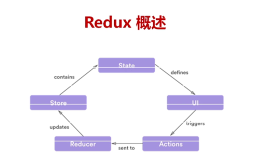

### 1.深入分析redux中的createStore方法
我们首先以一个官方demo来说,代码如下:

```js
import React from 'react'
import ReactDOM from 'react-dom'
import { createStore } from 'redux'
import Counter from './components/Counter'
import counter from './reducers'
const store = createStore(counter)
const rootEl = document.getElementById('root')
const render = () => ReactDOM.render(
  <Counter
    value={store.getState()}
    onIncrement={() => store.dispatch({ type: 'INCREMENT' })}
    onDecrement={() => store.dispatch({ type: 'DECREMENT' })}
  \/>,
  rootEl
)
render()
store.subscribe(render)
```
下面我们来看看createStore的作用:

```js
const store = createStore(counter)
//下面就是counter函数
export default (state = 0, action) => {
  switch (action.type) {
    case 'INCREMENT':
      return state + 1
    case 'DECREMENT':
      return state - 1
    default:
      return state
  }
}
```
createStore表示我们创建一个数据库，这个数据库计算下一个状态的方式是通过counter来完成的。而且，如果你要计算下一个状态，需要给我传入当前状态，以及你需要的特定的操作的名称，即Action。同时，这个数据库也提供了很多其他的方法。

<pre>
    getState: 获取当前的数据库的状态

    subscribe: 当你对数据库发出一个指令，而且数据库根据这个指令已经计算得到新的状态
    以后需要执行的回调函数

    dispatch：发出一个Action，告诉数据库你要干嘛。数据库会根据当前的状态以及你的命令类型计算得到新的状态。计算完成以后，我们要执行subscribe添加的所有的回调函数.

    replaceReducer:用一个新的store替换掉我们当前的store用来计算我们的新的state。如果你的app支持code splitting, 而且你想要动态加载reducer。同时如果你要为你的Redux支持Hot Reloading也需要
 
    observable:
</pre>

其中observable的内容如下:

```js
 function observable() {
    var outerSubscribe = subscribe
    return {
      subscribe(observer) {
        if (typeof observer !== 'object') {
          throw new TypeError('Expected the observer to be an object.')
        }
        function observeState() {
          if (observer.next) {
            observer.next(getState())
          }
        }
        observeState()
        var unsubscribe = outerSubscribe(observeState)
        return { unsubscribe }
      },
      [$$observable]() {
        return this
      }
    }
  }
```
该方法的实现不是本文讨论的重点，你可以查看文末的参考资料。此时我们回到上面的源代码。

第一步：createStore构建数据库并传入计算新state的规则

```js
const store = createStore(counter)
```
数据库会有上面的getState,subscribe,dispatch,replaceReducer,observable等各种方法。你可以给它注册事件，也可以从它哪里获取到数据。

第二步：注册回调函数。当数据库收到指令，并且通过它计算到新的值的时候重新render。也就是说，每次dispatch导致数据库状态变化后我们都会`重新render`

```js
store.subscribe(render)
```
第三步：渲染render页面

```js
const render = () => ReactDOM.render(
  <Counter
    value={store.getState()}
    //获取数据库状态
    onIncrement={() => store.dispatch({ type: 'INCREMENT' })}
    //向数据库发送指令
    onDecrement={() => store.dispatch({ type: 'DECREMENT' })}
  \/>,
  rootEl
)
render()
```

### 2.深入分析redux中的combineReducers方法
首先贴上源码（关键部分）:

```js
export default function combineReducers(reducers) {
  var reducerKeys = Object.keys(reducers)
  var finalReducers = {}
  //对每一个reducer进行循环，将那些导出是函数的reducer保存到finalReducers中
  for (var i = 0; i < reducerKeys.length; i++) {
    var key = reducerKeys[i]
    if (NODE_ENV !== 'production') {
      if (typeof reducers[key] === 'undefined') {
        warning(`No reducer provided for key "${key}"`)
      }
    }
    if (typeof reducers[key] === 'function') {
      finalReducers[key] = reducers[key]
    }
  }
  var finalReducerKeys = Object.keys(finalReducers)
  //得到我们关注的reducer所有的键名
  if (NODE_ENV !== 'production') {
    var unexpectedKeyCache = {}
  }
  var sanityError
  try {
    assertReducerSanity(finalReducers)
  } catch (e) {
    sanityError = e
  }
  //此时我们的combineReducers返回一个函数了，也就是最终结合起来的reducer
  //和普通的reducer一样，接收state与action为两个参数
  return function combination(state = {}, action) {
    if (sanityError) {
      throw sanityError
    }
    if (NODE_ENV !== 'production') {
      var warningMessage = getUnexpectedStateShapeWarningMessage(state, finalReducers, action, unexpectedKeyCache)
      if (warningMessage) {
        warning(warningMessage)
      }
    }
    var hasChanged = false
    var nextState = {}
    //http://redux.js.org/docs/api/combineReducers.html
    //此时key为["todos","counter"]
    //store.dispatch({
    //   type: 'ADD_TODO',
    //   text: 'Use Redux'
    // })
    // 此时表示我们会要reducers去处理，但是具体让那个reducer处理是要我们自己选择的~~
    for (var i = 0; i < finalReducerKeys.length; i++) {
      var key = finalReducerKeys[i]
      //此时如todos,counter两个key
      var reducer = finalReducers[key]
      //得到某个key对应的具体的reducer函数。如上面这种情况key和value是一致的，为todos和counter
      var previousStateForKey = state[key]
      //对于每一个reducer只会处理相应的key,所以我们的state肯定是如下的格式
      //{todos:[],counter:0}，也就是我们 ${ActionTypes.INIT}的初始值
      var nextStateForKey = reducer(previousStateForKey, action)
      //第一次循环如果是todos，那么我们会获取state中的todos的值以及action传入计算得到新的todos值
      if (typeof nextStateForKey === 'undefined') {
        var errorMessage = getUndefinedStateErrorMessage(key, action)
        throw new Error(errorMessage)
      }
      nextState[key] = nextStateForKey
      //更新这个key的值
      hasChanged = hasChanged || nextStateForKey !== previousStateForKey
      //这个state是否发生变化
    }
    //如果没有一个属性的值发生变化，那么hasChanged就是为false
    return hasChanged ? nextState : state
  }
}
```
我们真实使用的使用是如下方式的:

```js
  import todos from './todos'
  import counter from './counter'
  export default combineReducers({
    todos,
    counter
  })
```
你应该知道，我们这里导出的调用combineReducers后的结果其实就是我们组合后的reducer函数，这个函数会被传入到createStore中，就像以前我们传入单个reducer函数到createSStore中一样。对于每一个reducer函数的编写也是有具体的要求的:

```js
function assertReducerSanity(reducers) {
  Object.keys(reducers).forEach(key => {
    var reducer = reducers[key]
    var initialState = reducer(undefined, { type: ActionTypes.INIT })
    //通过对我们的reducer执行ActionTypes.INIT，得到这个reducer的初始值
    if (typeof initialState === 'undefined') {
      throw new Error(
        `Reducer "${key}" returned undefined during initialization. ` +
        `If the state passed to the reducer is undefined, you must ` +
        `explicitly return the initial state. The initial state may ` +
        `not be undefined.`
      )
    }

    var type = '@@redux/PROBE_UNKNOWN_ACTION_' + Math.random().toString(36).substring(7).split('').join('.')
    //我们的每一个reducer传入的第一个参数是state，第二个参数是Action
   //(1)不要处理@@redux这个空间下的Action或者@@redux下的${ActionTypes.INIT}，他们是私有的
   //(2)对于我们未知的action我们必须返回当前的state状态，除非这个Action是undefined.
   //   此时因为action是undefined,所以我们返回初始值，而不管Action本身的类型
    if (typeof reducer(undefined, { type }) === 'undefined') {
      throw new Error(
        `Reducer "${key}" returned undefined when probed with a random type. ` +
        `Don't try to handle ${ActionTypes.INIT} or other actions in "redux/*" ` +
        `namespace. They are considered private. Instead, you must return the ` +
        `current state for any unknown actions, unless it is undefined, ` +
        `in which case you must return the initial state, regardless of the ` +
        `action type. The initial state may not be undefined.`
      )
    }
  })
}
```
注意三点：通过对我们的reducer执行ActionTypes.INIT，得到这个reducer的初始值;不要处理@@redux这个空间下的Action或者@@redux下的${ActionTypes.INIT}，他们是私有的;对于我们未知的action我们必须返回当前的state状态，除非这个Action是undefined, 此时因为action是undefined,所以我们返回初始值(不是当前值)，而不管Action本身的类型。还有一点需要注意：

```js
  for (var i = 0; i < finalReducerKeys.length; i++) {
      var key = finalReducerKeys[i]
      //此时如todos,counter两个key
      var reducer = finalReducers[key]
      //得到某个key对应的具体的reducer函数。如上面这种情况key和value是一致的，为todos和counter
      var previousStateForKey = state[key]
      //对于每一个reducer只会处理相应的key,所以我们的state肯定是如下的格式
      //{todos:[],counter:0}，也就是我们 ${ActionTypes.INIT}的初始值
      var nextStateForKey = reducer(previousStateForKey, action)
      //第一次循环如果是todos，那么我们会获取state中的todos的值以及action传入计算得到新的todos值
      if (typeof nextStateForKey === 'undefined') {
        var errorMessage = getUndefinedStateErrorMessage(key, action)
        throw new Error(errorMessage)
      }
      nextState[key] = nextStateForKey
      //更新这个key的值
      hasChanged = hasChanged || nextStateForKey !== previousStateForKey
      //这个state是否发生变化
    }
```
对于这个for循环来说，传入一个Action的情况下，我们对将两个reducer函数(todos与counter)都执行它。对于不处理这个Action.type的reducer，我们会直接根据reducer返回当前的值，即currentState。同时，我们也必须注意，我们返回的state肯定是如下的类型,即肯定包含todos与counter属性，即使是获取初始${ActionTypes.INIT}值( nextState[key] = nextStateForKey):

```js
{
  todos:[],
  counter:0
}
```
### 3.深入分析redux中的bindActionCreators方法
我们直接给出源代码:

```js
function bindActionCreator(actionCreator, dispatch) {
  return (...args) => dispatch(actionCreator(...args))
}
export default function bindActionCreators(actionCreators, dispatch) {
  if (typeof actionCreators === 'function') {
    return bindActionCreator(actionCreators, dispatch)
  }
  if (typeof actionCreators !== 'object' || actionCreators === null) {
    throw new Error(
      `bindActionCreators expected an object or a function, instead received ${actionCreators === null ? 'null' : typeof actionCreators}. ` +
      `Did you write "import ActionCreators from" instead of "import * as ActionCreators from"?`
    )
  }
  var keys = Object.keys(actionCreators)
  //获取keys
  var boundActionCreators = {}
  for (var i = 0; i < keys.length; i++) {
    var key = keys[i]
    var actionCreator = actionCreators[key]
    //得到我们的actionCreator方法
    if (typeof actionCreator === 'function') {
      boundActionCreators[key] = bindActionCreator(actionCreator, dispatch)
    }
    //boundActionCreators["removeTodo"]=function(){}
    //boundActionCreators["addTodo"]=function(){}
    //所以，返回的内容很简单，就是把我们自己的函数包装一下，返回一个新的函数
    //当你调用这个新的函数的时候，新函数会直接dispatch我们的旧函数调用的值
    //同时将新函数的参数也传递给旧函数
  }
  return boundActionCreators
}
```
代码很简单，我们先给出调用的例子：

```js
 export function addTodo(text) {
  return {
    type: 'ADD_TODO',
    text
  }
}
//通过bindActionCreators包裹的函数必须是action creators
export function removeTodo(id) {
  return {
    type: 'REMOVE_TODO',
    id
  }
}
let boundActionCreators = bindActionCreators(TodoActionCreators, dispatch)
```
所以，返回的内容很简单，就是把我们自己的函数包装一下，返回一个新的函数
当你调用这个新的函数的时候，新函数会直接**dispatch我们的旧函数调用后的值
同时将新函数的参数也传递给旧函数**。所以上面的例子得到的数据类型如下:

```js
{
  addTodo:function(){},
  removeTodo:function(){}
  //这里的function是对我们的函数进行了一次包裹
}
```
### 4.深入分析redux中的applyMiddleware方法
直接贴上源码:

```js
export default function compose(...funcs) {
  if (funcs.length === 0) {
    return arg => arg
  }
 //如果中间件的个数为1，那么获取第一个中间件
  if (funcs.length === 1) {
    return funcs[0]
  }
  const last = funcs[funcs.length - 1]
  const rest = funcs.slice(0, -1)
  //last表示最后一个中间件，而rest标签除了最后一个中间件的其他中间件
  return (...args) => rest.reduceRight((composed, f) => f(composed), last(...args))
  //初始值为h(...args),reduceRight第一个函数的第一个参数为previousValue
}
//For example, compose(f, g, h) is identical to doing
//(...args) => f(g(h(...args))).
```
下面是applyMiddleware源码:

```js
export default function applyMiddleware(...middlewares) {
  //createStore=>reducer, preloadedState, enhancer
  return (createStore) => (reducer, preloadedState, enhancer) => {
    var store = createStore(reducer, preloadedState, enhancer)
    //得到一个store
    var dispatch = store.dispatch
    //获取到store上的dispatch
    var chain = []
    var middlewareAPI = {
      getState: store.getState,
      dispatch: (action) => dispatch(action)
    }
    chain = middlewares.map(middleware => middleware(middlewareAPI))
    dispatch = compose(...chain)(store.dispatch)
    // (...args) => rest.reduceRight((composed, f) => f(composed), last(...args))
    //[middleware1,middleware2,middleware3]
    // middleware1(middleware2(middleware3(last(store.dispatch))))
    return {
      ...store,
      dispatch
    }
  }
}
```
下面是一个middleware的中间件的例子:

```js
 function logger({ getState }) {
      return (next) => (action) => {
        console.log('will dispatch', action)
        // Call the next dispatch method in the middleware chain.
        let returnValue = next(action)
        console.log('state after dispatch', getState())
        // This will likely be the action itself, unless
        // a middleware further in chain changed it.
        return returnValue
      }
    }
```
从源码中我们可以看到，中间件的执行是分为下面三个步骤的：

第一步：调用我们middleware，传入getState与dispatch

```js
  var middlewareAPI = {
      getState: store.getState,
      dispatch: (action) => dispatch(action)
    }
```
第二次：再次调用我们的middleware,传入store.dispatch

```js
    dispatch = compose(...chain)(store.dispatch)
```
第三次：不管什么时候调用，调用方式如何，只要传入action即可。这也是我们唯一需要自己控制的一步~

```js
  return {
      ...store,
      dispatch
    }
```
还有一点需要注意，我们真实调用applyMiddleware时候的方式是:

```js
let store = createStore(
  todos,
  [ 'Use Redux' ],
  applyMiddleware(logger)
)
```
很显然，我们上面的applyMiddleware第二级函数参数是createStore,那么是什么时候调用的呢？我们看看createStore方法(只是摘取关键部分演示)：

```js
export default function createStore(reducer, preloadedState, enhancer) {
  if (typeof enhancer !== 'undefined') {
    if (typeof enhancer !== 'function') {
      throw new Error('Expected the enhancer to be a function.')
    }
    //applyMiddleware(logger)此处继续传入createStore与reducer,preloadedState
    //同时return直接返回了。但是我们要知道，在applyMiddleWare中我们创建了自己的
    //store，即 var store = createStore(reducer, preloadedState, enhancer)
    return enhancer(createStore)(reducer, preloadedState)
  }
}
```
是不是明白了，在createStore的时候我们传入了applyMiddleware(logger)。那么后面我们在createStore里面继续传入了createStore与reducer, preloadedState等函数


### 5.redux的数据流



同时我特别建议读一下[这篇文章](https://segmentfault.com/a/1190000006671759),我觉得他将redux的内容讲的特别通熟易懂，特别是mapStateToProps,mapDispatchToProps,actionCreator的作用，以及当mapDispatchToProps是对象的情况下，我们是如何将action发送出去的，以及此时actionCreator创建的action到底是什么，这些问题你将得到满意的答案。最后，我盗用他的图来说明一下redux的具体过程：


参考资料:

[zen-observable](https://github.com/zenparsing/zen-observable)

[proposal-observable](https://github.com/liangklfang/proposal-observable)

[symbol-observable](https://github.com/benlesh/symbol-observable)

[redux-observable](https://github.com/liangklfang/redux-observable)

[ServerRendering](http://redux.js.org/docs/recipes/ServerRendering.html)

[redux-observable.js.org](https://redux-observable.js.org/docs/basics/Epics.html)

[从零开始搭建React同构应用（三）：配置SSR](https://segmentfault.com/a/1190000008251610)

[redux官网](http://redux.js.org/docs/api/applyMiddleware.html)

[applyMiddleware的参数为什么加展开符？](https://segmentfault.com/q/1010000008263651)

[源码分析仓库](https://github.com/liangklfang/redux)

[Redux学习之一：何为middleware？](http://www.tuicool.com/articles/VNnUfuZ0)

[［译]深入浅出Redux中间件](http://www.tuicool.com/articles/u6JRjyz)

[Redux 入门教程（二）：中间件与异步操作](http://www.ruanyifeng.com/blog/2016/09/redux_tutorial_part_two_async_operations.html)

[redux中mapStateToProps三个方法作用深入探讨与mapDispatchToProps参数为Object](https://segmentfault.com/a/1190000006671759)
