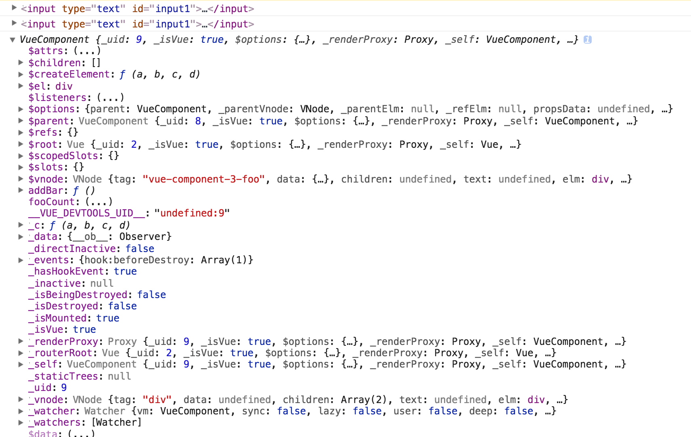
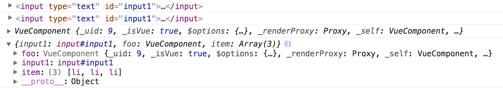
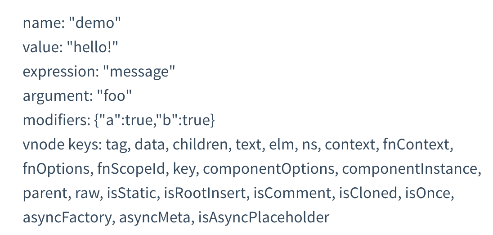
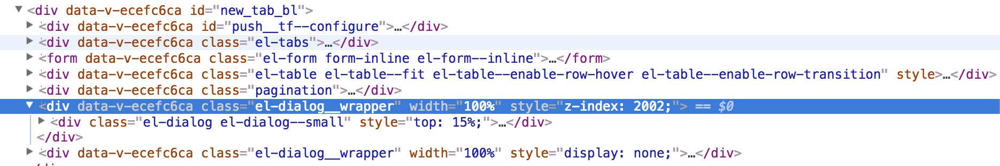

#### 前言
本部分我们主要添加一些在Vue学习中遇到的问题，大部分内容都来自于官方文档，不喜勿喷。通过对这部分官方文档主要内容的学习，希望能够快速入门Vue开发。
#### 1.通过.native为Vue组件添加原生事件
比如下面的为`ButtonMessage`组件添加原生的click事件:
```js
// 只有为Vue的组件添加.native才行，如果是下面的div或者p元素添加并不会起作用
<template>
    <div id="message-event-example" class="demo">
        <p v-for="msg in messages">{{ msg }}</p>
        <button-message v-on:click.native="focus" v-on:message="handleMessage" ></button-message>
    </div>
</template>
<script>
import ButtonMessage from "./ButtonMessage";
export default {
    data: function() {
        return {
            messages: []
        }
    },
    methods: {
        handleMessage: function(payload) {
            this.messages.push(payload.message)
        },
        focus:function(){
            alert('fuck');
        }
    },
    components: { ButtonMessage }
}
</script>
<style>
#message-event-example{
    border:1px solid red;
}
</style>
```
其实Vue官网也有明确说明的，你也可以[点击](https://segmentfault.com/q/1010000007896386)这里。

#### 2.Vue.use使用Vue组件
比如下面的例子:
```js
import ElementUI from 'element-ui';
import TreeView from "vue-json-tree-view";
Vue.use(ElementUI);
Vue.use(TreeView)
```
这是Vue注册插件的方式。详细内容可以查看[浅谈Vue.use](https://segmentfault.com/a/1190000012296163)。比如下面是[Element-ui](https://github.com/liangklfang/element/blob/dev/packages/button/index.js)对Button组件的用法:
```js
import ElButton from './src/button';
ElButton.install = function(Vue) {
  Vue.component(ElButton.name, ElButton);
};
export default ElButton;
```
下面是"./src/button"下Button组件的代码:
```js
<template>
  <button
    class="el-button"
    @click="handleClick"
    :disabled="disabled || loading"
    :autofocus="autofocus"
    :type="nativeType"
    :class="[
      type ? 'el-button--' + type : '',
      buttonSize ? 'el-button--' + buttonSize : '',
      {
        'is-disabled': disabled,
        'is-loading': loading,
        'is-plain': plain,
        'is-round': round
      }
    ]"
  >
    <i class="el-icon-loading" v-if="loading"></i>
    <i :class="icon" v-if="icon && !loading"></i>
    <span v-if="$slots.default"><slot></slot></span>
  </button>
</template>
<script>
  export default {
    name: 'ElButton',
    // ElButton.name
    inject: {
      elFormItem: {
        default: ''
      }
    },
    // props指定特定属性的类型
    props: {
      type: {
        type: String,
        default: 'default'
      },
      size: String,
      icon: {
        type: String,
        default: ''
      },
      nativeType: {
        type: String,
        default: 'button'
      },
      loading: Boolean,
      disabled: Boolean,
      plain: Boolean,
      autofocus: Boolean,
      round: Boolean
    },
    // 
    computed: {
      _elFormItemSize() {
        return (this.elFormItem || {}).elFormItemSize;
      },
      buttonSize() {
        return this.size || this._elFormItemSize || (this.$ELEMENT || {}).size;
      }
    },
    // Button组件的方法
    methods: {
      handleClick(evt) {
        this.$emit('click', evt);
      }
    }
  };
<\/script>
```
#### 3.Vue.component注册全局组件
要注册一个全局组件，可以使用 Vue.component(tagName, options)。例如：
```js
Vue.component('my-component', {
  // 选项,比如data,methods,components,template等
})
```
组件在注册之后，便可以作为自定义元素 <my-component><\/my-component> 在一个实例的模板中使用。注意**确保在初始化根实例之前**注册组件：
```js
<div id="example">
  <my-component></my-component>
</div>
```
下面是注册全局的组件:
```js
// 第一步:注册
Vue.component('my-component', {
  template: '<div>A custom component!</div>'
})
// 第二步:创建根实例,必须在初始化根实例之前注册组件
new Vue({
  el: '#example'
})
```
最后将会渲染为:
```js
<div id="example">
  <div>A custom component!</div>
</div>
```
#### 4.注册局部组件
你不必把每个组件都注册到全局。你可以通过某个Vue实例/组件的实例选项components 注册**仅在其作用域中可用的组件**：
```js
var Child = {
  template: '<div>A custom component!</div>'
}
new Vue({
  // ...
  components: {
    // <my-component> 将只在父组件模板中可用
    'my-component': Child
  }
})
```
这种封装也适用于其它可注册的 Vue 功能，比如指令。

#### 5.Vue的构造函数
比如常常看到如下的代码:
```js
import Vue from 'vue';
import App from './App';
import router from './router';
new Vue({
    router,
    render: h => h(App)
}).$mount('#app');
```
用法你可以[点击](https://segmentfault.com/q/1010000007826464)这里。

#### 6.Vue的slot学习
##### 6.1 Vue的template指定为一个特定的id与[slot](https://segmentfault.com/q/1010000008547170)
比如在index.html中指定了一个特定的template:
```js
 // 在index.html中使用type="text/x-template"定义vue的template 
<script type="text/x-template" id="anchored-heading-template">
    <div>
        <h1 v-if="level === 1">
        // slot
            <slot></slot>
        </h1>
        <h2 v-if="level === 2">
            <slot></slot>
        </h2>
        <h3 v-if="level === 3">
            <slot></slot>
        </h3>
        <h4 v-if="level === 4">
            <slot></slot>
        </h4>
        <h5 v-if="level === 5">
            <slot></slot>
        </h5>
        <h6 v-if="level === 6">
            <slot></slot>
        </h6>
    </div>
</script>
```
在main.js中注册child组件，child的组件template指定id为上面的模板:
```js
Vue.component("child", {
  // template: "<div>This is child</div>",
  template: "#anchored-heading-template",
  // template指定一个id的情况
  props: {
    level: {
      type: Number,
      required: true
    }
  }
});
```
在App.vue中我们指定template如下:
```js
<template>
  <div id="app">
    
    <router-view/>
    // 指定:level为1
    <child :level="1">
      hello world
    </child>
  </div>
<\/template>
```
详见[Vue.js 定义组件模板的七种方式](https://www.w3cplus.com/vue/seven-ways-to-define-a-component-template-by-vuejs.html)。下面再给出一个[this.$slots](http://blog.csdn.net/yangyiboshigou/article/details/74457691)的例子:
```js
// child组件接受slot
Vue.component("child", {
  render: function(createElement) {
    var header = this.$slots.header;
    var center = this.$slots.center;
    var footer = this.$slots.footer;
    //createElement第一个参数是标签名,第二个参数是值
    return createElement("div", [
      createElement("div", header),
      createElement("div", center),
      createElement("div", footer)
    ]);
  }
});
```
下面是对child组件的使用:
```js
 <child>
  <p slot="header">this is header</p>
  <p slot="center">this is center</p>
  <p slot="footer">this is footer</p>
</child>
```
最后渲染出来的组件DOM结构为:
```html
<div>
    <div>
      <p>this is header</p>
    </div>
    <div>
      <p>this is center</p>
    </div>
    <div>
      <p>this is footer</p>
    </div>
</div>
```

##### 6.2 通过elm获取到slot对应的DOM
```js
Vue.component("c-child", {
  props: ["target"],
  mounted() {
    // this.target会或获取到父组件的一个实例
    this.target(function(t) {
      console.log("子组件调用了父组件的this.target方法", t);
    });
    console.log("this.$slots.reference==",this.$slots.reference[0].elm);
  },
  template: `<div>我是c-child组件<slot name="reference"></slot></div>`
});
```
上面定义了一个组件c-child，我们看看如何使用这个c-child组件:
```html
<c-child v-bind:target="passRef2Child">
    <span slot="reference">我是slot的子级元素</span>
</c-child>
```
此时你可以看到c-child组件在mounted中通过$slots获取到了真实的DOM，而获取方法如下:
```js
this.$slots.reference[0].elm
```
这里你可以看到reference获取到的是一个**数组**，所以你可以通过如下方式来使用c-child组件:
```html
<c-child v-bind:target="passRef2Child">
    <span slot="reference">我是slot的子级元素</span>
    <span slot="reference">我是slot的2子级元素</span>
</c-child>
```
而此时两个slot为reference的span都会被添加到slot="reference"指定的元素中。例子代码可以[点击](https://github.com/liangklfangl/Vue-Demo/blob/master/src/components/%24ref.vue)这里获取。

#### 7.使用inline-template取消slot
比如在main.js中注册如下内容:
```js
// 注册my-checkbox组件+inline-template
Vue.component("my-checkbox", {
  data() {
    return { checked: false, title: "Check me" };
  },
  methods: {
    check() {
      this.checked = !this.checked;
    }
  }
});
```
在使用my-checkbox的时候可以通过如下方式来完成:
```js
<template>
    <my-checkbox inline-template>
        <div class="checkbox-wrapper"  @click="check">
            <div :class="{ checkbox: true, checked: checked }"></div>
            <div class="title"></div>
        </div>
    </my-checkbox>
</template>
```

#### 8.通过render方法定义Vue组件
```js
Vue.component("my-checkbox", {
  data() {
    return { checked: false, title: "Check me" };
  },
  methods: {
    check() {
      this.checked = !this.checked;
    }
  },
  render(createElement) {
    return createElement(
      "div",
      { attrs: { class: "checkbox-wrapper" }, on: { click: this.check } },
      [
        createElement("div", {
          class: { checkbox: true, checked: this.checked }
        }),
        createElement("div", { attrs: { class: "title" } }, [this.title])
      ]
    );
  }
});
```
该方法的优点是你的模板更接近编译器，并允许你使用完整的JavaScript 功能，而不是指令提供的子集著作权归作者所有。

#### 9.render方法使用jsx
```js
Vue.component("my-checkbox", {
  data() {
    return { checked: false, title: "Check me" };
  },
  methods: {
    check() {
      this.checked = !this.checked;
    }
  },
  render() {
    return (
      <div class="checkbox-wrapper" onClick={this.check}>
        {" "}
        <div class={{ checkbox: true, checked: this.checked }} />{" "}
        <div class="title">{this.title}</div>{" "}
      </div>
    );
  }
});
```

#### 10.修改Vue的prototype
```js
import axios from 'axios';
Vue.prototype.$axios = axios;
```
在组件中就可以通过该$axios方法来获取数据了:
```js
 export default {
        methods: {
            getData(){
                let self = this;
                if(process.env.NODE_ENV === 'development'){
                    self.url = '/ms/table/list';
                };
                // 通过self.$axios发送数据
                self.$axios.post(self.url, {page:self.cur_page}).then((res) => {
                    self.tableData = res.data.list;
                })
            }
        }
    }
```

#### 11.Vue的生命周期
如下图:


请仔细阅读[官方文档](https://cn.vuejs.org/v2/guide/instance.html#%E7%94%9F%E5%91%BD%E5%91%A8%E6%9C%9F%E5%9B%BE%E7%A4%BA)。

| 生命周期方法 | 方法描述                                                                                                                                                                                                                                                                                                                                                                                                               |
|--------------|------------------------------------------------------------------------------------------------------------------------------------------------------------------------------------------------------------------------------------------------------------------------------------------------------------------------------------------------------------------------------------------------------------------------|
| beforeCreate | 在实例初始化之后，数据观测 (data observer) 和 event/watcher 事件配置之前被调用。                                                                                                                                                                                                                                                                                                                                       |
| created      | 在实例创建完成后被立即调用。在这一步，实例已完成以下的配置：数据观测 (data observer)，属性和方法的运算，watch/event 事件回调。然而，挂载阶段还没开始，**$el 属性目前不可见**。                                                                                                                                                                                                                                         |
| beforeMount  | 在挂载开始之前被调用：相关的 render 函数**首次被调用**。该钩子在服务器端渲染期间不被调用。                                                                                                                                                                                                                                                                                                                             |
| mounted      | el 被新创建的 vm.$el 替换，并挂载到实例上去之后调用该钩子。如果 root 实例挂载了一个文档内元素，当 mounted 被调用时 vm.$el 也在文档内。注意 mounted 不会承诺所有的子组件也都一起被挂载。如果你希望等到整个视图都渲染完毕，可以用[ vm.$nextTick 替换掉 mounted](https://cn.vuejs.org/v2/api/#mounted)。该钩子在服务器端渲染期间不被调用。                                                                                |
| beforeUpdate | 数据更新时调用，发生在虚拟 DOM 打补丁之前。这里适合在更新之前访问现有的 DOM，比如手动移除已添加的事件监听器。该钩子在服务器端渲染期间不被调用，因为只有初次渲染会在服务端进行。                                                                                                                                                                                                                                        |
| updated      | 由于数据更改导致的虚拟 DOM 重新渲染和打补丁，在这之后会调用该钩子。当这个钩子被调用时，组件 DOM 已经更新，所以你现在可以执行依赖于 DOM 的操作。然而在大多数情况下，你应该避免在此期间更改状态。如果要相应状态改变，通常最好使用计算属性或 watcher 取而代之。注意 updated 不会承诺所有的子组件也都一起被重绘。如果你希望等到整个视图都重绘完毕，可以用 vm.$nextTick 替换掉 updated。 该钩子在服务器端渲染期间不被调用。 |

下面再说下一些和生命周期相关的问题:

(1)数据请求的方法[一般在created里面就可以](https://segmentfault.com/q/1010000010643393)，如果涉及到需要页面加载完成之后的话就用mounted。

(2)created的时候，视图中的html并没有渲染出来，所以此时如果直接去[操作HTML的DOM节点](http://blog.csdn.net/xdnloveme/article/details/78035065)，一定找不到相关的元素,而在mounted中，由于此时html已经渲染出来了，所以可以直接操作DOM节点。


#### 12.Vue中不要使用箭头函数
**不要在选项属性或回调上使用箭头函数**，比如:
```js
created: () => console.log(this.a) 
vm.$watch('a', newValue => this.myMethod())
```
因为**箭头函数是和父级上下文绑定在一起的，this不会是如你所预期的Vue实例**，经常导致 Uncaught TypeError: Cannot read property of undefined 或 Uncaught TypeError: this.myMethod is not a function 之类的错误。

#### 13.Vue中的[key](https://cn.vuejs.org/v2/api/#key)
key的特殊属性主要用在**Vue的虚拟DOM算法**，在新旧nodes对比时辨识VNodes。如果不使用 key，Vue会使用一种最大限度减少动态元素并且尽可能的尝试修复/再利用相同类型元素的算法。使用 key，它会基于key的变化重新排列元素顺序，并且会**移除key不存在的元素**。有相同父元素的子元素必须有独特的 key。重复的 key 会造成渲染错误。最常见的用例是结合 v-for：
```html
<ul>
  <li v-for="item in items" :key="item.id">...</li>
</ul>
```
它也可以用于强制替换元素/组件而不是重复使用它(类似React的key实现组件卸载)。当你遇到如下场景时它可能会很有用：完整地触发组件的生命周期钩子触发过渡。例如：
```html
<transition>
  <span :key="text">{{ text }}</span>
</transition>
```
当 text 发生改变时，<span> 会随时被更新，因此会触发过渡,请[查看官方文档](https://cn.vuejs.org/v2/guide/list.html#key)。

#### 14.Vue中的v-model和v-bind区别
<pre>
1. v-bind是数据绑定，没有双向绑定效果，但不一定在表单元素上使用，任何有效元素上都可以使用；
2. v-model是双向绑定，基本上只用在表单元素上；
3. 当v-bind和v-model同时用在一个元素上时，它们各自的作用没变，但v-model优先级更高，而且需区分这个元素是单个的还是一组出现的。
</pre>

官方文档有明确说明v-model的**作用**:\<input v-model="something">其实是\<input v-bind:value="something" v-on:input="something = $event.target.value">的语法糖

**下面给出v-bind和v-model共存的情况**:
```html
<label for="value in options">  
  <input type="checkbox" :value="value" v-model="selected">
</label>
```
下面是对应的data数据:
```js
data: {  options: [1, 2, 3, 4, 5],  selected: [],}
```
data.selected是一个数组，当一个选项被选中之后，这个选项的value值会被加入到data.selected中。这个时候:value就是有效的，因为它表示把options数组中对应的选项值传递给value，并不是双向绑定的意思，而只是传值过去。相当于说，**v-bind负责value的值，v-model负责选中状态**。当然，v-model是双向绑定，界面上你去勾选会影响data.selected的值，你在程序中操作了data.selected，也会反过来影响界面。v-model影响的是勾选效果，而v-bind影响的是值。

注意，只有当type="checkbox"是确定的情况下，才会让上述情况生效，type值不能是动态值，因为v-model被多次绑定同一个变量时，需要去检查type值，而如果这个时候type是动态的，比如用:type="type"进行动态绑定，就会导致模板编译报错。完整的代码如下:
```js
<template>
    <div id="v-model">
        <label v-for="value in options">
            <input type="checkbox" :value="value" v-model="selected" @change="onchange" />
        </label>
    </div>
<\/template>
<script>
export default {
    data: function() {
        return { options: [1, 2, 3, 4, 5], selected: [] }
    },
    methods: {
        onchange: function() {
            console.log('this.seleced===', this.selected);
            // 这里是所有选中的元素
        }
    }
}
<\/script>
<style>
<\/style>
```
下面是页面生成的DOM元素:
```html
<div id="v-model">
    <label><input type="checkbox" value="1"></label>
    <label><input type="checkbox" value="2"></label>
    <label><input type="checkbox" value="3"></label>
    <label><input type="checkbox" value="4"></label>
    <label><input type="checkbox" value="5"></label>
</div>
```

#### 15.Vue中组件通信
##### 15.1 子组件触发父组件方法
```js
<template>
    <div id="counter-event-example">
        <p>{{ total }}</p>
                // 1.父组件通过v-on来注册一个事件，如果监听到$.emit('increment')这个事件就调用incrementTotal
                // 2.每个 Vue 实例都实现了事件接口，即：使用 $on(eventName) 监听事件。使用 $emit(eventName, optionalPayload) 触发事件
                // 3.另外，父组件可以在使用子组件的地方直接用 v-on 来监听子组件触发的事件。不能用 $on 监听子组件释放的事件，而必须在模板里直接用 v-on 绑定
                // 4.子组件上的v-on:increment并不会被渲染都DOM中，而是vue的事件注册方式。比如这个例子渲染的DOM如下:
                //   <div id="counter-event-example"><p>0</p> 
                //     <button>0</button> 
                //    <button>0</button>
                //  </div>
        <button-counter v-on:increment="incrementTotal"></button-counter>
        <button-counter v-on:increment="incrementTotal"></button-counter>
    </div>
<\/template>
<script>
import ButtonCounter from "./ButtonCounter";
export default {
    data: function() {
        return {
            total: 0
        }
    },
    methods: {
        incrementTotal: function() {
            this.total++;
        }
    },
    // 2.注册子组件
    components: { ButtonCounter }
}
<\/script>
```
下面是ButtonCounter组件:
```js
<template>
    <button v-on:click="incrementCounter">
        {{ counter }}</button>
</template>
<script>
export default {
    data: function() {
        return {
            counter: 0
        }
    },
    methods: {
        incrementCounter: function() {
            this.counter++;
            // 通知父组件
            this.$emit('increment');
        }
    }
}
<\/script>
<style>
<\/style>
```
父组件通过**v-on:increment**来注册increment事件，子组件通过this.$emit('increment')将消息派发给父级组件。

##### 15.2 父组件传递信息到子组件
如果是传递字符串可以直接通过如下方式来完成:
```html
<div id="m-dialog">
<!-- 
<child value="str"></child>
该种方法“只能传递字符串”，
将child的data中的value = "str";不需要父组件data中有数据
 -->
    <child value="str"></child>
</div>
```
下面是组件的定义:
```js
Vue.component("child", {
    // child组件明确指定自己接受value的props
    props:["value"],
    template: '<span>{{ value }}</span>'
});
```
而如果是需要将**父级的变量传递给子级组件**，那么可以使用v-bind,比如按照下面的方式定义child组件:
```js
<template>
    <div id="m-dialog">
        // 1.v-bind将state绑定为父级组件的flag的值
        <my-dialog v-bind:state="flag" v-on:cancle="bbb"></my-dialog>
        <button v-on:click="fff">打开弹窗组件</button>
        <button>{{aaa}}</button>
    </div>
</template>
<script>
import dialog from '../components/dialog';
export default {
    name: "dialog",
    data: function() {
        return {
            aaa:123,
            flag: false
        };
    },
    components: {
    'my-dialog': dialog
    },
    methods: {
        fff: function() {
            this.flag = true;
        },
        bbb: function() {
            this.flag = false;
        }
  }
};
</script>
<style scoped>
</style>
```
[下面是dialog对于state的声明使用](https://github.com/Kelichao/vue.js.2.0/blob/master/src/pages/dialogPage.vue):
```js
<template>
    // 2.v-if判断是否可见
    <div class="m-dialog" v-if="state">
        <div class="m-dialog_content" >
            <div class="m-dialog_head" ></div>
            <div class="m-dialog_middle">400-757-1000</div>
            <div class="m-dialog_bottom f-flex">
                <span class="u-cancle f-item" v-on:click="cancle">取消</span>
                <span class="u-call f-item" v-on:click="call">呼叫</span>
            </div>
        </div>
    </div>
</template>
<script>
export default {
    name: 'aaa',
    props:["state"],
    methods: {
        cancle: function() {
            this.$emit('cancle')
        },
        call: function() {
            window.location.href = 'tel://' + "400-757-1000";
        }
    }
}
</script>
<style scoped>
</style>
```

##### 15.3 兄弟[组件之间通信](http://zengxt.pw/2017/01/07/vue%E9%9D%9E%E7%88%B6%E5%AD%90%E7%BB%84%E4%BB%B6%E6%80%8E%E4%B9%88%E9%80%9A%E4%BF%A1/)
```js
var eventBus = new Vue({});
// Vue.component注册组件
Vue.component("foo", {
  template:
    "<div><p>the count of foo is {{fooCount}}</p>" +
    '<button @click="addBar">add bar\'s count</button></div>',
  data: function() {
    return {
      fooCount: 0
    };
  },
  methods: {
    addBar: function() {
      // 触发事件
      eventBus.$emit("addBar");
    }
  },
  mounted: function() {
    eventBus.$on(
      "addFoo",
      function(num) {
        this.fooCount += num;
      }.bind(this)
    );
  }
});
// bar 组件
Vue.component("bar", {
  template:
    "<div><p>the count of bar is {{barCount}}</p>" +
    '<button @click="addFoo">add foo\'s count</button></div>',
  data: function() {
    return {
      barCount: 0
    };
  },
  methods: {
    addFoo: function() {
      // 触发事件，同时传递一个参数
      eventBus.$emit("addFoo", 2);
    }
  },
  // 在 组件创建的钩子函数中 监听事件
  mounted: function() {
    eventBus.$on(
      "addBar",
      function() {
        this.barCount++;
      }.bind(this)
    );
  }
});
```
此时eventBus对象必须是两个组件都能够访问的。

#### 16.Vue中的slot与slot-scope
比如下面的[插槽](https://segmentfault.com/a/1190000012996217)的例子:
```js
<template>
    <div class="father">
        <h3>这里是父组件</h3>
       // 1.第一次使用：用flex展示数据
        <child>
            <template slot-scope="user">
                <div class="tmpl">
                    <span v-for="item in user.data">{{item}}</span>
                </div>
            </template>
        </child>
      // 2.第二次使用：用列表展示数据
        <child>
            <template slot-scope="user">
                <ul>
                    <li v-for="item in user.data">{{item}}</li>
                </ul>
            </template>
        </child>
       // 3.第三次使用：直接显示数据
        <child>
            <template slot-scope="user">
                {{user.data}}
            </template>
        </child>
        //4.第四次使用：不使用其提供的数据
        <child>
            我就是模板
        </child>
    </div>
</template>
<script>
import Child from './children.vue'
export default {
    data: function() {
        return {
            msg: ''
        }
    },
    methods: {
        clickHandler(data) {
            console.log(data);
        }
    },
    components: {
        'child': Child
    }
}
<\/script>
<style scoped>
.father {
    width: 100%;
    background-color: #ccc;
    height: 650px;
}
.tmpl {
    display: flex;
    justify-content: space-around;
    flex-direction: row;
    width: 30%;
    margin: 0 auto;
}
.tmpl span {
    border: 1px solid red;
    height: 50px;
    line-height: 50px;
    padding: 10px;
}
<\/style>
```
而children.vue组件如下:
```js
<template>
    <div class="child">
        <h3>这里是子组件</h3>
        <slot :data="data"></slot>
        // 可以绑定data数据
    </div>
</template>
<script>
export default {
    data: function() {
        return {
            data: ['zhangsan', 'lisi', 'wanwu', 'zhaoliu', 'tianqi', 'xiaoba']
        }
    },
    computed: {
    },
    methods: {
    },
    components: {
    }
}
<\/script>
<style scoped>
.child {
    background-color: #00bbff;
    width: 100%;
    padding: 10px;
    -webkit-box-sizing: border-box;
    -moz-box-sizing: border-box;
    box-sizing: border-box;
}
<\/style>
```
插槽，也就是slot，**是组件的一块HTML模板**，这块模板显示不显示、以及怎样显示由父组件来决定。 实际上，一个slot最核心的两个问题这里就点出来了，是**显示不显示**和**怎样显示**。

#### 17.Vue中的computed与watch
##### 17.1 为什么要引入计算属性
模板内的表达式非常便利，但是设计它们的初衷是用于简单运算的。在模板中放入太多的逻辑会让模板过重且难以维护。例如：
```html
<div id="example">
  {{ message.split('').reverse().join('') }}
</div>
```
在这个地方，模板**不再是简单的声明式逻辑**。你必须看一段时间才能意识到，这里是想要显示变量 message的翻转字符串。当你想要在模板中多次引用此处的翻转字符串时，就会更加难以处理。所以，对于任何复杂逻辑，你都应当使用**计算属性**。

##### 17.2 [计算属性的特点](https://cn.vuejs.org/v2/guide/computed.html)
```html
<div id="example">
  <p>Original message: "{{ message }}"</p>
  <p>Computed reversed message: "{{ reversedMessage }}"</p>
</div>
```
下面是组件:
```js
var vm = new Vue({
  el: '#example',
  data: {
    message: 'Hello'
  },
  computed: {
    // 计算属性的 getter
    reversedMessage: function () {
      // `this` 指向 vm 实例
      return this.message.split('').reverse().join('')
    }
  }
})
```
(1)我们已经以声明的方式创建了这种依赖关系：计算属性的getter函数是**没有副作用** (side effect) 的，这使它更易于测试和理解。**watch**选项允许我们执行异步操作 (访问一个 API)，限制我们执行该操作的频率，并在我们得到最终结果前，设置中间状态。这些都是计算属性无法做到的。

(2)计算属性是**基于依赖进行缓存**的。计算属性只有在它的相关依赖发生改变时才会重新求值。这就意味着只要 message还没有发生改变，多次访问reversedMessage计算属性会立即返回之前的计算结果，而不必再次执行函数。但是如果在模板中直接`调用方法`，那么结果并不会缓存。同时也需要注意:计算属性也是可以提供setter方法的。


#### 18.Vue中的过滤器
Vue.js允许你自定义过滤器，**可被用于一些常见的文本格式化**。过滤器可以用在两个地方：**双花括号插值**和**v-bind 表达式** (后者从 2.1.0+ 开始支持)。过滤器应该被添加在JavaScript表达式的尾部，由“管道”符号指示:
```js
<!-- 在双花括号中 -->
{{ message | capitalize }}
<!-- 在 `v-bind` 中 -->
<div v-bind:id="rawId | formatId"><\/div>
```
添加过滤器可以通过如下两种方式来完成,包括`本地过滤器`和全局过滤器:
```js
filters: {
  capitalize: function (value) {
    if (!value) return ''
    value = value.toString()
    return value.charAt(0).toUpperCase() + value.slice(1)
  }
}
```
`全局过滤器`可以通过如下方法定义:
```js
Vue.filter('capitalize', function (value) {
  if (!value) return ''
  value = value.toString()
  return value.charAt(0).toUpperCase() + value.slice(1)
})
new Vue({
})
```

#### 19.Vue的响应式原理
当你把一个普通的JavaScript对象传给Vue实例的data选项，Vue将遍历此对象所有的属性，并使用 **Object.defineProperty**把这些属性全部转为getter/setter。Object.defineProperty 是 ES5中一个无法shim的特性，这也就是为什么Vue不支持 IE8 以及更低版本浏览器的原因。用户看不到getter/setter，但是在内部它们让Vue追踪依赖，在属性被访问和修改时通知变化。

**每个组件实例都有相应的watcher实例对象**，它会在组件渲染的过程中把属性记录为依赖，之后当依赖项的setter被调用时，会通知watcher 重新计算，从而致使它关联的组件得以更新。


受现代JavaScript的限制 (以及废弃 Object.observe)，Vue不能检测到对象属性的添加或删除。由于Vue会在初始化实例时对属性执行 getter/setter 转化过程，所以**属性必须在data对象上存在才能让Vue转换它，这样才能让它是响应的**。例如：
```JS
var vm = new Vue({
  data:{
  a:1
  }
})
// `vm.a` 是响应的
vm.b = 2
// `vm.b` 是非响应的
```
Vue**不允许在已经创建的实例上动态添加新的根级响应式属性**(root-level reactive property)。然而它可以使用Vue.set(object, key, value)方法将响应属性添加到嵌套的对象上：
```js
Vue.set(vm.someObject, 'b', 2)
```
您还可以使用vm.$set实例方法，这也是全局Vue.set方法的别名：
```js
this.$set(this.someObject,'b',2);
```
有时你想向已有对象上添加一些属性，例如使用Object.assign()或 \_.extend()方法来添加属性。但是，添加到对象上的新属性不会触发更新。在这种情况下可以创**建一个新的对象**，让它包含原对象的属性和新的属性：
```js
// 代替 `Object.assign(this.someObject, { a: 1, b: 2 })`
this.someObject = Object.assign({}, this.someObject, { a: 1, b: 2 })
```

#### 20.Vue[异步更新队列](https://cn.vuejs.org/v2/guide/reactivity.html)
可能你还没有注意到，Vue异步执行 DOM 更新。只要观察到数据变化，Vue将**开启一个队列，并缓冲在同一事件循环中发生的所有数据改变**。如果同一个 watcher被多次触发，只会被推入到队列中一次。这种在缓冲时去除重复数据对于避免不必要的计算和 DOM操作上非常重要。然后，在下一个的事件循环“tick”中，Vue刷新队列并执行实际 (已去重的) 工作。Vue在内部尝试对异步队列使用原生的 Promise.then 和 MessageChannel，如果执行环境不支持，会采用 setTimeout(fn, 0) 代替。

例如，当你设置vm.someData = 'new value',该组件**不会立即重新渲染**。当刷新队列时，组件会在事件循环队列清空时的下一个“tick”更新。多数情况我们不需要关心这个过程，但是如果你想在DOM状态更新后做点什么，这就可能会有些棘手。虽然Vue.js通常鼓励开发人员沿着“数据驱动”的方式思考，避免直接接触DOM，但是有时我们确实要这么做。为了在数据变化之后等待Vue完成更新DOM，可以在数据变化之后立即使用Vue.nextTick(callback)。**这样回调函数在DOM更新完成后就会调用**。例如：
```js
<div id="example">{{message}}<\/div>
var vm = new Vue({
  el: '#example',
  data: {
    message: '123'
  }
})
vm.message = 'new message' ;
// 更改数据
vm.$el.textContent === 'new message';
// false
Vue.nextTick(function () {
  vm.$el.textContent === 'new message' 
// true
})
```
在组件内使用[vm.$nextTick()](https://www.zhihu.com/question/50879936)实例方法特别方便，因为它不需要全局Vue ，并且回调函数中的this将自动绑定到当前的Vue实例上：
```js
Vue.component('example', {
  template: '<span>{{ message }}</span>',
  data: function () {
    return {
      message: '没有更新'
    }
  },
  methods: {
    updateMessage: function () {
      this.message = '更新完成'
      console.log(this.$el.textContent) // => '没有更新'
      this.$nextTick(function () {
        console.log(this.$el.textContent) // => '更新完成'
      })
    }
  }
})
```
关于Vue异步更新的原理你可以[查看](https://www.zhihu.com/collection/226172852)这个文章。


#### 21.Vue中的elem元素
提供一个在页面上已存在的DOM元素作为**Vue实例的挂载目标**。可以是CSS选择器，也可以是一个 HTMLElement实例。在实例挂载之后，元素可以用vm.$el访问。如果这个选项在实例化时有作用，实例将`立即进入编译过程`，否则，需要显式调用 vm.$mount()手动开启编译。对于ele有以下几个注意点:

(1)提供的元素**只能作为挂载点**。不同于Vue 1.x，所有的挂载元素会被Vue生成的DOM 替换。因此不推荐挂载root实例到<html>或者<body> 上。比如我有下面的挂载代码:
```js
new Vue({
  el: "#app",
  router,
  components: { App },
  // 其中App组件内容为<template><div>我是内容元素</div></template>
  template: "<App/>"
});
```
我的index.html(用于HtmlWebpackPlugin)结构为:
```html
  <div id="app"></div>
```
此时挂载后的Element面板里面产生的DOM为:
```html
<div>
   我是内容元素
</div>
```
刷新你会发现，首先Vue组件还`未挂载`的一瞬间，该div#app元素是在页面中的，而当Vue组件挂载完成后，所有的DOM都会被该组件替换掉了。

(2)如果render函数和template属性都不存在，`挂载DOM元素的HTML会被提取出来用作模板`，此时，必须使用 Runtime + Compiler(编译器+运行时)构建的Vue库。**编译器**：用来将模板字符串编译成为JavaScript渲染函数的代码。**运行时**：用来创建Vue 实例、渲染并处理虚拟DOM等的代码。基本上就是除去编译器的其它一切。假如我的htmlTemplate为:
```html
 <div id="app">
      <div>我是标题</div>
      <div>
          <div>{{name}}</div>
      </div>
      <div>我是footer</div>
  </div>
```
而在webpack的入口文件中的代码(没有template和render)如下:
```js
new Vue({
  el: "#app",
  router,
  data:function(){
    return {name:'qingtian'}
  },
  components: { App },
});
```
此时你会发现最后生成的DOM结构为:
```html
<div id="app">
  <div>我是标题</div> 
  <div>
    <div>qingtian</div>
  </div>
 <div>我是footer</div>
</div>
```
此时你发现el并没有被替换掉，其实在生命周期中也明确指出了是拿着outerHTML作为template的，所以div#app并没有被替换掉:


#### 22.Vue中[函数式组件](https://cn.vuejs.org/v2/guide/render-function.html#%E5%87%BD%E6%95%B0%E5%BC%8F%E7%BB%84%E4%BB%B6)
一个函数式组件可以通过如下方式来定义:
```js
Vue.component('my-component', {
  functional: true,
  // 为了弥补缺少的实例
  // 提供第二个参数作为上下文
  render: function (createElement, context) {
    // 向createElement通过传入context.data 作为第二个参数，我们就把 my-functional-button 上面所有的特性和事件监听器都传递下去了。事实上这是非常透明的，那些事件甚至并不要求 .native 修饰符。
    return createElement('button', context.data, context.children)
  },
  // Props 可选
  props: {
    // ...
  }
})
```
组件需要的一切都是通过**上下文(context)**传递，包括：
<pre>
props：提供 props的对象
children: VNode子节点的数组
slots: slots对象
data：传递给组件的data对象
parent：对父组件的引用
listeners: (2.3.0+)一个包含了组件上所注册的**v-on**侦听器的对象。这只是一个指向data.on 的别名。
injections: (2.3.0+) 如果使用了inject选项，则该对象包含了应当被注入的属性。
</pre>

在添加**functional: true**之后，组件的render函数增加context参数，this.$slots.default 更新为context.children，之后this.level更新为context.props.level。因为函数式组件只是一个函数，所以渲染开销也低很多。然而，对`持久化实例的缺乏也意味着函数式组件不会出现在Vue devtools的组件树`里。

#### 23.Vue中的render方法和template
当Vue选项对象中**有**render渲染函数时，Vue构造函数将直接使用渲染函数渲染DOM树，当选项对象中**没有**render渲染函数时，Vue构造函数首先通过将template模板生成render函数，然后再渲染DOM树，而当选项对象中既没有render渲染函数，也没有template模板时，会通过**el**属性获取挂载元素的outerHTML来作为模板，并编译生成渲染函数。在进行DOM渲染的时候，**render函数优先级最高，template和el次之**。

render方法是字符串模板的代替方案，允许你发挥JavaScript最大的编程能力。该渲染函数接收一个`createElement方法`作为第一个参数用来创建VNode。如果组件是一个函数组件，渲染函数还会接收一个`额外的 context参数`，为没有实例的函数组件提供上下文信息。详见[官方文档](https://cn.vuejs.org/v2/api/#render)。

#### 24.Vue中的ref
##### 24.1 ref的用法
ref被用来给元素或子组件注册引用信息。引用信息将会注册在**父组件的$refs对象上**。如果在普通的 DOM元素上使用，引用指向的就是DOM元素；如果用在子组件上，引用就指向组件实例：
```html
<!-- vm.$refs.p will be the DOM node -->
<p ref="p">hello</p>

<!-- vm.$refs.child will be the child comp instance -->
<child-comp ref="child"></child-comp>
```
当v-for用于元素或组件的时候，引用信息将是包含DOM节点或组件实例的数组。关于**ref注册时间**的重要说明：因为ref本身是作为渲染结果被创建的，在初始渲染的时候你不能访问它们-它们还不存在！$refs 也不是响应式的，因此你不应该试图用它在模板中做数据绑定。

$refs只在组件渲染完成后才填充，并且它是非响应式的。它仅仅是一个直接操作子组件的应急方案——应当`避免在模板或计算属性中使用$refs`。

##### 24.2 ref和document.getElementById都能获取到DOM
```js
<template>
    <div id="name">
        <input type="text" ref="input1" id="input1" />
        <button @click="add">添加</button>
    </div>
</template>
<script>
console.log('$ref被实例化');
export default {
    methods: {
        add: function() {
            this.$refs.input1.value = "22";
            console.log(this.$refs.input1);
            console.log(document.getElementById('input1'));
        }
    }
}
</script>
```
ref或者document.getElementById都能够获取到dom,而$refs相对document.getElementById的方法，会减少获取dom节点的消耗。

##### 24.3 为子组件指定一个ref来获取到vue组件实例
比如下面的例子:
```js
<template>
    <div id="name">
        <input type="text" ref="input1" id="input1" />
        <button @click="add">添加</button>
        <foo ref="foo"/>
        <!-- 该组件在main.js中已经注册了 -->
    </div>
</template>
<script>
console.log('$ref被实例化');
export default {
    methods: {
        add: function() {
            this.$refs.input1.value = "22";
            console.log(this.$refs.input1);
            console.log(document.getElementById('input1'));
            console.log(this.$refs.foo);
            // this.$refs.foo获取到子组件
        }
    }
}
<\/script>
```
可以通过 this.$refs.foo获取到子组件实例对象。下面是组件打印的log:



当然你也可以通过如下方式来获取子组件实例:
```js
<div id="parent">
  <foo ref="foo"></foo>
</div>  
```
下面是获取到组件实例的代码:
```js
var parent = new Vue({el:"#parent"});
var child = parent.$refs.foo
```

##### 24.4 ref和v-for共存的情况
这种情况，因为ref的值无法从迭代出来的对象中的某个属性中获取，所以当你指定一个固定的值的时候可以**获取到一个数组**:
```js
<template>
    <div id="name">
        <input type="text" ref="input1" id="input1" />
        <button @click="add">添加</button>
        <foo ref="foo" />
        <!-- 该组件在main.js中已经注册了 -->
        <ul v-for="item in list">
            <li ref="item">姓名:{{item.name}},性别{{item.sex}}</li>
        </ul>
    </div>
</template>
<script>
console.log('$ref被实例化');
export default {
    data:function(){
        return {
            list:[{
                name:'覃亮',
                sex:'男'
            },{
                name:'高山上的鱼',
                sex:'男'
            },{
                name:'liangklfang',
                sex:'男'
            }]
        }
    },
    methods: {
        add: function() {
            this.$refs.input1.value = "22";
            // ref或者document.getElementById都能够获取到dom,而$refs相对document.getElementById的方法，会减少获取dom节点的消耗。
            console.log(this.$refs.input1);
            console.log(document.getElementById('input1'));
            console.log(this.$refs.foo);
            // this.$refs.foo获取到子组件
            console.log(this.$refs);
        }
    }
}
<\/script>
```
此时打印出来的结果如下:



例子的详细代码可以[点击](https://github.com/liangklfangl/Vue-Demo/blob/master/src/components/%24ref.vue)这里。

##### 24.5 子组件获取到父组件的实例对象
其实可以通过传递一个函数的方式来完成，比如父组件的例子:
```js
<template>
      <span ref="reference">text</span>
      <c-child v-bind:target="passRef2Child"></c-child>
    </div>
</template>
```
假如子组件c-child要获取到父组件的ref为reference的实例，可以通过传递一个函数到子组件中:
```js
methods: {
      passRef2Child(callback) {
          return callback(this.$refs.reference)
      }
  }
```
此时在子组件中可以调用这个this.target的方法，该方法会被传入父组件中ref为reference的值作为参数:
```js
Vue.component("c-child", {
  props: ["target"],
  mounted() {
    this.target(function(t){
      console.log('子组件调用了父组件的this.target方法',t);
    });
  },
  template: "<div>我是c-child组件</div>"
});
```
详细代码可以[点击](https://github.com/liangklfangl/Vue-Demo/blob/master/src/components/%24ref.vue)这里。

#### 25.Vue中自定义指令
##### 25.1 Vue中指令的基本概念
除了核心功能默认内置的指令 (v-model 和 v-show)，Vue 也允许注册自定义指令。注意，在 Vue2.0 中，代码复用和抽象的主要形式是组件。然而，有的情况下，你**仍然需要对普通DOM元素进行底层操作，这时候就会用到自定义指令**。举个聚焦输入框的例子，如下：当页面加载时，该元素将获得焦点。事实上，只要你在打开这个页面后还没点击过任何内容，这个输入框就应当还是处于聚焦状态。现在让我们用指令来实现这个功能：
```js
// 注册一个全局自定义指令 `v-focus`
Vue.directive('focus', {
  // 当被绑定的元素插入到 DOM 中时……
  inserted: function (el) {
    // 聚焦元素
    el.focus()
  }
})
```
如果想注册**局部指令**，组件中也接受一个 directives 的选项：
```js
directives: {
  focus: {
    // 指令的定义
    inserted: function (el) {
      el.focus()
    }
  }
}
```
然后你可以在模板中任何元素上使用新的 v-focus 属性，如下：
```html
<input v-focus>
```

##### 25.2 指令中钩子函数与参数
一个指令定义对象可以提供如下几个钩子函数 (均为可选)：
- bind

  只调用一次，指令第一次绑定到元素时调用。在这里可以进行一次性的初始化设置。

- inserted
  
  被绑定元素插入父节点时调用 (**仅保证父节点存在，但不一定已被插入文档中**)。

- update

  所在组件的VNode更新时调用，**但是可能发生在其子VNode更新之前**。指令的值可能发生了改变，也可能没有。但是你可以通过比较更新前后的值来忽略不必要的模板更新 (详细的钩子函数参数见下)。

- componentUpdated
  
  指令所在组件的VNode及其子VNode全部更新后调用。

- unbind
  
  只调用一次，指令与元素解绑时调用。

接下来我们来看一下**钩子函数的参数(即 el、binding、vnode 和 oldVnode)**。指令钩子函数会被传入以下参数：

- el
  
  指令所绑定的元素，可以用来直接操作DOM。
- binding
  
  一个对象，包含以下属性：
  
  - name：指令名，不包括 v- 前缀。
  - value：指令的绑定值，例如：v-my-directive="1 + 1" 中，绑定值为 2。
  - oldValue：指令绑定的前一个值，仅在 update 和 componentUpdated 钩子中可用。无论值是否改变都可用。
  - expression：字符串形式的指令表达式。例如 v-my-directive="1 + 1" 中，表达式为 "1 + 1"。
  - arg：传给指令的参数，可选。例如 v-my-directive:foo 中，参数为 "foo"。
  - modifiers：一个包含修饰符的对象。例如：v-my-directive.foo.bar 中，修饰符对象为 { foo: true, bar: true }。
  - vnode：Vue编译生成的虚拟节点。移步[VNode API](https://github.com/vuejs/vue/blob/dev/src/core/vdom/vnode.js)来了解更多详情。
  - oldVnode：上一个虚拟节点，仅在 update 和 componentUpdated 钩子中可用。
除了el之外，**其它参数都应该是只读的，切勿进行修改**。如果需要在钩子之间共享数据，建议通过元素的dataset来进行。这是一个使用了这些属性的自定义钩子样例：
```js
<div id="hook-arguments-example" v-demo:foo.a.b="message"><\/div>
Vue.directive('demo', {
  bind: function (el, binding, vnode) {
    var s = JSON.stringify
    el.innerHTML =
      'name: '       + s(binding.name) + '<br>' +
      'value: '      + s(binding.value) + '<br>' +
      'expression: ' + s(binding.expression) + '<br>' +
      'argument: '   + s(binding.arg) + '<br>' +
      'modifiers: '  + s(binding.modifiers) + '<br>' +
      'vnode keys: ' + Object.keys(vnode).join(', ')
  }
})
new Vue({
  el: '#hook-arguments-example',
  data: {
    message: 'hello!'
  }
})
```
打印的内容如下:



该部分内容可以[查看](https://cn.vuejs.org/v2/guide/custom-directive.html#ad)官方文档。

##### 25.3 element-ui中指令[popover](https://github.com/liangklfang/element/blob/dev/packages/popover/src/main.vue#L33)详解
下面是v-popover指令的内容:
```js
export default {
  bind(el, binding, vnode) {
    // vue中v-popover:argument 和 v-popover="variate|| expression"得到的binding数据是不同的。后者可以指向动态popver组件，可以极大的增强popover指令的灵活程度。
    const _ref = binding.expression ? binding.value : binding.arg;
    // 上一部分已经详细说了binding.value和binding.arg
    vnode.context.$refs[_ref].$refs.reference = el;
    // 1.$refs请看上面的ref部分，从这里可以看到$refs是可以赋值的
    // 2.vnode.context.$refs[_ref]获取到的是特定ref的v-popover对象
    // vnode.context.$refs[_ref].$refs.reference=el表示为v-popover的$refs.reference赋值为v-popover修饰的DOM
  }
};
```
vnode.context可以获取到[当前Vue的实例](https://stackoverflow.com/questions/43081391/vue-directive-to-access-the-vue-instance)，而vnode.context.$refs[\_ref\_]获取到的是通过如下方式指定的el-popover:
```html
 <span v-popover:popover1>帮助支持</span>
```
即ref="popover1"的el-popover对象:
```html
<el-popover ref="popover1" placement="top-start" popper-class="env-clss" title="" width="160" trigger="hover">
    <div class="ant-popover-inner">
        <div>
            <div class="ant-popover-inner-content">
                <div>
                    <i class="anticon anticon-dingding" style="margin-right: 2px;"></i>
                    答疑
                </div>
                <div class="doc">
                    <i class="iconfont icon-shake" style="margin-right: 2px;"></i>
                    <a target="_blank" href="">问题反馈</a>
                </div>
                <div class="doc">
                    <i class="iconfont icon-solution" style="margin-right: 2px;"></i>
                    <a target="_blank" href="">说明文档</a>
                </div>
            </div>
        </div>
    </div>
</el-popover>
```
通过设置vnode.context.$refs[\_ref].$refs.reference = el可以将el-popover指定一个ref="reference"的元素，该元素就是指向了我们的如下元素:
```js
<span v-popover:popover1>帮助支持<\/span>
```
而el-popover的主要template代码如下:
```html
<template>
  <span>
    <transition :name="transition" @after-enter="handleAfterEnter" @after-leave="handleAfterLeave">
      <!-- 这里是ref="popper"的元素 -->
      <div class="el-popover el-popper" :class="[popperClass, content && 'el-popover--plain']" ref="popper" v-show="!disabled && showPopper" :style="{ width: width + 'px' }" role="tooltip" :id="tooltipId" :aria-hidden="(disabled || !showPopper) ? 'true' : 'false'">
        <div class="el-popover__title" v-if="title" v-text="title"></div>
        <slot>{{ content }}</slot>
        <!-- 通过slot插入content的值 -->
      </div>
    </transition>
    <!-- 这里是slot为reference的元素 -->
    <slot name="reference"></slot>
  </span>
</template>
```
而具体的逻辑代码如下:
```js
let reference = this.referenceElm = this.reference || this.$refs.reference;
    //  vnode.context.$refs[_ref].$refs.reference = el;
    // 这里是获取到我们的  <span v-popover:popover1>帮助支持</span>即v-popover指令指定的元素
    if (!reference && this.$slots.reference && this.$slots.reference[0]) {
      reference = this.referenceElm = this.$slots.reference[0].elm;
      // 上面$slot部分已经讲过可以通过elm获取到需要触发事件的DOM
    }
    // 如果采用的是如下的方式使用el-popover，那么通过this.$slots.reference[0].elm来获取到原生的DOM元素
    // <el-popover
    //   placement="right"
    //   title="标题"
    //   width="200"
    //   trigger="focus"
    //   content="这是一段内容,这是一段内容,这是一段内容,这是一段内容。">
    //   <el-button slot="reference">focus 激活</el-button>
    // </el-popover>
    // 可访问性
```
通过给reference添加hover,click,focus等事件来产生具体的效果。

#### 26.Vue中的mixins
mixin的基本用法如下:
```js
var mixin = {
  created: function () { console.log(1) }
}
var vm = new Vue({
  created: function () { console.log(2) },
  mixins: [mixin]
})
```
局部mixin用于mounted, destroyed等组件中的生成**周期方法与mixin是合并(即放到一个数组中)**，而对于methods中的方法是被覆盖的。比如下面的例子:
```js
//mixin
const hi = {
  methods: {
    sayHello: function() {
      console.log('hello from mixin!')
    }
  },
  mounted() {
    this.sayHello()
  }
}
//vue instance or component
new Vue({
  el: '#app',
  mixins: [hi],
  methods: {
    sayHello: function() {
      console.log('hello from Vue instance!')
    }
  },
  mounted() {
    this.sayHello()
  }
})
// hello from Vue instance!
// hello from Vue instance!
```
mixin中methods的sayHello被组件的sayHello覆盖了，而mounted**生命周期中**的sayHello方法其实被调用了两次。

#### 27.Vue中$attr,$props
attrs指的是那些没有被声明为props的属性，所以在渲染函数中还需要添加props参数。

#### 28.Vue的css的scoped
##### 28.1 子组件的根元素
子组件的根元素使用scoped后，父组件的样式将不会渗透到子组件中。不过一个子组件的根节点会**同时受其父组件有作用域的CSS和子组件有作用域的CSS的影响**。这样设计是为了让父组件可以从布局的角度出发，调整其子组件根元素的样式。这里给出一个例子:
```html
<el-dialog title="请选择要导入的视频类型SCG" :visible.sync="dialogVisible" width="100%" :before-close="scgHandleClose"/>
<!-- 我的页面使用了el-dialog -->
```
同时我希望修改el-dialog的宽度:
```html
<style lang='less' scoped>
#new_tab_bl .el-dialog--small {
    width: 70%;
}
</style>
```
因为我使用了scoped，所以按理来说el-dialog组件不会受到我页面的影响，但是我们看看DOM结构:



此时我的页面的最外层的元素的id为new_tab_bl，而el-dialog的最外层元素也被添加了属性**data-v-ecefc6ca**，这就是上面说的**子组件的根节点同时受其父组件有作用域的CSS和子组件有作用域的CSS的影响**。所以el-dialog的最外层的class其实会被编译为:
```css
.el-dialog__wrapper[data-v-ecefc6ca]{
}
```
而如果你仔细观察，你会发现，当前页面所有的自定义元素(除了子组件以外)都会被添加data-v-ecefc6ca这个值。我好奇的看了上面的css编译后的值:
```css
#new_tab_bl .el-dialog--small[data-v-ecefc6ca] {
  width: 70%;
  border: 2px solid red;
}
```
我们这里的层级选择器，最后作用到的元素为.el-dialog--small[data-v-ecefc6ca]，而这个元素根本不存在，所以不会生效(因为被加上了**data-v-ecefc6ca**)!然而，如果写出这样的代码(子级元素的最外层元素)是可以影响到子级元素的:
```css
#new_tab_bl{
  /*直接作用于父级元素*/
    .el-dialog__wrapper{
        border:2px solid blue;
    }
}
```


##### 28.2 深度作用选择器
如果你希望scoped样式中的一个选择器能够作用得“更深”，例如影响子组件，你可以使用 >>> 操作符：
```html
<style scoped>
.a >>> .b {}
</style>
```
上述代码将会编译成：
```css
.a[data-v-f3f3eg9] .b { }
```
有些像Sass之类的预处理器无法正确解析>>>。这种情况下你可以使用/deep/操作符取而代之——这是一个 >>> 的别名，同样可以正常工作。

##### 28.3 动态生成的内容
通过v-html创建的DOM内容不受作用域内的样式影响，但是你仍然可以通过深度作用选择器来为他们设置样式。
```html
<div v-html="html"></div>
```
v-html指令用于更新元素的innerHTML 。注意：内容按普通HTML插入 - 不会作为Vue模板进行编译 。如果试图使用v-html组合模板，可以重新考虑是否通过使用组件来替代。


##### 28.4 还有一些要留意
CSS作用域不能代替class。考虑到浏览器渲染各种CSS选择器的方式，当p{ color: red } **设置了作用域时(即与特性选择器组合使用时)会慢很多倍**。如果你使用class或者id取而代之，比如 .example { color: red }，**性能影响就会消除**。你可以在这块[试验田中](https://stevesouders.com/efws/css-selectors/csscreate.php)测试它们的不同。

在递归组件中小心使用后代选择器! 对选择器.a .b 中的CSS 规则来说，如果匹配 .a 的元素包含一个递归子组件，则所有的子组件中的 .b 都将被这个规则匹配。


参考资料:

[Vue.js 定义组件模板的七种方式](https://www.w3cplus.com/vue/seven-ways-to-define-a-component-template-by-vuejs.html)

[深入理解vue中的slot与slot-scope](https://segmentfault.com/a/1190000012996217)

[Vue中你不知道但却很实用的黑科技](https://div.io/topic/1880)

[你不知道的Vuejs - 深入浅出响应式系统](https://juejin.im/post/5a744fd06fb9a0634051e28f)

[vue中的 ref 和 $refs](https://www.cnblogs.com/xumqfaith/p/7743387.html)

[vue2 组件ref引用传递和生命周期的问题](https://segmentfault.com/q/1010000007807385)

[Vue中的mixins思考](https://juejin.im/entry/595ba0ebf265da6c30652036)

[在Vue.js中使用Mixin —— CSS-Tricks](http://zcfy.cc/article/using-mixins-in-vue-js-css-tricks-3257.html)

[有作用域的 CSS](https://vue-loader.vuejs.org/zh-cn/features/scoped-css.html)
