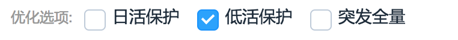

#### 前言
在这部分，我主要会写一些在vue使用中遇到的问题以及常见的解决方法。

#### 1.Vue-Router中多次渲染顶层组件
下面是Vue-Router中的router-view的简单用法。下面是webpack入口文件中内容:
```js
new Vue({
  router,
  render: h => h(Layout)
  // data: function() {
  //   return { name: "qingtian" };
  // }
  // components: { Main },
  // 必须指定template或者render方法，但是如果指定了会导致Main组件被重复渲染
  // 下面的/的path又会重新渲染一次Main组件，所以Layout组件就只要指定router-view即可
  // template: "<Main/>"
}).$mount("#app");
```
注意:在使用的时候不要添加components，比如上面的注释部分，其实会立马渲染一个Main组件，导致和router里面的指定的path为"/"为Main组件重复渲染。其实在Layout组件中，我们只需要如下内容即可:
```js
<template>
    <div>
        <router-view></router-view>
    </div>
</template>
<style>
</style>
```
而下面是我们具体的router即前端路由部分:
```js
export default new Router({
  routes: [
    {
      path: "/",
      // 1.默认路由的ref，React-Router里面的IndexRouter或者采用空的子路由
      name:'default',
      // chunkName
      component: Main,
      children: [
        {
          path: "",
          name: "default",
          component: resolve => require(["@/components/$ref.vue"], resolve)
        },
        {
          path: "ref",
          name: "ref",
          component: resolve => require(["@/components/$ref.vue"], resolve)
        },
        {
          path: "slot",
          name: "slot",
          component: resolve =>
            require(["@/components/slotPlusSlotScope.vue"], resolve)
        }
      ]
    }
  ]
});
```
这里当你访问的path为"/"的时候，其实上面app下的router-view将会被Main以及$ref.vue的组件替换掉。这一点一定要注意。因为他是router-view最本质的东西。

#### 2.Vue-Router如何获取到上一次的路由?
其实一开始我也是陷入了死胡同了，我想知道上一次的路由，然后判断**它是否在白名单中**，如果在白名单中我从localStorage中获取数据，如果不在白名单中我就执行采用默认的数据来渲染页面。这样就可以满足**用户点击后退按键的时候能够保存上一次的组件状态**。
```js
/**
     * 1.mounted的执行时机早于beforeRouteEnter
     * 2.这里面无法获取this实例
     */
    beforeRouteEnter(to, from, next) {
        next(vm => {
            // if (from.path && from.path.indexOf('landingPageCreate') != -1) {
            //     const msgStatusSelect = localStorage.getItem('msgStatusSelect');
            //     const msgTypeSelect = localStorage.getItem('msgTypeSelect');
            //     msgStatusSelect2localStorage = msgStatusSelect;
            //     msgTypeSelect2localStorage = msgTypeSelect;
            // }
        })
    },
```
因为受限于上面两个条件:**第一点**:在beforeRouteEnter里面没法获取到this，那也意味着我不能通过this设置组件的值，即无法通过它完成UI的更新(虽然此时我明确的知道页面来源)。**第二点**:mounted的执行时机早于beforeRouteEnter,这也意味着组件已经更新了，然后你才去获取值，所以，即使你通过vm.xxx=xxx这种方式赋值，在mounted里面也是无法获取到的，因为beforeRouteEnter在后面执行的，即还没有赋值，所以当然无法读取!

所以我的判断是beforeRouteEnter一般只是用于路由跳转redirect等，而无法通过这个方法修改组件数据。最后我抛弃了白名单的策略，**采用的策略如下**:
<pre>
1.每次文本框的值修改后都写到localStorage,同时调用this.$router.replace方法
2.浏览器后退的时候可以从localStorage里面获取数据，然后做一次重新搜索，在created或者mounted里面都可以
</pre>

```js
watch:{
  // 监听两个变量的变化并调用this.$router.replace更新到URL
    'msgTypeSelect': function(curVal, oldVal) {
      const href = window.location.href;
      const hash = window.location.hash;
      const idx = href.indexOf('?');
      let query = href.substring(idx + 1);
      if (idx != -1) {
          query = query.split('&').reduce((prev, cur) => {
              const [key, value] = cur.split('=');
              prev[`${key}`] = value;
              return prev
          }, {});
          // 已经有查询字符串
          this.$router.replace({
              path: '/pushlist',
              query: {
                  ...query,
                  msgTypeSelect: curVal,

              }
          });
      } else {
          this.$router.replace({
              path: '/pushlist',
              query: {
                  msgTypeSelect: curVal
              }
          });
      }
  },
  'msgStatusSelect': function(cur, old) {
      const href = window.location.href;
      const hash = window.location.hash;
      const idx = href.indexOf('?');
      let query = href.substring(idx + 1);
      if (idx != -1) {
          query = query.split('&').reduce((prev, cur) => {
              const [key, value] = cur.split('=');
              prev[`${key}`] = value;
              return prev
          }, {});
          this.$router.replace({
              path: '/pushlist',
              query: {
                  ...query,
                  msgStatusSelect: cur

              }
          });
      } else {
          this.$router.replace({
              path: '/pushlist',
              query: {
                  msgStatusSelect: cur
              }
          });
      }
  },
},
data(){
  return {
     msgStatusSelect: this.getQueryString('msgStatusSelect', true) || "-1",
     msgTypeSelect: this.getQueryString('msgTypeSelect', true) || "-1",
     // 默认从URL上获取，更新this.data的值
     // 初始情况URL为空，所以搜索出全部的结果(-1表示全部)
  }
},
created(){
  // 初次进入或者后退的时候走一次接口，如果能从URL中拿到数据就表示后退，否则-1表示直接进入
  const href = window.location.href;
  const hash = window.location.hash;
  const idx = href.indexOf('?');
  let query = href.substring(idx + 1);
  if (idx != -1) {
      query = query.split('&').reduce((prev, cur) => {
          const [key, value] = cur.split('=');
          prev[`${key}`] = value;
          return prev
      }, {});
      // 已经有查询字符串
      this.$router.replace({
          path: '/pushlist',
          query: {
              ...query,
              gmtCreateBegin: `${date} 00:00:00`,
              gmtCreateEnd: `${date} 23:59:59`,
              msgTypeSelect: this.getQueryString('msgTypeSelect', true) || "-1",
              msgStatusSelect: this.getQueryString('msgStatusSelect', true) || "-1"
          }
      });
  } else {
      this.$router.replace({
          path: '/pushlist',
          query: {
              gmtCreateBegin: `${date} 00:00:00`,
              gmtCreateEnd: `${date} 23:59:59`,
              msgTypeSelect: this.getQueryString('msgTypeSelect', true) || "-1",
              msgStatusSelect: this.getQueryString('msgStatusSelect', true) || "-1"
          }
      });
},
methods:{
 getQueryString: function(name, isSpa) {
          name = name.replace(/[\[]/, "\\[").replace(/[\]]/, "\\]");
          var regex = new RegExp("[\\?&]" + name + "=([^&#]*)"),
              results = regex.exec(isSpa ? location.hash : window.location.search.substr(1));
          return results == null ? "" : decodeURIComponent(results[1]);
      }
 }
}
```
这样不需要使用localStorage就可以直接完成页面后退的功能了，而不用判断上一次的路由来源。只要操作的时候修改URL，然后从URL中读取参数并查询，没有参数的话直接传入**-1表示直接进入而不是浏览器后退**。当然上面的重复代码应该提取到公共的函数，此处不再赘述。关于replace的用法你可以[参考这个文档](https://router.vuejs.org/zh-cn/essentials/navigation.html)。

#### 3.Vue中使用布尔值控制显示与隐藏
```js
// 默认cfg.disableAlgorithm为true
<el-checkbox label="2" :disabled="cfg.disableAlgorithm">算法实时投放<\/el-checkbox>
```
下面是对变量进行监听:
```js
watch: {
      'cfg.freq': function(cur, prev) {
          if (cur == 1) {
              this.cfg.disableAlgorithm = true;
          } else {
              this.cfg.disableAlgorithm = false;
          }
      }
  }
```
主要在于使用:disable，而不能是disabled="cfg.disableAlgorithm",因为**后者是字符串了**。

#### 4.Vue-cli中proxy代理不生效
修改build/dev-server.js，添加如下代码:
```js
var proxyMiddleware = require("http-proxy-middleware");
var devMiddleware = require("webpack-dev-middleware")(compiler, {
  publicPath: webpackConfig.output.publicPath,
  quiet: true
});
var hotMiddleware = require("webpack-hot-middleware")(compiler, {
  log: () => {}
});
// handle fallback for HTML5 history API
app.use(require("connect-history-api-fallback")());
app.use(
  "/",
  proxyMiddleware(["/baoluo/**", "/hotkeywords/**"], {
    // target: "http://30.55.144.240:7001",
    // target: "http://10.101.16.16:80/",
    target:"http://test.heyi.test",
    changeOrigin: true
  })
);
// 是不是代理服务器10.101.16.16
// 在devMiddeleware,hotMiddleware之前
// serve webpack bundle output
app.use(devMiddleware);
// enable hot-reload and state-preserving
// compilation error display
app.use(hotMiddleware);
```
而且http-proxy-middleware必须在webpack-hot-middleware和webpack-dev-middleware之前。这一点是测试的时候验证的，至少在我的情况下是这样的。而对于代理的http-proxy-middleware第一个参数可以是一个数组的。之所以会想到上面的方式是因为修改proxyTable并没有生效:
```js
proxyTable: {
  '/hotkeywords/query': {
    target: 'http://30.55.144.240:7001/',
    changeOrigin: true
  }
},
```

#### 4.el-table默认选中之toggleRowSelection方法
```js
// 下面的toggleRowSelection必须通过$nextTick方法
this.$nextTick(function() {
  this.configureRowSelections(itemList);
});
// itemLists为所有的表格元素
configureRowSelections(itemList) {
  const ids = [45, 116];
  const preSelections = itemList.filter((el, idx) => {
      return ids.indexOf(el.id) != -1
  });
  //逐个调用
  preSelections.forEach(el => {
    this.$refs.scgAddTable.toggleRowSelection(el, true);
  })
},
```
从上面可以知道，toggleRowSelection必须**逐个调用**才行。

#### 5.vue中的三目运算符
在template中可以这么写:
```html
<i @click="archive(scope.row.id,scope.row.favorite)" :class="scope.row.favorite ? 'iconfont icon-star1' : 'iconfont icon-star'"><\/i>
 <el-checkbox :value="!cfg.num ? false :true" style="margin-right:20px">配置</el-checkbox>
```

#### 6.el-tab获取到当前切换到的tab的id
比如下面的值:
```html
 <el-tabs @tab-click="selectTab" v-model="selectedTab">
      <el-tab-pane id="1" label="我收藏的" name="1"></el-tab-pane>
      <el-tab-pane id="2" label="我添加的" name="2"></el-tab-pane>
      <el-tab-pane id="0" label="全部" name="0"></el-tab-pane>
  </el-tabs>
```
在@tab-click回调函数中可以如下处理:
```js
 selectTab: function(vu, evt) {
      const { id } = vu.$el;
      this.selectedTab = id;
      this.$nextTick(function() {
          this.onSearch();
      });
  },
```
即通过**vu.$el.id**获取到当前切换到tab页面!

#### 7.vue的回调函数传入参数
比如template可以如下方式书写:
```html
  <el-button type="primary" @click="showVideo(false)">添加</el-button>
```
这样showVideo函数中就可以获取到传递过去的值，这和React是不一样的，React的回调函数是不能直接通过showVideo()这种方式注册的，因为**它相当于直接调用**。

#### 8.el-table需要格式化数据，比如日期
```html
 <template slot-scope="scope">
      <p>
          <span>{{ formatter(scope.row.gmtCreate)}}</span>
          <br />
          <span>{{formatter(scope.row.gmtModified)}}</span>
      </p>
  </template>
```
通过在methods里面定义一个函数formatter，这样可以通过**moment**来对时间进行格式化了!!!

#### 9.vue中的{{}}符号可以写出运算
比如下面的代码:
```html
 <template slot-scope="scope">
    <p>
        <span style="font-weight:bold">{{scope.row.used||0}}</span> /
        <span style="font-weight:bold">{{scope.row.total||0 - scope.row.used||0}}</span>
    </p>
</template>
```
这样当scope.row.used或者scope.row.total为null等的时候就会显示0.

#### 10.vue的回调函数中直接修改this中的值
```html
 <span slot="footer" class="dialog-footer">
      <el-button @click="dialogVisible = false">取 消</el-button>
      <el-button type="primary" @click="submitScgCfg">确 定</el-button>
  </span>
```
比如上面的@click回调函数就直接设置**dialogVisible = false**。

#### 11.vue模板中设置disable的值
```html
 <el-radio-group v-model="cfg.audit">
      <el-radio :label="1" :disabled="!cfg.isAudit">自动过审</el-radio>
      <el-radio :label="0">提交待审</el-radio>
  </el-radio-group>
```
这样当cfg.isAudit的值为false的时候，自动过审选项将不能选择。

#### 12.vue中设置互斥的el-checkbox组/按钮组
比如下面的图:


假如我选择了"突发全量(值为1)"就不能选择前面的任意一个checkbox，此时我的代码逻辑如下:
```js
data:function(){
  return {
     hasOne: false,
     // 表示是否选中了值为1的checkbox,因为有两种情况需要区分
     // 情况1:先选中了前面，然后选择的1
     // 情况2:先选中了1，后选中的前面的
     cfg:[
         {typeOption:[]}
      ]
  }
}
```
在created里面默认设置:
```js
 created:function(){
  this.hasOne = typeOption.indexOf('1') != -1
 }
```

```js
optimalChange: function(val) {
  // 含有突发全量
  if (!!~val.indexOf(1)) {
      this.cfg[0].typeOption = [1];
      if (this.hasOne) {
          // 已经选择过了突发全量了
          this.cfg[0].typeOption = val.filter(el => {
              return el != 1;
          })
          this.hasOne = false;
      } else {
          if (this.cfg[0].typeOption.indexOf(1) == -1) {
              this.cfg[0].typeOption.push(1);
          }
          // 前一次没有1，那么插入1
          this.hasOne = true;
      }
  } else {
      this.hasOne = false;
      this.cfg[0].typeOption = val;
  }
  console.log('设置后为===', this.cfg[0].typeOption);
  }
```
下面是vue的template:
```html
 <el-checkbox-group @change="optimalChange" v-model="cfg[0].typeOption">
    <span class="text"> 优化选项:</span>
    <el-checkbox :label="4">日活保护</el-checkbox>
    <el-checkbox :label="2">低活保护</el-checkbox>
    <el-checkbox :label="1">突发全量</el-checkbox>
</el-checkbox-group>
```

#### 13.[emoji-picker](https://github.com/OneSignal/emoji-picker)屏蔽某一个表情
上次从服务端接受一个前端项目，遇到类型为relax的emoji在编辑的时候不能正常显示，找过了很多方法最后也没有查到具体的问题。最后采用了一个极端暴力的方法:将这个emoji去掉,即修改他的load方法:
```js
// 每次切换面板都会重新load一次
EmojiMenu.prototype.load = function(category) {
    var html = [];
    var options = $.emojiarea.icons;
    var path = $.emojiarea.assetsPath;
    var self = this;
    if (path.length && path.charAt(path.length - 1) !== "/") {
      path += "/";
    }
    var updateItems = function() {
      self.$items.html(html.join(""));
    };
    if (category > 0) {
      for (var key in options) {
        // 这里做了处理，如果是:relaxed的emoji直接隐藏掉
        // category>0表示不是经常使用的面板
        var is = key == ":relaxed:" ? true : false;
        if (options.hasOwnProperty(key) && options[key][0] === category - 1) {
          if (is) {
            html.push(
              '<a style="display:none" href="javascript:void(0)" title="' +
                util.htmlEntities(key) +
                '">' +
                EmojiArea.createIcon(options[key], true) +
                '<span class="label">' +
                util.htmlEntities(key) +
                "</span></a>"
            );
          } else {
            html.push(
              '<a href="javascript:void(0)" title="' +
                util.htmlEntities(key) +
                '">' +
                EmojiArea.createIcon(options[key], true) +
                '<span class="label">' +
                util.htmlEntities(key) +
                "</span></a>"
            );
          }
        }
      }
      updateItems();
    } else {
      ConfigStorage.get("emojis_recent", function(curEmojis) {
        curEmojis = curEmojis || defaultRecentEmojis || [];
        var key, i;
        for (i = 0; i < curEmojis.length; i++) {
         // 这里做了处理，如果是:relaxed的emoji直接隐藏掉
          var is = util.htmlEntities(key) == ":relaxed:";
          key = curEmojis[i];
          if (options[key]) {
            if (is) {
              html.push(
                '<a href="javascript:void(0)" title="' +
                  util.htmlEntities(key) +
                  '">' +
                  EmojiArea.createIcon(options[key], true) +
                  '<span class="label">' +
                  util.htmlEntities(key) +
                  "</span></a>"
              );
            } else {
              html.push(
                '<a href="javascript:void(0)"  title="' +
                  util.htmlEntities(key) +
                  '">' +
                  EmojiArea.createIcon(options[key], true) +
                  '<span class="label">' +
                  util.htmlEntities(key) +
                  "</span></a>"
              );
            }
          }
        }
        updateItems();
      });
    }
  };
```
修改后在"经常使用/emoji"面板都不会有relax的emoji了!

#### 14.使用[vue-treeselect](https://vue-treeselect.js.org/)实现tree-select单选逻辑
```js
data:function(){
  return {
    msgTypeEnum: [{
                id: "1000",
                label: 'pp',
                children: [{
                    id: "1000:4",
                    label: 'xx'
                }, {
                    id: "1000:2",
                    label: 'yy'
                }, {
                    id: "1000:1",
                    label: 'ttt'
                }]
            }, {
                id: "1001",
                label: 'rrr',
                children: [{
                    id: "1001:4",
                    label: 'ff'
                }, {
                    id: "1001:2",
                    label: 'gg'
                }, {
                    id: "1001:1",
                    label: 'ee'
                }]
            }, {
                id: "1002",
                label: 'gg',
                children: [{
                    id: "1002:2",
                    label: 'uu'
                }, {
                    id: "1002:1",
                    label: 'oo'
                }]
            }]
  }
}
/**
 * 取消选中某一个子级元素，如果是父级元素被取消选择，那么在msgTypeSelect中可以监听到，因为选中了另外一个
 */
msgTypeDeselect: function(value) {
    const { id, label, children } = value;
    const idx = this.searchTreeParams.indexOf(id);
    const [msgType, typeOption] = id.split(':');
    // 取消msgType和typeOption
    // console.log('取消选中的值以及下标为', value, idx);
    if (idx != -1) {
        this.searchTreeParams.splice(idx, 1);
    }
    console.log('取消选中后的searchTreeParams==', this.searchTreeParams);
},

/**
 * 取消选中某一个子级元素，如果是父级元素被取消选择，那么在msgTypeSelect中可以监听到，因为选中了另外一个
 */
msgTypeDeselect: function(value) {
  const { id = "", label, children } = value;
  const idx = this.searchTreeParams.indexOf(id);
  const [msgType, typeOption] = id.split(':');
  // 取消msgType和typeOption
  const searchTreeParams = this.searchTreeParams;
  const isLeaf = id.indexOf(":") != -1;
  // 如果是叶子节点

  if (idx != -1 && isLeaf) {
      this.searchTreeParams.splice(idx, 1);
      // 如果你要取消选择的这个在数组里面，那么直接删除掉即可
      console.log('searchTreeParams====', searchTreeParams);
  } else {
      // 是根节点，如1001,1002...要删除所有的根节点下的子节点
      const childrenEls = this.msgTypeEnum.filter(el => {
          return el.id == id;
      })[0].children;

      childrenEls.forEach(el=>{
          const idx = this.searchTreeParams.indexOf(el.id);
          if(idx!=-1){
              this.searchTreeParams.splice(idx,1);
          }
      });
  }
  console.log('取消选中后的searchTreeParams==', this.searchTreeParams);
}

/**
 * 选中某一个
 *
 */
msgTypeSelect: function(cur) {
const { id, label, children } = cur;
        if (!children) {
            //没有children表示是子级元素
            const [msgType = '', typeOption = []] = id && id.split(':');
            this.searchTreeParams = this.searchTreeParams.filter(el => {
                const dot = el.indexOf(':');
                if (dot != -1) {
                    const [localMsgType, localOption] = el.split(':');
                    if (localMsgType == msgType) {
                        return true;
                    }
                }
                return false;
            });
            this.searchTreeParams.push(id);
        } else {
            // 选中的这个有子级
            const childrenItems = this.msgTypeEnum.filter(el => {
                return el.id == id;
            })[0].children.reduce((prev, cur) => {
                return prev.concat(cur.id);
            }, []);
            this.searchTreeParams = childrenItems;
        }
        console.log('选中后的searchTreeParams===', this.searchTreeParams);
}
```
下面是vue的template的逻辑:
```html
 <treeselect style="width:370px;height:36px;" :limit="3" @select="msgTypeSelect" @deselect="msgTypeDeselect" placeholder="请选择消息类型" :openOnClick="true" :multiple="true" :options="msgTypeEnum" :value="searchTreeParams">
 </treeselect>
```
最后的效果就是，tree-select的**最外层是单选的，而里面的子级选项是多选**的!

#### 15.在radio-group切换之前弹出确认框
在radio-group切换之前我们希望弹出确认框，用户**点击了确认后才真实切换，点击了取消后不会切换**。一开始使用的是v-model,最后发现v-model会立即导致值的变化从而无法在值变化之前进行拦截确认。最后修改为v-bind:
```html
 <el-radio-group @input="mockSendChange($event,arguments)" v-bind:value="mockSend" size="mini" style="position:relative;top:-10px;">
      <el-radio :label="1">是</el-radio>
      <el-radio :label="0">否</el-radio>
  </el-radio-group>
```
下面是方法的代码:
```js
mockSendChange: function(value, arg) {
  const h = this.$createElement;
  // 切换到是的时候提示
  if (value) {
      this.$msgbox({
          title: '消息',
          message: h('p', null, [
              h('span', null, ' '),
              h('i', { style: 'color: red' }, '模拟发送不会真实发送，用于测试同学模拟全量发送')
          ]),
          showCancelButton: true,
          showClose:false,
          confirmButtonText: '确定',
          cancelButtonText: '取消',
          beforeClose: (action, instance, done) => {
              if (action === 'confirm') {
                  this.mockSend = value;
                  // 点击确定设置为指定的值
                  setTimeout(() => {
                      done();
                  })
              } else {
                  // 点击取消保持原来的值不变
                  done();
              }
          }
      }).then(action => {
      });
  } else {
    // 切换到"否""不做提示
    this.mockSend = value;
  }
}
```
这个例子有三点需要注意，第一点是使用了radio-group的**@input而不是[@change](https://github.com/ElemeFE/element/issues/3181)**事件:
```js
@input="mockSendChange($event,arguments)"
```
第二点使用$event可以传递参数,第三点是使用v-bind而不是v-model。

#### 16.删除前二次确认的vue实现
我们可以开发下面的组件:
```js
import Vue from "vue";
Vue.component("confirmation-modal", {
  // template: "#modal",
  // 这种指定id的例子是如何使用的，必须在index.html中书写
  props: ["open", "user"],
  template: `
      <div class="modal">
          <div class="modal-window">
              <p>你确定要删除
                  <strong style="color:red">{{ user.name }}</strong> ?</p>
              <div class="actions">
                  <button class="cancel" @click="onCancel">取消</button>
                  <button class="confirm" @click="onConfirm">确认</button>
              </div>
          </div>
      </div>`,
  methods: {
      // confirmation-modal就是template渲染后的内容，点击取消或者确认的时候
      // emit特定的事件
      onConfirm() {
          this.$emit("confirm");
      },
      onCancel() {
          this.$emit("cancel");
      }
  }
});
```
然后在template中按照如下方式来使用:
```html
<template>
  <div id="app" v-cloak>
      <!-- @keydown.enter.prevent用于阻止默认时间 -->
      <input class="newuser-input" type="text" @keydown.enter.prevent='addUser' ref='newuser' placeholder="New user...">
      <!-- 每一个用户点击的时候触发delete -->
      <ul class="users">
          <li v-for='u in users' :key='u.id' mode="out-in">{{u.name}}
              <button class="deleteBtn" @click="confirmDelete(u)">x</button>
          </li>
      </ul>
      <!-- confirmation-modal接受一个user和open参数，同时接受的事件为confirm和cancel事件，组件内部通过emit触发 -->
      <confirmation-modal :user="selectedUser" v-if='confirmModal' @confirm='deleteUser' @cancel="cancelDelete"></confirmation-modal>
      <button v-if="this.users.length > 2" @click="shuffle">Shuffle</button>
  </div>
</template>
```
在confirmation-modal这个子组件中我们通过@confirm和@cancel注册了两个事件，这样在子组件中通过**emit就能触发父组件事件**。完整的代码可以[点击这里](./source/confirm.vue),而具体效果可以[点击这里](https://codepen.io/blokche/pen/eWMrdN)。

#### 17.Vue为点击的按钮添加一个.active类
比如下面是template的代码:
```html
 <div class="button_group item">
  <el-button :class="selectedDTIdx==4 ? 'mega' : '' " @click="selectDT(4)">万象定向包</el-button>
  <el-button :class="selectedDTIdx==2 ? 'mega' : '' " @click="selectDT(2)">上传UTDID号码包</el-button>
  <el-button :class="selectedDTIdx==1 ? 'mega' : '' " @click="selectDT(1)">上传UID号码包</el-button>
</div>
```
下面是selectDT的代码，主要是修改selectedDTIdx的值:
```js
selectDT: function(id) {
  this.selectedDTIdx = id;
}
```

#### 18.重置搜索条件
```js
 this.searchParams = this.$options.data().searchParams;
 // 获取到的是初始的搜索默认值
 // this.$data.searchParams
```
前者是获取默认值，而后者$data是获取当前的值

#### 19.vue的keep-alive不生效问题
比如路由配置如下:
```js
{
  path: "/datamanager/overview",
  component: Home,
  name: "home",
  // Home组件
  children: [
    {
      path: "/createNew",
      name: "createNew",
      component: PushCreateNew,
      meta: {
        keepAlive: true
      }
    }
  ]
}
```
很显然Home组件下可能会出现各种子级组件，所以我们Home组件的模板为:
```html
<template>
    <div class="wrapper">
        <v-head></v-head>
        <v-sidebar></v-sidebar>
        <div class="content">
            <transition name="move" mode="out-in">
                <keep-alive v-if="$route.meta.keepAlive">
                    <router-view :key="routerPath"></router-view>
                </keep-alive>
                <router-view v-else :key="routerPath"></router-view>
            </transition>
        </div>
    </div>
</template>
```
很显然模板中也出现了keep-alive包裹的router-view，但是有一点需要注意的是**keep-alive必须在transition里层，而不能是处于transition外层**，否则不会生效。还有一点也要注意，即[keep-alive要求被切换的组件都要具有name](https://vuefe.cn/v2/guide/components-dynamic-async.html#dynamic-component-demo)，要么是使用组件的name选项，要么就是通过局部/全局注册。

#### 20.el-table手动调用selection-change方法
比如表格中某一个列要求设置为el-input，同时这个el-input失去焦点的时候要获取当前表格选中的所有的**选中数据**，此时可以通过如下方法:
```jsx
<el-table max-height="500" :data="listRulesData" ref="dialogListRules" @selection-change="handleSelectionChange">
<el-table-column :render-header="renderHeader" width="120">
    <template scope="scope">
        <el-input-number :controls="false" v-model="scope.row.priority" @blur="dialogListRulesBlur" />
        <el-popover placement="top-start" title="优先级提示" width="200" trigger="hover" content="备注: 优先级数字越小,优先级越高">
            <i class="el-icon-question" slot="reference" style="margin-left:5px"></i>
        </el-popover>
    </template>
</el-table-column>
</el-table>
```
即在el-input失去焦点的时候获取它:
```js
dialogListRulesBlur: function(value) {
      const $tableEl = this.$refs.dialogListRules;
      const selections = $tableEl.selection;
      //可以获取selection
      this.handleSelectionChange(selections);
  },
 handleSelectionChange: function(selections) {
    const groupRule = selections.reduce((prev, cur) => {
        const { priority, ruleId } = cur;
        return prev.concat({
            priority: +priority,
            ruleId: +ruleId
        });
    }, []);
    this.cfg[1].groupRule = groupRule.sort(compare('priority'));
}
```

#### 21.手动调用createElement创建element-ui的组件
```js
 renderHeader: function() {
  const h = this.$createElement;
  return h("el-popover", { trigger: "click", title: '优先级说明', content: "优先级数字越小,优先级越高", placement: "bottom", width: "200" }, [h('i', { class: "el-icon-question", slot: "reference" }, "优先级")])
},
```
下面是vue的[官方$createElement说明](https://cn.vuejs.org/v2/guide/render-function.html#createElement-%E5%8F%82%E6%95%B0):
```js
createElement(
  // {String | Object | Function}
  // 一个 HTML 标签字符串，组件选项对象，或者
  // 解析上述任何一种的一个 async 异步函数，必要参数。
  'div',
  // {Object}
  // 一个包含模板相关属性的数据对象
  // 这样，您可以在 template 中使用这些属性。可选参数。
  {
  },
  // {String | Array}
  // 子节点 (VNodes)，由 `createElement()` 构建而成，
  // 或使用字符串来生成“文本节点”。可选参数。
  [
    '先写一些文字',
    createElement('h1', '一则头条'),
    createElement(MyComponent, {
      props: {
        someProp: 'foobar'
      }
    })
  ]
)
```


参考文献:

[vue实现前进刷新，后退不刷新](https://juejin.im/post/5a69894a518825733b0f12f2)
