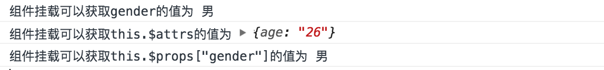

#### 前言
本部分我们主要添加一些在Vue学习中应该深入考虑的地方。

#### 1.Vue的响应式原理
知乎的[深入浅出Vue基于“依赖收集”的响应式原理](https://zhuanlan.zhihu.com/p/29318017)给出了非常深刻的回答，下面只是在回答上面加上自己的一点理解，建议[去原文阅读](https://zhuanlan.zhihu.com/p/29318017)。
```js
/**
 * 1.依赖收集器的target:用来存放监听器里面的onComputedUpdate()方法的。即当对象的属性变化后需要依赖某个回调函数来计算出
 * 计算属性(computed)，这个回调函数就是依赖收集器。之所以叫依赖收集器是因为该方法里面往往都是对对象本身数据的依赖从而得到
 * 计算属性的值
 */
const Dep = {
  target: null
}

/**
 * 2.为对象设置get,set方法，同时当你调用该对象的get方法以后，我需要把相应的回调传入到一个数组中，因为所有的计算属性都是会
 * 依赖于对象本身的值的，这也是上面依赖收集器的来源。而当你对对象本身的值进行修改以后，其需要通知所有的计算属性去更新自身的值。
 * 这是典型的观察者模式。
 */
function defineReactive (obj, key, val) {
  const deps = []
  Object.defineProperty(obj, key, {
    get () {
        // 这里假设只有watcher会读取它的属性，从而将回调放到watcher的回调列表里面
      console.log(`我的${key}属性被读取了！`)
      if (Dep.target && deps.indexOf(Dep.target) === -1) {
        deps.push(Dep.target)
      }
      return val
    },
    set (newVal) {
      console.log(`我的${key}属性被修改了！`)
      val = newVal
      deps.forEach((dep) => {
        dep()
      })
    }
  })
}

/**
 * 3.把一个对象的每一项都转化成可观测对象
 */
function observable (obj) {
  const keys = Object.keys(obj)
  for (let i = 0; i < keys.length; i++) {
    defineReactive(obj, keys[i], obj[keys[i]])
  }
  return obj
}

/**
 * 4.当计算属性的值被更新时调用
 * @param { Any } val 计算属性的值
 */
function onComputedUpdate (val) {
  console.log(`我的类型是：${val}`)
}

/**
 * 5.观测者:观察特定的计算属性的值的变化，如果它变化后需要执行特定的回调callback，即cb函数。计算cb函数得到计算属性的值
 * 同时把这个新的值传递给onComputedUpdate，即输出计算属性更新后的值
 */
function watcher (obj, key, cb) {
  const onDepUpdated = () => {
    const val = cb()
    onComputedUpdate(val)
  }

/**
 * 6.当你获取对象观察属性的时候会进一步调用watcher函数的回调函数得到新的值进而通知给onComputedUpdate
 */
  Object.defineProperty(obj, key, {
    get () {
      Dep.target = onDepUpdated;
      // 立即调用watch回调函数进而将Dep.target更新到defineReactive，因为回调函数会读取Object上的值，从而调用其get方法
      const val = cb()
      Dep.target = null
      return val
    },
    set () {
      console.error('计算属性无法被赋值！')
    }
  })
}
```
其实上面的代码解决了以下几个问题:
<pre>
1.当对象的属性值变化以后需要根据更新后的值得到新的计算属性的值
2.可能有多个计算属性的值依赖于对象的同一个值，所以当你获取对象的某个值的时候需要以数组形式保存所有计算属性的回调函数
</pre>

#### 2.为什么Vue使用MutationObserver做批量处理？
根据[HTML Standard](https://www.zhihu.com/question/55364497/answer/144215284)，在**每个task运行完以后，UI都会重渲染**，那么在microtask 中就完成数据更新，当前task结束就可以得到最新的UI了。反之如果新建一个task来做数据更新，那么**渲染就会进行两次**（当然，浏览器实现有不少不一致的地方）。总之，我的理解就是使用MutationObserver来做UI更新是为了使得用户界面能够尽快更新，因为它本身就是一个microtask而不是Task。更多内容你可以[查看](https://github.com/liangklfangl/react-article-bucket/blob/master/others/nodejs-QA/browser-QA.md)我的这个文章。

#### 3.Vue中的高阶组件
##### 3.1 Vue组件是什么?
Vue 中组件是什么？有的同学可能会有疑问，难道不是函数吗？对，Vue中组件是函数没有问题，不过那是最终结果，比如我们在**单文件组件中的组件定义其实就是一个普通的选项对象**，如下：
```js
export default {
  name: 'BaseComponent',
  props: {...},
  mixins: [...]
  methods: {...}
}
```
这不就是一个纯对象吗？所以当我们从单文件中导入一个组件的时候：
```js
import BaseComponent from './base-component.vue'
console.log(BaseComponent)
```
思考一下，这里的 BaseComponent是什么？它是函数吗？不是，虽然单文件组件会被vue-loader 处理，但处理后的结果，也就是我们这里的BaseComponent仍然还是一个普通的JSON 对象，只不过当你把这个对象注册为组件(components 选项)之后，Vue 最终会以该对象为参数创建一个构造函数，该构造函数就是生产组件实例的构造函数，所以在Vue 中组件确实是函数，只不过那是最终结果罢了，**在这之前我们完全可以说在Vue中组件也可以是一个普通对象，就像单文件组件中所导出的对象一样**。

基于此，我们知道在Vue中一个组件可以以纯对象的形式存在，所以Vue中的高阶组件可以这样定义：**接收一个纯对象，并返回一个新的纯对象**，如下代码：
```js
export default function WithConsole (WrappedComponent) {
  return {
    template: '<wrapped v-on="$listeners" v-bind="$attrs"/>',
    components: {
      wrapped: WrappedComponent
    },
    mounted () {
      console.log('I have already mounted')
    }
  }
}
```
WithConsole 就是一个高阶组件，它接收一个组件作为参数：WrappedComponent，并返回一个新的组件。在新的组件定义中，我们将WrappedComponent注册为wrapped 组件，并在 template 中将其渲染出来，同时添加mounted钩子，打印I have already mounted。


##### 3.2 实现vue高阶组件
其完整的实现代码如下:
```js
function WithConsole (WrappedComponent) {
  return {
    mounted () {
      console.log('I have already mounted')
    },
    props: WrappedComponent.props,
    // 执行props
    render (h) {
      const slots = Object.keys(this.$slots)
        .reduce((arr, key) => arr.concat(this.$slots[key]), [])
        // 手动更正context
        // _self表示高阶组件实例对象，即vnode.context = this._self处理context
        // 因为由于高阶组件的引入，在原本的父组件与子组件之间插入了一个组件(也就是高阶组件)
        // ，这导致在子组件中访问的 this.$vnode已经不是原来的父组件中的 VNode 片段了，而是高阶组件的 VNode 片段，所以此时 this.$vnode.context 引用的是高阶组件，但是我们却将 slot 透传，slot 中的 VNode 的 context 引用的还是原来的父组件实例
        .map(vnode => {
          vnode.context = this._self
          return vnode
        })
      // 透传slots
      return h(WrappedComponent, {
        on: this.$listeners,
        props: this.$props,
        scopedSlots: this.$scopedSlots,
        // scopedSlots与slot 的实现机制不一样，本质上scopedSlots就是一个接收数据作为参数并渲染VNode的函数，所以不存在context的概念，所以直接透传即可：
        attrs: this.$attrs
      }, slots)
    }
  }
}
```
我们观察一个Vue组件主要观察三点：**props,event以及slots**。比如下面组件:
```js
<template>
  <div>
    <span @click="handleClick">props: {{test}}</span>
  </div>
</template>
<script>
export default {
  name: 'BaseComponent',
  props: {
    test: Number
  },
  methods: {
    handleClick () {
      this.$emit('customize-click')
    }
  }
}
</script>
```
它接收一个数字类型的props即test，并发射一个自定义事件，事件的名称是：customize-click，没有 slots。所以我们会这样使用该组件：
```html
<base-component @customize-click="handleCustClick" :test="100" />
```
。不过这里展示的是基本的用法，如果要深入了解Vue高阶组件原理可以[点击](http://hcysun.me/2018/01/05/%E6%8E%A2%E7%B4%A2Vue%E9%AB%98%E9%98%B6%E7%BB%84%E4%BB%B6/)这里，该文章详细的说明了Vue组件的基本用法。

#### 4.$attrs与$props作用
#### 4.1 $attrs与$props作用
过去我们在vue的父子组件传值的时候，我们先需要在**子组件上用props注册一些属性**：
```html
<template>
    <div>
        props:{{name}},{{age}} 或者 {{$props['name']}},{{$props['age']}}
    </div>
</template>
```
下面是js代码:
```js
export default{
    props: ['name','age']
}
```
然后父组件调用的时候当属性来传值:
```html
<child name="rick" :age="18"></child>
```
如果给child传**props没有注册的属性，我们就要用$attrs来取了**
```html
<child name="rick" :age="18" gender="male"></child>
```
下面是在子组件中获取props的值的两种方式，一种是使用$props，而另一种使用的是$attr(**子组件未声明**):
```html
<template>
    <div>
        props:{{name}},{{age}} 或者 {{$props['name']}},{{$props['age']}} 
        <br>
        attrs: {{$attrs['gender']}}  在$attrs里面只会有props没有注册的属性
    </div>
</template>
```
下面是js代码:
```js
export default{
    props: ['name','age']
}
```
当然这个$attrs是vue2.4才推出的，为了简化父组件和孙组件的传值。

#### 4.2 $attrs简化父子组件传值
下面是具体的组件设置代码:
```js
Vue.component('grand-child',{
   props: [],
   template:'<div>This is grand-child component!</div>'
}); 
Vue.component('child',{
   props: ["gender"],
  //可以获取到父组件通过v-bind="$attrs"绑定的值
   mounted:function(){
    console.log('组件挂载可以获取gender的值为',this.gender);
    console.log('组件挂载可以获取this.$attrs的值为',this.$attrs);
    console.log('组件挂载可以获取this.$props["gender"]的值为',this.$props['gender']);
   },
   template:'<div>This is child component!<grand-child/></div>'
}); 
//child组件里面使用了grand-child组件
Vue.component('parent',{
   props: [],
   //parent组件使用的时候没有通过props设置应该传递的prop,但是可以通过$attrs获取
   template:'<div>This is parent component!<br/><child v-bind="$attrs"/></div>'
});
//在实例化Vue之前要注册其他组件，从而在template里面可以使用其他组件
new Vue({
  el: '#app',
  data: {
    message: 'Hello Vue.js!'
  }
})
```
而template的代码如下:
```html
<div id="app">
  <p>{{ message }}</p>
  <parent gender="男" age="26"/>
</div>
```
**注意**:在new Vue之前parent,child,grand-child都已经注册完成,因此可以在template里面直接使用这几个组件。上面例子的运行结果如下:



parent组件传入了gender,age两个props，然后直接通过**v-bind="$attrs"**传递给child组件，而child组件声明了gender作为props,所以它可以直接获取到parent组件的值。源码可以[点击这里](./images/$attrs.vue)，而更多关于$attrs相关知识可以[点击这里](https://github.com/liangklfangl/react-article-bucket/blob/master/vue/inner-core-concept.md#32-%E5%AE%9E%E7%8E%B0vue%E9%AB%98%E9%98%B6%E7%BB%84%E4%BB%B6)。


参考资料:

[深入浅出Vue基于“依赖收集”的响应式原理](https://zhuanlan.zhihu.com/p/29318017)

[Vue 源码解析：深入响应式原理（上）](https://www.imooc.com/article/14466)

[探索Vue高阶组件](http://hcysun.me/2018/01/05/%E6%8E%A2%E7%B4%A2Vue%E9%AB%98%E9%98%B6%E7%BB%84%E4%BB%B6/)
