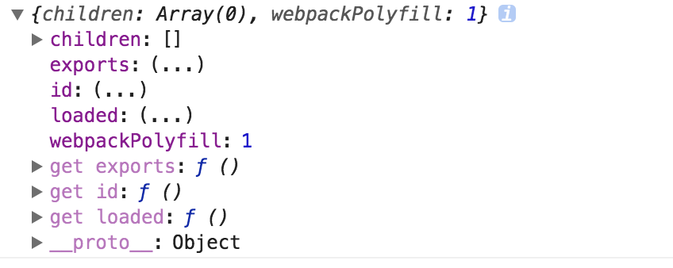

#### 1.harmony export定义
Webpack 2在发布的时候直接对ES2015的模块化方案提供了支持，我们称之为协调模块(harmony modules)，同时Webpack 2也可以自动检测那些模块没有被使用(比如下面的unused harmony export square)。所以在Webpack2打包后的文件中经常可以看到下面的代码:
```js
/* 1 */
/***/ (function(module, __webpack_exports__, __webpack_require__) {
"use strict";
  /* unused harmony export square */
  /* harmony export (immutable) */ __webpack_exports__["a"] = cube;
  function square(x) {
    return x * x;
  }
  function cube(x) {
    return x * x * x;
  }
}
```
其中，还有一定要注意:即,在没有添加babel-plugin-add-module-exports的情况下，我们Webpack2通过__webpack_exports__方式提供了对ES6模块的原生支持!

#### 2.uglify.js处理ES6代码出错
SyntaxError: Unexpected token: name (xxxxxx) from Uglify plugin

或者如下报错信息:

Error: index.js from UglifyJs Unexpected token: name (source)

解决方法:打包的时候你很可能忘记将`某一个目录(utils)`下的ES6代码打包了，除非你没有采用ES6语法。否则uglify.js是不能处理ES6代码的压缩的。详见[这里](https://github.com/webpack/webpack/issues/2972)。如果你采用[wcf]()，请修改如下:

```js
 "build": "wcf  --config ./webpack.config.js",
```
修改为:
```js
 "build": "wcf  --dev --config ./webpack.config.js",
```
但是此时资源并没有被压缩。

#### 3.手动将let/const修改为var的问题
minifying index.js Name expected

解决方法:一定要使用babel对ES6的代码打包，而不是仅仅手动将里面的const,let修改为var，否则很可能出现这个问题

#### 4.react-dnd报错
Uncaught Error: Cannot have two HTML5 backends at the same time.

#### 5.开发环境下使用extract-text-webpack-plugin问题
webpack使用ExtractTextPlugin将css抽取出来作为单个文件加载到head中，这个过程是异步的，是随着js执行而完成的;所以，当组件componentDidMount触发的时候，我们的css可能没有加载完成，从而导致组件初次渲染出现计算问题。所以，一般在开发环境中，我们不要使用ExtractTextPlugin组件将css单独抽取出来以文件的方式引用，而以内联style的方式是不会存在这个问题的

#### 6.webpack动态加载字体文件.woff的异常
报错信息：url-loader找不到

解决方法如下:

你要弄清楚，对于下面的css中的资源加载也会使用url-loader的,只要你使用了webpack配置:
```js
{
  test: /\.(png|jpg|gif|woff|woff2)$/,
  loader: require.resolve('url-loader') + '?limit=8192',
  publicPath: publicPath
}
```

```css
@font-face {
  font-family: 'anticon';
  src: url('@{icon-url-customize}.eot'); /* IE9*/
  src: url('@{icon-url-customize}.eot?#iefix') format('embedded-opentype'), /* IE6-IE8 */
  url('@{icon-url-customize}.woff') format('woff'), /* chrome、firefox */
  url('@{icon-url-customize}.ttf') format('truetype'), /* chrome、firefox、opera、Safari, Android, iOS 4.2+*/
  url('@{icon-url-customize}.svg#iconfont') format('svg'); /* iOS 4.1- */
}
```
所以报错说url-loader找不到的时候可以查看是否有类似的字体资源引用。解决方法：将`url-loader`的webpack配置修改为`require('url-loader')`即可。

#### 7.webpack处理css中引入的iconfont资源
首先：在webpack中配置publicPath，如`/myProject/1.0.0/`

然后:如下方式使用eot资源
```css
@font-face {
font-family: 'anticon';
src: url(/static/iconfont.57a86336.eot);
}
```
最后生成的url引用为`/myProject/1.0.0/static/confont.57a86336.eot`

#### 8.import与module.export混用存在的问题
报错信息如下:
<pre>
Uncaught TypeError: Cannot assign to read only property 'exports' of object '#<Object>'
    at Object.<anonymous> (index.js:24)
    at Object.__webpack_require__.constructor.promise (index.js:26)
    at __webpack_require__ (bootstrap f46fb0d5b88212eed390:693)
    at fn (bootstrap f46fb0d5b88212eed390:114)
    at Object.<anonymous> (index.js:7)
    at __webpack_require__ (bootstrap f46fb0d5b88212eed390:693)
    at fn (bootstrap f46fb0d5b88212eed390:114)
    at Object.<anonymous> (index.less:21)
    at __webpack_require__ (bootstrap f46fb0d5b88212eed390:693)
    at webpackJsonpCallback (bootstrap f46fb0d5b88212eed390:25)
</pre>
不要在代码中混用module.exports与import，但是[require和export](http://www.dongcoder.com/detail-380119.html)是可以的。

#### 9.webpack-dev-server监听80端口号问题
问题：报错信息如下
<pre>
Error: listen EACCES 30.6.219.146:80
    at Object.exports._errnoException (util.js:1018:11)
</pre>
解决:请使用管理员权限
```js
sudo npm run dev
```

#### 10.webpack-dev-server报错
<pre>
Invalid Host header
</pre>

解决方法：
```js
  devServer:{
      host:'30.6.219.146',
      disableHostCheck: true,
      //设置为true即可
      publicPath:'/',
      open :false,
      https: false,
      port:80
    }
```
但是disableHostCheck这个参数只有在80端口启动http的情况下是有效的。

#### 11.在html中引入相对路径找不到的问题
解决方法:请设置[--content-base](https://github.com/liangklfangl/webpack-dev-server)即可

#### 12.$export is not a function
报错信息如下:
<pre>
  Uncaught TypeError: $export is not a function
    at Object.<anonymous> (es6.object.define-property.js:5)
    at __webpack_require__ (bootstrap 82d50e4553d9d0d3550e:689)
    at fn (bootstrap 82d50e4553d9d0d3550e:108)
    at Object.<anonymous> (define-property.js:3)
    at __webpack_require__ (bootstrap 82d50e4553d9d0d3550e:689)
    at fn (bootstrap 82d50e4553d9d0d3550e:108)
    at Object.<anonymous> (define-property.js:3)
    at __webpack_require__ (bootstrap 82d50e4553d9d0d3550e:689)
    at fn (bootstrap 82d50e4553d9d0d3550e:108)
    at Object.hasOwn (_object-dp.js:3)
</pre>

解决方法:发现我的exclude是通过如下方式指定的:
```js
 exclude :path.resolve("node_modules"),
```
修改为如下内容就可以了:
```js
 exclude: /node_modules/,
```
你也可以[点击这里查看](https://stackoverflow.com/questions/36313885/babel-6-transform-runtime-export-is-not-a-function),关于path.resolve内容[可以点击这里](https://github.com/liangklfangl/webpack-chunkfilename)

#### 13.url-loader找不到的问题
在css中通过下面的方式引入字体文件也会使用url-loader加载:
```js
@font-face {font-family: "iconfont";
  src: url('iconfont.eot?t=1479085947184'); /* IE9*/
  src: url('iconfont.eot?t=1479085947184#iefix') format('embedded-opentype'), /* IE6-IE8 */
  url('iconfont.woff?t=1479085947184') format('woff'), /* chrome, firefox */
  url('iconfont.ttf?t=1479085947184') format('truetype'), /* chrome, firefox, opera, Safari, Android, iOS 4.2+*/
  url('iconfont.svg?t=1479085947184#iconfont') format('svg'); /* iOS 4.1- */
}
```
所以，请确保你的webapck配置可以处理此种类型的字体文件，即添加特定的loader，如果还是有问题，那么请保证在loader配置中使用require.resolve:
```js
{
    test: /\.xyz$/,
    loader: require.resolve("file-loader")
}
```
详细信息可以[点击这里](https://github.com/webpack/webpack/issues/111)

#### 14.Webpack2.2+ES6模块化时候exports为undefined
报错信息如下:
<pre>
Uncaught ReferenceError: exports is not defined
    at Object.<anonymous> (index.js:19)
    at __webpack_require__ (bootstrap facb1f6811f74eb75ad9:657)
    at fn (bootstrap facb1f6811f74eb75ad9:81)
    at Object.<anonymous> (emitter.js:3)
    at __webpack_require__ (bootstrap facb1f6811f74eb75ad9:657)
    at module.exports.ctor.super_ (bootstrap facb1f6811f74eb75ad9:706)
    at bootstrap facb1f6811f74eb75ad9:706
</pre>
Webpack 2结合ES6的模块化添加了tree-shaking,code splitting, HMR等功能。你只需要在babel-preset-env这个插件的配置项中添加{ modules: false }，此时我们的babel就不会打包import/export语法。而会将这个ES6模块打包的过程交给Webpack 2去处理。但是很多情况下会出现上面这个问题，说exports是undefined。

原因是:Babel 6在处理export default存在问题，需要结合babel-plugin-add-module-exports插件来完成。该插件会在代码后面添加下面这句代码:
```js
module.exports = exports["default"];
```
比如你有下面的源代码:
```js
// index.js
export default 'foo'
```
在Babel@6下将会打包成为下面的代码:
```js
'use strict';
Object.defineProperty(exports, "__esModule", {
  value: true
});
exports.default = 'foo';
//直接放在export.default上面
```
因此，当你require的时候将会就需要使用丑陋的".default",如下所示:
```js
require('./bundle.js') // { default: 'foo' }
require('./bundle.js').default // 'foo'
```
但是当你加入了babel-plugin-add-module-exports插件以后，将会得到如下的代码:
```js
'use strict';
Object.defineProperty(exports, "__esModule", {
  value: true
});
exports.default = 'foo';
module.exports = exports['default'];
```
因此，你就可以放心的去掉.default的代码了:
```js
require('./bundle.js') 
//直接可以去掉.default,而直接得到foo
```
但是在添加babel-plugin-add-module-exports插件后，我们会同时引入下面的代码(其中module.exports = exports['default']是babel真实打包之前通过AST分析添加的代码，所以此时我们的exports.default还没有被添加):
```js
exports.default = 'foo';
```
然而在使用Webpack2.2+ES6模块化的时候，[我们的exports是undefined](https://github.com/webpack/webpack/issues/3491)。因此解决方法就是删除'add-module-exports'这个babel插件。那么为什么删除这个插件就可以了呢？原因很简单:因为如果没有这个插件，代码不会有:
```js
module.exports = exports['default'];
```
因此，此时依然是ES6模块，而不是commonjs模块，所以通过后续webpack2直接处理ES6模块转化为__webpack_exports__["default"] = TestExpose，而不是export.default，所以不会存在对exports赋值的过程(即Webpack2接管了对ES6模块打包的任务)！比如我们的源代码如下:
```js
import React from "react";
import ReactDOM from "react-dom";
export default class TestExpose extends React.Component{
  render(){
    return <div>TestExpose</div>

  }
}
ReactDOM.render(<TestExpose/>,document.getElementById('react-content'));
```
在没有babel-plugin-add-module-exports插件的时候会生成下面的代码:
```js
class TestExpose extends __WEBPACK_IMPORTED_MODULE_0_react___default.a.Component {
  render() {
    return __WEBPACK_IMPORTED_MODULE_0_react___default.a.createElement(
      "div",
      null,
      "TestExpose"
    );
  }
}
/* harmony export (immutable) */ __webpack_exports__["default"] = TestExpose;
__WEBPACK_IMPORTED_MODULE_1_react_dom___default.a.render(__WEBPACK_IMPORTED_MODULE_0_react___default.a.createElement(TestExpose, null), document.getElementById('react-content'));

/***/ })
/******/ ]);
//# sourceMappingURL=index.js.map
```
也就是说，我们并没看到module.exports或者exports的代码,替代的是__webpack_exports__。下面是[具体的说明](https://github.com/webpack/webpack/issues/3491)，但是这个issue我并没有验证。下面是我真实的测试结果。webpack 2.2.0-rc.0对于下面的情况会有重大的变化:

(1)当一个模块通过import引入了其他模块，但是使用了module.exports向外导出该模块的内容，这种情况直接抛出错误8。因为exports是只读的，而不能修改。

(2)在ES6模块中，exports已经是不存在了，因此你访问这些变量将会得到错误。下面是打印的module.exports的代码，你可以看这个[pull request](https://github.com/webpack/webpack/pull/3580)：



下面给出一个ES6模块调用commonjs模块的示例:
```js
// a.js
module.exports = function foo () {};
```
下面是b.js：
```js
// b.js
import a from './a.js';
 // error, no default member found in a
a.foo();
```
很显然此时会报错，因为a.js导出的是一个函数，所以应该通过下面的方式调用:
```js
import a from './index.js'; // error, no default member found in a
a();
```
或者通过下面的require调用:
```js
const a = require('./index.js'); // error, no default member found in a
a();
```

#### 15.加载的chunk是低版本的动态chunk而不是最新chunk解决方法
你需要弄懂webpack的assetsRoot,assetsSubDirectory,assetsPublicPath等概念:
```js
 assetsRoot: path.resolve(__dirname, '../dist'),
 // 构建输出目录 也就是构建后的东西都扔这里
 assetsSubDirectory: 'static',
 // 资源子目录 除了index.html，其余的js img css都分在这里
 assetsPublicPath: '//www.baidu.com/bundle/1.0.22/'
```
对于publicPath不懂的请[查看](https://github.com/liangklfangl/webpack-dev-server)这里。这里的assetsPublicPath也差不多是同样的道理，即//www.baidu.com/bundle/1.0.22/对应的assetsRoot的目录。比如dist/static/css/app.css的文件就会被映射到//www.baidu.com/bundle/1.0.22/static/css/app.css这个真实的资源路径。

#### 16.webpack配置出错
<pre>
./app/modules/utils/IO/index.js
Module not found: Error: Can't resolve 'exports' in '/Users/qinliang.ql/Desktop/structor-usage/app/modules/utils/IO'
BREAKING CHANGE: It's no longer allowed to omit the '-loader' suffix when using loaders.
                 You need to specify 'exports-loader' instead of 'exports',
                 see https://webpack.js.org/guides/migrating/#automatic-loader-module-name-extension-removed
 @ ./app/modules/utils/IO/index.js 1:0-42
 @ ./app/modules/utils/motifyLifecycle.js
 @ ./app/modules/utils/hoc.js
 @ ./app/modules/antd/index.js
 @ ./.structor/app/components.js
 @ ./.structor/src/commons/pageUtils.js
 @ ./.structor/src/PageForDesk.js
 @ ./.structor/src/default.js
 @ multi react-hot-loader/patch eventsource-polyfill webpack-hot-middleware/client?path=/structor-dev/a&timeout=2000&overlay=false&noInfo=true ./.structor/src/default.js
</pre>

发现是webpack的plugins里面配置的内容如下:
```js
 new webpack.ProvidePlugin({
      fetch: "exports?self.fetch!whatwg-fetch"
    })
```
其实报错说的很明白，要求使用exports-loader，不能忽略-loader后缀!


参考文献:

[Webpack 2: "Uncaught ReferenceError: exports is not defined"](https://ntucker.true.io/ntucker/webpack-2-uncaught-referenceerror-exports-is-not-defined/)
